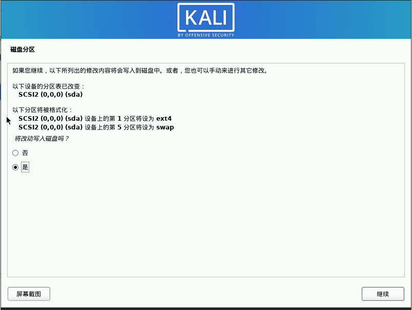

# 101-A1-Kali Linux系统安装

---

从本节开始，我们将正式开始信息安全知识和技术的学习。在学习一系列诸如漏洞原理、攻击手段等知识前，我们需要先学习一些有关linux与windows操作系统的基础知识。这些基础知识尤为重要，牢固掌握将保障你在日后的学习中事半功倍。


## 1. kali 系统介绍

要迈出成为黑客的第一步，我们可以从了解kali linux系统开始。

计算机的操作系统（operating system，简称OS）是管理计算机硬件与软件资源的计算机程序。操作系统需要处理如管理与配置内存、决定系统资源供需的优先次序、控制输入设备与输出设备、操作网络与管理文件系统等基本事务。操作系统也提供一个让用户与系统交互的操作界面。简单的说，比照我们最熟悉的Windows系统，你可以轻松领会这个概念。除了日常生活中常见的Windows和Mac系统，操作系统还有另一大分支，即Linux系统，有关它的内容我们将在后面的章节中做重点介绍。

我们本节要学习的kali linux系统即是Liunx系统的一个发行版，它专为从事信息安全工作而打造，可以理解为黑客的专用计算机系统。kali linux面向各种信息安全任务，例如渗透测试、安全研究、计算机取证和逆向工程等，其内部集成了超过600个安全工具。另外，kali linux是完全免费的，而且永远都是免费的。

农夫安全团队鼓励学习者在学习过程中全程使用kali系统，甚至可以在日后工作中仍然以kali系统作为桌面。这有助你迅速进入学习新东西的感觉，也利于快速熟悉并掌握linux系统命令。同时我们认为，一个开机就进入kali系统的电脑，会像奖章一样激励你向黑客身份认同，这在最初的学习阶段里尤其重要。还有，在怠惰的时候，要想用kali安装游戏可不简单。在过去的线下教学中，我们一直强制要求学员把电脑装成kali系统，也一直在验证这一方式的良好效果。所以我们鼓励线上的学习者也这样干。


 ## 2. 下载 kali 镜像

[kali官方网站](https://www.kali.org)地址为：https://www.kali.org

在此网站中，你可以获取到kali的官方文档、博客、系统镜像等内容。

[kali系统镜像下载](https://www.kali.org/get-kali/#kali-bare-metal)地址为：https://www.kali.org/get-kali/#kali-bare-metal 

在此页面中，我们选择kali完整离线安装程序的64位镜像下载。


下载完成后，文件名应为kali-linux-xxxxx-installer-amd64.iso的形式，其中“xxxxx”为镜像版本号。


## 3. 制作 kali 安装介质


在windows系统下，可以使用USBWriter、UltraISO等软件制作系统安装U盘。

在linux系统下，可使用命令制作系统安装U盘。

[官方有关制作镜像的介绍](https://www.kali.org/docs/usb/):https://www.kali.org/docs/usb/live-usb-install-with-linux/

所需命令如下：

```bash
fdisk -l
umount /dev/sdb*
mkfs.vfat /dev/sdb -I
dd if=X.iso of=/dev/sdb
```

`fdisk -l` 命令，可以查看计算机所挂磁盘个数、分区及容量等情况。


在命令执行结果中，可以看到我的电脑挂载了两块硬盘。其中，sda为第一块磁盘，sdb为第二块磁盘，如有更多磁盘则以此类推。sda1为第一块磁盘上的第一块分区，sda2为第一块磁盘上的第二块分区，如有更多分区则以此类推。

插入U盘后，重新执行`fdisk -l`命令。


在命令执行结果末尾可以看到系统挂载了第三块磁盘sdc，磁盘上有两个分区，此即为U盘。（如果电脑原本一块磁盘，则U盘盘符编号应为sdb）

使用`umount /dev/sdc*`命令可以卸载U磁盘。（如果电脑原本只有一块硬盘，则U盘盘符编号应为sdb）


使用`mkfs.vfat /dev/sdc -I`命令可以重新挂载U盘（如果电脑原本只有一块硬盘，则U盘盘符编号应为sdb），


使用`mkfs.vfat /dev/sdc -I`命令挂载U盘，不同于U盘默认的被挂载状态，U盘将作为一个整体被挂载而无视其硬盘分区。我们重新使用`fdisk -l`命令可以在执行结果末端看到这种变化。


这样做的原因是，我们希望U盘整体被格式化为kali系统安装盘，如果只针对U盘的一个分区做kali系统镜像，很可能导致分区空间不够大。

最后执行`dd if=*.iso of=/dev/sd*`命令将kali镜像刻录到U盘中。命令中if=后接镜像路径，of=后面接U盘路径，如下图：


这一过程会比较漫长，请耐心等待。


到此执行结束。kali镜像烧录U盘完成。

具有图形化界面的linux系统也可以使用Etcher软件进行烧录。

[etcher下载地址](https://www.balena.io/etcher/):https://www.balena.io/etcher/


## 4. 安装 kali 系统

在安装系统时，首先要调整主机引导模式。关于此，各类计算机都有不同的操作，可在网上搜索关于自己计算机的具体实现方法。总之要达成以下几点：

1. 进入BIOS。
2. 开启CPU硬件虚拟化
3. 调整启动项为从U盘启动
4. 保存设置后重启主机

当主机重启后，屏幕显示如下界面视为成功。此时选择第一个选项Graphical install图形化安装


在语言选择界面选择简体中文，点击继续。


到此，可先不进行网络配置。


到此，可修改主机名。


继续。


输入用户名。


继续。


设置密码。


等待进度条


磁盘分区，选择第一个。此步骤会格式化硬盘。


继续。


选择将所以文件放在同一个分区中。


继续。


选择是，继续。



等待进度条


系统组件如下图方式勾选：


是，继续。


这一步要注意将系统引导写在主机硬盘上，不要勿选为U盘。


安装完成，拔出U盘。点击继续，系统会自动重启。


选择用户，并输入密码。


安装完成。


于桌面右上角设置链接网络。


