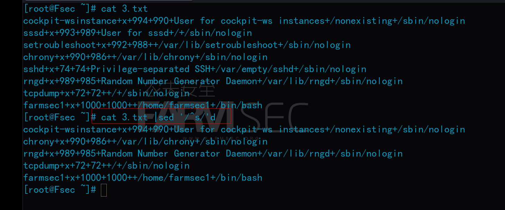
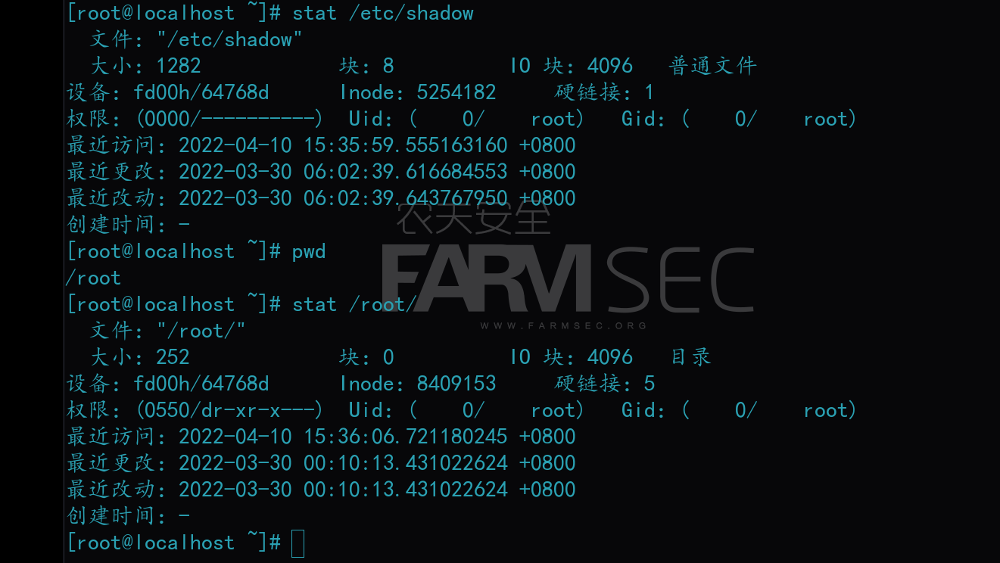

# 101-A10-Linux基础命令（3）

本节主要介绍一些文本处理相关的linux命令，是日后信息安全工作中的情报侦察、数据梳理、日志分析等技术的重要基础。

##  1. awk 命令

`awk`是一种处理文本文件的语言，是一个强大的文本分析工具。

相比较屏幕处理的优点，`awk`在处理庞大文件时不会出现内存溢出或是处理缓慢的问题，通常用来格式化文本信息。
`awk`也是一个非常棒的数据处理工具！相较于`sed `常常作用于一整个行的处理, `awk`则比较倾向于一行当中分成数个`字段`来处理。

`awk`处理过程: 依次对每一行进行处理，然后输出。

命令的基本格式是：`awk ‘{print($1)}’`

案例：

```bash
cat 1.txt|awk '{print($2)}'                 #打印出文本中每行的第二个字段
```


```bash 
cat /etc/passwd |awk -F ":" '{print($1)}'  #-F指定分隔符，以“：”为分隔符，打印出文本中每行第一个字段
```


```bash
cat /etc/passwd |awk -F ":" '{print($1,"+++",$3)}'   #打印出第一个字段与第三个字段，并在其中间添加+++内容
cat /etc/passwd |awk -F ":" '{print($1"+++"$3)}'     #对比差异
```


```bash
cat passwd | awk -F ":" '{print $NF}'       #打印出文本中每行的最后一个字段
cat passwd | awk -F ":" '{print $(NF-1)}'   #打印出文本中每行的倒数第二个字段。$（NF-1）为倒数第二，依此类推。
```


## 2. sed 命令

`sed` 是stream editor(流编辑器)的简称，是一款强大的,并且有些复杂的程序。

`sed` 本身是一个管线命令，可以将数据进行替换、删除、新增、提取特定行等功能，主要用来自动编辑一个或多个文件、简化对文件的反复操作、编写转换程序等。sed按行来执行命令。

接下来的实验，我们要以/etc/passwd文件内容为例子。

拷贝文件`cat /etc/passwd > 1.txt`

我们以一个例子来介绍`sed`命令，`sed 's/:/+/g'`

s代表搜索，g代表的则是全文。不加g的话则是替换每行第一个出现的。所以这条命令代表的将文件中所有的：替换为+


`cat 1.txt |sed 's/:/+/3g'`     #代表的则是从第三次匹配开始替换，依此类推。


`sed -i 's/:/+/g' 1.txt`              #参数`-i`,直接修改文件，并非打印出来。


以上这些命令中是以/做为该命令的定界符，如果需要修改或者匹配的字段带有/则不能再使用/做为该条命令的定界符，可以使用任意的定界符，不冲突就行。`cat passwd |sed 's!:!/!g' ` 以！号做为定界也是一样的。

此外，在此命令中，搜索位置使用`^`代表一行的开头，`$`代表一行的结尾。`sed`是以行为单位执行的。

我们用如下案例展示：

`cat ip.txt |sed 's#^#http://#g'`在每行之前加上`http://`。


`cat ip.txt |sed 's#$#:8080#g'`在每行末尾加上“:8080”


`sed '/^$/d' 2.txt`删除空白的行。


`sed '/^s/'d ` 删除文件中所有开头是s的行。




## 3. grep 命令

grep这个名字来自于短语“global regular expression print”，所以我们能看出 grep 程序和正则表达式有关联。

本质上，grep 程序会在文本文件中查找一个指定的正则表达式,并把匹配行输出到标准输出。

命令格式：
`grep [options] [pattern]　[filename]`

案例：

```bash
cat passwd |grep root                          # 只显示带有root关键字的行
grep -e root passwd                            # 匹配有root的行
grep -v root passwd                            # 忽略匹配到的行
cat passwd |grep -E "root|sshd"                # 包含多个可能性的行
cat passwd |grep -E '^r'                       # 以r开头的行
cat passwd |grep -E 'n$'                       # 以n结尾的行
grep “root” /etc/passwd /etc/shadow            # 查询多个文件
grep "passwd" /etc -rn                         # -r 为递归 -n 显示关键字出现在第几行   在多级目录中对文本进行递归查找
```


## 4. find 命令


`find` 命令用来在指定目录下查找文件。任何位于参数之前的字符串都将被视为欲查找的目录名。如果使用该命令时，不设置任何参数，则 find  命令将在当前目录下查找子目录与文件。并且将查找到的子目录和文件全部进行显示。

这是一个超级复杂的命令，最简单的模式为：`find 路径 -name [名字]`。

案例：

```bash 
find / -size 1000k                #从根目录查找大小为1000K的文件
find   -name '1*'                 #在当前目录下查找文件名以1开始的文件
find / -name '1*'                 #从根目录查找文件名以1开始的文件
find / -user farmsec1             #从根目录查找属主为farmsec1的文件
find / -group farmsec             #从根目录查找属组为farmsec的文件
find /etc -type f/d               #按sock类型查找，f代表文件，d代表目录
find . -type f -mtime -7          #搜索7天内当前目录下修改过的文件（-7代表7天内，7代表前7天那一天，+7代表7天前）
find . -type f -mmin -10          #搜索10分钟内当前目录下修改过的文件 
find . -atime -1 -type f          #搜索当前目录下一天内被访问的文件（-1代表1天内，1代表前1天那一天，+1代表1天前）
find . -amin -10 -type f          #搜索当前目录下10分钟内被访问的文件
find . -ctime -1 -type f          #搜索当前目录下一天内状态被改变（列如权限）的文件（-1代表1天内，1代表前1天那一天，+1代表1天前）
find . -cmin -10 -type f          #搜索当前目录下10分钟内状态被改变的文件
find . -perm 777                  #搜索处当前文件下符合777权限的文件
```


+ exec选项

```bash
find 搜索路径 [选项] 搜索内容 -exec 命令2{}\;
find . -type f -perm 644 -exec ls -l {} \;
find / -exec grep "Hello" {} \;

find / -name "*.tmp" -exec rm -f {} \;   (危险)
find / -name "*" -ctime +2 -exec rm -f {} \;（危险，别敲） 
```


## 5. ag 命令

`ag`类似`grep`和`find`，但是执行效率比后两者高。

最基本的用法为`ag -g <File Name>`,从当前目录寻找文件


案例：

```bash
ag -g <File Name>            # 类似于 find . -name <File Name>
ag -i PATTERN                # 忽略大小写搜索含PATTERN文本
ag -A [number] PATTERN       #搜索含PATTERN文本，并显示匹配内容之后的n行文本，例如：ag -A 5  abc会显示搜索到的包含abc的行以及它之后5行的文本信息。
ag -B [number] PATTERN       #搜索含PATTERN文本，并显示匹配内容之前的n行文本
ag -C [number] PATTERN       #搜索含PATTERN文本，并同时显示匹配内容以及它前后各n行文本的内容。
ag --ignore-dir <Dir Name>   #忽略某些文件目录进行搜索。
ag -w PATTERN                #全匹配搜索，只搜索与所搜内容完全匹配的文本。
ag --java PATTERN            #在java文件中搜索含PATTERN的文本。
ag --xml PATTERN             #在XML文件中搜索含PATTERN的
```


## 6.stat命令

用于显示文件信息：

用法：stat [文件或目录]

```
stat /etc/passwd
```




## 7. split 命令

`split`命令可以将一个大文件分割成很多个小文件，有时需要将文件分割成更小的片段，比如为提高可读性，生成日志等。

参数：

+ -b 按文件大小进行切割   
+ -l 按行数来进行切割
+ -d 为使用数字为生成文件的后缀  
+ -a 指定后缀的长度

案例：

```bash
split -b 30k messages    # 按照每个文件30K大小切割messages文件。
split -l 300 messages    # 将messages文件切割为每3行一份。
```


## 8.sort命令

`sort`命令是在Linux里非常有用，它将文件进行排序，并将排序结果标准输出。

```bash
cat 1.txt|sort            #默认的排序方式，从首字母开始
cat 1.txt|sort -t         #按照字典进行排序
cat 1.txt|sort -n         #按照数字进行排序
```


## 9. uniq 命令

`uniq`用于报告或忽略文件中的重复行，一般与sort命令结合使用。

要注意先排序，后去重。因为uniq命令只能消除相邻且相同的行。

```bash
cat 1.txt |sort -n |uniq              #排序去重
cat 1.txt|sort -n |uniq -c            #列出重复的次数
cat 1.txt |sort -n |uniq -d           #列出有哪些行是重复的
```


以上系列命令可以用于日志分析：

如统计IP地址的访问数量并按照数量进行排序：
`cat access_log |awk '{print($1)}'|sort|uniq -c |sort -nr |more`

针对访问量最大的IP分析其访问内容：
`cat access_log |grep 'IP地址'|head -n 100`


## 10. nl 命令

`nl`命令用于显示文件内容行号。

案例：

```bash
cat /etc/passwd |nl
```


## 11.远程连接命令

### 11.1 ssh命令

`ssh`命令是Linux的远程连接工具。

ssh命令：Linux的远程连接工具

例如`ssh 192.168.0.149`，以当前终端用户身份远程连接IP为`192.168.0.149`的计算机。   

+ -l    为指定用户   如 `ssh -l farmsec 192.168.0.149`以farmsec用户远程登录，也可写成`ssh farmsec@192.168.0.149`
+ -p  为指定端口号


执行`ssh`的默认情况下，会使用本地的用户名连接对方的用户名，例如本地的root连接对面服务器的root，如果两端用户名不一样，则需要使用`-l username`指定用户名。

再确认密码后，方能登录成功，而同时变化的文件为：`/root/.ssh/known_hosts`
在第一次登录时，openssh将会提示不知道这台登录的主机，只要输入`yes`，就会把这台主机的“识别信息”添加到known_hosts文件中.
第二次登陆后，则无须此步骤，但是如果出现错误，例如主机产生变化，则需要删除`/root/.ssh/known_hosts`内容。

### 11.2 linux下远程连接smb

Smb服务为网络文件共享协议，它允许应用程序和终端用户从远端的文件服务器访问文件资源
用法：在kali的`文件`–>`其他位置`-->`连接到服务器`处输入：`smb://192.168.0.149/share`


关于此部分知识，还将在后续有关windows的章节中详述。

### 11.3 rdesktop 命令

`rdesktop`命令用于在linux下链接windows远程桌面。

用法：`rdesktop 192.168.0.178`

关于此部分知识，还将在后续有关windows的章节中详述。

## 12. URL 相关命令

URL，既是俗称的网址/网页链接。

### 12.1 curl 命令

`curl`命令是一个利用URL规则在命令行下工作的文件传输工具。它支持文件的上传和下载，所以是综合传输工具，但按传统，习惯称curl为下载工具。作为一款强力工具，curl支持包括HTTP、HTTPS、ftp等众多协议，还支持POST、cookies、认证、从指定偏移处下载部分文件、用户代理字符串、限速、文件大小、进度条等特征。

用法：`curl [选项] [url]`

参数：

+ -i  显示头部信息
+ -v 显示请求全过程解析
+ -O 下载

案例：

```bash
curl www.farmsec.com
curl www.farmsec.com -i
curl www.farmsec.com -v
curl -O https://bootstrap.pypa.io/get-pip.py
```


### 12.2 wget 命令

wget命令：用来从指定的URL下载文件。wget非常稳定，它在带宽很窄的情况下和不稳定网络中有很强的适应性，如果是由于网络的原因下载失败，wget会不断的尝试，直到整个文件下载完毕。如果是服务器打断下载过程，它会再次联到服务器上从停止的地方继续下载。这对从那些限定了链接时间的服务器上下载大文件非常有用。

```bash
wget https://bootstrap.pypa.io/get-pip.py
```


前面我们下载下的文件名都是乱码，所以我们需要给它自定义文件名
加入-O的参数即可指定文件名

```bash
wget  https://bootstrap.pypa.io/get-pip.py -O 123.py	
```


如果文件比较大时，加入参数`-b`，进行后台下载，然后可使用使用`tail -f wget-log`查看进度。


```bash
-c：继续执行上次终端的任务；可以在下载中断后再次使用。
```


