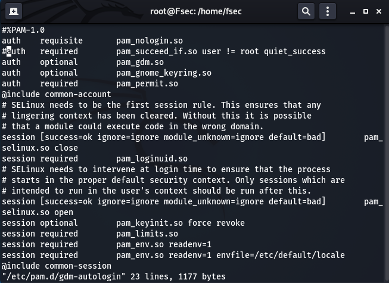
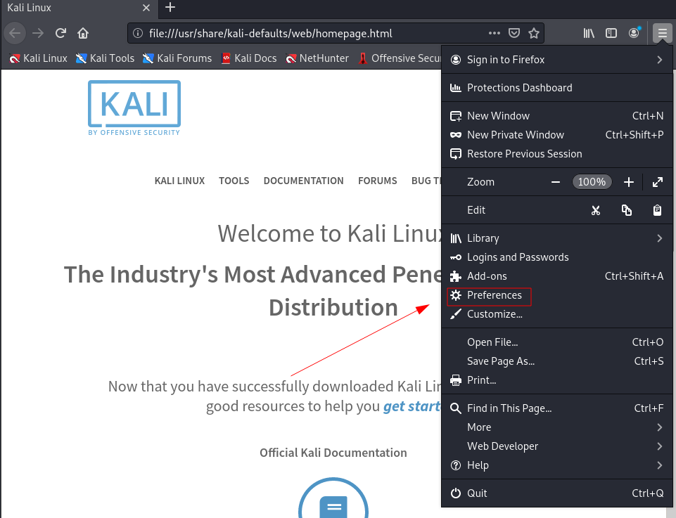
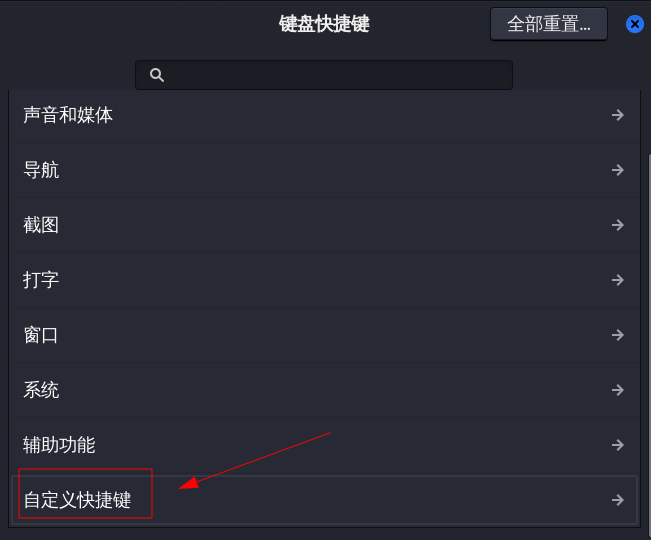

# 101-A2-Kali Linux系统调试

---

在安装好kali系统后，我们需要对系统进行一些设置以方便日后使用。


## 1. 开启root用户登录

Root用户，也称为根用户，是Unix系统(如Linux、QNX等)，及Android和iOS移动设备系统中的唯一的超级用户，因其可对根目录执行读写和执行操作而得名。其具有系统中的最高权限，如启动或停止一个进程，删除或增加用户，增加或者禁用硬件，添加文件或删除所有文件等等。

在kali系统安装后，默认用户为非root，不具备管理员权限。这是出于系统安全考虑的设置，但不利于我们下一步学习掌握kali系统。因此需要将kali设置为以root用户管理。

有两种方法，可以实现开机以root身份登录kali系统。

第一种方法如下：

所需命令：

```bash
sudo -s
vi /etc/pam.d/gdm-autologin
vi /etc/pam.d/gdm-password
vi /etc/passwd
password
init 6
```

具体操作如下：

点击下图图标进入命令终端。


1.1使用命令`sudo -s`，并输入密码。


1.2输入命令：`vi /etc/pam.d/gdm-autologin`，命令执行后显示如下页面。


按`i`键进入文本编辑模式。在第三行文本前输入`#`。



修改完成后按`Esc`键退出编辑模式，输入`:`调出文件编辑命令，再输入`wq`，按回车退出文本。`w`为保存，`q`为退出。

1.3输入命令`vi /etc/pam.d/gdm-password`，按照上文方法将第三行文本修改为下图：


`:wq`保存退出。

1.4输入命令`vi /etc/passwd`。将文本第一行改为下图格式。


1.5输入`password`命令设置root用户密码。


1.6输入`init 6`重启计算机。（`init 0`为关机）

1.7重启后登入root用户。


第二种方法是通过安装软件包实现root登录。

使用`apt-get install kali-root-login`命令安装软件包。


安装完成后，输入命令`passwd`修改root密码。


`init 6`重启后使用root登录。


## 2. 在 nvidia 显卡计算机上安装驱动

部分使用nvidia显卡的计算机在安装kali后会产生缺少驱动不兼容的情况。解决这一问题可参考如下步骤:

> apt-cache search linux-image
>
> apt-get install linux-image-xxx linux-header-xxx
>
> init 6
>
> echo -e "blacklist nouveau\noptions nouveau modeset=0\nalias nouveau off" > /etc/modprobe.d/blacklist-nouveau.conf
>
> update-initramfs -u && reboot
>
> apt-get install dkms
>
>   下载nvidia相应的驱动程序后，用以下命令执行安装。
>
> ./NVIDIA-Linux-x86_64-470.74.run         #全部选是即可
>
>  安装驱动后需要编辑一些配置文件
>
> vi /etc/X11/xorg.conf
>
> ```
> Section "ServerLayout"
>  Identifier "layout"
>  Screen 0 "nvidia"
>  Inactive "intel"
> EndSection
> 
> Section "Device"
>  Identifier "nvidia"
>  Driver "nvidia"
>  BusID "PCI:1:0:0"
> EndSection
> 
> Section "Screen"
>  Identifier "nvidia"
>  Device "nvidia"
>  Option "AllowEmptyInitialConfiguration"
> EndSection
> 
> Section "Device"
>  Identifier "intel"
>  Driver "modesetting"
> EndSection
> 
> Section "Screen"
>  Identifier "intel"
>  Device "intel"
> EndSection
> ```
>
> vi /usr/share/gdm/greeter/autostart/optimus.desktop
>
> ```
> [Desktop Entry]
> Type=Application
> Name=Optimus
> Exec=sh -c "xrandr --setprovideroutputsource modesetting NVIDIA-0; xrandr --auto"
> NoDisplay=true
> X-GNOME-Autostart-Phase=DisplayServer
> ```
>
> vi /etc/xdg/autostart/optimus.desktop
>
> ```
> [Desktop Entry]
> Type=Application
> Name=Optimus
> Exec=sh -c "xrandr --setprovideroutputsource modesetting NVIDIA-0; xrandr --auto"
> NoDisplay=true
> X-GNOME-Autostart-Phase=DisplayServer
> ```
>
> init 6

以上命令中，执行`apt-cache search linux-image`命令可检索kali系统最新版本内核。系统内核是操作系统最基本的部分。在linux环境中，某些软件和驱动在安装过程中需要调用最新的内核版本。因此我们需要找到最新版本系统内核并安装升级。


执行`apt-get install linux-image-xxx linux-header-xxx`命令以安装kali最新版本内核，其中xxx代表内核版本。如下图：


安装新的内核之后需要重启电脑，其余命令按上文顺次执行即可。

## 3. 安装搜狗输入法

在kali系统中，默认环境是没有中文输入法的，因此需要我们手动安装。

[下载搜狗输入法地址](https://pinyin.sogou.com/linux/?r=pinyin)为：https://pinyin.sogou.com/linux/?r=pinyin

下图图标为kali自带火狐浏览器。


下图图标为kali文件系统图标，点击图标进入文件系统。从浏览器下载的内容默认保存在，`下载`文件夹下。


在此文件夹下，右键菜单打开终端。


执行`dpkg -i sogouimebs_2.1.0.2214_amd64.deb`安装搜狗输入法。


由于缺少依赖环境，安装输入法报错，发生此类情况时可用`apt-get install -f`命令进行强制修复安装。


完成此操作后，`init 6`重启电脑。使用`Ctrl+空格`调出搜狗输入法。


## 4. 安装WPS

WPSOffice是一款办公软件套装，可以实现办公软件最常用的文字、表格、演示，PDF阅读等多种功能，全面兼容微软Office97-2010格式。最重要的是它可以在linux平台上使用。

[WPS下载地址](https://linux.wps.cn/)为:https://linux.wps.cn/

选择64位Deb格式下载。


同样按照前文方式操作，在下载文件所在位置打开命令终端，执行`dpkg -i wps-office_11.1.0.10702_amd64.deb`命令安装软件。如发生安装错误，仍可用`apt install -f`命令修复安装。

安装完成后，可在如下位置找到WPS。鼠标右键菜单选择添加到收藏夹，可以将此软件图标固定在桌面侧边栏上。

打开WPS软件时会出现如下报错，这其实是kali系统缺少某些中文字体导致的。


其实这种情况并不影响使用，可以无视。但你也可以收集一些字体文件，将字体文件拷贝至kali字体文件夹即可。kali字体文件夹路径为`/usr/share/fonts/`。

WPS切换搜狗输入法。部分系统可能会遇到打开WPS后搜狗输入法切换不出来的情况。需要在三个配置文件中加入环境变量。同时卸载英文输入法解决这个问题。

>`vim /usr/bin/wps`
>
>```
>export XMODIFIERS="@im=fcitx"
>export QT_IM_MODULE="fcitx"
>```
>
>`vim /usr/bin/et`
>
>```
>export XMODIFIERS="@im=fcitx"
>export QT_IM_MODULE="fcitx"
>```
>
>`vim /usr/bin/wpp`
>
>```
>export XMODIFIERS="@im=fcitx"
>export QT_IM_MODULE="fcitx"
>```
>
>`apt-get remove --purge ibus`

完成后重启计算机，可以解决这个问题。

## 5. 安装 Virtualbox 虚拟机

VirtualBox是一款功能强大的虚拟化软件，所谓虚拟化软件（virtualizationsoftware）是指可以让一部主体电脑建立与执行一至多个虚拟化环境（virtualenvironment）的软件，关于这一部分知识我们会在后续章节中会着重介绍。现在你只需简单的理解为，虚拟化软件可以实现在你的电脑上模拟出另一个或多个假计算机，这些虚拟的计算机可以搭建不同操作系统和不同软件服务，从而模拟各式各样的网络环境与主机环境。从这个角度看，虚拟化软件绝对是练习信息安全技术的利器，Virtualbox则是虚拟化软件中的一款。

安装virtualbox所需命令如下：

```bash
apt-cache search linux-image
apt-get install linux-headers-xxx linux-image-xxx
init 6
apt-get install virtualbox virtualbox-guest-additions-iso
```

以上命令中，执行`apt-cache search linux-image`命令可以查询kali系统最新版本内核。系统内核是操作系统最基本的部分。在linux环境中，某些软件在安装过程中需要调用最新的内核版本。因此我们需要找到最新版本系统内核并安装升级。


执行`apt-get install linux-image-xxx linux-header-xxx`命令以安装kali最新版本内核，其中xxx代表内核版本。如下图：


安装新的内核之后需要重启电脑。重启后，执行`apt-get install virtualbox virtualbox-guest-additions-iso`命令安装虚拟机。安装完成后，可以按照前文操作方式在kali软件菜单内找到它。图标为：


## 6. Firefox 浏览器调优

MozillaFirefox，中文俗称“火狐”，是一个由Mozilla开发的自由及开放源代码的网页浏览器。它自带于kali系统中，在使用之前我们需要对部分功能进行调整。

### 6.1 将 Firefox 浏览器设置为中文。操作如下图：




重启浏览器后，Firefox菜单变为中文。

### 6.2  firefox 关闭 success.txt 及开启插件安装

打开浏览器,在地址栏输入`about:config`


在search那一行输入network.captive，将network.captive-portal-service.enadbled那一行双击改为false
​	

在search那一行输入xpinstall.signatures，将xpinstall.signatures.required那一行双击改为false


### 6.3 更新 Firefox 浏览器

在命令终端执行`apt-get install firefox-esr`命令可将Firefox浏览器升级到最新版本。


## 7. 安装 Chrome 浏览器

双浏览器更符合信息安全工作的需要，因此我们再加装一款谷歌浏览器。

> apt-get install chromium
>
> vi /usr/share/applications/chromium.desktop
>
> ```
> Exec=/usr/bin/chromium --no-sandbox %U		
> ```
>

执行`vi /usr/share/applications/chromium.desktop`命令后，将文本中`Exec`一行改为如下内容：


安装完成后软件图标为：


## 8. typora 安装

作为一个信息安全技术的学习者，记笔记是相当必要的。学习任何IT技术所需的笔记软件都要满足以下条件：界面美观简洁、编辑使用快捷、排版不易变形、便于查询检索、便于复制粘贴、可跨平台使用、便于拷贝导出，以及软件精简轻量。typroa软件满足以上所有条件。你现在看到的文字和排版就是用typora写成的。

typora可以使用markdown语法编写笔记。至于markdown语法是什么？如何使用？网上一搜一大把。这是你要靠百度自己学会的第一个知识。想当好信息安全工程师，利用百度谷歌自学是必备的素养。检索教程并学习掌握typroa软件使用和markdown语法大致需要你付出半小时到一小时的学习时间，但绝对值得。

安装typora需要执行如下命令：

```bash
wget -qO - https://typora.io/linux/public-key.asc | sudo apt-key add -
add-apt-repository 'deb https://typora.io/linux ./'
apt-get update
apt-get install typora
vi /usr/share/applications/typora.desktop
修改exec为：/usr/bin/typora --no-sandbox
```

软件安装完成后图标为：


## 9. flameshot 截图工具安装

截图功能是编写学习笔记和渗透测试报告时所必须的，在kali中我们可以安装一款名为flameshot的截图工具。

安装：

```bash
apt-get install flameshot
```

设置快捷键：





设置完成后，按`Ctrl+Alt+A`即可截图。


## 10. 安装 python-pip

pip是Python包管理工具，该工具提供了对Python包的查找、下载、安装、卸载的功能。关于python编程语言有关的知识将在后文介绍。许多黑客脚本都用python编写，也依赖某些python模块运行。因此我们需要pip来安装某些python脚本所需的模块。

安装pip3

```bash
apt-get install python3-pip
```

安装pip2

```
curl -O https://bootstrap.pypa.io/pip/2.7/get-pip.py
python2 get-pip.py
```

如没有`curl`命令kali会提示安装，选`y`。


安装完成后，执行如下命令：

```
pip2 -V
pip3 -V
```

可以查看pip的版本。验证安装是否完成 。


