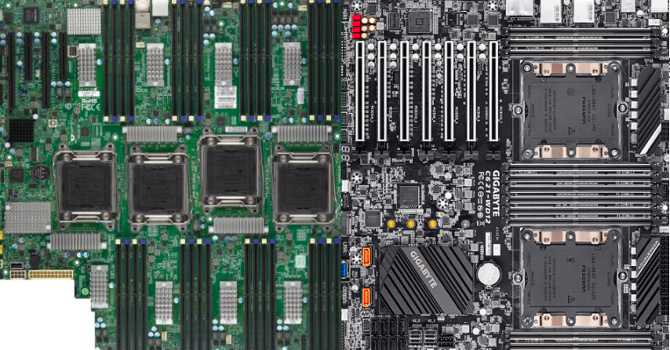
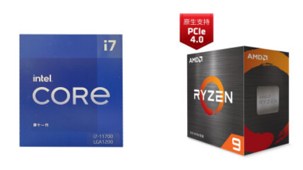
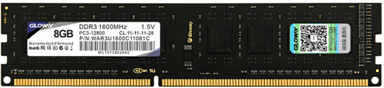
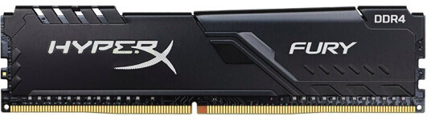
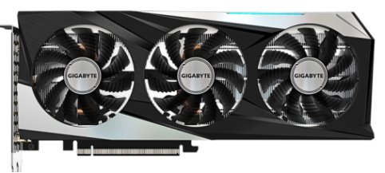
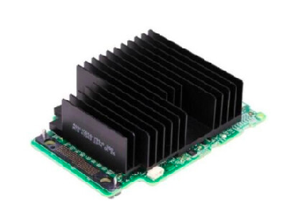

# 101-A3-计算机服务器硬件

---

作为信息安全从业者了解硬件常识是必要的。在本节中我们介绍了一些服务器硬件方面的知识。在农夫以往的线下教学中，我们为学员提供物理服务器以便学习，此一节知识作为接触服务器的准备。


## 1. 服务器

服务器，也称伺服器，是提供计算服务的设备。服务器在网络中为其它客户机（如PC机、智能手机、ATM等终端甚至是火车系统等大型设备）提供计算或者应用服务。服务器具有高速的CPU运算能力、长时间的可靠运行、强大的I/O外部数据吞吐能力以及更好的扩展性。
​由于服务器需要响应服务请求，并进行处理，因此一般来说服务器应具备承担服务并且保障服务的能力。服务器的构成包括处理器、硬盘、内存、系统总线等。

```bash
请思考台式机、笔记本电脑、工作站、服务器对于稳定性的要求差异？
```


## 2. 主板

主板：相当于人体的神经系统，将所有的组件进行相互联系。
​主板主流品牌：华硕，技嘉，微星，超微
​服务器的区别：服务器主板一般都是至少支持两个处理器，往往是双路以上的服务器，单路服务器有时候就是使用台式机主板。




## 3. CPU

CPU（中央处理器）：想当于人体的大脑
​常见品牌：Intel、AMD，龙芯，上海兆芯，上海申威
​CPU的核心数：是指物理上，也就是硬件上存在着几个核心。比如，双核就是包括2个相对独立的CPU核心单元组，四核就包含4个相对独立的CPU核心单元组。
​CPU线程数：它是一种逻辑的概念，简单地说，就是模拟出的CPU核心数。比如，可以通过一个CPU核心数模拟出2线程的CPU，也就是说，这个单核心的CPU被模拟成了一个类似双核心CPU的功能
​CPU的摩尔定律：摩尔定律是由英特尔（Intel）创始人之一戈登·摩尔（Gordon Moore）提出来的。其内容为：当价格不变时，集成电路上可容纳的元器件的数目，约每隔18-24个月便会增加一倍，性能也将提升一倍。换言之，每一美元所能买到的电脑性能，将每隔18-24个月翻一倍以上。



## 4. 内存

CPU和磁盘之间的缓冲设备，也叫临时存储器（存放数据），断电时数据丢失
​一般程序运行时会被调度到内存中执行，服务器关闭或程序关闭后，数据从内存中释放掉。
​ECC校验：ECC校验是一种内存纠错原理，它是现在比较先进的内存错误检查和更正的手段。ECC内存即纠错内存，简单的说，其具有发现错误，纠正错误的功能，一般多应用在高档台式电脑/服务器及图形工作站上，这将使整个电脑系统在工作时更趋于安全稳定。






## 5. 显卡

显卡又称显示卡( Video card)，是计算机中一个重要的组成部分，承担输出显示图形的任务，对喜欢玩游戏和从事专业图形设计的人来说，显卡非常重要。主流显卡的显示芯片主要由NVIDIA（英伟达）和AMD（超微半导体）两大厂商制造，通常将采用NVIDIA显示芯片的显卡称为N卡，而将采用AMD显示芯片的显卡称为A卡.

cpu GPU  8-16 3.8G   100cpu  TITAN




## 6. 硬盘

硬盘：硬盘是计算机的最主要的存储设备
机械硬盘大概分类： I/O 
蓝绿黑红紫金
硬盘容量：硬盘容量是以兆字节（MB）或千兆字节（GB）为单位，1GB=1024MB，1TB=1024GB。但硬盘厂商在标称硬盘容量时通常取1G=1000MB，因此我们在BIOS中或在格式化硬盘时看到的容量会比厂家的标称值要小。
硬盘转数：硬盘转速以每分钟多少转来表示，单位表示为RPM，RPM是Revolutions Per minute的缩写，是转/每分钟。RPM值越大，内部传输率就越快，访问时间就越短，硬盘的整体性能也就越好

SSD硬盘：容量、接口、速率、可擦写次数。


## 7. raid卡

raid卡：一般是指磁盘阵列。
磁盘阵列是由很多块独立的磁盘，组合成一个容量巨大的磁盘组，利用个别磁盘提供数据所产生加成效果提升整个磁盘系统效能。利用这项技术，将数据切割成许多区段，分别存放在各个硬盘上，
磁盘阵列的好处是：当任意一个硬盘发生故障时，仍可读出数据。在数据重构时，可将数据经计算后重新置入新硬盘中
raid阵列常用的几种级别为：raid0，raid1，raid5，raid10  raid01



服务器BIOS的设置

DEll R710 BIOS设置详解：
https://wenku.baidu.com/view/3132f4363968011ca300910d.html

