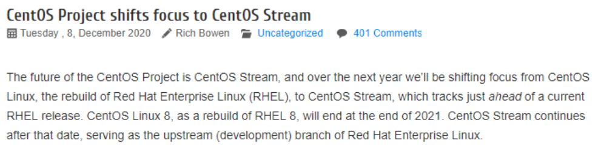
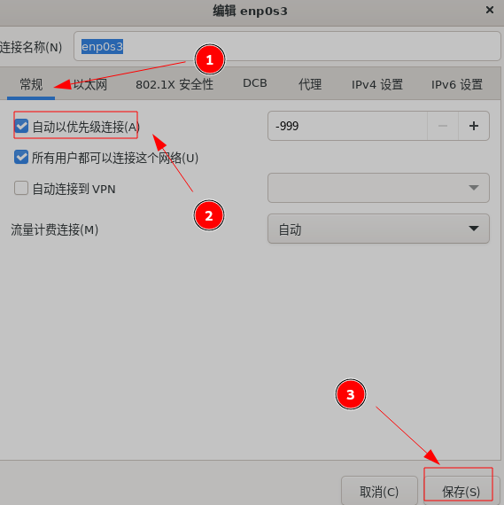

# 101-A4-CentOS 系统安装

---

在学习信息安全的过程中，我们会逐步学习搭建各类系统和服务以便研究和练习。在本节中，我们将学习搭建centos环境，以便学习linux系统命令与服务。


## 1. CentOS 系统介绍

CentOS操作系统是Linux系统的一个发行版。

Linux操作系统，全称GNU/Linux，是一种免费使用和自由传播的类UNIX操作系统，其内核由林纳斯·本纳第克特·托瓦兹于1991年10月5日首次发布，它主要受到Minix和Unix思想的启发，是一个基于POSIX和Unix的多用户、多任务、支持多线程和多CPU的操作系统。

它能运行主要的Unix工具软件、应用程序和网络协议。它支持32位和64位硬件。

Linux继承了Unix以网络为核心的设计思想，是一个性能稳定的多用户网络操作系统。

严格来讲，Linux这个词本身只表示Linux内核，但实际上人们已经习惯了用Linux来形容整个基于Linux内核，并且使用GNU 工程各种工具和数据库的操作系统。

关于Linux的发行版本，比较流行的有两大体系。一是debain体系，Ubuntu和kali系统就属于这一体系。另一个体系称为redhad，具有代表性的发行版有Red Hat公司发布的面向企业用户的Linux操作系统，即Red Hat Enterprise Linux（简称RHEL），而CentOS（Community Enterprise Operating System，中文意思是社区企业操作系统）则来自于RHEL依照开放源代码规定释出的源代码所编译而成。由于出自同样的源代码，因此有些要求高度稳定性的服务器以CentOS替代商业版的Red Hat Enterprise Linux使用。两者的不同在于Centos完全开源。


## 2.再见 CentOS， Rocky Linux 要来了

Centos系统目前最新的版本是Centos 8，已于2021年12月8日停止更新。在这之后不会出现CentOS 9系统了，取而代之是CentOS Stream这个叫滚动发行版本。CentOS是100%重建的RHEL。RHEL需要交服务费，而CentOS是免费的。简单的来说就是免费的版本没有了，后续不再支持社区版本了。

好的消息是 CentOS Linux 的替代产品 Rocky Linux 于 2021 年第二季度发布了，但目前Rocky Linux还比较年轻。




## 3. CentOS 系统下载

[centos官网](https://www.centos.org/)地址为https://www.centos.org/ ，从官网可下载最新版的centos安装镜像，现存为centos与stream两个版本。我们下载CentOS Stream版本。


## 4.制作 CentOS 安装介质

现今centos stream的安装镜像大小在8.2G以上，为此只建议通过U盘作为安装介质。

```
umount /dev/sdb*
mkfs.vfat /dev/sdb -I
dd if=CentOS-Stream-8-x86_64-xxx-dvd1.iso of=/dev/sdb
```


## 5. Virtualbox 使用

### 5.1 创建虚拟机

本次实验我们采用Virtualbox虚拟机来安装Centos stream。


在virtualbox中点击新建。需要命名虚拟机名称，选择虚拟机文件保存位置，类型选择Linux，版本选择redhat64。


​		内存给1G.


选择文件保存位置，分配虚拟机大小为16G。点击创建。


### 5.2 设置虚拟机		

创建完成后，选择该虚拟机，点击设置。


在存储一页选择挂载刚刚下载的centos镜像路径。


在网络一页选择，桥接网络模式。


全部设置好以后，点击OK保存设置并退出。点击启动即可启动虚拟机。


如想关闭虚拟机，点击右上角x号即可。选择“快速休眠”，虚拟机将进入休眠模式，相当于暂停，下次打开时将从暂停状态继续工作。选择“正常关闭”则类似于关机，下次打开时虚拟机将从开机开始运行。


### 5.3 虚拟机网络模式		

这里介绍一下虚拟机常见的四种网络模式：

+ Bridged（桥接网卡模式）

桥接模式就是将主机网卡与虚拟机虚拟的网卡利用虚拟网桥进行通信。在桥接的作用下，类似于把物理主机虚拟为一个交换机，所有桥接设置的虚拟机连接到这个交换机的一个接口上，物理主机也同样插在这个交换机当中，所以所有桥接下的网卡与网卡都是交换模式的，相互可以访问而不干扰。在桥接模式下，虚拟机ip地址需要与主机在同一个网段，如果需要联网，则网关与DNS需要与主机网卡一致。

如果现在不能理解以上概念，你可以暂时理解为，在桥接模式下，物理机与虚拟机都在同一个路由器下，两者可以互相交互，但两者上网时是不需要经过对方的，只需各自经路由器访问互联就好。就好像你在家中，手机和电脑都同连一个WiFi，手机与电脑可以进行网络交互（ping），同时手机和电脑上网时都不需要经过对方，直接经过WiFi访问互联就好。同时，如果在这个wifi下还有其他设备，这些设备都是可以互相交互的。

+ NAT（地址转换模式）

使用NAT模式，就是让虚拟系统借助NAT(网络地址转换)功能，通过物理机所在的网络来访问公网。也就是说，使用NAT模式可以实现在虚拟系统里访问互联网。NAT模式下的虚拟系统的TCP/IP配置信息是由虚拟网络的DHCP服务器提供的，无法进行手工修改，因此虚拟系统也就无法和本局域网中的其他真实主机进行通讯。采用NAT模式最大的优势是虚拟系统接入互联网非常简单，你不需要进行任何其他的配置，只需要物理机能访问互联网即可。

如果现在不能理解以上概念，你可以暂时理解为，在NAT模式下，物理机就是虚拟机的路由器，两者可以互相交互，但虚拟机上网必须经由物理机才能实现。就好像在你家中，手机连接了家里的WiFi，但电脑连接的是手机的热点，此时手机与电脑可以互相交互（ping），但如果电脑想上网，必须经过手机热点才行。同时，如果家庭wifi中连接其他手机，连接热点的电脑与其是无法交互的（ping）。

+ host-only(主机模式)

在某些特殊的网络调试环境中，要求将真实环境和虚拟环境隔离开，这时你就可采用host-only模式。在host-only模式中，所有的虚拟系统是可以相互通信的，但虚拟系统和真实的网络是被隔离开的。

简单理解的话，在host-only模式下，虚拟机无法与外部网络通信，但可以与物理机交互。

+ Internal（内部网络模式）

内网模式，顾名思义就是内部网络模式，虚拟机与外网完全断开，只实现虚拟机与虚拟机之间的内部网络模式。

我们用以下表格表达各模式网络连通性的不同：

| 模式名称\连通 | 虚拟机与外部网络 |       虚拟机与物理机       | 同一物理机下的各虚拟机 | 跨物理机的各虚拟机 |
| :-----------: | :--------------: | :------------------------: | :--------------------: | :----------------: |
| 桥接网卡模式  |        是        |             是             |           是           |         是         |
|    NAT模式    |        是        | 有线网络可以，无线网络不行 |           是           |         否         |
| host-only模式 |        否        |             是             |           是           |         否         |
| 内部网络模式  |        否        |             否             |           是           |         否         |

### 5.4 虚拟机快照与恢复

在虚拟机运行过程中，点击控制–>生成备份可以生成系统快照。


生成的快照可以在`备份[系统快照]`中找到。


在此界面可以恢复快照。


一旦恢复快照，虚拟机将恢复到快照保存时的状态。保存快照之后的一切操作和改变都会被取消。


## 6 安装centos系统

启动虚拟机，选择Install Centos Stream 9


选择语言。


有`安装目的地`、`软件选择`、`网络和主机名`、`根密码`四项需要设置。


### 6.1 安装目的地设置


`/`根分区就是root分区，系统所有的东西都在这个分区内

`swap`分区是交换分区，在系统的物理内存不够用的时候，把硬盘内存中的一部分空间释放出来，以供当前运行的程序使用。那些被释放的空间可能来自一些很长时间没有什么操作的程序，这些被释放的空间被临时保存到Swap分区中，等到那些程序要运行时，再从Swap分区中恢复保存的数据到内存中。

`/boot`分区包含了操作系统的内核和在启动系统过程中所要用到的文件，建这个分区是有必要的，因为目前大多数的pc机要受到BIOS的限制，况且如果有了一个单独的/boot启动分区，即时主要的根分区出现了问题，计算机依然能够启动。这个分区的大小约在60MB—120MB之间。


### 6.2 软件选择

选择Sever安装。


### 6.3 网路和主机名




### 6.4 根密码

设置密码，勾选允许root用户ssh登录。点击完成。


全部完成后点击开始安装，安装进行完毕点击重启。


## 7 Centos细节调整

安装完成后，输入用户名密码即可登录系统。


执行`ip a`命令可查看当前虚拟机IP。


在kali或其他系统命令终端使用`ssh`命令可远程连接虚拟机，有关ssh命令的知识将在后续章节详述。

命令格式为：

```
ssh [用户名]@[ip]
```

执行后一般输入密码即可。但首次登录在系统询问中需输入yes。	


要方便今后的学习，我们需要对centos进行一些调整，包括：

```
selinux的关闭
Firewalld的关闭
cockpit的使用
```

此后章节中，如无特殊说明，所用centos实验环境大多需要关闭selinux，关闭防火墙，以方便我们实验操作。

### 7.1 selinux 关闭

使用`vi /etc/selinux/config `命令编辑selinux配置文件。将文件中的`SELINUX=enforcing`更改为`SELINUX=disabled`。


完成此操作后需要重启才能生效。

### 7.2 firewalld 关闭

```bash
systemctl stop firewalld
systemctl disable firewalld
```

执行`systemctl stop firewalld`命令关闭防火墙。

执行`systemctl disable firewalld`命令取消防火墙开机自启。


### 7.3 cockpit 的使用

```bash
systemctl start cockpit
```

执行`systemctl start cockpit`命令开启cockpit。开启后可在浏览器输入虚拟机IP：9090端口访问系统


登录后可通过web页面管理查看系统。


完成以上操作后，注意制作虚拟机快照，以方便后续学习操作中反复回滚到此初始环境。
