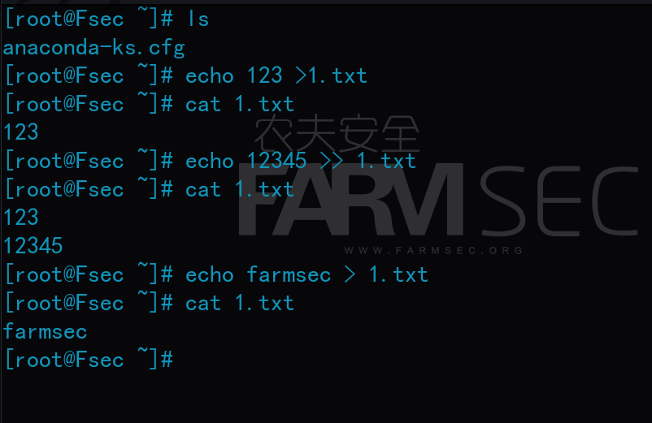

# 101-A5-Linux基础命令（1）

----

## 1. Linux 介绍

### 1.1 Linux 的介绍

Linux，全称GNU/Linux，是一种免费使用和自由传播的类UNIX操作系统，其内核由林纳斯·本纳第克特·托瓦兹于1991年10月5日首次发布，它主要受到Minix和Unix思想的启发，是一个基于POSIX和Unix的多用户、多任务、支持多线程和多CPU的操作系统。
​Linux继承了Unix以网络为核心的设计思想，是一个性能稳定的多用户网络操作系统。它能运行主要的Unix工具软件、应用程序和网络协议。它支持32位和64位硬件。
​严格来讲，Linux这个词本身只表示Linux内核，但实际上人们已经习惯了用Linux来形容整个基于Linux内核，并且使用GNU 工程各种工具和数据库的操作系统。 

### 1.2 Linux 的发行版

Linux有上百种不同的发行版，其中大体分为两类，一类是商业公司维护的发行版本，一类是社区组织维护的发行版本。如基于商业开发的Red Hat Enterprise Linux、SUSE、Oracle Linux，和基于社区开发的debian、archlinux等。前者以著名的Redhat（RHEL）为代表，后者以Debian为代表。

Redhat，应该称为Redhat系列，包括RHEL(Redhat Enterprise Linux，也就是所谓的Redhat Advance Server，收费版本)、Fedora Core(由原来的Redhat桌面版本发展而来，免费版本)、CentOS(RHEL的社区克隆版本，免费)。Redhat应该说是在国内使用人群最多的Linux版本，甚至有人将Redhat等同于Linux。Redhat系列的包管理方式采用的是基于RPM包的YUM包管理方式，包分发方式是编译好的二进制文件。稳定性方面RHEL和CentOS的稳定性非常好，适合于服务器使用，但是Fedora Core的稳定性较差，最好只用于桌面应用。

Debian，或者称Debian系列，包括Debian和Ubuntu等，我们所用的kali也属于这个系列。Debian是社区类Linux的典范，是迄今为止最遵循GNU规范的Linux系统。Debian最早由Ian Murdock于1993年创建。Debian最具特色的是apt-get / dpkg包管理方式。

在实际使用中，所感受到的最大差别应是两个体系在安装软件时所用的软件包的安装方式不同，例如redhat的yum与RPM，debian的apt-get与dpkg。有关这方面知识我们会在下节课详述。

除了这具有代表性的两大体系外，Linux发行版还有其他体系，例如Slackware系的SUSE Linux。我们的教程主要使用的是redhat与debian系。


## 2. Linux 常用命令

接下来，我们要开始了解一部分常用Linux命令。你可以选择在上一节搭建好的centos环境中练习命令，远程连接到centos的命令为`ssh root@ip`。你也可以在kali上使用linux命令，除了打开命令终端的方式，还可使用快捷键以将图形化界面切换为字符界面。按`CTRL+ALT+F3`至`F7`，kali将切换至字符界面。按`CTRL+ALT+F1`至`F2`，kali将切换回图形化界面。

### 2.1 mkdir 命令

`mkdir`命令用于创建目录。

用法：`mkdir [选项] [目录名]`

参数：`-p` 创建多级目录，如果目录名称不存在，就新建一个。

案例：

```bash
mkdir farmsec
mkdir farmsec1 farmsec2
mkdir -p farmsec3/farmsec4
```


### 2.2 ls 命令

`ls`命令用于显示指定工作目录下之内容（列出指定目录所含之文件及子目录)，`ls`命令的输出信息可以进行彩色加亮显示，以区分不同类型的文件。

用法：`ls [选项] [目录]`

参数：

+ `-a` 显示所有文件及目录 (**.** 开头的隐藏文件也会列出)

+ `-l`  除文件名称外，也将文件型态、权限、拥有者、文件大小等资讯详细列出

+ `-h` 以容易理解的格式列出文件大小

案例：

```bash
ls
ls -l
ls -a farmsec3
ls -al farmsec3
```


### 2.3  pwd 命令

`pwd`命令以绝对路径的方式显示用户当前工作目录。命令将当前目录的全路径名称（从根目录）写入标准输出。全部目录使用/分隔。第一个/表示根目录，最后一个目录是当前目录。执行pwd命令可立刻得知您目前所在的工作目录的绝对路径名称。

用法：`pwd`

案例：

```shell
pwd
```


### 2.4 cd 命令

`cd`命令用于切换当前工作目录。                 

用法：`cd [目录]`

案例：

```bash
cd farmsec
```


用法：`cd [绝对路径]`

案例：

```bash
cd /root/farmsec3/farmsec4
```


用法：  `.`代表当前目录，`..`代表上一级目录，`cd ~`用于切换至登录用户家目录。`cd -`用于回到上一个目录。

案例：

```bash
cd .
cd ..
cd ~
cd -
```


### 2.5 touch 命令

`touch`命令用于创建一个空白的新文件，如果同名文件已存在，则修改其时间属性。

用法： `touch [选项] [文件名]`

案例：

```bash
touch fsec1
```


### 2.6 cp 命令

`cp`命令主要用于复制文件或目录。

用法：`cp [选项] [源文件] [目录]`

参数：

+ `-r`：若给出的源文件是一个目录文件，此时将复制该目录下所有的子目录和文件。（递归）
+ `-p`：除复制文件的内容外，还把修改时间和访问权限也复制到新文件中。(保持默认属性)

案例；

```bash
cp fsec1 farmsec
cp /root/farmsec/fsec1 farmsec1
cp /root/farmsec1/fsec1 /root/farmsec2
cp -r farmsec farmsec3/farmsec4
```


### 2.7 mv 命令

`mv`命令用来为文件或目录改名、或将文件或目录移入其它位置。

用法：`mv [选项] [源文件/源目录] [目录]`
参数：

- **-f**: 如果指定移动的源目录或文件与目标的目录或文件同名，不会询问，直接覆盖旧文件。（直接覆盖不询问）
- **-n**: 不要覆盖任何已存在的文件或目录。(不覆盖已存在的文件)

```bash
mv fsec1 f1
mv f1 farmsec
mv farmsec farmsec1
```


`mv`命令的另一种用法是将文件剪切。

`mv 路径/文件名 路径、文件名`

```
mv 1.txt /root
mv 2.txt /root/3.txt
mv /root/2.txt /root/1/1.txt
```


### 2.8 rm命令

`rm `命令用于删除文件或者目录。

用法：`rm [选项] [文件\目录]`

- -i 删除前逐一询问确认。
- -f 即使原档案属性设为唯读，亦直接删除，无需逐一确认。
- -r 将目录及以下之档案亦逐一删除。

```bash
rm f1
rm -f fsec
rm farmsec1/farmsec/      #删除farmsec1/farmsec/目录下的所有文件
rm -r farmsec1
rm -rf farmsec2
rm -rf /root/farmsec3
```


注意：`rm -rf`是一条危险的命令，代表递归删除某文件，如`rm -rf /`是递归删除根目录下的所有目录和文件，该命令不会询问，一旦执行系统将崩溃。

## 3. Linux 常用命令总结

### 3.1 Linux 的命令格式

linux命令的格式表现为：命令+选项+对象

```bash
COMMAND options arguments
```

具体说明:

COMMAND： 表示命令的名称, 如 ls 。

options：定义命令的执行特性,可以有长短两种选项：

+ 长选项: 用 -- 引导,后面跟完整的单词,如 --help  

+ 短选项: 用 - 引导,后面跟单个的字符, 如 -a

+ 多个短选项可以组合使用,例如: -h -l -a == -hla， 但是长选项不能组合使用,如 --help后面就不能再跟另外一个单词了。

options也可以有自己的参数，注意：选项与选项之间、选项与参数之间、参数与参数之间必须有空格。

arguments：表示命令的作用对象，如上述示例中farmsec 就是ls命令的作用对象。

在Linux中严格区分大小写。


### 3.2 Linux 获取命令帮助的方式

使用`-h`,`–help`和`man`可以查看命令的帮助文件。

```bash
ping -h
cp --help
man cp
```


### 3.3 绝对路径与相对路径

绝对路径就是你的主页上的文件或目录在硬盘上真正的路径，linux的绝对路径是指从根目录说起的。万物起源为`/`目录 。

例如： `/dev/somedir/..`、`/etc/password`

 而相对路径则是从当前目录说起: 即 `./`。例如在当前目录为根的情况下的`./usr/bin`和`usr/bin`是一个目录。


### 3.4 Tab键的使用

tab键的两大作用:

+ tab补全：只需输入文件或目录名以及命令的前几个字符，然后按TAB键，如无相重的，完整的文件名或者命令立即自动在命令行出现；如有相重的，再按一下TAB键，系统会列出当前目录下所有以这几个字符开头的名字。
+ tab键查看：在命令行下，只需输入例如m，再连续按两次TAB键，系统将列出所有以m开头的命令，(包括自定义的Bshell命令函数)，对查找某些记不清楚的命令特有用。熟练使用tab键可提高工作效率。


### 3.5 四个特殊的文件名

```bash
.    #代表当前目录
..   #代表上一级目录
-    #代表上一个工作的目录
~    #代表家目录（root为/root,其他用户在/home下)   
```


## 4. 文本查看相关命令

### 4.1 cat 命令

`cat`命令用于打开文件查看文件内容。

用法：`cat [选项] [文件]`

案例：

```bash
cat /etc/passwd
```


查看farmsec文件
`cat farmsec` 


`cat -v farmsec `               #加入参数-v后再查看

参数：

+ -v：除了 LFD(换行) 和 TAB 之外所有控制符，用 ^ 和 M- 显示。


### 4.2 echo 命令

`echo`命令用于输出指定内容。

用法：`echo '[文本]'`

```bash
echo '123'
```


利用`>>`和`>`也可以将输出内容写入到文件中。

```bash
>     #为覆盖
>>    #为追加
```



使用`>>`和`>`可以将命令的输出结果保存于文件中。

```bash
cat /etc/passwd >1.txt
```


### 4.3 more 命令

`more` 命令类似 `cat` ，不过会以一页一页的形式显示，更方便使用者逐页阅读，而最基本的指令就是，按空格键`Space`就往下一页显示，按`Enier`键显示文本的下一行内容,按 `b`键就会往回(back)一页显示，按`q`键退出。

用法：`more [选项] [文件]`

案例：

```bash
more /etc/passwd
```


### 4.4 less 命令

 `less` 与more类似，用less命令显示文件时，用`PageUp`键向上翻页，用`PageDown`键向下翻页。要退出less程序按`q`键。

用法：`less [选项] [文件] `

案例：

```bash
less /etc/passwd
```


### 4.5 head 命令

`head`命令用于查看文件的开头的内容。在默认情况下，head命令显示文件的头10行内容  

用法：`head [选项] [文件]`

参数：

- -n<行数> 显示的行数

案例：显示passwd文件前两行 

```bash
head -n 2 /etc/passwd   
```


### 4.6 tail 命令

`tail` 文件中的尾部内容。tail命令默认在屏幕上显示指定文件的末尾10行，如果给定的文件不止一个，则在显示的每个文件前面加一个文件名标题

用法:`tail [选项] [文件]`

+ 参数：-n<行数> 显示的行数

案例：查看passwd文件尾部三行内容。

```bash
tail -n 3 /etc/passwd
```


+ 参数：-f 循环读取

案例：查看新增的内容

```bash
tail -f /var/log/secure
```

`/var/log/secure`是系统远程登录日志，我们可以通过`tail -f`命令监控日志变化情况。


随后我们另开一个命令终端远程登录此台计算机。


可以看到`tail -f`命令监控到了日志变化。`Ctrl+c`取消命令。


使用管道操作符`|`可以把一个命令的标准输出传送到另一个命令的标准输入中，连续的|意味着第一个命令的输出为第二个命令的输入，第二个命令的输入为第一个命令的输出，依次类推。

案例：只显示passwd文本的第五行。

```bash
head -n 5 /etc/passwd |tail -n 1 
```


###  4.7 wc 命令

`wc`命令用来计算数字。利用wc指令我们可以计算文件的Byte数、字数或是列数。

用法：`wc [选项] [文件]`

参数：

+ -l  显示行数
+ -c 显示Bytes数
+ -w 显示字数

案例：

```bash
wc -l /etc/passwd
wc -c /etc/passwd
wc -w /etc/passwd
```


### 4.8 du 命令

`du`命令可查看文件使用空间

用法：`du [选项] [文件]`

参数：

+ -h  以K，M，G为单位，提高信息的可读性。

案例：

```bash
du -h /etc/passwd
```


### 4.9 df 命令

`df`命令用于显示磁盘分区上的可使用的磁盘空间。默认显示单位为KB。可以利用该命令来获取硬盘被占用了多少空间，目前还剩下多少空间等信息。

用法：`df [选项]` 

参数：

+ -h 使用人类可读的格式

案例：

```bash
df -h
```


### 4.10 diff 命令

`diff` 命令用于比较文件的差异。

`diff `以逐行的方式，比较文本文件的异同处。如果指定要比较目录，则 diff 会比较目录中相同文件名的文件，但不会比较其中子目录。

案例：

```bash
diff 1.txt 2.txt
```

diff命令所参考的不是第一个文件，而是第二个文件，它的输出信息有以下几种字符：

c: 表示必须做一些修改才能使两个文件相同

a: 表示必须添加一些内容才能使两个文件相同

d: 表示必须删除一些内容才能使两个文件相同

让我们用几个实验来学习diff的输出含义：

例1：


上图中，`5,8c5,8`代表从第五行到第八行需要修改才能使两个文件一致。其中`<`和`>`代表不同的字符属于前后哪个文件。

例2：


上图中`6c6`，`8c8`代表第6行和第8行，需要修改才能相同。

例3：


`diff -i`代表比较时忽略大小写。

例4：


可以看到，diff是以比较时后面的文件为基准的。`diff 1.txt 2.txt`的输出结果`7d6`代表1.txt需要删除第七行1.txt才能与2.txt 一样。`diff 2.txt 1.txt`的输出结果`6a7`代表2.txt需要在第6行后增加1.txt第七行的容才能与1.txt一致。

例5：


可以看到，diff是以比较时后面的文件为基准的。`diff 1.txt 2.txt`的输出结果`6，7d5`代表1.txt需要删除第六行，第7行才能与2.txt 一样。`diff 2.txt 1.txt`的输出结果`5a6，7`代表2.txt需要在第五行后增加1.txt第六第七行的内容。

例6：


在上图中，`0a1,2`代表需要在第0行增加对比文件第一第二行的内容。`1,2d0`则表示需要删除第一第二行。

## 5. 输入/输出重定向

大多数系统命令从您的终端获取输入并将结果输出发送回您的终端。

通常用于标准输出的命令的输出可以很容易地转移到文件中。此功能称为输出重定向。

正如命令的输出可以重定向到文件一样，命令的输入也可以从文件重定向。

### 5.1 输出重定向

当我们执行命令时，命令的输出会显示在终端上。但有时，我们需要命令的输出保存在文件中，这时就需要`>`和`>>`对命令输出进行重定向。

`>`符号，是将命令的输出存入文件，并覆盖文件原本的内容。

```bash
ls > 1.txt
cat /etc/passwd > 1.txt
```


`>>`符号，表示将命令输出结果追加入文件，不会覆盖文件内容。

```bash 
echo '1' >> 1.txt
echo '2' >> 2.txt
```


### 5.2 输入重定向

正如命令的输出可以可重定向到文件，命令的输入也可以重定向到文件。一般使用`<`和`<<`，其中`<<`可以引入多行命令的输入。

```
cat < 1.txt
ls < 1.txt
```


`<<`，则更为常用一些，它将运算符解释为读取输入的指令，直到找到包含指定分隔符的行。直到包含分隔符的行的所有输入行都被输入到命令的标准输入中。命令形式一般如下：

```
command << delimiter
document
delimiter
```

其中`delimiter`代表用户定义的分隔符，两个分隔符之间，是输入的多行参数。

如：

```bash
wc -l << EOF
abcd
1234
EOF

## 其输出结果为2，统计了输入的行数。
```


## 6. Linux 的文件结构

在Linux系统中有一个重要的概念：一切都是文件。 其实这是UNIX哲学的一个体现，而Linux是重写UNIX而来，所以这个概念也就传承了下来。在UNIX系统中，把一切资源都看作是文件，包括硬件设备。


在Linux系统中文件后缀是没有作用的，后缀名只是为了能让自己能够更好的区别文件的作用。

Linux系统中的各类文件被Linux使用目录树进行管理， 所谓的目录树就是以根目录`/`为主，向下呈现分支状的一种文件结构。


与Windows 系统不同，Linux 系统没有C盘、D盘、E盘那么多的盘符，只有一个根目录（/），所有的文件（资源）都存储在以根目录（/）为树根的树形目录结构中。

1. 这样做最明显的好处是，开发者仅需要使用一套 API 和开发工具即可调取  Linux 系统中绝大部分的资源。举个简单的例子，Linux 中几乎所有读（读文件，读系统状态，读  socket，读PIPE）的操作都可以用read函数来进行；几乎所有更改（更改文件，更改系统参数，写 socket，写  PIPE）的操作都可以用write函数来进行。
2. 不利之处在于，使用任何硬件设备都必须与根目录下某一目录执行挂载操作，否则无法使用。我们知道，本身Linux具有一个以根目录为树根的文件目录结构，每个设备也同样如此，它们是相互独立的。如果我们想通过Linux上的根目录找到设备文件的目录结构，就必须将这两个文件系统目录合二为一，这就是挂载的真正含义。


下面我们来逐一介绍Linux根目录下的各个目录：

+ `/bin`目录下包含了用户命令文件，也就是shell命令。
+ `/boot`包含了系统启动过程中所需要的所有内容。
+ `/dev`目录是设备文件或者专有文件的存放位置。
+ `/etc`目录包含了系统的配置文件。
+ `/root`用户专有的家目录。一个用户对自己的家目录拥有绝对的控制权。
+ `/lib`目录里面存放着共享库和内核模块。在系统的启动阶段和运行根文件系统的各种命令时，都需要用到这些共享库，所以必须与根文件放在一起。
+ `/media`与`/mnt`是常见的挂载点.
+ `/opt`目录系统附加软件的存放地址
+ `/sbin`目录必备的系统软件存放处。用户系统维护的软件和某些只限root用户使用的命令存储在/sbin /usr/sbin以及/usr/local/sbin目录下。
+ `/srv`目录某些服务进程启动以后，他们需要读取的数据会放在srv目录中。
+ `/tmp`目录存放临时文件。任何程序都不用对/tmp目录下的任何文件或目录负责。
+ `/var`目录包含着系统中绝大多数的随时变化着的数据，比如系统日志。/var的某些内容是不能共享给其他系统的，典型的就是/var/logs /var/run。当然某些是可以共享的，如/var/spool/news。


## 7. VI 编辑器

vi编辑器：`vi`是Linux系统的第一个全屏幕交互式编辑程序，它从诞生至今一直得到广大用户的青睐，历经数十年仍然是人们主要使用的文本编辑工具，它可以执行输出、删除、查找、替换、块操作等众多文本操作，而且用户可以根据自己的需要对其进行定制，这是其他编辑程序所没有的。
vi编辑器具有三种模式：`一般模式`、`编辑模式`、`指令模式`。
这三种模式可以通过观察vi界面的左下角判断。

在命令行执行`vi [文件名]` 命令可进入vi编辑器并编辑文件，如果没有同名文件则创建。


此时，vi编辑器处于`一般模式`。


从`一般模式`输入字母`i`进入`编辑模式`，特征是左下角有插入字样。


在`编辑模式`下，可以用方向键移动光标，同时写入字符。


`编辑模式`下按`ESC` 回到`一般模式`。


`一般模式`下按`:`进入`命令模式`。特征是右下角有`:`。


`命令模式`下常用指令：

```bash
w         # 保存 write
q         # 退出 quit
wq        # 保存并退出
q!        # 不保存强制退出
set nu    # 显示行号
wq!       # 强制保存并退出
```


在`一般模式`下可使用的指令：

```bash
/farmsec           # 搜索“farmsec”内容
gg                 # 光标立马回到第一行
2                  # 光标向下跳2行，以此类推
G                  # 移动到最后一行
dd                 # 删除当前行
d2j                # 删除当前行和下两行
yy                 # 复制一行
y2y                # 复制2行
p (小写)            # 粘贴到光标之后
P (大写)            # 粘贴到光标之前
```

