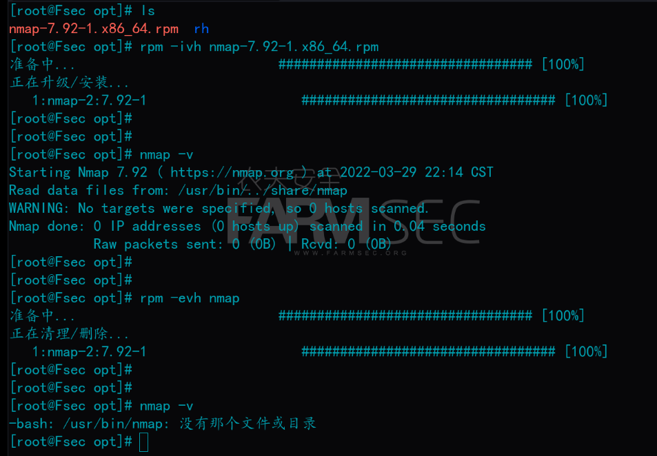
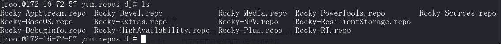

# 101-A7-redhat体系的软件安装

在前文中，我们了解到linux系统的发行版主要分为debian和redhat两个体系。两个体系最直观的不同是软件安装命令的不同。

这一节，我们要来学习rehad体系的软件安装。前文我们使用的Centos实验环境，就以本节所介绍的命令来管理软件的安装与卸载。

## 1. rpm 命令

`rpm`命令用于管理软件。rpm原本是 Red Hat Linux 发行版专门用来管理 Linux  各项套件的程序，由于它遵循 GPL 规则且功能强大方便，因而广受欢迎。逐渐受到其他发行版的采用。RPM 套件管理方式的出现，让 Linux  易于安装，升级，间接提升了 Linux 的适用度。能被`rpm`命令安装的软件包一般以`.rpm`为文件后缀。

### 1.1 常见命令

```
rpm -ivh [package_name]         #安装软件包
rpm -evh [package_name]         #卸载软件
rpm -qlp *.rpm                  #列出rpm包的内容
rpm -qa |grep [字符串]           #在已安装的所有软件中查询包含某字符串的软件版本
rpm -ql [软件名]                 #列出该软件所有文件与目录所在的完整文件名
rpm -qc [软件名]                 #列出软件的所有设置文件
rpm -qR [软件名]                 #查询某软件依赖的其他软件
rpm -qf [文件名]                 #查询文件属于哪个软件包
```




## 2. yum 命令

`yum`命令是一个在 Fedora 和 RedHat 以及 SUSE 中的 Shell 前端软件包管理器。

基于RPM包管理，能够从指定的服务器自动下载RPM包并且安装，可以自动处理依赖性关系，并且一次安装所有依赖的软件包，无须繁琐地一次次下载、安装。yum提供了查找、安装、删除某一个、一组甚至全部软件包的命令。

### 2.1 yum 源配置

同apt命令一样，`yum`依然从源获取软件。在centos中yum源文件存储在`/etc/yum.repos.d`目录中。



repo文件的示例：

```
[baseos]
name=Rocky Linux $releasever - BaseOS
mirrorlist=https://mirrors.rockylinux.org/mirrorlist?arch=$basearch&repo=BaseOS-$releasever
#baseurl=http://dl.rockylinux.org/$contentdir/$releasever/BaseOS/$basearch/os/
gpgcheck=1
enabled=1
gpgkey=file:///etc/pki/rpm-gpg/RPM-GPG-KEY-rockyofficial
```

epel源是redhat系比较常用的源。

EPEL (Extra Packages for Enterprise Linux)是基于Fedora的一个项目，为“红帽系”的操作系统提供额外的软件包，适用于RHEL、CentOS和Scientific Linux.

安装epel源只需要安装一个叫”epel-release”的软件包，这个软件包会自动配置yum的软件仓库。

命令为：`dnf install -y epel-release`

### 2.2 yum 命令

```
yum makecache                         #更新源（安装新源后执行）
yum clean all                         #清除缓存目录（/var/cache/yum）下的软件包及旧的headers
yum list |grep                        #显示所有已经安装和可以安装的程序包
yum info [package-name]               #显示安装包信息
yum -y install [package-name]         #安装软件,默认选yes
yum remove [package-name]             #卸载
yum deplist rpm                       #查看程序rpm依赖情况
yum update                            #更新全部软件包
yum group list                        #列出组
yum group install "Security Tools"    #安装‘Security Tools’软件组
yum search                            #检索安装包
```

### 2.3 dnf 命令

`DNF`是新一代的rpm软件包管理器。它正在逐步取代`yum`命令。

```
dnf repolist                                           #该命令用于显示系统中可用的 DNF 软件库
dnf repolist all                                       #该命令用于显示系统中可用和不可用的所有的 DNF 软件库
dnf list                                               #用户系统上的所有来自软件库的可用软件包和所有已经安装在系统上的软件包
dnf list installed                                     #该命令用于列出所有安装了的 RPM 包
dnf list available                                     #用于列出来自所有可用软件库的可供安装的软件包
dnf search [pakage]                                    #用该命令来搜索软件包
dnf provides /bin/bash                                 #查找某一文件的提供者
dnf info nano                                          #查看软件包详情
dnf install [pakage]                                   #安装软件包
dnf update systemd                                     #该命令用于升级指定软件包
dnf check-update                                       #该命令用于检查系统中所有软件包的更新
dnf update                                             #该命令用于升级系统中所有有可用升级的软件包
dnf remove [pakage]                                    #删除系统中指定的软件包
dnf autoremove                                         #删除无用孤立的软件包
dnf clean all                                          #删除缓存的无用软件包
dnf history                                            #查看您系统上 DNF 命令的执行历史
dnf grouplist                                          #该命令用于列出所有的软件包组
dnf groupinstall ‘Educational Software’                #该命令用于安装一个软件包组
dnf groupupdate ‘Educational Software’                 #升级一个软件包组中的软件包
dnf groupremove ‘Educational Software’                 #该命令用于删除一个软件包组
dnf reinstall [pakage]                                 #该命令用于重新安装特定软件包
```

