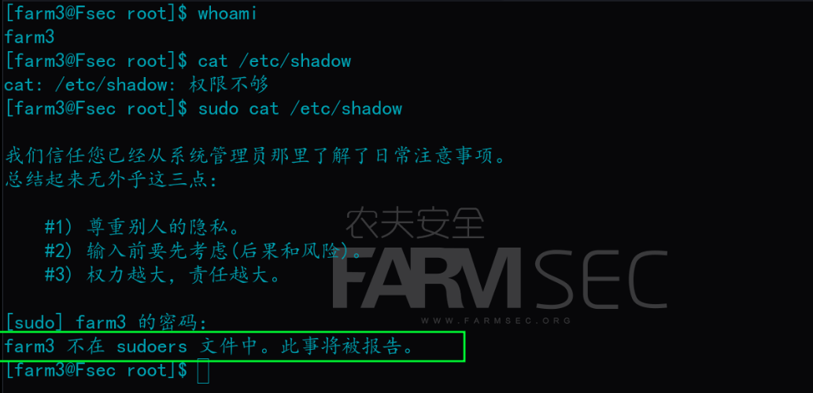
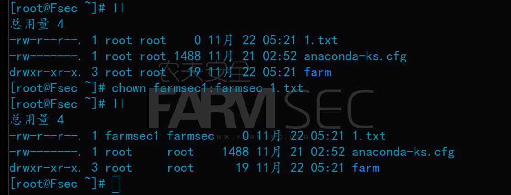
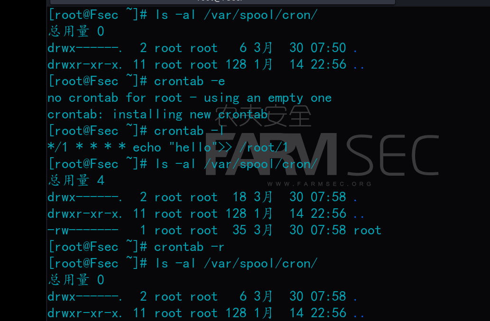

# 101-A8-Linux常用配置文件

----

在本节中，我们将学习Linux系统常用配置文件。这部分知识是后续信息安全渗透与防御的重要基础。本节实验环境为centos。

## 1. 用户相关

### 1.1 /etc/passwd 文件

`/etc/passwd`文件中保存的就是系统中所有的用户和用户的主要信息，这个文件的内容非常规律，每行代表一个用户。


每一行有七个字段，以：为分隔符，每个字段所代表的含义不同，以root这一行来做示例


+ 第一个字段为：用户名名称
+ 第二字段为：密码表示，但是不是真正的密码，密码是在另一个文件当中，在早期的unix中，这里保存的就是真正的加密后的密码字符串
+ 第三个字段为：UID，也就是用户的ID
+ 第四字段为：GID，也称为用户的组ID
+ 第五个字段为：用户的说明
+ 第六个字段为：用户的家目录
+ 第七个字段为：shell,也可以理解为用户登录之后所拥有的权限


### 1.2 /etc/shadow 文件

`/etc/shadow`是用户保存密码的文件。

这个文件的每行代表一个用户，同样的也是以：为分隔符。


`/etc/shadow`这个文件有九个字段，以root这一行为例。


+ 第一字段为：用户名称
+ 第二个字段为：该用户加密后的密码，没有密码的用户则是*或者!!,是不能登录的
+ 第三个字段为：密码何时修改过，这里显示的数字是从1970 年 1 日 1 日作为标准时间算的，每过去一天时间戳加1.如果是10000的话，那么就是1970年1月1日后的第10000天
+ 第四个字段为：两次修改密码的时间间隔，如果是5，那么密码修改后5天内不能再更改，为0的话，是随时都可修改
+ 第五个字段为：密码的有效期，是从第三字段之后开始算的，默认是99999
+ 第六个字段为：密码到期修改前的警告天数，根据第五个字段算的，默认为7，则是到期前的7天开始警告
+ 第七个字段为：密码到期后的宽限天数，为0是到期立马失效，-1是永远不失效
+ 第八个字段为：用户失效的时间，同样是以时间戳表示的
+ 第九个字段：这个字段暂时没有功能


### 1.3 /etc/group 文件

linux用户组的所有信息都存放在`/etc/group`文件当中，也就是passwd文件中GID的来源。


`/etc/group`这个文件分为四个字段，也是以：为分隔符

+ 第一个字段：用户组名称
+ 第二个字段：用户组密码
+ 第三个字段：对应的GID
+ 第四个字段：用户列表，本字段可以为空

### 1.4 /etc/gshadow文件

前面讲过，`/etc/passwd` 文件存储用户基本信息，同时考虑到账户的安全性，将用户的密码信息存放另一个文件 ``/etc/shadow`  中。本节要将的 `/etc/gshadow` 文件也是如此，组用户信息存储在 `/etc/group` 文件中，而将组用户的密码信息存储在  `/etc/gshadow` 文件中。

文件中，每行代表一个组用户的密码信息，各行信息用 ":" 作为分隔符分为 4 个字段，每个字段的含义如下：

`组名：加密密码：组管理员：组附加用户列表`


+ 第一个字段：用户组名称
+ 第二个字段：用户组密码，通常不会设置
+ 第三个字段：组管理员
+ 第四个字段：用户列表，本字段可以为空


### 1.5 useradd 命令

`useradd`命令可用来建立用户帐号。帐号建好之后，再用`passwd`命令设定帐号的密码。而可用`userdel`删除帐号。使用`useradd`指令所建立的帐号，实际上是保存在`/etc/passwd`文本文件中。

#### 1.5.1 创建新用户 

`useradd`命令用于建立用户帐号。

案例：

```
useradd farm1			#创建用户farm1	
```


#### 1.5.2 建立uid为0的用户

建立UID为0的用户。

案例：

```
useradd -o -u 0 aaa
cat /etc/passwd |grep aaa
```


建立UID为0的用户，实际上是建立的是root用户的别名用户：


UID与GID的数字可以相同，但是UID与GID为0，只分配给root用户及root组；1-499是属于系统用户的。500以后可以分配给普通用户。

一般我们新建用户默认是从1000开始的。

#### 1.5.3 指定新建用户所属组

案例：

```
groupadd fsec                   #新建一个fsec的用户组
useradd fsec1 -g fsec           #新建一个fsec1的用户，并加入到fsec组里
cat /etc/passwd |grep fsec1
```


#### 1.5.4 更改用户和用户组

使用`usermod`命令可以更改用户的各项信息。

```
-l<帐号名称>           #修改用户帐号名称。
-c<备注>              #修改用户帐号的备注文字。
-g<群组>              #修改用户所属的群组。
-G<群组>              #修改用户所属的附加群组。
-d<登入目录>           #修改用户登入时的目录。
-e<有效期限>           #修改帐号的有效期限。
-f<缓冲天数>           #修改在密码过期后多少天即关闭该帐号。
-L                    #锁定用户密码，使密码无效。
-s<shell>             #修改用户登入后所使用的shell。
-u<uid>               #修改用户ID。
-U                    #解除密码锁定。
```

如修改用户名：

```
usermod fesc1 -l fsec2
```


修改用户家目录：

```
usermod fsec2 -d /home/fsec2
```


使用`groupmod`命令可以修改用户组的各项信息。

如修改组名称。

```
groupmod fsec -n fsec123
```


```
  -g, --gid GID                 #将组 ID 改为 GID
  -h, --help                    #显示此帮助信息并推出
  -n, --new-name NEW_GROUP      #改名为 NEW_GROUP
  -o, --non-unique              #允许使用重复的 GID
  -p, --password PASSWORD       #将密码更改为(加密过的) PASSWORD
  -R, --root CHROOT_DIR         #chroot 到的目录
  -P, --prefix PREFIX_DIR       #prefix directory where are located the /etc/* files
```

#### 1.5.5 删除用户和用户组

使用`userdel`命令可以删除用户，使用`groupdel`命令可以删除用户组。

```
userdel fsec2
groupdel fsec123
```


### 1.6 passwd 命令

`passwd`命令用于修改或添加用户的密码,
用法：`passwd [user]`
案例：

```
passwd	farmsec1
```


注意，当你以root用户登录时，你可以修改系统内任意用户的密码，且无需遵守密码复杂度要求。

当你以普通用户登录时，只能修改自己的密码，且必须遵守密码复杂度要求。

当`passwd`命令不跟用户名时，代表修改当前用户密码。


## 2.网络相关

### 2.1 网卡配置文件

Centos网卡配置文件存储于`/etc/sysconfig/network-scripts/ifcfg-[网卡名]`


```
DEVICE="eth0"                                #网卡名
HWADDR="00:0C:29:FD:FF:2A"                   #mac地址
NM_CONTROLLED="yes"                          #network mamager的参数，实时生效，不需要重启
ONBOOT="yes"                                 #开机自动链接
IPADDR=192.168.1.31                          #ip地址
NETMASK=255.255.255.0                        #子网掩码
GATEWAY=192.168.1.1                          #网关
BOOTPROTO=static                             #静态ip
```

### 2.2 设置网卡状态两种方法：

设置网卡状态命令：

```
systemctl restart/stop/start/status network         #重启/停止/启动/查看状态
service network restart/stop/start/status           #重启/停止/启动/查看状态
```

2.2.1 systemctl 和 service 命令

```
systemctl restart/stop/start/status network          #重启/停止/启动/查看状态
service network restart/stop/start/status            #重启/停止/启动/查看状态
```

2.2.2 nmcli 命令

```
nmcli c show                 #查看状态
nmcli c up/down [网卡名]      #启动/关闭
nmcli c reload [网卡名]       #重启
nmcli c modify enp0s3 ipv4.addresses 192.168.0.62/24
nmcli c modify enp0s3 ipv4.gateway 192.168.0.1
nmcli c modify enp0s3 ipv4.dns 8.8.8.8
```

### 2.3 DNS 相关

有关DNS的知识我们会在后续的章节中详述，现在你只需要简单理解为，电脑想要访问网页，必要设定一个DNS服务器的IP（常见的有114.114.114.114等），这个DNS服务器负责将你输入的网址（如：www.baidu.com ）转换为你的电脑可以识别的IP。经过这种转换，电脑才能访问网页。

Centos的DNS配置文件存储于`/etc/resolv.conf` 
nameserver 114.114.114.114


### 2.4 查看网络IP的命令

```
ip a
ifconfig
```


###  2.5 Ubuntu/kali上网相关：

#### 2.5.1 网卡配置

Ubuntu上的网卡配置文件存储于`/etc/network/interfaces`

其中主要参数：

```
# 若设置静态IP
auto [网卡名]			
iface [网卡名] inet static							
address 192.168.3.90                #ip地址
gateway 192.168.3.1                 #网关
netmask 255.255.255.0               #子网掩码

# 若设置动态IP
auto [网卡名]
iface eth0 inet dhcp
```

#### 2.5.2 设置网卡状态

```
/etc/init.d/networking restart  #重启网卡
/etc/init.d/networking start    #启动网卡
/etc/init.d/networking stop     #关闭网卡
```

#### 2.5.3 dns配置

DNS配置文件存储于`/etc/resolv.conf`

```
nameserver 192.168.0.1
```

#### 2.5.4 kali 上网配置

kali的上网配置可以在图形化界面调试。

点击右上角网络连接的图标可以打开一个下拉菜单。


在IPv4选项卡中，我们可以指定IP网关等。


设置好后点击应用，还需要重启网络连接使其生效。


## 3. 运行级别

所谓运行级别，简单点来说，运行级别就是操作系统当前正在运行的功能级别。级别是从0到6，具有不同的功能。

Linux下的7个运行级别：

+ 0:系统停机状态，系统默认运行级别不能设置为0，否则不能正常启动，机器关闭。

+ 1:单用户工作状态，root权限，用于系统维护，禁止远程登陆，就像Windows下的安全模式登录。

+ 2:多用户状态，没有NFS支持。

+ 3:完整的多用户模式，有NFS，登陆后进入控制台命令行模式。

+ 4:系统未使用。

+ 5:X11控制台，登陆后进入图形GUI模式，XWindow系统。

+ 6:系统正常关闭并重启，默认运行级别不能设为6，否则不能正常启动。运行init6机器就会重启。

  关机/重启命令：

  ```
  init 0
  init 6
  ```


## 4. sudo 与 su

sudo是linux系统管理指令，是允许系统管理员让普通用户执行一些或者全部的root命令的一个工具。

root用户需要设置普通用户的sudo权限，设置之后，普通用户在命令前加sudo即可使用管理员权限执行改命令。

### 4.1 sudo 配置文件

`sudo`配置文件存在于`/etc/sudoers`，root用户如想赋予普通用户sudo权限，则需要修改大概位于98行的内容：

```
97 ## Allow root to run any commands anywhere
98 root    ALL=(ALL)       ALL
99 
100 ## Allows members of the 'sys' group to run networking, software,
101 ## service management apps and more.
102 # %sys ALL = NETWORKING, SOFTWARE, SERVICES, STORAGE, DELEGATING, PROCESSES, LOCATE, DRIVERS
103 
104 ## Allows people in group wheel to run all commands
105 %wheel        ALL=(ALL)       ALL
106 
107 ## Same thing without a password
108 # %wheel        ALL=(ALL)       NOPASSWD: ALL
```

如果给farmsec1用户添加sudo权限：

`farm1	ALL=(ALL)	ALL`
如果给farmsec用户组添加sudo权限：
`%farmsec	ALL=(ALL)	ALL`

设计实验：

创建farm1；farm2；farm3；farm4，四个用户，其中farm1与farm2属于farmsec用户组。


然后给farm1用户和farm4用户添加sudo权限。并给farmsec用户组添加sudo权限

`vi /etc/sudoers`进行这些修改。

如图：


`wq!`强制保存。

下面我们将用这四个用户分别执行`cat /etc/shadow`命令和`sudo cat /etc/shadow`命令。

在正常情况下，只有root用户权限才能查看`/etc/shadow`文件的内容。而在刚刚的`/etc/sudoers`配置文件中，我们规定了farm1和farm4用户，及farmsec用户组具有sudo用户权限。在这些sudo用户执行命令时，只需在命令前加上`sudo`就可以申请用root用户权限执行该命令。





从上述结果中我们可以观察到，配置文件中规定的sudo用户和sudo用户组中的用户都可以借用root权限执行命令。只有farm3用户，它既不是sudo用户，也不在farmsec这个sudo用户组中，因此它无法使用root权限，他尝试使用高权限的行为也会被报告给root用户。


### 4.2 四种切换用户及权限的方式

下面的实验中，我们将介绍多种切换用户及权限的命令。为了阐释明了这些命令的细微差别。需要做一些准备工作。

一是安装zsh的shell终端`yum -y insatll zsh`

二是在`/etc/passwd`文件中将sudo用户的默认shell改为`zsh`的。

将farm1一行末尾的`/bin/bash`改为`/usr/bin/zsh`


完成了这些之后，重启，使修改生效。

之后，我们分别ssh登录root用户和farm1用户，记下他们的家目录和默认shell。


#### 4.2.1 sudo 命令

`sudo [command]`的形式，可以使sudo用户以root权限执行一些命令。第一次执行需要验证sudo用户的密码。

```
sudo head -n1 /etc/shadow
```


在使用`sudo [command]`时，sudo用户虽然使用了root权限执行了命令，但依然使用的是自己的环境。


#### 4.2.2 sudo -i

`sudo -i`命令，可以使sudo用户切换为root用户。

在切换为root后，会切换到root的家目录，并使用root用户的环境。

切换root用户时会校验sudo用户的密码。


#### 4.2.3 sudo -s

`sudo -s`命令，也可以使sudo用户切换为root用户。

切换用户后，不会切换目录，仍然使用sudo用户自己的环境。

切换root用户时需要验证sudo用户自己的密码。


#### 4.2.4 su 

`su [username]`是切换用户的命令。它不局限于sudo用户使用，任何用户想切换到其他用户都可以使用这个命令。

切换用户时，需要验证要切换用户的密码。切换后，仍使用原来的环境变量。


#### 4.2.5 su -

`su - [username]`是切换用户的命令。它不局限于sudo用户使用，任何用户想切换到其他用户都可以使用这个命令。

切换用户时，需要验证要切换用户的密码。切换后，仍使新用户的环境变量。


### 4.3 whoami 命令

`whoami`命令用于显示当前用户。

```
whoami
```

人生三大难题之一我是谁就解决了 ,配合着pwd,cd ,三个难题就都解决了。


## 5. Linux的文件权限

### 5.1 linux 文件权限

在命令行输入`ls -al`时,会出现以下信息


`ls -al`显示文件权限对应的有七个字段，每个字段以空格为分隔


+ 第一个字段为：分别是文件类型，和属主属组其他人的读写执行权限。严格来说这是两个字段。
+ 第二个字段为：也就是上图看到的17字样，对文件是文件内容被系统记录的次数。对目录是目录中文件属性的字节数
+ 第三个字段为：属主，文件的所有者
+ 第四个字段为：属组，文件的所有组
+ 第五个字段为：内容大小
+ 第六个字段为：文件最后一次被修改的时间
+ 第七个字段为：文件名字

在第一个字段中，会出现这样的形式`drwxr-xr-x.`共是11个字符。


第一个字符：

常见的有`d`和`-`两种形式，第一个字母为`d`代表为目录，为`-`代表为文件。

此外还有其他形式：

- **`-`**：常规文件
- **`b`**：块特殊文件
- **`c`**：字符特殊文件
- **`C`**：高性能（”连续数据“）文件
- **`d`**：目录
- **`D`**：门(Solaris 2.5及以上版本)
- **`l`**：符号链接
- **`M`**：离线（”前已“）文件（Cray DMF）
- **`n`**：网络专用文件（HP-UX）
- **`p`**：FIFO（命名管道）
- **`P`**：断开（Solaros 10及以上）
- **`s`**：套接字
- **`?`**：其他文件

第二到第十个字符：共有9个字符，每三个为一组。代表`属主` 、`属组` 、`其他人`的权限。常见的权限有`r` `w` `x`，分别为读权限、写权限、执行权限

如一个文件这一部分字段表达为`-rwxrw-r--.`。

* 则表示此文件是一个文件而非目录；
* 此文件的属主（拥有者/创建者）具备对其的**读、写、执行**权限；
* 此文件的属组（文件所有者同一个用户组的用户）具备**读、写**权限，而没有执行权限；
* 此文件属主与属组之外的用户，具有**读**权限，但无法修改与执行。
* 如果一个文件需要能够被读取，则需要`r`权限
* 如果一个文件需要能够被编辑，则需要`r`与`w`权限。
* 如果一个文件能够被执行，则需要`x`权限

在第四、第七和第十个字符中，除却常见的`x`执行权限外，还有其他情况：

+ **`S`**：设置了SUID或SGID，没有执行权限 
+ **`s`**：设置了SUID或SGID，具有执行权限 

+ **`T`**：设置了粘滞位，没有执行权限
+ **`t`**：设置了粘滞位，具有执行权限 

第十一个字符的含义： 

- **`.`**：没有任何其他替代访问方法的SELinux安全上下文（没有设置ACL）
- **`+`**：具有任何其他组合访问方法的SELinux安全上下文（设置了ACL） 


### 5.2 chown 命令

chown命令用于设置文件所有者。

用法：`chown [-R] [username]:[groupname] [filename]`
案例：

```
chown farmsec1:farmsec 1.txt
chown -R farmsec1:farmsec farm #-R 递归，farm目录及其下所有目录、文件
```




### 5.3 chmod 命令

`chmod`命令用来变更文件或目录的权限。
用法：`chmod [-R] 755 filename`
案例：

```
chmod 755 1.txt
chmod 777 1.txt
```

r=4(可读) w=2（可写） x=1（执行）**

+ 可读可写可执行则为7（rwx）
+ 可读可写则为6(rw-)
+ 可读可执行则为5（r-x）
+ 可写可执行则为3（-wx）
+ 无论如何相加都不会出现重复的数字


| #    | 权限           | rwx  |
| ---- | -------------- | ---- |
| 7    | 读 + 写 + 执行 | rwx  |
| 6    | 读 + 写        | rw-  |
| 5    | 读 + 执行      | r-x  |
| 4    | 只读           | r--  |
| 3    | 写 + 执行      | -wx  |
| 2    | 只写           | -w-  |
| 1    | 只执行         | --x  |
| 0    | 无             | ---  |


使用`-R`参数代表递归，将目录以下所有文件都赋予同样的权限。


该命令也可直接添加或删除某种权限
用法：`chmod +x filename`
案例：

```
chmod +x farm.txt
chmod -x farm.txt
chmod a+x farm.txt
chmod g-x farm.txt
chmod a+r farm.txt
chmod ug=rwx,o=x farm.txt
```

参数释义


| who  | 用户类型 | 说明                   |
| ---- | -------- | ---------------------- |
| `u`  | user     | 文件所有者             |
| `g`  | group    | 文件所有者所在组       |
| `o`  | others   | 所有其他用户           |
| `a`  | all      | 所用用户, 相当于 `ugo` |


| Operator | 说明                                                   |
| -------- | ------------------------------------------------------ |
| `+`      | 为指定的用户类型增加权限                               |
| `-`      | 去除指定用户类型的权限                                 |
| `=`      | 设置指定用户权限的设置，即将用户类型的所有权限重新设置 |


| 模式 | 名字         | 说明                                                         |
|:----|:------------|:------------------------------------------------------------|
| `r`  | 读           | 设置为可读权限                                               |
| `w`  | 写           | 设置为可写权限                                               |
| `x`  | 执行权限     | 设置为可执行权限                                             |
| `X`  | 特殊执行权限 | 只有当文件为目录文件，或者其他类型的用户有可执行权限时，才将文件权限设置可执行 |
| `s`  | setuid/gid   | 当文件被执行时，根据who参数指定的用户类型设置文件的setuid或者setgid权限 |
| `t`  | 粘贴位       | 设置粘贴位，只有超级用户可以设置该位，只有文件所有者u可以使用该位 |


## 6.计划任务

`crontab`被用来提交和管理用户的需要周期性执行的任务，与windows下的计划任务类似，当安装完成操作系统后，默认会安装此服务工具，并且会自动启动crond进程，crond进程每分钟会定期检查是否有要执行的任务，如果有要执行的任务，则自动执行该任务。

`crontab -e` 编辑当前用户的cron表
`crontab -l` 查看当前用户的cron表

`crontab -r` 删除当前用户的cron表

`crontab`命令是cron table的简写，它是cron的配置文件，也可以叫它作业列表，我们可以在以下文件夹内找到相关配置文件。

- `/var/spool/cron/` 目录下存放的是每个用户包括root的crontab任务，每个任务以创建者的名字命名
- `/etc/crontab` 这个文件负责调度各种管理和维护任务。
- `/etc/cron.d/` 这个目录用来存放任何要执行的crontab文件或脚本。
- 我们还可以把脚本放在`/etc/cron.hourly`、`/etc/cron.daily`、`/etc/cron.weekly`、`/etc/cron.monthly`目录中，让它每小时/天/星期、月执行一次。




编辑cron的格式为：`分 时 日 月 周 命令`

```
*    #代表任意时间
,    #代表不联系的时间点，2,3 表示2和3都行
-    #代表连续的时间段，比如2-4表示2,3,4
*/n  #代表每隔单位时间
```

案例1：每隔一分钟往1文本里输入一条hello 的信息

```
*/1 * * * * echo "hello">> /root/1
```

案例2：每小时的第一分钟执行一次

```
1 * * * * echo "hello">> /root/1
```

案例3：每小时的第一分钟跟第二分钟执行

```
1,2 * * * * echo "hello">> /root/1
```

其他案例：

```
实例1：每1分钟执行一次myCommand
* * * * * myCommand

实例2：每小时的第3和第15分钟执行
3,15 * * * * myCommand

实例3：在上午8点到11点的第3和第15分钟执行
3,15 8-11 * * * myCommand

实例4：每隔两天的上午8点到11点的第3和第15分钟执行
3,15 8-11 */2  *  * myCommand

实例5：每周一上午8点到11点的第3和第15分钟执行
3,15 8-11 * * 1 myCommand

实例6：每晚的21:30重启smb
30 21 * * * /etc/init.d/smb restart

实例7：每月1、10、22日的4 : 45重启smb
45 4 1,10,22 * * /etc/init.d/smb restart

实例8：每周六、周日的1 : 10重启smb
10 1 * * 6,0 /etc/init.d/smb restart

实例9：每天18 : 00至23 : 00之间每隔30分钟重启smb
0,30 18-23 * * * /etc/init.d/smb restart

实例10：每星期六的晚上11 : 00 pm重启smb
0 23 * * 6 /etc/init.d/smb restart

实例11：每一小时重启smb
0 */1 * * * /etc/init.d/smb restart

实例12：晚上11点到早上7点之间，每隔一小时重启smb
0 23-7/1 * * * /etc/init.d/smb restart
```

不同用户的计划命令：

当我们使用farm2用户时，也可以编辑自己的计划任务。


我们使用`crontab -l`的命令是无法查看到其他用户的计划任务的。farm2用户的计划任务保存在`/var/spool/cron/`目录下。

可以使用如下命令进行查看：

```
crontab -u <user> -l
```


## 7.开机自启

### 7.1 设置服务开机自启命令

在systemctl的命令中，`enable`代表开机自启，`disable`代表取消开机自启。

如想设置某服务开机自启，可使用`systemctl enable [服务名]`

案例：

```
systemctl enable nginx
```


### 7.2 开机自动执行命令

`/etc/rc.d/rc.local` 用于添加开机启动命令,`/etc/rc.local`是`/etc/rc.d/rc.local`的软链接，软连接相当于windows的快捷方式。


系统开机后会自动执行`/etc/rc.local`,换句话说，只要将你想执行的命令写入这个文件，`vi /etc/rc.local`，就可以做到开机自动执行。

如我们在此处写入`echo 'hello' >> /root/hello`。

如果你是第一次使用这个文件，需要对其加上执行权限。`chmod +x /etc/rc.local`


然后重启服务器，我们会发现写入`/etc/rc.local` 的命令在开机时被执行了。


备注：

老版本的系统中，控制服务启动的命令还有如下的内容：

```
chkconfig
/etc/init.d/  /etc/rc.d/init.d
```

配置的方法可参考网上详细教程。

从centos7开始，系统的服务控制开始由systemctl替换早起版本的chkconfig与service的指令。

systemctl的服务的位置位于/usr/lib/systemd/system中。

所以未来在应急响应的排查中，需要排查的目录需要依照操作系统的版本进行针对性的排查。

