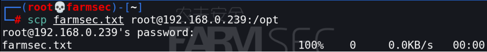

# 101-B1-openssh服务


从本节开始，我们将了解一系列CentOS常见服务。本节主要介绍openssh服务。

本节学习者需用虚拟机搭建CentOS环境。

目标：

+ 熟悉和掌握ssh的概念
+ 掌握ssh、scp命令
+ 掌握公私钥概念、配置ssh公私钥认证登录
+ 了解openssh配置文件，实现ssh安全加固

## 1. 什么是 SSH


`SSH` 为 Secure Shell 的缩写，是建立在应用层基础上的安全协议。SSH是较为可靠的专为远程登录会话和其他网络服务提供安全性的协议。利用用 SSH 协议可以有效防止远程管理过程中的信息泄露问题。

OpenSSH 服务是 SSH  协议的免费开源实现，可以用来进行远程控制， 或在计算机之间传送文件。而实现此功能的传统方式，如telnet(终端仿真协议)、 rdp ftp、 rlogin、rsh都是极为不安全的，并且会使用明文传送密码。OpenSSH提供了服务端后台程序和客户端工具，用来加密远程控制和文件传输过程中的数据，并由此来代替原来的类似服务。

通过使用SSH，你可以把所有传输的数据进行加密，这样可以较好地抑制"中间人"这种攻击，也可能够防御DNS欺骗和IP欺骗。

使用SSH，还有一个额外的好处就是传输的数据是经过压缩的，所以可以加快传输的速度。


在前文中，我们已经介绍了使用`ssh`命令远程连接服务器的方法。接下来我们将介绍使用其传输文件的命令。

`scp`命令：将本机文件复制到远程服务器上（上传）

命令格式：`scp 【本地文件路径】 [username]@[主机IP]：[拷贝的目录]`



将远程服务器上的文件复制到本机（下载）

命令格式：`scp [username]@[主机地址]:[服务器上文件路径] [本地文件路径]`


注意两点：

+ 1.如果远程服务器openssh有特殊限制，scp便要走特殊端口，具体用什么端口视情况而定，命令格式如下：

`scp -P 2222 [username]@[主机地址]:/usr/local/sin.sh /home/administrator`

+ 2.使用scp要注意所使用的用户是否具有可读取远程服务器相应文件的权限.

## 2. 安装 openssh

openssh默认已经安装于centos中，无须额外的安装。相关的软件包可以通过以下命令进行查询。

```bash
dnf list |grep openssh
openssh-clients.x86_64      #客户端
openssh-server.x86_64       #服务端
openssh-askpass.x86_64      #交互式访问
```


## 3. 服务的状态/停止/启动

可使用`systemctl`命令查看和设置openssh服务的状态。

```bash
systemctl status sshd.service    #查看ssh状态
systemctl start sshd.service     #启动ssh服务
systemctl stop sshd.service      #停止ssh服务
```

注意：**如果服务关闭，则无法远程登录服务器。**


## 4. 配置免密码（公私钥认证）登录

`ssh`服务主要有两种登录方式：第一种为密码口令登录，第二种为公钥登录。

下面我们来解释一下公私钥的概念：

密码体系从加密和解密方面来分类的话，可以分为对称加密和非对称加密。

+ 对称加密：加密和解密使用的密钥是同一个。
+ 非对称加密：加密和解密使用的密钥是不同的，采用两个密钥。
+ 对称加密解密的速度比较快，非对称加密和解密花费的时间长、速度相对较慢。
+ 对称加密的安全性相对较低，非对称加密的安全性较高。

公私钥体系既是常见的非对称加密，每个通信方均需要两个密钥，即公钥和私钥，这两把密钥可以互为加解密。公钥是公开的，不需要保密，而私钥是由个人自己持有，并且必须妥善保管和注意保密。其特性为：

+ 一个公钥对应一个私钥。
+ 密钥对中，让大家都知道的是公钥，不告诉大家，只有自己知道的，是私钥。
+ 如果用其中一个密钥加密数据，则只有对应的那个密钥才可以解密。
+ 如果用其中一个密钥可以进行解密数据，则该数据必然是对应的那个密钥进行的加密。


ssh服务通过密码进行登录，主要流程为：

1. 客户端连接上服务器之后，服务器把自己的公钥传给客户端
2. 客户端输入服务器密码通过公钥加密之后传给服务器
3. 服务器根据自己的私钥解密登录密码，如果正确那么就让客户端登录


ssh服务公钥登录，主要流程为：

1. 客户端生成RSA公钥和私钥
2. 客户端将自己的公钥存放到服务器
3. 客户端请求连接服务器，服务器将一个随机字符串发送给客户端
4. 客户端根据自己的私钥加密这个随机字符串之后再发送给服务器
5. 服务器接受到加密后的字符串之后用公钥解密，如果正确就让客户端登录，否则拒绝。这样就不用使用密码了。


使用公私钥登录，可以避免每次登录服务器都输入密码。下面我们来实际操作此流程。

linux下可以用用`ssh-keygen`命令生成公钥/私钥对。

若有机器A，B。现想A（客户机）通过ssh免密码登录到B（服务器）。
在A机（客户机）下使用`ssh-keygen`命令生成公钥/私钥对。在执行此命令后将在`/root/.ssh`目录下将生成`id_rsa`和`id_rsa.pub`文件。 


 进入`/root/.ssh`文件夹内可以看到如下密钥文件

```bash
  id_rsa        #私钥
  id_rsa.pub    #公钥
```


在B机器（服务器）开启证书的验证，默认是开启的。
若没有开启可修改ssh配置文件，`vi /etc/ssh/sshd_config`，将文本中有关`PubkeyAuthentication `和`AuthorizedKeysFile`的条目修改为如下内容：

```bash
PubkeyAuthentication yes
AuthorizedKeysFile      .ssh/authorized_keys
```


随后重启服务
`systemctl restart sshd.service`

A机器（客户机）使用`ssh-copy-id [user]@[host]`命令拷贝密钥文件到B机器（服务器）。


随后客户机访问服务器，我们会发现直接无密码登录。


而如果我们此时使用另外一台主机登录，我们会发现可以通过密码的方式登录。我们可以修改配置文件中的第70行`PasswordAuthentication` 值为`no`，可以禁止使用密码的方式。


小结：客户机有私钥，被登录的服务器要有登录客户机的公钥。这个公钥/私钥对一般在私钥宿主机（客户机）产生。上面是用rsa算法的公钥/私钥对，也可以用dsa算法(对应的文件是id_dsa，id_dsa.pub)。


思考：在实际工作中，哪些情况适用于密码登录，哪些情况适用于公私钥登录。

## 5. openssh 配置文件与加固

登录服务器将配置的公钥删除，以免影响后面实验。

```bash
cd .ssh 
rm -rf author*
```


恢复openssh配置文件

```bash
vi /etc/ssh/sshd_config
```


### 5.1 实验一： 修改 SSH 默认端口

所需命令：

>vi /etc/ssh/sshd_config
>
>```
>Port 2222
>```
>
>systemctl restart sshd.service
>
>ssh [user]@[IP] -p 2222

OpenSSH常用配置文件有两个`/etc/ssh/ssh_config`和 `/etc/ssh/sshd_config`。

`ssh_config`为客户端配置文件。

`sshd_config`为服务端配置文件。

在本节中，我们实验修改的皆为`sshd_config`，即服务端配置文件，为的是规定主机**被**远程登录时的状态。

`vi /etc/ssh/sshd_config`将光标定位到Port 22这行(大概为17行)，取消注释，并修改端口为2222（ssh默认端口为22）


设置好之后，保存退出，并重启SSH服务。`systemctl restart sshd.service`


我们通过客户机访问，会发现默认的22端口已经无法访问，需要使用 `-p [端口号]`的方式进行访问。
`ssh 192.168.0.239 -p 2222`


### 5.2 实验二：配置ssh日志

所需命令：

>vi /etc/ssh/sshd_config
>
>```
>#SyslogFacility AUTH
>
>SyslogFacility   AUTHPRIV
>
>LogLevel DEBUG    
>```
>
>systemctl restart sshd.service
>
>tail -f /var/log/secure

在此实验中，我们将学习在ssh配置文件中配置ssh日志。

`vi /etc/ssh/sshd_config`将光标定位到约36行可以查看到如下信息。

`SyslogFacility AUTHPRIV` 表示当有人使用ssh登录系统时，ssh会记录信息，记录类型为AUTHPRIV。
`#LogLevel INFO`表示设置记录sshd日志信息的级别。


`SyslogFacility`一项，规定了服务日志的性质，也规定了服务日志存储的默认路径。

如：`AUTHPRIV` 表达了日志记录的是包含敏感信息的用户身份验证消息，默认存储于`/var/log/secure`。

`AUTH` 则表达了日志记录的是不包含敏感信息的用户身份验证消息，同样默认存储于`/var/log/secure`。

ssh配置文件的这一字段一般是不需要修改的。在LInux系统的其他服务配置文件中，你可能会遇见`SyslogFacility`设置为其他状态的情况，可以通过下表了解其含义。

| 设置         | 描述                                                | 默认日志文件                    |
| ------------ | --------------------------------------------------- | ------------------------------- |
| **local0**   | BIG-IP 特定消息                                     | **/var/log/ltm**                |
| **local1**   | EM 特定消息 APM 特定消息                            | **/var/log/em /var/log/apm**    |
| **loacl2**   | GTM 和链路控制器特定消息                            | **/var/log/gtm**                |
| **local3**   | ASM 特定消息                                        | **/var/log/asm**                |
| **loacl4**   | ITCM 门户和服务器 (iControl) 特定消息               | **/var/log/ltm**                |
| **loacl5**   | 包过滤特定消息                                      | **/var/log/pktfilter**          |
| **loacl6**   | HTTPD 特定消息                                      | **/var/log/httpd/httpd_errors** |
| **loacl7**   | Linux 特定的引导消息                                | **/var/log/boot.log**           |
| **cron**     | 与**cron**进程相关的消息                            | **/var/log/cron**               |
| **daemon**   | 与系统守护进程相关的消息（包括**named**和**ntpd**） | **/var/log/daemon.log**         |
| **kern**     | 内核消息                                            | **/var/log/kern.log**           |
| **mail**     | 邮件系统消息                                        | **/var/log/maillog**            |
| **auth**     | 不包含敏感信息的用户身份验证消息                    | **/var/log/secure**             |
| **authpriv** | 包含敏感信息的用户身份验证消息                      | **/var/log/secure**             |
| **user**     | 与用户进程相关的消息                                | **/var/log/user.log**           |

`#LogLevel INFO`表示设置记录sshd日志信息的级别。可以理解为设置了日志的详细程度。

`INFO`级别代表了日志会报告大部分有用信息，是较为详细的日志等级，除此外，还有其他等级：

| 等级        | 描述                             | 冗长度   |
| ----------- | -------------------------------- | -------- |
| **emerg**   | 紧急系统紧急信息                 | 最低限度 |
| **alert**   | 需要管理员干预的严重错误         | 低的     |
| **crit**    | 严重错误，包括硬件和文件系统故障 | 低的     |
| **err**     | 非关键但可能非常重要的错误消息   | 低的     |
| **warning** | 至少应该记录以供审查的警告消息   | 中等的   |
| **notice**  | 包含有用但可能会被忽略的消息     | 中等的   |
| **info**    | 包含有用但可能会被忽略的消息     | 高的     |
| **debug**   | 仅用于故障排除的消息             | 最大值   |

你可以将此条注释取消，将其修改为`#LogLevel DEBUG`，重启ssh服务（systemctl restart sshd.service）,观察修改前后日志（tail -f /var/log/secure）详细度的变化。

日志默认详细级别：


DEBUG级别：（一次登录日志一屏装不下）


实验结束后将其改回`INFO`级别并重启sshd服务，避免影响后续实验。

### 5.3 实验三：禁止root登录

所需命令：

>vi /etc/ssh/sshd_config
>
>```
>PermitRootLogin no   
>```
>
>systemctl restart sshd.service

在`Authentication`部分，取消注释`PermitRootLogin yes`并修改为 `PermitRootLogin no`，这一设置决定了是否允许root用户登录，将yes改为no，则root不能登录 。


随后保存退出后，添加一个新账户并设置密码；并重启ssh服务。

```bash
useradd farmsec 
passwd farmsec
systemctl restart sshd
```


在客户机上使用root登录则会提示权限拒绝，而使用普通用户则成功登录。

```bash
ssh 192.168.0.239 -p 2222
ssh 192.168.0.239 -p 2222 -l farmsec
```


### 5.4 实验四：配置长时间无人操作自动断开ssh链接

所需命令：

>vi /etc/ssh/sshd_config
>
>```
>LoginGraceTime 2m
>
>PermitEmptyPasswords no
>```
>
>systemctl restart sshd.service
>
>vi /etc/profile
>
>```
>export TMOUT=10
>```
>
>source /etc/profile


约在配置文件40行的`#LoginGraceTime 2m`，设置了指定时间内没有成功登录，将会断开连接，若无单位则默认时间为秒。图中默认为2分钟，如需调整可取消注释，调整为自己想要设定的值。


在`/etc/profile`这个配置文件的末尾加上

```bash
export TMOUT=10      #单位是秒
```


执行`source /etc/profile`命令，使配置文件生效。


可以看到，当命令终端超过10秒无人操作，ssh连接自动断开了。

### 5.5 开启空口令登录（慎用！）

配置文件`/etc/ssh/sshd_config`64行的`PermitEmptyPasswords no`，默认设置禁止空口令登录，将其取消掉`#`注释并将`no`改为`yes`，更改完后记得**重启**sshd服务使配置文件生效

`systemctl restart sshd`

注：使用空口令登录须开启密码认证


添加新用户farmsec

`useradd farmsec`

清除farmsec用户密码

`passwd -d farmsec`


测试空口令登录成功


### 5.6 实验五：访问速度调优

所需命令：

>vi /etc/ssh/sshd_config
>
>````
>GSSAPIAuthentication no 
>````
>
>````
>UseDNS no
>````
>
>systemctl restart sshd.service

将此两行改为no可解决ssh链接慢的问题

```bash
GSSAPIAuthentication no      #关闭GSSAPI认证
UseDNS no                    #关闭DNS解析
```


一般 SSH 依次进行的认证方法的是 publickey, gssapi-keyex, gssapi-with-mic, password。
一般用户只使用 password 认证方式，但前面 3 个认证过程系统还是会尝试，这就浪费时间了，也就造成 SSH 登录慢。GSSAPI 主要是基于 Kerberos 的，因此要解决这个问题也就变成要系统配置有 Kerberos， 一般用户是没有配置 Kerberos的。

### 5.7  启用密码策略

>vi /etc/login.defs
>
>```
>PASS_MAX_DAYS 99
>PASS_MIN_DAYS  1
>PASS_MIN_LEN   8
>PASS_WARN_AGE  1 
>```
>
>vi /etc/security/pwquality.conf
>
>```
>minlen = 8
>minclass = 4
>maxrepeat = 2
>maxclassrepeat = 2
>lcredi = 1
>ucredit = 1
>dcredit = 1
>ocredit = 1
>```


启用密码策略有两个配置文件：
第一个是`/etc/login.defs`
修改文件里的策略：`vi /etc/login.defs`

```bash
PASS_MAX_DAYS 99      #密码99天过期
PASS_MIN_DAYS  1      #修改密码最小间隔为1天
PASS_MIN_LEN   8      #密码最短长度为8
PASS_WARN_AGE  1      #密码过期前1天内通知用户 
```


第二个配置文件为：`/etc/security/pwquality.conf`

修改文件里的策略：`vi /etc/security/pwquality.conf`

```bash
# "N" 处应填写数字
minlen=N              #定义用户密码的最小长度； 
minclass=N            #定义密码必须满足同时有几种字符；
maxrepeat=N           #定义密码中允许几个连续相同的字符；	
maxclassrepeat=N      #定义用户密码连续字符的最大数目；
lcredit=N             #定义用户密码中必须包含多少个小写字母；
ucredit=N             #定义用户密码中必须包含多少个大写字母；1
dcredit=N             #定义用户密码中必须包含多少个数字；1
ocredit=N             #定义用户密码中必须包含多少个特殊字符（除数字、字母之外）；其中 = 1表示，至少有一个  
```

配置文件长这样：


密码策略这里修改后，只对新建用户生效。我们可以新建一个test用户尝试设置其密码。


查看`/etc/shadow`文件是否生效，可以看到已经生效了


## 6. ssh 的日志

ssh服务的日志存储于`/var/log/secure`。 
`tail -f /var/log/secure`
大家可以自由定制所想查看的日志，例如模拟登录失败，登录成功等不同方式，以观察日志的不同变化。
状态:

+ Failed password 为密码错误
+ Accept  password 为登录成功
+ disconnected by user 为断开链接


## 7. ssh加固的思考

如果现在有道面试题，问SSH如何加固？可面试官只想听到的是采用公私钥登录的方式，面对这种情况你会怎么回答？

很显然，这其中会出现可以抬杠的空间。那么从头思索该如何针对这个基础的服务进行加固？

思考这些问题来复习本节知识：

1. 密码登录和公私钥登录分别适用于哪种情况？
2. 口令复杂度要怎样设置合适？是不是越复杂越好？
3. 针对root用户是否可以登录进行思考。
4. 登录失败次数的限定应如何设置？无人操作自动断开要设置为多久为佳？
5. 修改默认端口号是否有效？

目前，你可能会有自己的答案，不过你也可以在学完防御篇章时再回头重新思考这些问题。

其实本节知识之外，还有其他的加固思路，如：

1. 利用防火墙进行访问限制。
2. 利用单点登录系统进行登录管理。
3. 利用堡垒机进行管控。
4. 对ssh服务日志进行监控、分析和审计。
5. 等等。

随着你学的东西越多，你会了解更多的加固和防御方式。届时你需要将新的方案与旧的进行比对，结合工作的具体场景，进行取舍或选择‘“我全都要”。
