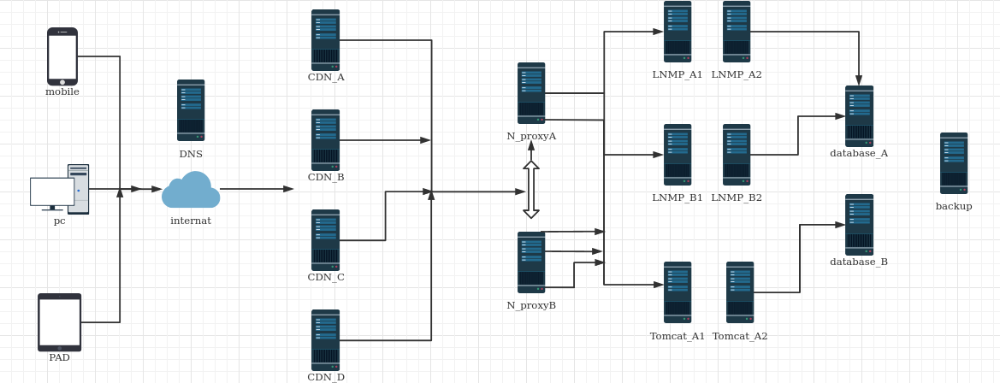

# 构建模拟IDC架构

## 一 前言

在过去我们讲述过的课程中，已经将Linux的基础命令与常见的服务搭建方式讲述完毕。

而任何真实存在的IT体系，通过诸多细微的组件，共同构成了一个大型的体系架构以应对复杂的业务。

本章节的目的在于，将讲述的单独的知识点进行整合，设计并实现一个可以支持更大规模的架构。

通过思考、设计、实施,理解整个网络体系的不同场景下的数据流向。


## 二 已经学习的内容

我们已经完成如下内容的学习。

1. Linux常用命令

2. openssh

3. dnsmasq

4. apache与LAMP

5. nginx反向代理与LNMP

6. NFS与Linux防火墙

   

## 三 分析并设计架构

   当你决定买一台时候，你会发现你会不自觉地进行了一个需求的分析。

```
        我暑假打工，赚到了4000块钱。
        我希望这个手机可以流畅运行王者荣耀。        
        屏幕的清晰度要好，因为我的另外一份兼职是某网站匿名黑一个叫农夫安全的组织。
```

然后你经过比对，挑选了一个品牌的手机，当然还有另外一种可能

```
		我要樱花粉 ：)
```

所以当我们决定设计一个架构体系的时候，我们需要从实际的需求出发，而不该是因为我会这些知识，所以我都要把它们放到体系里。

那么通过思考，我们可以得到我们的需求(下面需求为简单罗列，并非权威)

| id   | 需求                     | 解决方案          |
| ---- | ------------------------ | ----------------- |
| 1    | 所有网站通过域名访问     | dnsmasq           |
| 2    | 确保全球的用户访问       | CDN               |
| 3    | 确保整个架构没有单点故障 | nginx反向代理体系 |
| 4    | 确保整个架构的数据安全   | mariadb集群       |
| 5    | 确保整个架构的灾难恢复   | NFS备份           |
| 6    | 确保整个架构具备安全性   | firewalld         |
| 7    | 确保整个架构的访问控制   | sshd              |

据此，我们可以通过需求，推测出我们所需要的拓扑图。



当然或许你的想法与我们并不相同，但这无所谓啦，但是我们需要你的方案思考一些问题:

1. 整个访问的流程下，数据流是什么样的？

2. 当任意的节点出现故障，哪些节点会影响访问？

3. 那些不会影响访问的节点，是如何进行处理确保业务连续性的？

   

## 四 实施步骤

“谋定而后动，知止而有得”

在更多的时候，我们需要通过合理的规划进度，确保整体的进展符合自己的预期。

```
你在小学时候，学校留了数学、语文、英语三门的作业，同时你也希望能够看<喜洋洋与灰太狼>。
如果你的方案是先选择耗时最长的数学，然后一边写数学题一边看电视，很明显你会招来一顿胖揍。
```

那么回到实施IT架构上，我们需要规划好我们的工作顺序，以及每个任务点如何完成校验。

参考顺序：

```
1.规划域名与IP/虚拟IP对应的清单。
2.安装所有底层所需要的Linux系统，并确保firewalld与selinux处于关闭状态。
3.配置LNMP_A,并确保测试网页访问正常。
4.配置LNMP_B,并确保测试网页访问正常。
5.配置Tomcat_A,并确保测试网页访问正常。
6.配置数据库集群。
7.LNMP_A/LNMP_B/Tomcat_A的正式代码上线，并保证数据库可以成功访问。
8.配置nginx反向代理，这其中包括安装/集群/配置文件。
9.通过修改hosts文件的方式进行校验，如果出现错误，可通过日志与服务运行状态进行排错。
10.配置dnsmasq，将解析设置为该有的方式。
11.本机还原DNS设置进行初步测试，随后关机部分服务器确认业务连续性情况。
```

最终的思考题：

按照如下方式构建的架构，还有哪些缺点？


