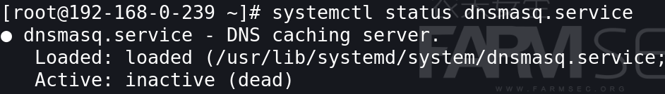

# 101-B2-DNSmasq服务

本节，学习者需用虚拟机搭建CentOS环境。

此外需要在kali上安装`nslookup`工具，命令为`apt-get -y install  dnsutils`。


## 1.DNS解析流程

域名系统（Domain Name System，缩写：DNS）是互联网的一项服务。它作为将域名和IP地址相互映射的一个分布式数据库，能够使人更方便地访问互联网，而不用去记能够被机器直接读取的IP数串。通过主机名，最终得到该主机名对应的IP地址的过程叫做域名解析（或主机名解析）。

DNS协议运行在UDP协议之上，使用端口号53。关于UDP协议与TCP协议。

DNS服务器体系的架构可以看做是一种分布式集群。各个DNS服务器间采取分布式的层次数据库模式以及缓存方法来存储和交换数据。

### 1.1 域名解析过程

以下是在电脑浏览器中输入网址后发生的事情：

1. 在浏览器中输入www.qq.com域名，操作系统会先检查自己本地的hosts文件是否有这个网址映射关系，如果有，就先调用这个IP地址映射，完成域名解析。（Hosts文件记录了一些常用的网址域名与其对应的IP地的关联，可以自己编辑，kali中存在于/etc/hosts。）
2. 如果hosts里没有这个域名的映射，则查找本地DNS解析器缓存，是否有这个网址映射关系，如果有，直接返回，完成域名解析。
3. 如果hosts与本地DNS解析器缓存都没有相应的网址映射关系，首先会找TCP/IP参数中设置的首选DNS服务器，在此我们叫它本地DNS服务器，此服务器收到查询时，如果要查询的域名，包含在本地配置区域资源中，则返回解析结果给客户机，完成域名解析，此解析具有权威性。
4. 如果要查询的域名，不由本地DNS服务器区域解析，但该服务器已缓存了此网址映射关系，则调用这个IP地址映射，完成域名解析，此解析不具有权威性。
5. 如果本地DNS服务器本地区域文件与缓存解析都失效，则根据本地DNS服务器的设置（是否设置转发器）进行查询，如果未用转发模式，本地DNS就把请求发至 “根DNS服务器”，“根DNS服务器”收到请求后会判断这个域名(.com)是谁来授权管理，并会返回一个负责该顶级域名服务器的一个IP。
6. 本地DNS服务器收到IP信息后，将会联系负责.com域的这台服务器。这台负责.com域的服务器收到请求后，如果自己无法解析，它就会找一个管理.com域的下一级DNS服务器地址(qq.com)给本地DNS服务器。当本地DNS服务器收到这个地址后，就会找qq.com域服务器，重复上面的动作，进行查询，直至找到www.qq.com主机。
7. 如果用的是转发模式，此DNS服务器就会把请求转发至上一级DNS服务器，由上一级服务器进行解析，上一级服务器如果不能解析，或找根DNS或把转请求转至上上级，以此循环。
8. 不管是本地DNS服务器用是是转发，还是根提示，最后都是把结果返回给本地DNS服务器，由此DNS服务器再返回给客户机。

我们用下图表现这一过程：


### 1.2 递归查询于迭代查询

DNS服务器集群做域名解析的时候，会产生两种查询方式，递归查询与迭代查询。

#### 1.2.1 递归查询 

主机向本地域名服务器的查询一般都是采用递归查询。

所谓递归查询就是：如果主机所询问的本地域名服务器不知道被查询的域名的IP地址，那么本地域名服务器就以DNS客户的身份，向其它根域名服务器继续发出查询请求报文(即替主机继续查询)，而不是让主机自己进行下一步查询。

因此，递归查询返回的查询结果或者是所要查询的IP地址，或者是报错，表示无法查询到所需的IP地址。

 #### 1.2.2 迭代查询

本地域名服务器向根域名服务器的查询的迭代查询。

迭代查询的特点：当根域名服务器收到本地域名服务器发出的迭代查询请求报文时，要么给出所要查询的IP地址，要么告诉本地服务器：“你下一步应当向哪一个域名服务器进行查询”。然后让本地服务器进行后续的查询。

根域名服务器通常是把自己知道的顶级域名服务器的IP地址告诉本地域名服务器，让本地域名服务器再向顶级域名服务器查询。

顶级域名服务器在收到本地域名服务器的查询请求后，要么给出所要查询的IP地址，要么告诉本地服务器下一步应当向哪一个权限域名服务器进行查询。

最后，知道了所要解析的IP地址或报错，然后把这个结果返回给发起查询的主机

我们用下图表现这两种查询的关系：


## 2. dnsmasq的介绍

`dnsmasq`服务提供DNS缓存和DHCP服务功能。
作为域名解析服务器(DNS)，dnsmasq可以通过缓存DNS请求来提高对访问过的网址的连接速度。
作为DHCP服 务器，dnsmasq可以为局域网电脑提供内网ip地址和路由。
DNS和DHCP两个功能可以同时或分别单独实现。
dnsmasq轻量且易配置，此外它还 自带了一个PXE服务器以及对邮件服务器的mx记录的支持，jabber的srv记录的支持等。它提供了DNS功能和可选择的DHCP功能可以取代 dhcpd服务和bind等服务，配置起来更简单，更适用于虚拟化和大数据环境的部署。


## 3. dnsmasq的基本概述

`dnsmasq`配置文件是`/etc/dnsmasq.conf`，在它的配件文件中的注释已经给出了非常详细的解释。

`dnsmasq` 的默认的配置文件中有许多选项，而且在设置上有很当灵活。dns与dhcp的许多功能它都具备。它可服务于那些只在本地适用的域名，这些域名是不会在全球 DNS服务器中出现的(私有域名)。DHCP服务器和DNS服务器结合，并且允许DHCP分配的地址能在DNS中正常解析，而这些DHCP分配的地址和相 关命令可以配置到每台主机中，也可以配置到一台核心设备中(比如路由器)，DNSmasq支持静态和动态两种DHCP配置方式。  

一般情况下，我们可以用bind解决dns的问题，dhcpd解决dhcp的问题，可用dnsmasq解决下面的一些维护问题：

1. 局域网有很多机器希望使用一致的hosts文件，你需要经常维护这份列表。
2. 你希望局域网的人访问某个域名时，拦截下来到指定的ip，做缓存节省带宽或者其它用途都可以。优先使用本地自定义dns。
3. 阻止对某个域名的正常解析


由于本章课程只讲述dnsmasq，为了避免干扰，我们需要关闭防火墙以及selinux.
使用`systemctl disable firewalld`命令禁止防火墙的自动启动。


编辑selinux的配置文件`/etc/selinux/config`
将默认配置`enforcing`修改为`disabled`
关闭后`init6`重启


安装dnsmasq：
`dnf -y install dnsmasq`


查看状态：`systemctl status/stop/start/restart dnsmasq`



dnsmasq的配置文件

dnsmasq服务对应的三个配置文件：

```bash
/etc/dnsmasq.conf    #主配置文件
/etc/hosts           #本地映射文件
/etc/resolv.conf     #域名配置文件
```

`dnsmasq` 能够缓存外部DNS记录，同时提供本地DNS解析或者作为外部DNS的代理，
即`dnsmasq`会首先查找`/etc/hosts`等本地解析文件，然后再查找 `/etc/resolv.conf`等外部`nameserver`配置文件中定义的外部DNS。所以说`dnsmasq`是一个DNS中继。DNS配置同样写入`dnsmasq.conf`配置文件里。

同时在/etc/hosts文件中加入本地内网解析，这样一来每当内网机器查询时就会优先查询 hosts文件，这就等于将/etc/hosts共享给全内网机器使用，从而解决内网机器互相识别的问题，比如像hadoop添加datanode节点 时。相比逐台机器编辑hosts文件或者添加Bind记录，仅需要编辑一个`/etc/hosts`文件。

## 4. dnsmasq的配置文件

`/etc/hosts`文件：
hosts文件包含了ip地址和主机名之间的映射，包括主机名的别名，在没有域名服务器的情况下，系统上的所有网络程序都通过查询该文件来解析对应于某个主机名的ip地址，否则就需要使用DNS服务程序来解决。通常可以将常用的域名和ip地址映射加入到hosts文件中，实现快速方便的访问
每行可以是两部分，即网络ip地址和主机名。主机名和域名的区别在于，主机名通常在局域网内使用，通过hosts文件，主机名就被解析到对应ip
解析顺序：浏览器DNS缓存->本地计算机HOSTS文件->本地系统DNS缓存->DNS服务器


对于检查的顺序可以通过`systemd-resolve`完成一个简单的测试。（`systemd-resolved.service`用于运行DNS查询和维护DNS缓存。）

```bash
systemctl start systemd-resolved       #kali中启动服务
systemd-resolve --flush-cache          #清除主机中DNS的缓存
systemd-resolve --statistics           #查看dns缓存的数量，主要关注Current Cache Size是否为0
systemd-resolve www.baidu.com          #使用工具解析域名
```

`vi /etc/hosts`                                         添加一条www.baidu.com的解析记录


这样我们就把百度绑定到了192.168.0.1这个IP上，在缓存与hosts文件并列的情况下进行测试


`/etc/hosts`文件的使用：
添加一个解析记录：`vi /etc/hosts`
当我们将一个ip指向百度时，再ping它解析的就是我们指向的ip.


`/etc/resolv.conf`文件：用于设置DNS服务器的IP地址及DNS域名
最主要是`nameserver`关键字，如果没指定`nameserver`就找不到DNS服务器


`dnsmasq.conf`配置文件
`vi /etc/dnsmasq.conf`
此为该服务对应的端口，默认是53端口
取消注释则为使用5353端口  


`domain-needed`表示强制使用完整的解析名，从不转发格式错误的域名


此处可设置自定义`resolv.conf`文件


此处可设置不使用`resolv.conf`这个文件


如果你不想使用`/etc/hosts`，则取消下面的注释
`#no-hosts`
本地解析文件，如果你想读取其他类似`/etc/hosts`文件，则进行配置。

`#addn-hosts=/etc/banner_add_hosts`


主机名扩展，自动的给hosts中的name增加一个域名
例如，/etc/hosts中的主机www将扩展成farmsec.cn

```bash
expand-hosts
domain=farmsec.cn
```


启用日志文件：
`log-queries`   这里默认是没有开的
`log-facility=/var/log/dnsmasq.log`  这行要自己加上，定义日志的文件


下面我们来做一个实验。

编辑`dnsmasq`服务器的`/etc/hosts`文件
添加想要解析的内容


编辑成功后需要重启服务


将本地主机dns服务器指向dnsmasq


做一个解析，可以看到只给一个主机头与补全域名的解析是一致的


Tips

```bash
绕云waf的一个小技巧：

在我们遇到存在云waf的网站时，我们访问并不是直接解析到该网站，而是将我们的请求解析到云waf上，云waf会将请求进行一个过滤，将含有危害的请求过滤掉，将正常的请求发送给网站服务器进行响应。

所以在我们找到该网站的真实ip前提条件下，那么我们就可以在hosts文件中添加一个解析指向该网站的真实ip，从而达到绕过云waf。
```

## 5. nslookup的使用

nslookup命令：查询DNS解析用的命令
可以指定dns服务器
server 192.168.0.239


也可以查询DNS记录中的其他记录：

可以是以下这些类型：

```bash
A       #地址记录（直接查询默认类型）
AAAA    #地址记录
AFSDB   #Andrew文件系统数据库服务器记录
ATMA    #ATM地址记录
CNAME   #别名记录
HINFO   #硬件配置记录，包括CPU、操作系统信息
ISDN    #域名对应的ISDN号码
MB      #存放指定邮箱的服务器
MG      #邮件组记录
MINFO   #邮件组和邮箱的信息记录
MR      #改名的邮箱记录
MX      #邮件服务器记录
NS      #名字服务器记录
PTR     #反向记录
RP      #负责人记录
RT      #路由穿透记录
SRV     #TCP服务器信息记录
TXT     #域名对应的文本信息
X25     #域名对应的X.25地址记录
```

如指定查询邮箱解析
`set type=mx`


## 6. DNS日志讲解

dns日志文件：
我们在本机上ping一下


可以看下日志返回的记录
`tail -f /var/log/dnsmasq.log`
首先是谁解析了哪个请求
在hosts文件里查询到了这个解析请求而后返还这个记录
如果机器上面的话，就像dns服务器进行查找
在返还这个记录


解析一个不存在的域名


可以看到这里日志记录就没有返回
只能看到向上一级提交了请求。


使用工具来进行爆破，查看日志的状态 
`fierce --domain farmsec.cn`


监控日志，大量的解析记录，一直在做解析。


