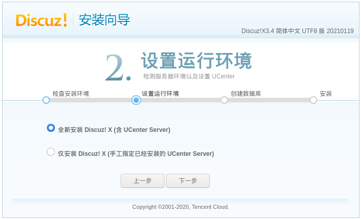

# 101-B3-Apache服务

本节，学习者需用虚拟机搭建CentOS环境。

另需准备Discuz论坛部署包。你可以到discuz官网下载这个网站部署包。


## 1. Apache的简介：

Apache是世界使用排名第一的Web服务器软件。它可以运行在几乎所有广泛使用的计算机平台上，由于其跨平台和安全性被广泛使用，是最流行的Web服务器端软件之一。它快速、可靠并且可通过简单的API扩充，将Perl/Python等解释器编译到服务器中。

同时Apache音译为阿帕奇，是北美印第安人的一个部落，叫阿帕奇族，在美国的西南部。也是一个基金会的名称、一种武装直升机等等。

Apache开源项目:https://projects.apache.org/projects.html?name


## 2. Apache的安装:

安装apache，命令为`dnf -y install httpd`。


等待安装完成后，我们启动服务并设定开机自启：

```bash
systemctl start httpd
systemctl enable httpd
```


随后我们通过客户机的浏览器打开，如果能看到Apache的默认页面，说明安装成功。


## 3. Apache的配置文件

Apache主要目录：

```bash
/etc/httpd/conf/httpd.conf   #apache的主配置文件
/etc/httpd/                  #apache配置文件的目录
/var/www/                    #apache默认存放网页的目录
```

`/etc/httpd/conf/httpd.conf`文件详解：

```bash
34  ServerRoot "/etc/httpd"                   #定义Apache的配置文件目录
45  Listen 80                                 #定义Apache的端口
69  User apache                               #定义启动用户
70  Group apache                              #定义启动用户组
89  ServerAdmin root@localhost                #定义管理员邮箱
98  #ServerName www.example.com:80            #定义服务器的域名
122 DocumentRoot "/var/www/html"              #定义网页目录
167 DirectoryIndex index.html                 #定义默认首页文件
```

### 3.1 测试一：修改httpd的默认监听端口

修改Listen 80 为81


随后重启服务

`systemctl restart httpd`


我们访问默认地址，则无法打开页面，需要输入http://IP:81/


### 3.2 测试二：替换默认页面

`/var/www/html`目录中创建默认页面index.html,内容为“hello world”


客户机浏览器中输入地址，如果成功出现hello world即可。


### 3.3 测试三：替换默认首页名称

修改配置文件`/etc/httpd/conf/httpd.conf`


在目录中添加新的index2.html文件,并重启httpd服务


使用浏览器打开，发现虽然index.html依旧存在，但默认打开的是index2.html的内容


### 3.4 测试四：Apache的虚拟主机配置

为了使用基于域名的虚拟主机，必须指定服务器IP地址（和可能的端口）来使主机接受请求。可以用NameVirtualHost指令来进行配置。 如果服务器上所有的IP地址都会用到， 你可以用*作为NameVirtualHost的参数。在NameVirtualHost指令中指明IP地址并不会使服务器自动侦听那个IP地址。 这里设定的IP地址必须对应服务器上的一个网络接口。
下一步就是为你建立的每个虚拟主机设定<VirtualHost>配置块，<VirtualHost>的参数与NameVirtualHost指令的参数是一样的。每个<VirtualHost>定义块中，至少都会有一个ServerName指令来指定伺服哪个主机和一个DocumentRoot指令来说明这个主机的内容存在于文件系统的什么地方。
如果在现有的web服务器上增加虚拟主机，必须也为现存的主机建造一个<VirtualHost>定义块。其中ServerName和DocumentRoot所包含的内容应该与全局的保持一致，且要放在配置文件的最前面，扮演默认主机的角色。

在conf.d中建立vhosts.conf文件，虚拟主机的配置文件如下：

```bash
<VirtualHost *:80>
#绑定的主域
ServerName farmsec.com
#绑定的子域名
ServerAlias www.farmsec.com
#网站主目录
DocumentRoot /var/www/com
#日志配置
ErrorLog /var/log/httpd/com_error.log
CustomLog /var/log/httpd/com_access.log common
#ServerSignature Off
</VirtualHost>
#测试一的配置
<Directory "/var/www/com/">
    Options FollowSymLinks
    AllowOverride All
    Require all granted
</Directory>
```

在目录下创建多个测试网页


更改完配置文件重启服务
`systemctl restart httpd`

随后设置客户机（kali）的本地hosts文件，将IP与DNS对应起来。


点开浏览器（隐私窗口）访问www.farmsec.com/www.farmsec.cn,查看页面是否正确。


```bash
引申：同一台主机部署多个网站的方式如下：
1.同IP不同端口
2.同端口不同IP
3.同IP同端口不同主机头
```

## 4. Apache的日志

利用`tail -f /var/log/httpd/*`监控apache日志。

当我们安装并启动Apache后，Apache会自动生成两个日志文件，在linux系统中他们保存在`/var/log/httpd/`下，这两个日志文件分别是访问日志access_log和错误日志error_log。如果使用 SSL 服务的话，还可能存在 ssl_access_log和ssl_error_log 和 ssl_request_log 三种日志文件。

访问日志access_log记录了所有对Web服务器的访问活动，下面是访问日志access_log中的一个标准记录


```
192.168.10.110 - - [28/Mar/2022:08:29:09 +0800] "GET /login.php HTTP/1.1" 200 1415 "-" "Mozilla/5.0 (X11; Linux x86_64) AppleWebKit/537.36 (KHTML, like Gecko) Chrome/100.0.4896.60 Safari/537.36"
```

日志字段所代表的内容如下：

1. 远程主机IP：表明访问网站的是谁
2. 空白(E-mail)：为了避免用户的邮箱被垃圾邮件骚扰，第二项就用“-”取代了
3. 空白(登录名)：用于记录浏览者进行身份验证时提供的名字。
4. 请求时间：用方括号包围，而且采用“公用日志格式”或者“标准英文格式”。 时间信息最后的“+0800”表示服务器所处时区位于UTC之后的8小时。
5. 方法+资源+协议：服务器收到的是一个什么样的请求。该项信息的典型格式是“METHOD RESOURCE PROTOCOL”，即“方法 资源 协议”。
6. 状态码：请求是否成功，或者遇到了什么样的错误。大多数时候，这项值是200，它表示服务器已经成功地响应浏览器的请求，一切正常
7. 发送字节数：表示发送给客户端的总字节数。它告诉我们传输是否被打断（该数值是否和文件的大小相同）。把日志记录中的这些值加起来就可以得知服务器在一天、一周或者一月内发送了多少数据。
8. UA信息：访问者的user-agent信息。

下面是错误日志的格式：


## 5.搭建LAMP体系


LAMP是指一组通常一起使用来运行动态网站或者服务器的自由软件名称首字母缩写：  
    Linux，操作系统
    Apache，网页服务器
    MariaDB或MySQL，数据库管理系统（或者数据库服务器）
    PHP、Perl或Python，脚本语言
虽然这些开放源代码程序本身并不是专门设计成同另几个程序一起工作的，但由于它们的廉价和普遍，这个组合开始流行（大多数Linux发行版本捆绑了这些软件）。当一起使用的时候，它们表现的像一个具有活力的“解决方案包”（Solution Packages）。其他的方案包有苹果的WebObjects（最初是应用服务器），Java/J2EE和微软的.NET架构。
“LAMP包”的脚本组件中包括了CGIweb接口，它在90年代初期变得流行。这个技术允许网页浏览器的用户在服务器上执行一个程序，并且和接受静态的内容一样接受动态的内容。程序员使用脚本语言来创建这些程序因为它们能很容易有效的操作文本流，甚至当这些文本流并非源自程序自身时也是。正是由于这个原因系统设计者经常称这些脚本语言为胶水语言。
Michael Kunze在一篇为德国计算机杂志《c't》（1998，第12期，230页）而写的文章中使用了缩略语“LAMP”。这篇文章意在展示一系列的自由软件成为了商业包的替换物。由于IT世界众所周知的对缩写的爱好，Kunze提出“LAMP”这一容易被市场接受的术语来普及自由软件的使用。


O'Reilly和MySQL AB在英语人群中普及了这个术语。MySQL AB自己的市场推广在某种程度上基于LAMP包的推广，其他的项目和厂商则推行这个术语的一些变体，包括：

```bash
    LAPP       （以PostgreSQL替代MySQL）
    LAMP       （最后两个字母意味着Middleware和PostgreSQL）
    LNMP或LEMP （以Nginx替代Apache）
    WAMP       （以MicrosoftWindows替代Linux）
    MAMP       （以Macintosh替代Linux）
    LAMJ       （以JSP/servlet替代PHP）
    BAMP       （以BSD替代Linux）
    WIMP       （指MicrosoftWindows, MicrosoftIIS，MySQL,PHP）
    AMP        （单指Apache,MySQL和PHP）
    XAMP       （以XML替代Linux）
```

一些人借用LAMP来描述一类可定制组成的系统，而不是制造一系列新词，并用它来表示这些系统和统一打包的页面开发环境的不同（例如ASP，.NET和J2EE）。
举例来说，Wikipedia，免费自由的百科全书，运行的一系列软件具有LAMP环境一样的特点。Wikipedia使用MediaWiki软件，主要在Linux下开发，由Apache HTTP服务器提供内容，在MariaDB数据库中存储内容，PHP来实现程序逻辑。

安装apache及其扩展包
`dnf -y install httpd httpd-devel`


安装mariadb数据库及其扩展包。

`dnf -y install mariadb mariadb-server`


安装php数据库及其扩展包：

`dnf -y install php php-mysqlnd php-gd libjpeg* php-ldap php-odbc php-pear php-xml php-xmlrpc php-mbstring php-bcmath php-mhash`


还原apache配置文件，并重启apache服务，检查是否正常运行


创建一个名为`info.php`的文件，将其保存在`/var/www/html`，文件内容如下：

```php
<?php
phpinfo();
?>
```

浏览器访问phpinfo页面。


启动`mariadb`数据库并设置开机自启

```bash
systemctl start mariadb
systemctl enable mariadb
```


设置mariadb管理员密码并验证密码

```bash
mysqladmin -u root password 123456
mysql -u root -p
```


验证是否可以正确显示库名：

```bash
show databases;
exit;
```


将discuz源码传到网站目录下	

`scp -r * root@192.168.0.239:/var/www/html`


浏览器访问网站ip并按照向导安装：


根据安装向导显示有不符合项目,修正不符合项目，并刷新浏览器：


默认全新安装：



配置数据库及其管理员信息：


安装成功
点击右下角“我已安装成功，点此访问”：


网站创建成功：


## 6 .apache安全配置实例

隐藏Apache的版本号及其它敏感信息。

一般来说，软件的漏洞信息和特定版本是相关的，因此，版本号对黑客来说是比较有价值的。
当远程请求发送到你的 Apache Web 服务器时，在默认情况下，一些有价值的信息，如 web 服务器版本号、服务器操作系统详细信息、已安装的 Apache 模块等等，会随服务器生成的文档发回客户端。
这给攻击者利用漏洞并获取对 web 服务器的访问提供了很多有用的信息。为了避免显示 web 服务器信息。安装完apache一般第一时间应该关闭apache的版本信息和其他信息，避免黑客会通过apache暴露出来的信息针对性的入侵，为了服务器的安全这些信息一定要及时关闭。
其中有两个重要的指令：`ServerTokens`、`ServerSignature`

`ServerTokens`:

它决定了发送回客户端的服务器响应头字段是否包含服务器操作系统类型的描述和有关已启用的 Apache 模块的信息。

```bash
ServerTokens Prod[uctOnly]     #服务器会发送(比如)： Server: Apache
ServerTokens Major             #服务器会发送(比如)： Server: Apache/2
ServerTokens Minor             #服务器会发送(比如)： Server: Apache/2.0
ServerTokens Min[imal]         #服务器会发送(比如)： Server: Apache/2.0.41
ServerTokens OS                #服务器会发送(比如)： Server: Apache/2.0.41 (Unix)
ServerTokens Full (或未指定)    #服务器会发送(比如)： Server: Apache/2.0.41 (Unix) PHP/4.2.2 MyMod/1.2
```


此设置将作用于整个服务器，而且不能用在虚拟主机的配置段中。

`ServerSignature`:

这允许在服务器生成的文档（如错误消息、modproxy 的 ftp 目录列表、modinfo 输出等等）下添加一个显示服务器名称和版本号的页脚行。
它有三个可能的值：

​    On - 允许在服务器生成的文档中添加尾部页脚行，
​    Off - 禁用页脚行
​    EMail - 创建一个 “mailto:” 引用；用于将邮件发送到所引用文档的 ServerAdmin。


网站版本真实信息：


设置前服务端返回Server信息:

```bash
curl http://192.168.0.239 -i
```


设置并重启：

```bash
cp /usr/share/doc/httpd-2.4.6/httpd-default.conf /etc/httpd/conf.d/
vi /etc/httpd/conf.d/httpd-default.conf
```


将`ServerTokens`、`ServerSignature`改为如下格式：


重启服务`systemctl restart httpd`

设置后的Server信息:

`curl http://192.168.0.239 -i`


## 7. 课后作业

搭建如下开源PHP程序，并了解程序。

```bash
     wordpress
     discuz
     禅道
     sugarcrm
     开源OA
     开源电商
     开源在线教育（edusoho）
     zabbix
```

