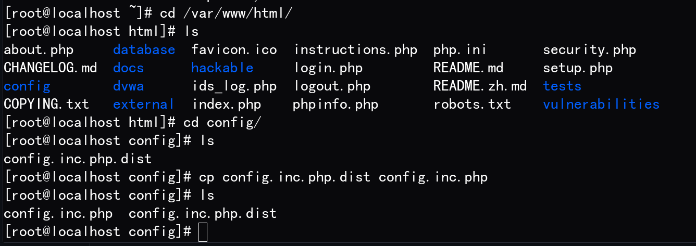
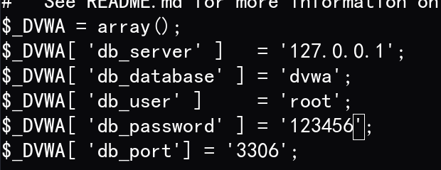
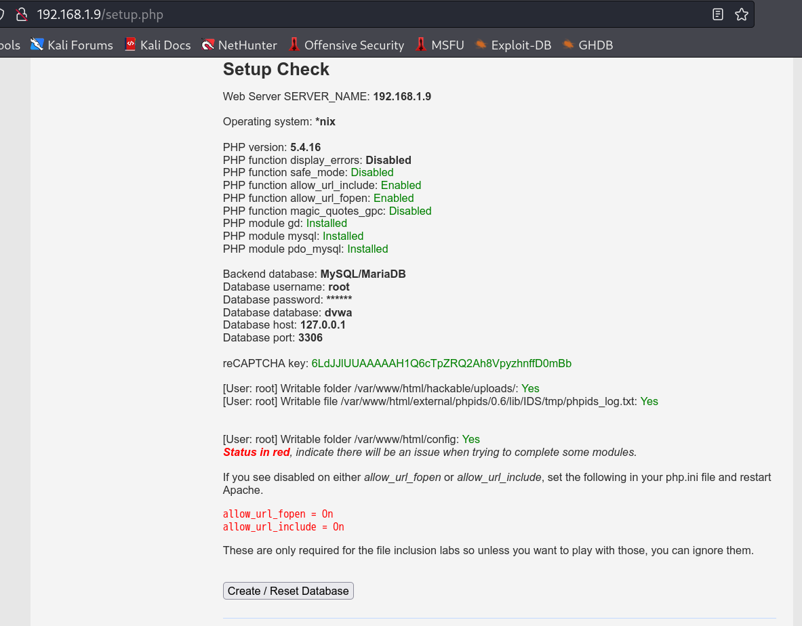
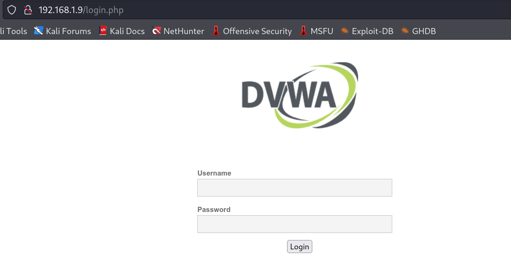

# 101-B4-DVWA靶机搭建

本节，学习者需用虚拟机搭建CentOS环境。

另需准备DVWA部署包。可用命令下载：`git clone https://github.com/digininja/DVWA.git`


## DVWA简介

Damn Vulnerable Web Application (DVWA)(译注：可以直译为："该死的"不安全Web应用网站)，是一个编码糟糕的、易受攻击的 PHP/MySQL Web应用程序。 它的主要目的是帮助安全专业人员在合法的环境中，测试他们的技能和工具，帮助 Web 开发人员更好地了解如何增强 Web 应用程序的安全性，并帮助学生和教师在受控的课堂环境中，了解 Web 应用程序的安全。

DVWA的具体目标是通过简单明了的界面，来演练一些最常见的 Web 漏洞，这些漏洞具有不同的难度级别。 请注意，此软件存在说明和未说明的漏洞。 这是故意的。 我们鼓励您尝试并发现尽可能多的安全问题。


## 搭建LAMP环境

要搭建DVWA可以首先搭建一套lamp环境。

```bash
yum -y install httpd httpd-devel
yum -y install mariadb mariadb-server
yum -y install php php-mysqlnd php-gd libjpeg* php-ldap php-odbc php-pear php-xml php-xmlrpc php-mbstring php-bcmath php-mhash
systemctl start mariadb
systemctl enable mariadb
mysqladmin -u root password 123456
systemctl start httpd
systemctl enable httpd
```

## 搭建DVWA

将DVWA文件拷贝至apache网页目录：`scp -r * root@192.168.1.9:/var/www/html/`



请确保您的 `config/config.inc.php` 文件存在。 只有 `config.inc.php.dist` 是不够的，您必须编辑它以适应您的环境并将其重命名为 `config.inc.php`。


**数据库设置**：

请确保您在 `./config/config.inc.php` 中的数据库凭据是正确的

变量默认设置如下：

```bash
$_DVWA[ 'db_user' ] = 'dvwa';
$_DVWA[ 'db_password' ] = 'p@ssw0rd';
$_DVWA[ 'db_database' ] = 'dvwa';
```

要根据数据库更改其设置。




访问网址根据网页提示完成其他设置：

**文件夹权限**：

- `./hackable/uploads/` - 需要允许web服务可写（用于文件上传）。
- `./external/phpids/0.6/lib/IDS/tmp/phpids_log.txt` - 需要允许web服务可写（如果你想使用 PHPIDS）。

**PHP配置**:

- `allow_url_include = on` - 允许远程文件包含 (RFI) [[allow_url_include](https://secure.php.net/manual/en/filesystem.configuration.php#ini.allow-url-include)]
- `allow_url_fopen = on` - 允许远程文件包含 (RFI) [[allow_url_fopen](https://secure.php.net/manual/en/filesystem.configuration.php#ini.allow-url-fopen)]
- `safe_mode = off` - （如果 PHP <= v5.4）允许 SQL 注入（SQLi） [[safe_mode](https://secure.php.net/manual/en/features.safe-mode.php)]
- `magic_quotes_gpc = off` - （如果 PHP <= v5.4）允许 SQL 注入（SQLi） [[magic_quotes_gpc](https://secure.php.net/manual/en/security.magicquotes.php)]
- `display_errors = off` - （可选）隐藏 PHP 警告消息以使其不那么冗长 [[display_errors](https://secure.php.net/manual/en/errorfunc.configuration.php#ini.display-errors)]

**文件: `config/config.inc.php`**:

- `$_DVWA[ 'recaptcha_public_key' ]` & `$_DVWA[ 'recaptcha_private_key' ]` - 这些值需要从https://www.google.com/recaptcha/admin/create 生成


一般来说只需要以下命令：

```bash
chmod 777 /var/www/html/hackable/uploads/
chmod 777 /var/www/html/external/phpids/0.6/lib/IDS/tmp/phpids_log.txt
chmod 777 /var/www/html/config
vi /etc/php.ini                                  # 设置allow_url_include=On
vi /var/www/html/config/config.inc.php           # 设置数据库信息；填写key（可选）
systemctl restart httpd.service
```

当以上设置全部完成后，网页应如下图所示，此时单击`Create / Reset Database`按钮。 这将为您创建/重置数据库，并填入一些数据。



安装完成如下图：



初始密码为admin/password 。这个网站将在后续学习过程中被反复使用，你也可以现在尝试看看它有哪些奇奇怪怪。
