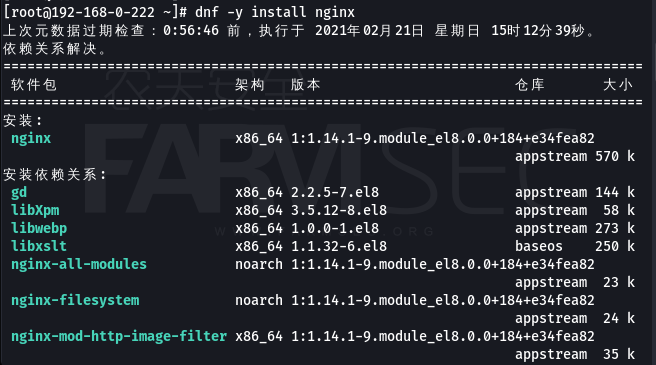
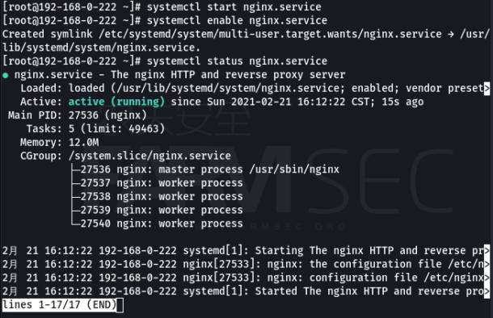
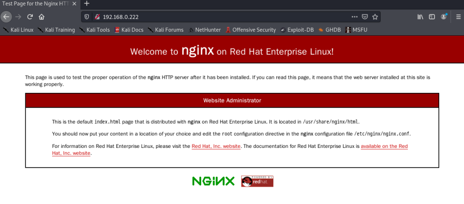
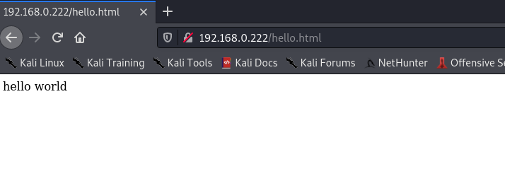
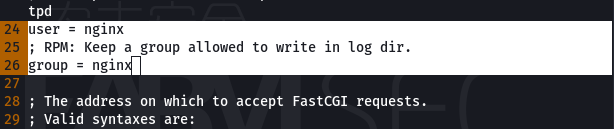
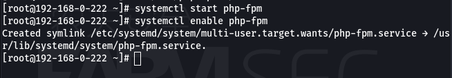
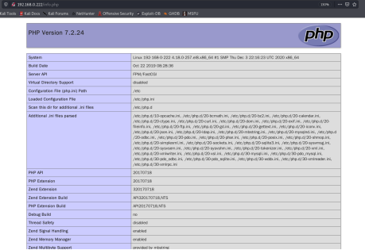
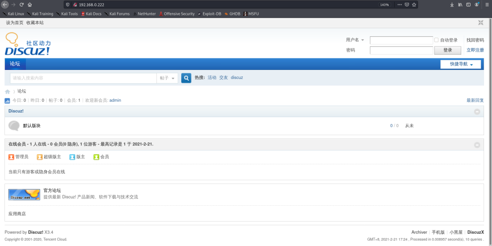

# 101-B5-nginx服务与lnmp架构

## 1. nginx 介绍

Nginx (engine x) 是一个高性能的HTTP和反向代理服务器，也是一个IMAP/POP3/SMTP服务器。Nginx是由伊戈尔·赛索耶夫为俄罗斯访问量第二的Rambler.ru站点（俄文：Рамблер）开发的，第一个公开版本0.1.0发布于2004年10月4日。

其将源代码以类BSD许可证的形式发布，因它的稳定性、丰富的功能集、示例配置文件和低系统资源的消耗而闻名。2011年6月1日，nginx 1.0.4发布。

Nginx是一款轻量级的Web 服务器/反向代理服务器及电子邮件（IMAP/POP3）代理服务器，并在一个BSD-like 协议下发行。其特点是占有内存少，并发能力强，事实上nginx的并发能力确实在同类型的网页服务器中表现较好，中国大陆使用nginx网站用户有：百度、京东、新浪、网易、腾讯、淘宝等。

为了更好地适应国内环境，各厂商在nginx在原有的基础上进一步开发，Tengine就是其中典型案例。

Tengine是由淘宝网发起的Web服务器项目。它在Nginx的基础上，针对大访问量网站的需求，添加了很多高级功能和特性。Tengine的性能和稳定性已经在大型的网站如淘宝网，天猫商城等得到了很好的检验。它的最终目标是打造一个高效、稳定、安全、易用的Web平台。

Tengine官网：http://tengine.taobao.org/

## 2. nginx 安装

安装nginx
`dnf -y install nginx`



启动nginx并设置为开机启动

```bash
systemctl start nginx.service 
systemctl enable nginx.service 
systemctl status nginx.service 
```



打开浏览器输入地址，如果弹出nginx的默认页面，则说明安装成功。




## 3. nginx 的配置文件

nigix主要文件路径为：

```bash
/etc/nginx/               #nginx的配置目录
/etc/nginx/nginx.conf/    #nginx的主配置文件
/usr/share/nginx/         #默认存放网页的目录
```

`/etc/nigix/nginx.conf`配置文件内容由多个块组成，最外面的块是main，main包含Events和HTTP，HTTP包含upstream和多个Server，Server又包含多个location。

main（全局设置）、server（主机设置）、upstream（负载均衡服务器设置）和 location（URL匹配特定位置的设置）。

+ main块设置的指令将影响其他所有设置；
+ server块的指令主要用于指定主机和端口；
+ upstream指令主要用于负载均衡，设置一系列的后端服务器；
+ location块用于匹配网页位置

在这四个部分当中，每个部分都包含若干指令，这些指令主要包含Nginx的主模块指令、事件模块指令、HTTP核心模块指令，同时每个部分还可以使用其他HTTP模块指令，例如Http SSL模块、HttpGzip Static模块和Http Addition模块等。

main部分设置的指令将影响其它所有部分的设置；server部分的指令主要用于指定虚拟主机域名、IP和端口；upstream的指令用于设置一系列的后端服务器，设置反向代理及后端服务器的负载均衡；location部分用于匹配网页位置（比如，根目录“/”,“/images”,等等）。

他们之间的关系式：server继承main，location继承server；upstream既不会继承指令也不会被继承。它有自己的特殊指令，不需要在其他地方的应用。

在本次实验中，配置文件不必修改，保持原样即可。

```bash
user nginx;
worker_processes auto;
error_log /var/log/nginx/error.log;
pid /run/nginx.pid;

# Load dynamic modules. See /usr/share/doc/nginx/README.dynamic.
include /usr/share/nginx/modules/*.conf;

events {
    worker_connections 1024;
}

http {
    log_format  main  '$remote_addr - $remote_user [$time_local] "$request" '
                      '$status $body_bytes_sent "$http_referer" '
                      '"$http_user_agent" "$http_x_forwarded_for"';

    access_log  /var/log/nginx/access.log  main;

    sendfile            on;
    tcp_nopush          on;
    tcp_nodelay         on;
    keepalive_timeout   65;
    types_hash_max_size 2048;

    include             /etc/nginx/mime.types;
    default_type        application/octet-stream;

    # Load modular configuration files from the /etc/nginx/conf.d directory.
    # See http://nginx.org/en/docs/ngx_core_module.html#include
    # for more information.
    include /etc/nginx/conf.d/*.conf;

    server {
        listen       80 default_server;
        listen       [::]:80 default_server;
        server_name  _;
        root         /usr/share/nginx/html;

        # Load configuration files for the default server block.
        include /etc/nginx/default.d/*.conf;

        location / {
     
        }

        error_page 404 /404.html;
            location = /40x.html {
        }

        error_page 500 502 503 504 /50x.html;
            location = /50x.html {
        }
    }
```

## 4. 通过nginx构建静态网站

`/usr/share/nginx/html/`目录中创建页面hello.html,内容为“hello world”


客户机浏览器中输入地址，如果成功出现hello world即可



## 5. 通过NGINX构建动态网站

LNMP代表的就是：Linux系统下Nginx+MySQL+PHP这种网站服务器架构。
Linux是一类Unix计算机操作系统的统称，是目前最流行的免费操作系统。代表版本有：debian、centos、ubuntu、fedora、gentoo等。
Nginx是一个高性能的HTTP和反向代理服务器，也是一IMAP/POP3/SMTP代理服务器。
Mysql是一个小型关系型数据库管理系统。
PHP是一种在服务器端执行的嵌入HTML文档的脚本语言。
这四种软件均为免费开源软件，组合到一起，成为一个免费、高效、扩展性强的网站服务系统。

LNMP环境的安装所需命令:

```bash
dnf -y instatll nginx
dnf -y install mariadb mariadb-server
dnf -y install php-fpm php php-mysqlnd php-gd libjpeg* php-ldap php-odbc php-pear php-xml php-xmlrpc php-mbstring php-bcmath php-mhash
```

nginx配置

```bash
systemctl start nginx
systemctl enable nginx
```

mariadb配置

```bash
systemctl start mariadb
systemctl enable mariadb
mysqladmin -u root password
mysql -u root -p
```

php配置

修改php-fpm的用户名和组。 

```bash
 vi /etc/php-fpm.d/www.conf 
```



```bash
systemctl start php-fpm
systemctl enable php-fpm
```



phpinfo测试

在/usr/share/nginx/html中建立php.info文件

```php
<?php 
phpinfo(); 
?>
```

```bash
vi /usr/share/nginx/html/info.php
cat /usr/share/nginx/html/info.php
chown -R nginx:nginx  /usr/share/nginx/html/
```

通过http://IP/info.php 进行访问测试。



可通过阅读/etc/nginx/conf.d/php-fpm.conf文件得出PHP解析的思路。

上传dz的文件，安装部署即可，过程与LAMP相同。



## 6.apache和nginx的区别

Web 服务器是存储、处理和交付网页给用户的计算机。Apache 服务器和 NGINX 是当今为 Internet 提供支持的两个最著名的 Web 服务器。世界上超过 50% 的网站都运行在这两个 Web 服务器上。它们都旨在处理不同的工作负载并补充各种类型的软件，从而创建广泛的 Web 应用程序堆栈。

### 6.1 NGINX 的好处

NGINX 服务器有很多优点。其中一些如下：

- NGINX 是开源的，可以免费使用。 
- NGINX 有一个简单的配置系统，不像 Apache。用户必须编辑不超过两个文件。
- NGINX 在处理 pdf、zip、HTML、mp4、MPEG、Avi-、jpg、gif、png 等静态文件时的性能非常好。
- NGINX 可以毫无困难地处理来自任何 Web 应用程序的流量，并为大多数应用程序提供配置指南。NGINX 提供各种应用程序，例如 WordPress、python、ruby、Drupal、VBulletin、PhpBB 和许多其他流行的应用程序。 
- 与 Apache 或 Lighttpd 等其他 Web 服务器相比，NGINX 在处理并发连接、响应时间和资源使用方面更胜一筹。
- NGINX 使网站更快，从而使他们能够获得更高的 Google 排名，因为他们已经对搜索排名算法进行了各种更改，并且最近他们使网站的速度也成为算法的一部分。速度更快的网站会得到 Google 的最大支持。NGINX 可以在流量大的情况下同时有效地处理多个客户端请求。这使网站更加优化和更快。

### 6.2 APACHE的好处

- Apache 是开源的，它可以免费使用，并允许社区开发人员轻松扩展和修改它。
- Apache 是灵活的，因为它存在动态模块。
- Apache 兼容类 Unix 操作系统，如 Linux、BSD 等，以及 MS Windows。
- Apache 拥有庞大的社区，并且在出现任何问题时都可以轻松获得支持。
- Apache 对静态文件具有最佳的交付能力，并且与任何编程语言兼容。

### 6.3 NGINX 和 Apache 之间的关键区别：

-  NGINX 是一个开源的高性能 Web 服务器和反向代理服务器，而 Apache 是一个开源的 HTTP 服务器。NGINX 作为反向代理服务器位于专用网络中的防火墙后面，并将客户端请求引导到适当的后端服务器，确保客户端和服务器之间的网络流量顺畅流动。
- 两者之间的根本区别在于它们的架构。NGINX 具有单线程架构，其中多个客户端请求在单个线程中处理。另一方面，Apache 具有多线程架构，其中为请求创建一个进程。NGINX 的事件驱动架构即使在大流量下也能确保更好的性能。
- NGINX 能够很好地处理静态内容。它比 Apache 快 2.5 倍。对于动态内容，Apache 本身在 Web 服务器本身内处理动态内容，而 NGINX 不能在内部处理动态内容，并且依赖于外部进程来执行。
- NGINX 和 Apache 服务器都非常擅长处理安全性，但 NGINX 代码库要小得多，所以从安全角度来看这是一个很大的优势。
- NGINX 完全支持几乎所有的 Unix 操作系统，但对 Windows 的支持是部分的。另一方面，Apache 完全支持类 Unix 操作系统和 MS Windows。

| 特征         | NGINX                                                        | APACHE                                                       |
| ------------ | ------------------------------------------------------------ | ------------------------------------------------------------ |
| 简单         | NGINX 的开发和创新很复杂，因为它具有复杂的架构来同时处理多个连接。 | Apache 很容易开发，因为它的每个进程一个连接的模型。          |
| 操作系统支持 | NGINX 在类 Unix 系统上运行，但对 Windows 的支持有限。        | Apache 兼容所有类 Unix 系统，如 Linux、BSD 等，并且完全支持 Windows。 |
| 基本架构     | Nginx 遵循事件驱动/单线程方法来处理客户端请求 Nginx 在一个线程中处理多个请求 | Apache 遵循进程驱动/多线程方法来处理客户端请求。             |
| 静态内容     | NGINX 可以同时运行数千个静态内容连接，速度比 Apache 快 2.5 倍。 | 在 Apache 中，为每个请求创建一个新线程 Apache 显示静态内容的速度较慢。 |
| 动态内容     | NGINX 不处理动态内容。                                       | Apache 在 Web 服务器本身内处理动态内容。                     |
| 交通处理     | NGINX 可以在流量大的情况下同时有效地处理多个客户端请求。     | Apache 无法同时处理多个客户端请求以及繁重的 Web 流量。       |
| 内存消耗     | Nginx 使用有限的硬件资源来处理客户端请求并且消耗更少的内存   | Apache的内存消耗更多。                                       |
| 用法         | NGINX 被开发为既是 Web 服务器又是反向代理服务器。            | Apache 被开发为 Web 服务器。                                 |
| 集中配置     | NGINX 有一个相对简单的配置系统。 Nginx 不允许额外的配置。    | Apache 中的配置系统并不是那么简单。 Apache 允许通过 .htaccess 文件在每个目录的基础上进行额外配置。 |
| 请求口译     | Nginx 通过 URI（统一资源标识符）来解释客户端请求。           | Apache 传递文件系统位置来解释客户端请求。                    |
| 安全         | Nginx 以更小的代码库提供更好的安全性。                       | Apache 还提供了良好的安全性，但与 Nginx 相比，它的安全性较低。此外，Apache 的代码库非常高。 |
| 功能模块     | NGINX 的核心版本不支持动态模块，但 NGINX plus 是 NGINX 的付费版本，支持动态模块。 模块的加载和卸载很复杂。 | Apache 由可以关闭/打开的动态加载模块组成。 apache中模块的加载和卸载更简单 |
| 支持         | NGINX 由成立于 2011 年的 NGINX, Inc 公司处理。社区支持通过 IRC（Internet 中继聊天）、邮件列表和堆栈溢出来完成。 | Apache 服务器由来自世界各地的用户社区处理，并由 Apache 软件基金会协调。社区支持通过 IRC、邮件列表、堆栈溢出和论坛完成。 |

公平地说，NGINX 和 Apache 都提供了高质量的性能——它们灵活、有能力、而且很强大。两者都在今天的市场上占有一席之地，但 NGINX 是占主导地位的。新出现时，Apache 占领了网络服务器领域，但逐渐发生了转变。NGINX 是轻量级的，具有事件驱动的架构。因此，它可以更有效地处理繁重的网络流量。而且，它比静态文件处理更快。在流媒体和互联网消费达到顶峰的今天，这些功能更有价值。因此，开发人员发现 NGINX 架构更适合现代 Web 应用程序开发。

### 6.4 结论

NGINX 和 Apache 是当今最流行的两种 Web 服务器。决定哪台服务器最适合我们在很大程度上取决于我们的需求，并将需求与服务器的功能进行映射将有助于确定最佳选择。我们的要求和经验可能会导致您选择其中一种或两种，甚至选择不同的路径。两个都？是的，你没听错。Apache 和 NGINX 也可以成为朋友！通过一起使用它们可以发挥每个服务器的优势。 

在当今时代，互联网消费处于历史最高水平，Web 应用程序开发领域竞争激烈，NGINX 和 Apache 的知识非常重要。对于开发人员和组织来说，这对于决定哪些 Web 服务器或哪些 Web 服务器将为他们提供最好的服务是不可或缺的。

