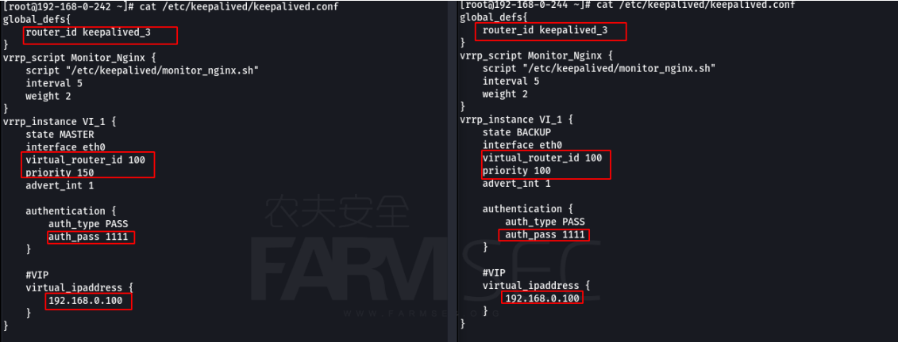
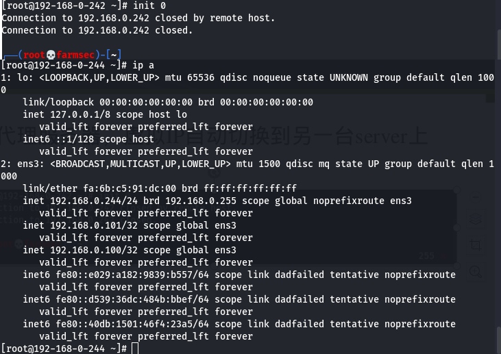

# 101-B6-nginx 反向代理

本节，培训班同学可用农夫安全提供的线上云主机进行实验，网上学习者需用虚拟机搭建CentOS环境。

## 1. 正向代理与反向代理

正向代理是一个位于客户端和目标服务器之间的代理服务器(中间服务器)。为了从原始服务器取得内容，客户端向代理服务器发送一个请求，并且指定目标服务器，之后代理向目标服务器转交并且将获得的内容返回给客户端。

反向代理实际运行方式是指以代理服务器来接受internet上的连接请求，然后将请求转发给内部网络上的服务器，并将从服务器上得到的结果返回给internet上请求连接的客户端，此时代理服务器对外就表现为一个服务器。

反向代理工作在服务期的前端，作为前端服务器，正向代理工作在客户端的前端，为客户端做代理。


简单理解的话，在日常上网过程中，如果在正向代理场景中，你需要知道欲访问资源的地址，在浏览器输入欲访问资源的地址，然后流量经由代理去访问它。通常情况下，客户端与代理在同一内网环境下，典型的场景是burp suite(后文会讲)；如在反向代理场景中，你需要知道的是代理地址，在浏览器输入代理地址，代理会替你请求到欲访问资源。通常情况下，代理与服务端在同一内网环境下，典型的场景是nigix作为代理使用的情况。


为了更好的理解，用下图来解释：


反向代理的作用于保证内网的安全，大型网站，通常将反向代理作为公网访问地址，Web服务器是内网。
可以通过反向代理来实现负载均衡，通过反向代理服务器来优化网站的负载。


## 2. NGINX 反向代理的配置文件案例

在本节实验中，需要事先准备一台lnmp环境搭载好网站的服务器（实现方式见前一节），再另准备一台centos环境虚拟机作为本节实验操作主机。

192.168.0.244    # nginx反向代理IP

192.168.0.222    # real server ip（被代理服务器地址）

修改`/etc/nginx/nginx.conf`文件为如下格式：

```bash
user nginx;
worker_processes auto;
error_log /var/log/nginx/error.log;
pid /run/nginx.pid;

include /usr/share/nginx/modules/*.conf;

events {
    worker_connections 1024;
}

http {
    log_format  main  '$remote_addr - $remote_user [$time_local] "$request" '
                       '$status $body_bytes_sent "$http_referer" '
                      '"$http_user_agent" "$http_x_forwarded_for"';
    access_log  /var/log/nginx/access.log  main;
    sendfile            on;
    tcp_nopush          on;
    tcp_nodelay         on;
    keepalive_timeout   65;
    types_hash_max_size 2048;
    include             /etc/nginx/mime.types;
    default_type        application/octet-stream;

    include /etc/nginx/conf.d/*.conf;
       
        include /etc/nginx/default.d/*.conf;

upstream web1 {
        server 192.168.0.222  weight=1;        #此处填写被代理服务器IP
       #server 192.168.0.17  weight=1;
       #ip_hash;
        }
server{
        listen 80;
        server_name www.farmsec.org;
        access_log  /var/log/nginx/farmsec.log;
        location / {
            root /home/web1_root;
            proxy_pass http://web1;
            proxy_read_timeout 300;
            proxy_connect_timeout 300;
            proxy_redirect     off;
            proxy_set_header   X-Forwarded-Proto $scheme;
            proxy_set_header   Host              $http_host;
            proxy_set_header   X-Real-IP         $remote_addr;
            proxy_set_header X-Forwarded-For $proxy_add_x_forwarded_for;
        }
    }
}
```


upstream模块：
定义一组服务器。 这些服务器可以监听不同的端口。 而且，监听在TCP和UNIX域套接字的服务器可以混用。

在如下配置文件中，nginx反向代理服务器代理了两个服务器(192.168.0.12和192.168.0.17)，并采用负载均衡模式。所谓负载均衡是指将负载（工作任务）进行平衡、分摊到多个操作单元上进行运行。在此场景中，可以理解为nginx服务器将来访流量平均分配给被代理的两个服务器。配置文件中weigtht参数表示权值，权值越高被分配到的几率越大，此配置文件中两个weight值都为1，即代表平均分配。


```bash
upstream web1 {
    server 192.168.0.12  weight=1;      #weigtht参数表示权值，权值越高被分配到的几率越大	
    server 192.168.0.17  weight=1;
    ip_hash;                            #负载均衡集群模式


location / {

            root /home/web1_root;       #定义服务器的默认网站根目录位置
            proxy_pass http://web1;     #请求转向mysvr 定义的服务器列表
            proxy_read_timeout 300;     #连接成功后，后端服务器响应时间(代理接收超时)
            proxy_connect_timeout 300;  #nginx跟后端服务器连接超时时间(代理连接超时)
            proxy_redirect     off;     #代理重定向
                                        #后端的Web服务器可以通过X-Forwarded-For获取用户真实IP
            proxy_set_header   X-Forwarded-Proto $scheme;
            proxy_set_header   Host              $http_host;
            proxy_set_header   X-Real-IP         $remote_addr;
        
}
```


## 3. 集群

当网站的访问量达到一定程度后，单台服务器不能满足用户的请求时，需要用多台服务器集群可以使用nginx做反向代理。

### 3.1 集群的分类

负载均衡集群（Load Balancing clusters），简称LBC或LB
高可用性集群（High-Availability clusters），简称HAC
高性能计算集群（High-performance clusters），简称HPC

#### 3.1.1 负载均衡集群

负载均衡集群为了提供更为实用，性价比更高的系统架构解决方案，可以把很多客户集中的访问请求尽可能平均分摊在计算机集群中处理。
注意：要考虑每个节点的承受能力，防止雪崩。
作用：

+ 分担用户访问请求几数据流量（负载均衡）
+ 保持业务连续性，即7*24小时服务（高可用性）
+ 应用于web业务及数据库从库等服务器的业务
+ 负载均衡开源的软件包括LVS Nginx Haproxy等

#### 3.1.2 高可用性集群

在集群任意一个节点失效的情况下，该节点的所有任务会自动转移到其他正常的节点上，并且不影响真个集群的运行。
作用：

+ 当一台机器宕机时，另外一台机器接管机器的IP资源和服务资源，提供服务。
+ 常用于不易实现负载均衡的应用，比如在均衡器，主数据库，主存储之间
+ 高可用性集群常用的软件包括keepalived heartbeat等

#### 3.1.3 高性能计算集群

通常，高性能计算集群设置为集群开发的并行应用程序，以解决负复杂的科学问题（天气预报，石油勘探，核反应模拟等）
高性能集群对外就好像一个超级计算机，这种超级计算机内部是有数十至上万台独立服务器组成，并且在公共消息传递层上进行通信运行并行应用程序。


### 3.2 负载均衡分类（按功能）：

+ 轮询（默认）        #每个请求按时间顺序逐一分配到不同的后端服务器，如果后端服务器down掉，能自动剔除。
+ 指定权重              #指定轮询几率，weight和访问比率成正比，用于后端服务器性能不均的情况。 
+ IP绑定 ip_hash	  #每个请求按访问ip的hash结果分配，这样每个访客固定访问一个后端服务器，可以解决session的问题。
+ fair（第三方）	   #按后端服务器的响应时间来分配请求，响应时间短的优先分配。 

## 4. 启动NGINX反向代理

当修改好nginx配置文件后，执行以下命令重启nginx服务。

```bash
nginx -t              # 测试配置文件是否有语法错误
nginx -s reload       # 重新加载Nginx配置文件，然后以优雅的方式重启Nginx
```


使用浏览器打开`http://反向代理IP/文件`的格式访问，可以发现当你访问nginx反向代理时，服务器代你去访问了其代理的网站资源。


同时查看nginx的日志(两台均看)


可以发现，当你访问nginx代理服务器时，代理服务器会记录你的主机IP来访问，而被代理服务器（网站）则会记录nginx反代服务器IP来访问的情况。


## 5. 捕获客户端真实IP

在此架构中，后端真实服务器获取的log中，IP地址变成了反向代理IP。但在实际工作时，尤其在防御黑客入侵方面，我们更需要日志记录来访的真实IP而非代理IP。这需要在配置文件中修改一个参数实现。

在反向代理服务器上开启X-Forwarded-For

```bash
vi /etc/nginx/nginx.conf
# 在配置文件中修改如下内容：
proxy_set_header X-Real-IP $remote_addr;
proxy_set_header X-Forwarded-For $proxy_add_x_forwarded_for;
```


查看nginx的日志（2台都看)


可以看到，目前反向代理服务器和被代理（网站）服务器的日志都记录了，你的kali主机IP的访问情况。

## 6. 高可用及负载均衡

高可用：它通常是指，通过设计减少系统不能提供服务的时间。冗余+自动故障转移。系统一直能够提供服务，我们说系统的可用性是100%。
一般而言，商业上的网站其可靠性需要达到至少4个9，也就是99.99&以上。这就意味着，系统的年停机时间为8.76个小时  

负载均衡：实现资源使用最大化，最大吞吐量，最小响应时间和避免过载。
将我们的应用服务器部署多台，然后通过负载均衡将用户的请求分发到不同的服务器用来提高网站、应用、数据库或其他服务的性能以及可靠性

下面我们通过一个实验来实现高可用及负载均衡，需要四台服务器，两台搭载网站，两台做nginx反向代理，都同时代理两个网站。

安装两台nginx服务，在nginx网页目录下保存一个1.html作为网页文件。并将nignx启动

```bash
dnf install nginx 
systemctl start 知道什么程序干什么用的 
systemctl enable nginx
```

两台安装好后，设置另两台服务器上安装nignx为反向代理并代理后端真实server，配置文件相同。

两台都重启一下nginx服务
systemctl restart nginx
访问一下是否更改成功


安装keepalived

两台nginx反向代理服务器均安装`keepalived`服务，`keepalived`服务可以的作用是检测服务器的状态，如果有一台web服务器宕机，或工作出现故障，Keepalived将检测到，并将有故障的服务器从系统中剔除，同时使用其他服务器代替该服务器的工作，当服务器工作正常后Keepalived自动将服务器加入到服务器群中，这些工作全部自动完成，不需要人工干涉，需要人工做的只是修复故障的服务器。

```bash
yum -y install keepalived
```


修改第一台服务器的keepalived配置文件
`vi /etc/keepalived/keepalived.conf`
把里面的配置内容清空，并分别拷贝如下两个配置文件的内容（keepa.conf keepb.conf）

```bash
###keepa.conf
global_defs{
    router_id keepalived_91
}
vrrp_script Monitor_Nginx {
    script "/etc/keepalived/monitor_nginx.sh"
    interval 5
    weight 2
}

vrrp_instance VI_1 {
    state MASTER
    interface ens3
    virtual_router_id 91
    priority 150
    advert_int 1

    authentication {
        auth_type PASS
        auth_pass 1122
    }

    #VIP
    virtual_ipaddress {
        192.168.0.101
    }
    track_script {
        Monitor_Nginx
    }
}

global_defs{
    router_id keepalived_181
}
vrrp_instance VI_2 {
    state BACKUP
    interface ens3
    virtual_router_id 181
    priority 100
    advert_int 1

    authentication {
        auth_type PASS
        auth_pass 2211
    }

    #VIP
    virtual_ipaddress {
        192.168.0.100
    }
    track_script {
        Monitor_Nginx
    }
}

```

```bash
###keepb.conf
global_defs{
    router_id keepalived_91
}
vrrp_instance VI_1 {
    state BACKUP
    interface ens3
    virtual_router_id 91
    priority 100
    advert_int 1

    authentication {
        auth_type PASS
        auth_pass 1122
    }

    #VIP
    virtual_ipaddress {
        192.168.0.100
    }
    track_script {
        Monitor_Nginx
    }
}

global_defs{
    router_id keepalived_181
}
vrrp_script Monitor_Nginx {
    script "/etc/keepalived/monitor_nginx.sh"
    interval 5
    weight 2
}
vrrp_instance VI_2 {
    state MASTER
    interface ens3
    virtual_router_id 181
    priority 150
    advert_int 1

    authentication {
        auth_type PASS
        auth_pass 2211
    }

    #VIP
    virtual_ipaddress {
        192.168.0.101
    }
    track_script {
        Monitor_Nginx
    }
}

```

`vi /etc/keepalived/keepalived.conf`

```bash
router_id keepalived_3        #此处定义的是它的id，两台是一样的，但在一个网络内两台应该是唯一的一组
```


```bash
script "/etc/keepalived/monitor_nginx.sh"  #定义检测nginx状态脚本的路径）
interval 5                                 #脚本执行间隔，每5s检测一次
weight 2                                   #脚本结果导致的优先级变更，检测失败（脚本返回非0）则优先级 +2
```


```bash
state MASTER                        #定义keepalived的状态MASTER和BACKUP两种，必须大写
interface enp0s3                    #指定虚拟ip的网卡名称，须与自己的网卡名一致
virtual_router_id 109               #路由器标识，MASTER和BACKUP必须是一致的
priority 150                        #定义优先级，数字越大，优先级越高，在同一个vrrp_instance下，MASTER的优先级必须大于BACKUP的优先级。这样MASTER故障恢复后，就可以将VIP资源再次抢回来
advert_int 1                        #设置master与backup负载均衡器之间同步检查的时间间隔，单位是秒 
```


```bash
authentication {         #设置验证类型和密码
        auth_type PASS   #主要有PASS和AH两种
        auth_pass 1111   #设置验证密码,MASTER和BACKUP密码必须相同 
    }
```


```bash
#VIP
    virtual_ipaddress {
        192.168.0.100                 #设置虚拟ip地址，可以设置多个，每行一个
    }
```


```bash
 track_script {
        Monitor_Nginx                  #调用监控脚本
    }
```


配置文件对比



设置第二台keepalived配置文件
`vi /etc/keepalived/keepalived.conf`
配置文件与第一台一样，需要修改的地方只有两处
将此块的state以及 priority修改

```bash
vrrp_instance VI_1 {
    state BACKUP               #此处修改为BACKUP
    interface  enp0s3          #注意网卡名是否一样
    virtual_router_id 109
    priority 100               #此处需要比主数值低，主是150，从则为100
    advert_int 1
```


为两台keepalived编写监测脚本，脚本内容主从均为一样
`vi /etc/keepalived/monitor_nginx.sh`


```bash
#!/bin/bash
farmsec=$(ps -C nginx --no-heading|wc -l)
if [ "${farmsec}" = "0" ]; then
            systemctl stop keepalived
fi
```

给监测脚本添加权限并启动keepalived：

```bash
chmod 755 /etc/keepalived/monitor_nginx.sh
systemctl start keepalived
systemctl enable keepalived
```

启动keeplived后，使用命令ip a查看是否配置成功

```bash
server1 ip为192.168.0.242      #虚拟IP 192.168.0.100
server2 ip为192.168.0.244	    #虚拟IP 192.168.0.101
```


可以看到虚拟ip已分别挂载到两台server上 

使用虚拟ip访问一下查看是访问，成功访问到后段真实server


修改nginx反代配置文件，取消X-Forwarded-For后，查看后端服务器日志
证明实验成功.


关闭一台反向代理服务器，虚拟IP自动切换到另一台server上.



服务器启动后，虚ip自动切换回主server

通过配置dns，实现两个虚ip的负载均衡


在客户端测试dns负载均衡效果


## 公网中构建CDN站点

什么是CDN？

dnspod+vultr+cloudflare

