# 101-B7-Linux存储

## 一 前言

在过往的IT体系中，磁盘的性能一直在制约着整体的性能。而诸如于云计算、备份数据等需求往往需要海量的空间。

在实际的场景中，可以将存储分为如下三类：

```
		1 单机版存储
		2 类私有网盘存储
		3 分布式存储
```

单机版存储可以采用的方案如NFS、SMB等服务。

私有网盘存储可以采用FreeNAS、owncloud等方案。

分布式存储方案可以采用ceph、TFS等。

在企业的环境中可以进行针对性的选择，而出于企业备份数据的角度，课程中所讲述的存储方案为单机版与私有网盘的方案。


## 二 NFS服务

### 2.1 NFS简介

NFS（Network File System）即网络文件系统，是FreeBSD支持的文件系统中的一种，它允许网络中的计算机之间通过TCP/IP网络共享资源。在NFS的应用中，本地NFS的客户端应用可以透明地读写位于远端NFS服务器上的文件，就像访问本地文件一样。

以下是NFS最显而易见的好处：

- 节省本地存储空间，将常用的数据存放在一台NFS服务器上且可以通过网络访问，那么本地终端将可以减少自身存储空间的使用。
- 用户不需要在网络中的每个机器上都建有Home目录，Home目录可以放在NFS服务器上且可以在网络上被访问使用。
- 一些存储设备如软驱、CDROM和Zip（一种高储存密度的磁盘驱动器与磁盘）等都可以在网络上被别的机器使用。这可以减少整个网络上可移动介质设备的数量。

需要特别强调，NFS服务用于Linux类的主机间的文件共享，当需要与windows生态进行访问时，需要采用SMB协议。


### 2.2 NFS服务搭建


在NFS的服务中，主要依赖于nfs-utils与rpcbind的来进行服务。

在centos中，使用如下命令安装所需服务

```
dnf -y install rpcbind nfs-utils
```


关于rpcbind的作用

> The rpcbind utility is a server that converts RPC program numbers into universal addresses. It must be running on the host to be able to make RPC calls on a server on that machine.
>
> When an RPC service is started, it tells rpcbind the address at which it is listening, and the RPC program numbers it is prepared to serve. When a client wishes to make an RPC call to a given program number, it first contacts rpcbind on the server machine to determine the address where RPC requests should be sent.
>
> The rpcbind utility should be started before any other RPC service. Normally, standard RPC servers are started by port monitors, so rpcbind must be started before port monitors are invoked.
>
> When rpcbind is started, it checks that certain name-to-address translation-calls function correctly. If they fail, the network configuration databases may be corrupt. Since RPC services cannot function correctly in this situation, rpcbind reports the condition and terminates.
>
> The rpcbind utility can only be started by the super-user. 

所以在NFS的服务的启动中，启动rpcbind后再启动nfs服务。

```
systemctl start rpcbind
systemctl start nfs-server
systemctl enable rpcbind
systemctl enable nfs-server
```

查看rpc服务的注册情况，可使用rpcinfo的指令进行查看。

```
rpcinfo -p localhost
```

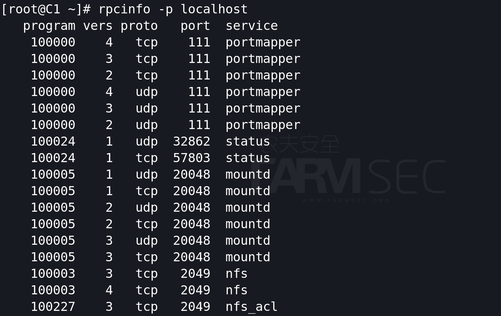

至此，NFS的服务安装完毕。


### 2.3 NFS的配置文件


NFS服务的配置文件为/etc/exports

建立分享的文件下

```
mkdir /share1
mkdir /share2
```

编辑/etc/exports，输入如下内容：

```
/share1 *(sync,ro) 192.168.0.50(sync,rw)
/share2 192.168.0.0/24(sync,ro)
```

编辑完成后，需要运行exportfs重新发布所共享的目录。（exportfs -r 重新读取配置文件）


如果需要重启服务，建议先重启rpcbind再重启NFS服务。


配置文件的含义如下：

输出"/share1"目录，对所有主机可读，对IP地址为192.168.0.50的主机可读可写。

输出"/share2"目录，对192.168.0.0/24网络内的所有主机可读。 


配置文件每行分为两段：第一段为共享的目录，使用绝对路径，第二段为客户端地址及权限。  

```
地址可以使用完整IP或网段，例如10.0.0.8或10.0.0.0/24，10.0.0.0/255.255.255.0当然也可以地址可以使用主机名，DNS解析的和本地/etc/hosts解析的都行，支持通配符，例如：*.fsec.io  
 权限有：  
·  rw：read-write，可读写； 
·  ro：read-only，只读；  
·  sync：文件同时写入硬盘和内存；  
·  async：文件暂存于内存，而不是直接写入内存；  
·  no_root_squash：NFS客户端连接服务端时如果使用的是root的话，那么对服务端分享的目录来说，也拥有root权限。  
·  root_squash：NFS客户端连接服务端时如果使用的是root的话，那么对服务端分享的目录来说，拥有匿名用户权限，通常他将使用nobody或nfsnobody身份；  
·  all_squash：不论NFS客户端连接服务端时使用什么用户，对服务端分享的目录来说都是拥有匿名用户权限；  
·  anonuid：匿名用户的UID值，通常是nobody或nfsnobody，可以在此处自行设定；  
·  anongid：匿名用户的GID值。 
```


### 2.4 客户端的访问

#### 2.4.1showmount命令

showmount -e  显示本地NFS服务器中的共享列表

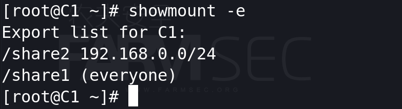

showmount -e IP 显示指定NFS服务器中的共享列表

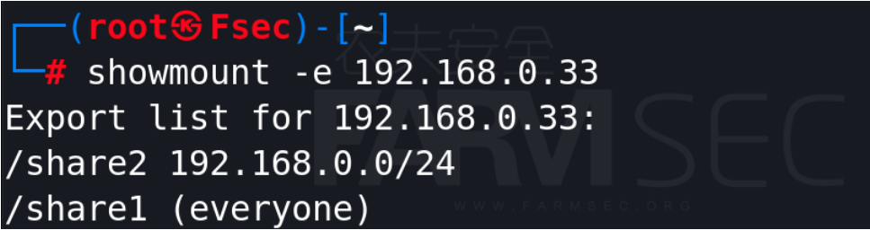

如果kali中没有showmount的指令，可通过如下指令进行查询与安装：

```
apt-cache search showmount
apt-get install nfs-common
```

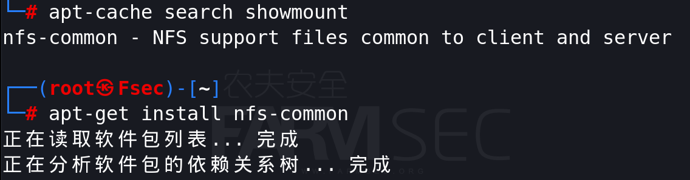


#### 2.4.2 mount命令

mount命令用于挂载磁盘，在nfs的服务中，需要使用mount -t nfs 或者mount.nfs的指令进行指定挂载的类型。

使用挂载前先在客户端创建挂载点。


随后使用mount指令将远程主机的目录挂载至本机的目录。

```
mount -t nfs 192.168.0.33:/share1 /mnt/share1
mount.nfs 192.168.0.33:/share2 /mnt/share2
```

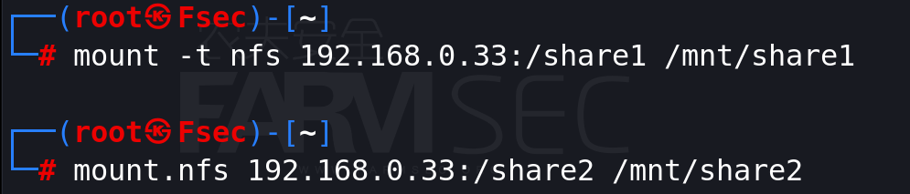

当我们进入到挂载好的目录中，分别进行创建文件的测试，会发现虽然同时失败，但报错的信息却分别为**权限不够**与**只读文件系统**。

但我们所配置的权限中，特定的IP已经给予rw的权限，却提示权限不够。换言之，share2的权限是对的，share1的写入权限为错误状态。

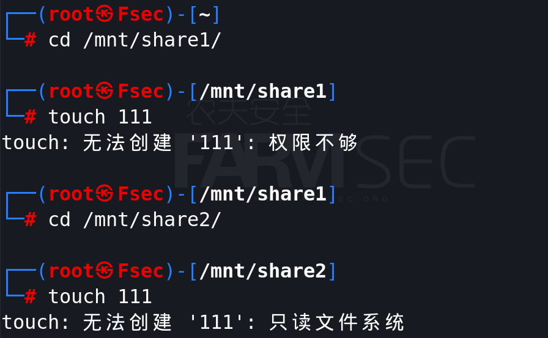

exports目录权限中，有这么一个参数**no_root_squash**。

其作用是：登入 NFS 主机使用分享目录的使用者，如果是 root 的话，那么对于这个分享的目录来说，他就具有root 的权限！。默认情况使用的是相反参数root_squash：在登入 NFS 主机使用分享之目录的使用者如果是 root 时，那么这个使用者的权限将被压缩成为匿名使用者，通常他的UID 与 GID 都会变成 nobody 那个身份。

为此重新修正权限后即可完成写入。

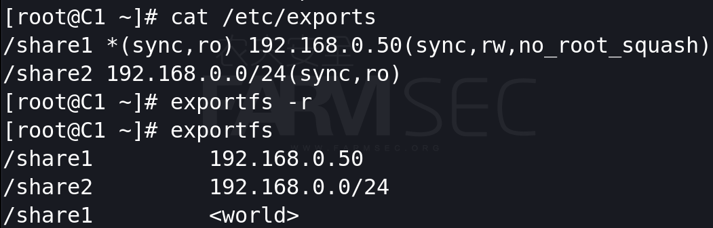

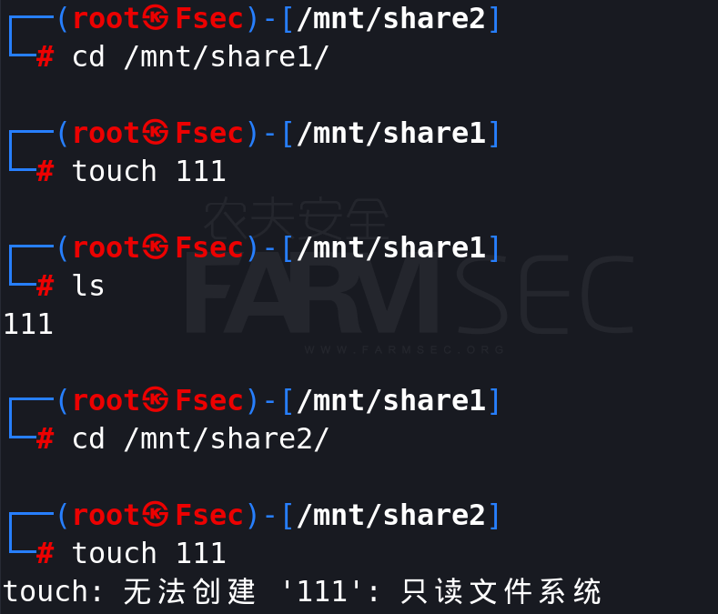

#### 2.4.3 卸除已挂载的目录

mount |grep nfs 显示当前主机挂载的NFS共享目录

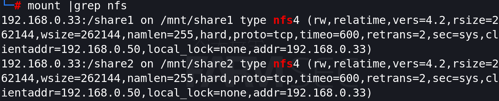

umount 命令卸载NFS 文件系统(不要在挂载的目录中进行操作)


### 2.5 备份数据的方案

假设现今我们在IDC的网络中，搭建了一台NFS的服务器用于给业务主机提供数据备份的服务。那么此时我们的需求可以梳理出大致需要完成以下三点的需要：

1 如果客户端重启后，那么挂载的连接将会失效，为此需要拥有自动挂载的方案。

2 备份的所拷贝的文件或文件夹时，需要采用时间戳进行命名，以便用于区分。

3 系统中哪些文件需要备份？

#### 2.5.1 客户端自动挂载NFS

通过如下的命令，我们重新调整NFS的配置。

```
mkdir /backup
vi /etc/exports
cat /etc/exports
/backup 192.168.0.0/24(sync,rw,no_root_squash)
exportfs -r
exportfs
```

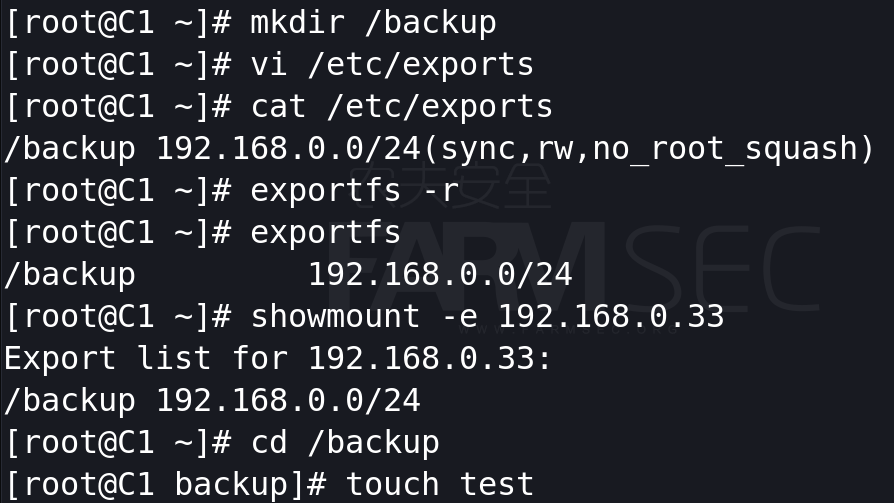

在客户机中，可通过使用rc.local的方式实现开机自动挂载。

在/etc/rc.local文件中添加如下内容：

```
mount.nfs 192.168.0.33:/backup /mnt/backup/
```

随后创建挂载点，并给/etc/rc.local执行权限。

```
mkdir /mnt/backup
chmod +x /etc/rc.local
```

重启主机后，可进入/mnt/backup目录中查看是否存在测试的文件即可。

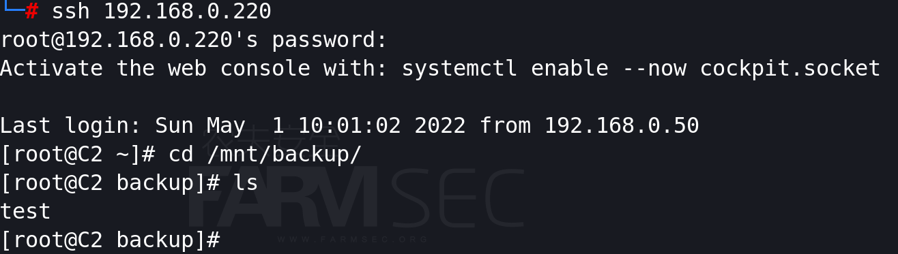

#### 2.5.2 通过计划任务自动挂载

首先我们先编写备份的脚本，以备份passwd文件为例：

```
#!/bin/bash
date="$(date +%F)"
cp /etc/passwd /mnt/backup/pass_$date
```

随后可通过计划任务进行配置周期性的运行脚本即可。由于前文已讲述完crontab的使用，为此不在赘述。

#### 2.5.3 哪些文件需要备份

数据无价！！！

数据库、web代码、web所上传的文件、日志等。


### 2.6 错误的NFS配置

第一，如果NFS暴露在公网中，虽然只给予了只读权限，那么外网主机通过访问共享即可得到敏感的数据。

第二，NFS在位于内网中的情况，那么当攻击者拿到其中一台主机的权限后，可通过访问备份的目录进入到数据集中的区域。

第三，如果将敏感的目录共享出去，攻击者有可能查看到/etc/shadow或者编辑密钥实现攻击。

当然加固的思路可以自由发挥喽~


