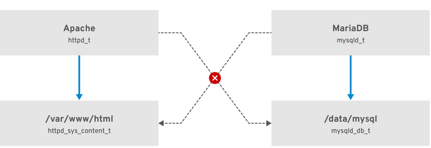
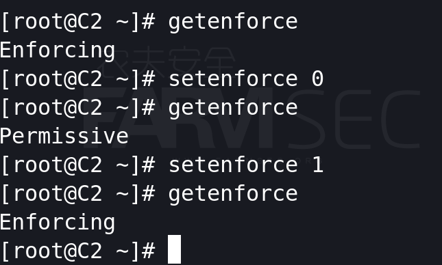
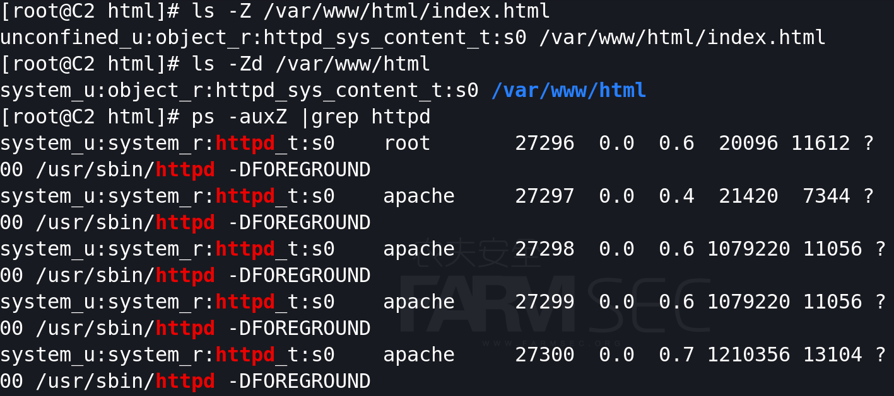
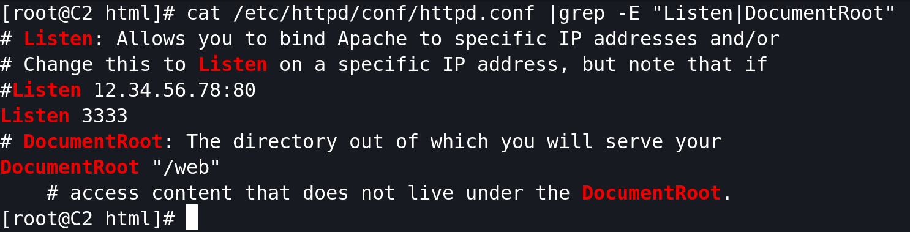
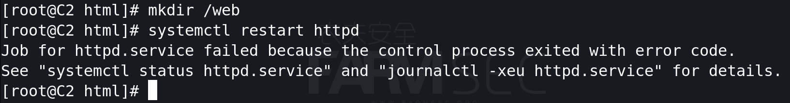
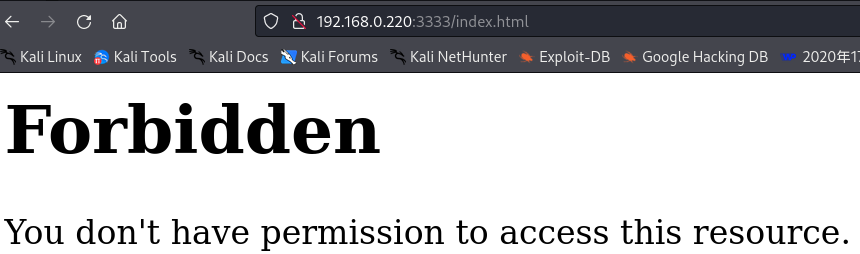

## 101-B9-selinux

### 2.1 SELinux 简介

系统管理员一般无法通过基于用户、组群和其它权限（称为 Discretionary Access Control，DAC）的标准访问策略生成全面、精细的安全策略。例如，限制特定应用程序只能查看日志文件，而同时允许其他应用程序在日志文件中添加新数据。 		

Security Enhanced Linux(SELinux)实施强制访问控制(MAC)。每个进程和系统资源都有一个特殊的安全性标签,称为 *SELinux 上下文（context）*。SELinux 上下文有时被称为 *SELinux 标签*，它是一个提取系统级别细节并专注于实体的安全属性的标识符。这不仅提供了在 SELinux 策略中引用对象的一个一致方法，而且消除了在其他身份识别系统中可能存在的模糊性。例如，某个文件可以在使用绑定挂载的系统中有多个有效的路径名称。 	



​	在上例中，SELinux 允许以 `httpd_t` 运行的 Apache 进程访问 `/var/www/html/` 目录，并拒绝同一进程访问 `/data/mysql/` 目录，因为 `httpd_t` 和 `mysqld_db_t` 类型上下文没有允许规则。另一方面，作为 `mysqld_t` 运行的 MariaDB 进程可以访问 `/data/mysql/` 目录，SELinux 也会正确地拒绝使用 `mysqld_t` 类型的进程来访问标记为 `httpd_sys_content_t` 的 `/var/www/html/` 目录。 


### 2.2 运行 SELinux 的好处		

SELinux 提供以下优点： 				

```
所有进程和文件都被标记。SELinux 策略规则定义了进程如何与文件交互，以及进程如何相互交互。只有存在明确允许的 SELinux 策略规则时，才能允许访问。 

精细访问控制。传统的 UNIX 通过用户的授权、基于 Linux 的用户和组进行控制。而 SELinux 的访问控制基于所有可用信息，如 SELinux 用户、角色、类型以及可选的安全级别。 

SELinux 策略由系统管理员进行定义，并在系统范围内强制执行。 

改进了权限升级攻击的缓解方案。进程在域中运行，因此是相互分离的。SELinux  策略规则定义了如何处理访问文件和其它进程。如果某个进程被破坏，攻击者只能访问该进程的正常功能，而且只能访问已被配置为可以被该进程访问的文件。例如：如果 Apache HTTP 服务器被破坏，攻击者无法使用该进程读取用户主目录中的文件，除非添加或者配置了特定的 SELinux  策略规则允许这类访问。 

SELinux 可以用来强制实施数据机密性和完整性，同时保护进程不受不可信输入的影响。
```

但是，SELinux 本身并不是： 	

```
防病毒软件				
用来替换密码、防火墙和其它安全系统 				
多合一的安全解决方案 	
```

SELinux 旨在增强现有的安全解决方案，而不是替换它们。即使运行 SELinux，仍需要遵循好的安全实践，如保持软件更新、使用安全的密码、使用防火墙。 		

Red Hat Enterprise Linux 8 提供以下用于 SELinux 的软件包：

    策略： selinux-policy-targeted、selinux-policy-mls
    工具： policycoreutils、policycoreutils-gui、libselinux-utils、policycoreutils-python-utils、setools-console、 checkpolicy 
    
    yum -y install policycoreutils libselinux-utils policycoreutils-python-utils setools-console checkpolicy policycoreutils-gui


### 2.3 更改 SELinux 状态和模式

 SELinux 可使用三种模式之一运行： enforcing（强制）、permissive（宽容）或 disabled（禁用）。

```
Enforcing 模式是默认操作模式，在 enforcing 模式下 SELinux 可正常运行，并在整个系统中强制实施载入的安全策略。

在 permissive 模式中，系统会象 enforcing 模式一样加载安全策略，包括标记对象并在日志中记录访问拒绝条目，但它并不会拒绝任何操作。不建议在生产环境系统中使用 permissive 模式，但 permissive 模式对 SELinux 策略开发和调试很有帮助。

强烈建议不要使用禁用（disabled）模式。它不仅会使系统避免强制使用 SELinux 策略，还会避免为任何持久对象（如文件）添加标签，这使得在以后启用 SELinux 非常困难。 
```

开启selinux的方式：

在您选择的文本编辑器中打开 `/etc/selinux/config` 文件，例如：

```none
# vi /etc/selinux/config
```

配置 `SELINUX=enforcing` 选项：

```none
# This file controls the state of SELinux on the system.
# SELINUX= can take one of these three values:
#       enforcing - SELinux security policy is enforced.
#       permissive - SELinux prints warnings instead of enforcing.
#       disabled - No SELinux policy is loaded.
SELINUX=enforcing
# SELINUXTYPE= can take one of these two values:
#       targeted - Targeted processes are protected,
#       mls - Multi Level Security protection.
SELINUXTYPE=targeted
```

重启系统：

```none
reboot
```

完成后可通过getenforce、setenforce 0、setenforce 1进行临时的切换。



### 2.4 SELinux安全上下文

SELinux 管理过程中，进程是否可以正确地访问文件资源，取决于它们的安全上下文。进程和文件都有自己的安全上下文，SELinux  会为进程和文件添加安全信息标签，比如 SELinux 用户、角色、类型、类别等，当运行 SELinux 后，所有这些信息都将作为访问控制的依据。

查看文件、目录、进程的安全上下文，执行命令如下：

```
ls -Z            		###查看文件的安全上下文
```

```
ls -Zd /root     		###查看目录的安全上下文
```

```
ps auxZ | grep httpd	###查看进程的安全上下文
```



只要进程和文件的安全上下文匹配，该进程就可以访问该文件资源。

安全上下文看起来比较复杂，它使用“：”分隔为 4 个字段，其实共有 5 个字段，只是最后一个“类别”字段是可选的，例如：

```
system_u:system_r:httpd_t:s0：[类别]
身份字段 ：角色    ：类型 ：灵敏度：[类别]
```

**身份字段（user)**：用于标识该数据被哪个身份所拥有，相当于权限中的用户身份。

```
seinfo -u   ###列出SELinux中所有的身份（user）
```

**角色（role）**：用来表示此数据是进程还是文件或目录。

常见的角色有以下两种：

object_r：代表该数据是文件或目录，这里的“_r”代表 role。

system_r：代表该数据是进程，这里的“_r”代表 role。

```
seinfo -r  ###列出SELinux中所有的角色（role）
```

**类型（type）**：类型字段是安全上下文中最重要的字段，进程是否可以访问文件，主要就是看进程的安全上下文类型字段是否和文件的安全上下文类型字段相匹配，如果匹配则可以访问。
注意，类型字段在文件或目录的安全上下文中被称作类型（type），但是在进程的安全上下文中被称作域（domain）。也就是说，在主体（Subject）的安全上下文中，这个字段被称为域；在目标（Object）的安全上下文中，这个字段被称为类型。域和类型需要匹配（进程的类型要和文件的类型相匹配），才能正确访问。

```
seinfo -t  ###列出SELinux中所有的类型（type）
```

**灵敏度**：灵敏度一般是用 s0、s1、s2 来命名的，数字代表灵敏度的分级。数值越大，代表灵敏度越高。

**类别**：类别字段不是必须有的，所以我们使用 ls 和 ps 命令查询的时候并没有看到类别字段。但是我们可以通过 seinfo 命令来查询：

```
seinfo -u -x
```


### 2.5 selinux的调试

我们通过调试apache的服务进行演示，通过修改apache的监听端口及网页目录产生关于selinux的错误。

cat /etc/httpd/conf/httpd.conf |grep -E "Listen|DocumentRoot"





进行selinux的排错处理：

```
systemctl status httpd   ###得到的报错关键信息如下：
AH00072: make_sock: could not bind to address 0.0.0.0:3333
```

SELinux 策略假设 `httpd` 在端口 80 上运行：

```none
semanage port -l | grep http
http_cache_port_t              tcp      8080, 8118, 8123, 10001-10010
http_cache_port_t              udp      3130
http_port_t                    tcp      80, 81, 443, 488, 8008, 8009, 8443, 9000
pegasus_http_port_t            tcp      5988
pegasus_https_port_t           tcp      5989
```

更改 SELinux 类型端口 3333 使其与端口 80 匹配：

```none
semanage port -a -t http_port_t -p tcp 3333
```

再次启动 `httpd`，内容仍无法访问：

```none
systemctl start httpd
```



使用 `sealert` 工具查找原因：

```none
sealert -l "*"
...
SELinux is preventing /usr/sbin/httpd from getattr access on the 文件 /web/index.html.
...
```

使用 `matchpathcon` 工具比较标准 SELinux 类型和新路径：

```
matchpathcon /var/www/html /web
/var/www/html	system_u:object_r:httpd_sys_content_t:s0
/web	system_u:object_r:default_t:s0
```

方式一：

将新 `/web` 内容目录的 SELinux 类型改为默认 `/var/www/html` 目录的类型： 				

```
semanage fcontext -a -e /var/www /web
matchpathcon /var/www/html /web
/var/www/html	system_u:object_r:httpd_sys_content_t:s0
/web	system_u:object_r:httpd_sys_content_t:s0
```

递归重新标记 `/web` 目录：

```
restorecon -Rv /web
```

方式二：

```
semanage fcontext -a -t httpd_sys_content_t "/web(/.*)?"
restorecon -Rv /web
```


### 2.6总结

现今由于时间关系，侧重点在于对selinux进行初步的了解。

未来本章节的内容将会重写进行更多的增加。

如果有余力想学习更多相关内容，可参阅redhat的官方文档：https://access.redhat.com/documentation/zh-cn/red_hat_enterprise_linux/8/html/using_selinux/index
