# 101-C1-windows系统安装

## 1. 准备工作

VirtualBox虚拟机  内存2048MB以上，硬盘40G以上，虚拟网卡调整为桥接模式。
windows 2019 iso镜像文件，并挂载到虚拟光驱。


## 2. 安装windows2019

1.开启虚拟机，进入安装界面

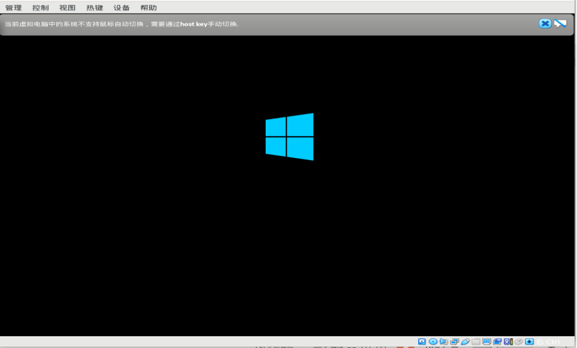

2.选择输入语言和其他首选项，然后单击下一步

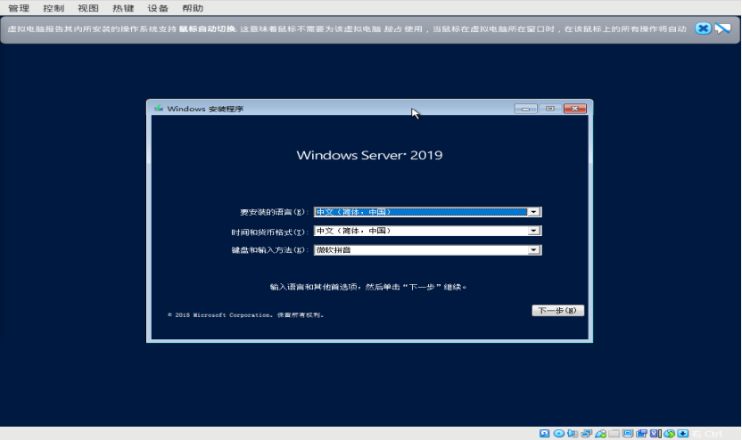

3.选择现在安装

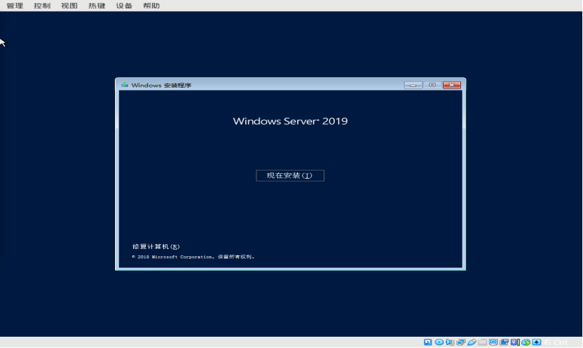

4.输入产品秘钥或者直接选择我没有产品秘钥跳过

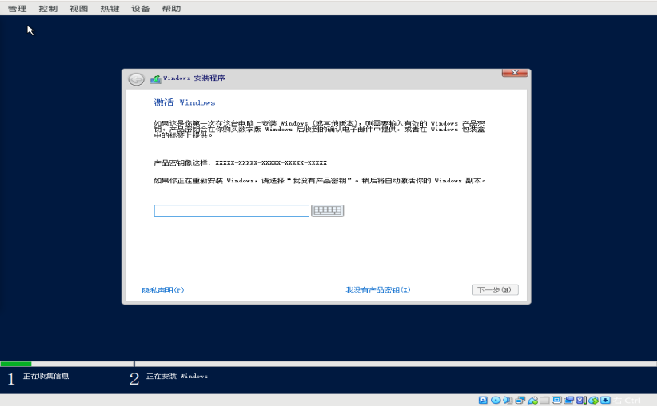

5.可以看到有四个选项

前两个选项为标准版,后两个为数据中心版;

实验环境选择标准版带有GUI的服务器(第二项)

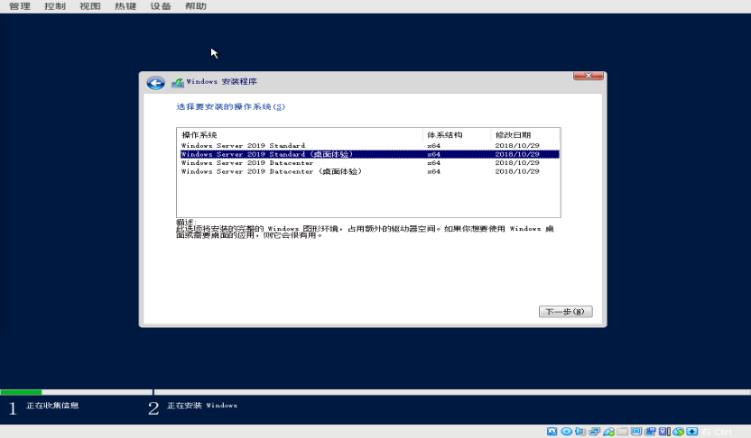

6.许可条款,勾选接受条款,下一步

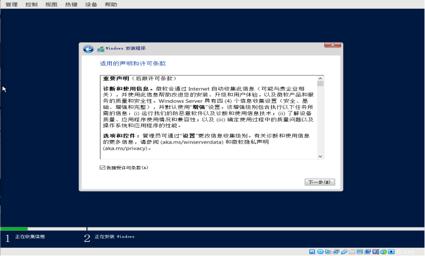

7.这里选择自定义，仅安装Windows（高级）

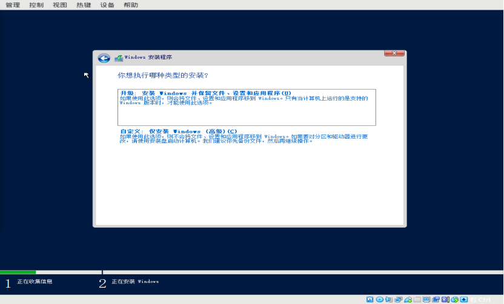

8.如果有RAID卡无法识别,可在此处加载RAID卡驱动

没有的话就可以开始新建,格式化,删除等分区操作,然后下一步。

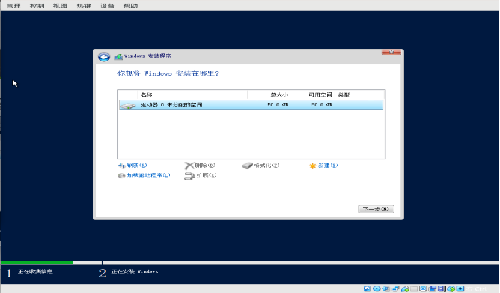

9.开始安装进程

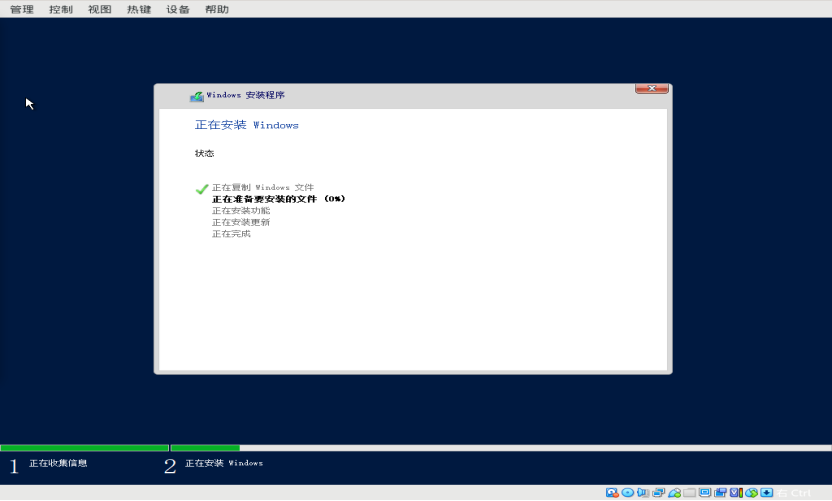

10.设置管理员密码,注意复杂度要求

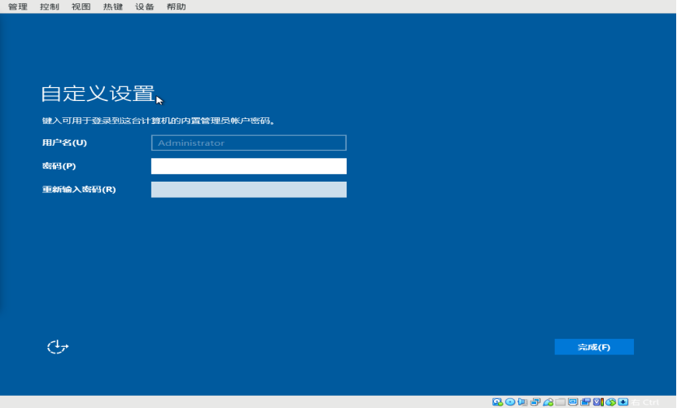

11.传入Ctrl+Alt+Delete登录

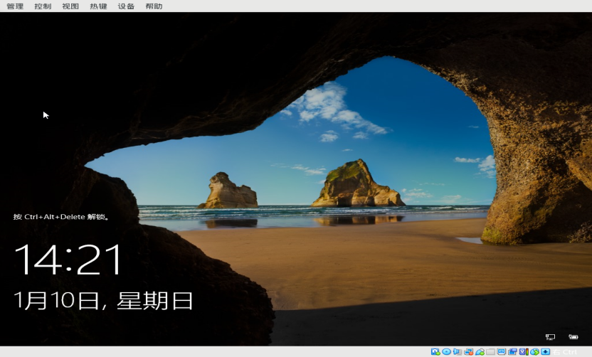

12.输入管理员密码进入系统

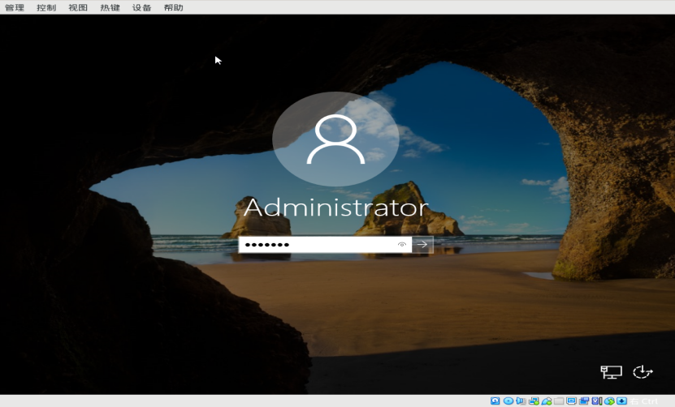

## 3. 安装virtualbox增强功能

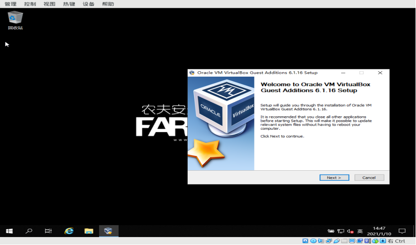

## 4. windows的基础调试

关闭防火墙用户通知

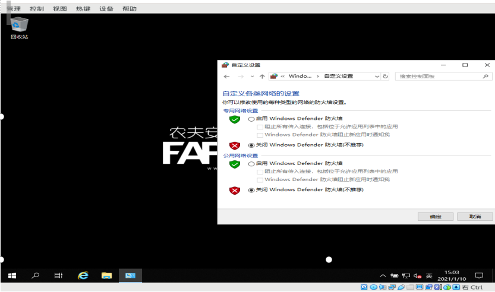

在计算机属性,远程设置处打开windows远程

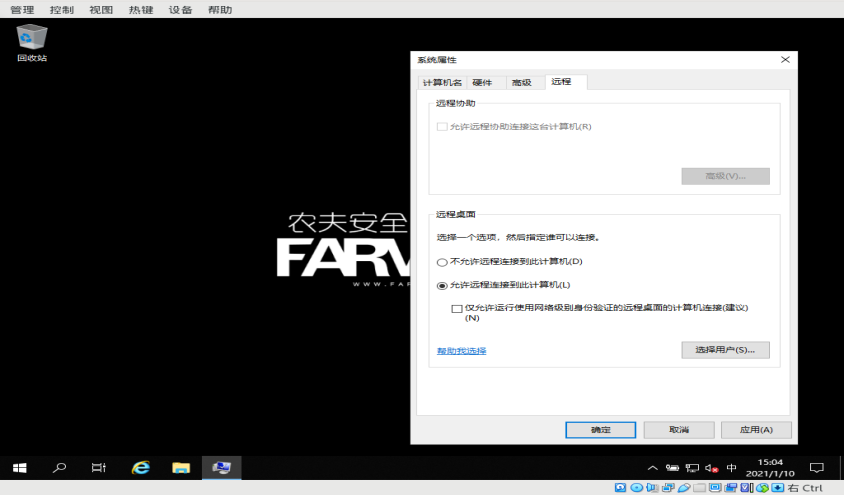

win10使用远程连接控制win2019(win+r打开运行 命令:mstsc)


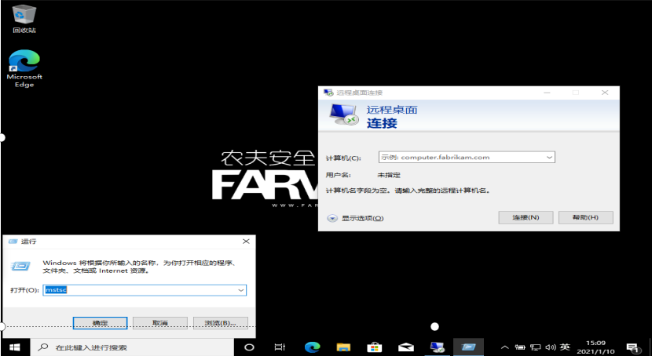

kali远程连接win2019  (命令：rdesktop 192.168.20.194 -u administrator -p 123.bmk)

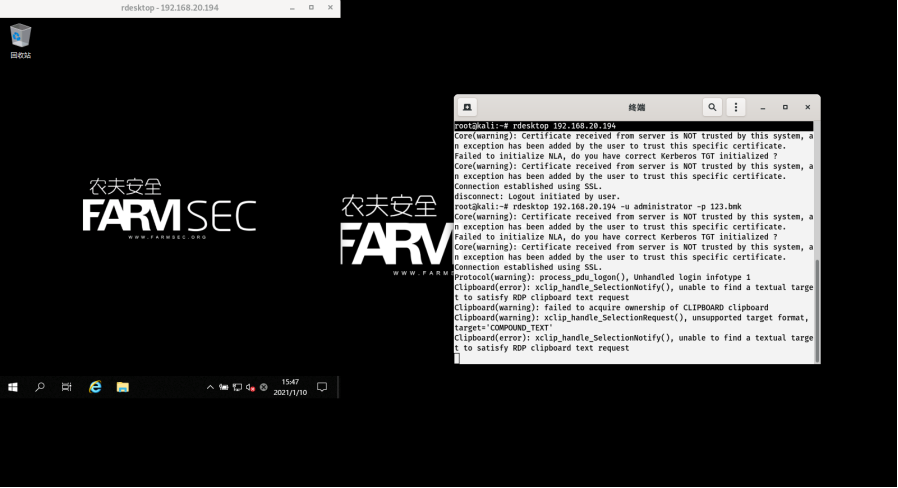

windows映像工具(sysprep)

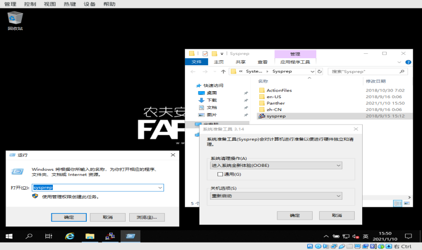

## 5. windows远程管理工具 

Windows Admin Center之前叫Honolulu，是 windows Server 机箱内管理工具的一个演化过程;它是一个单一Web窗口, 它整合了本地和远程服务器管理的各个方面。作为本地部署的、基于浏览器的管理体验, 不需要 Internet 连接和 Azure。Windows 管理中心使您能够完全控制部署的所有方面, 包括不连接 Internet 的专用网络。

在私有云环境中可以管理Windows Server 2012以上服务器操作系统以及Windows 10，当然还可以结合Azure进行一起管理。

可以安装以下 Windows 操作系统上的 Windows Admin Center:   

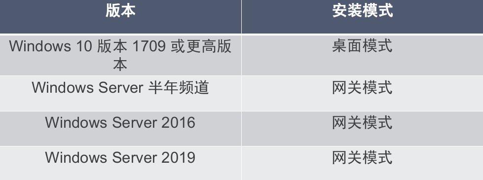

支持的操作系统：Management
你可以管理以下 Windows 操作系统使用 Windows Admin Center:

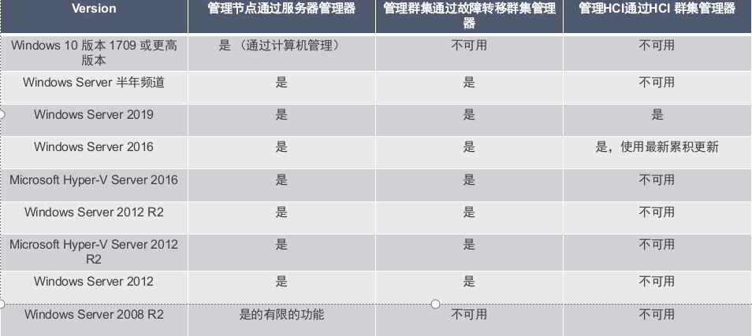

```
备注：
Windows Admin Center 需要的 Windows Server 2008 R2，2012年和 2012 R2 中不包括 PowerShell 功能。 如果将管理其与 Windows Admin Center，您将需要这些服务器上安装 Windows Management Framework (WMF) 5.1 或更高版本。
在 PowerShell 中键入 $PSVersiontable，以验证是否安装了 WMF 并且版本是否为 5.1 或更高版本。
如果未安装 WMF，你可以下载 WMF 5.1。
```

双击执行WindowsAdminCenter2009.exe,基本一直下一步

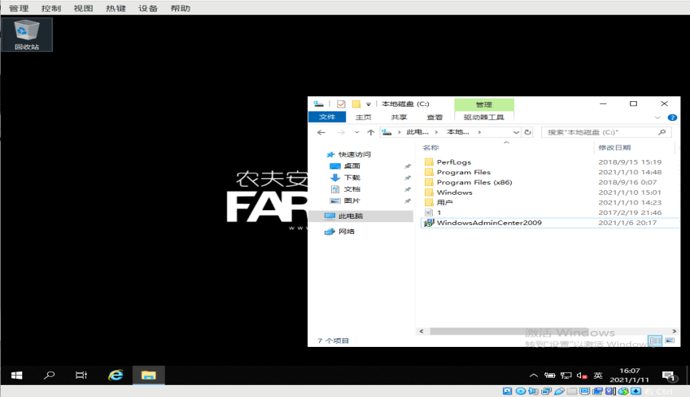

安装完成

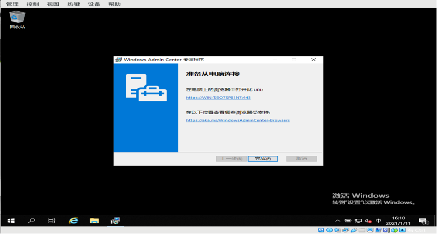

浏览器输入https://ip即可打开Windows admin center web管理界面，用户名为administrator，密码为主机设置的密码

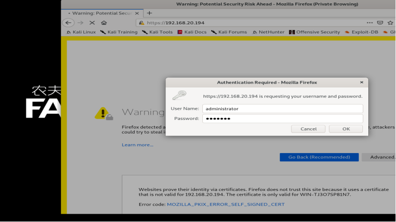

内置功能等同于计算机功能，可以非常方便的实现远程管理。生产环境安装请注意证书问题及弱口令问题。

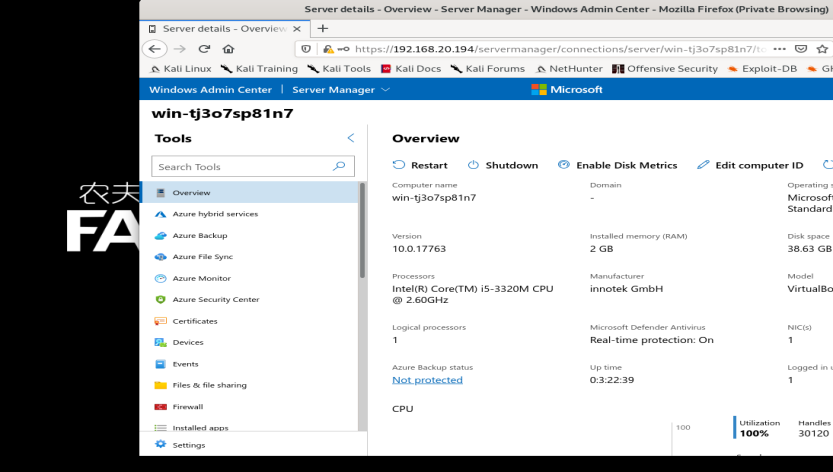

## 6. windows cmd常用命令

`win+R`常用命令。

```bash
gpedit.msc     #组策略
explorer       #打开资源管理器
logoff         #注销命令
lusrmgr.msc    #本机用户和组
services.msc   #本地服务设置
compmgmt.msc   #计算机管理
```

`cmd`常用命令。

````bash
ping ip(或域名)                                          #向对方主机发送默认大小为32字节的数据
net user 用户名 密码 /add                                 #建立用户
net user 用户名 /active:yes                              #激活用户
net user                                                #查看有哪些用户
net localgroup administrators 用户名 /add                #把用户添加到管理员中使其具有管理员权限
net start                                               #查看开启了哪些服务
netstat -a                                              #查看开启了哪些端口,常用netstat -an
arp                                                     #查看和处理ARP缓存
NetSh Advfirewall set allprofiles state off             #关闭防火墙
Netsh Advfirewall show allprofiles                      #查看防火墙状态
````


## 7. 课后作业：

1 windows10/windows server2019安装

2 windows 2019/10 细节调整(防火墙、远程桌面开启、kali连接Windows)

3 熟悉cmd常见命令的使用


