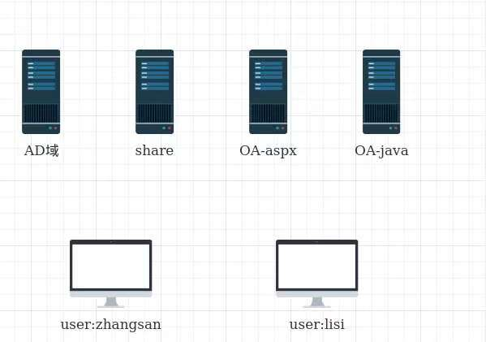

# 101-C10-构建企业办公环境

# 构建企业办公网络

## 一 前言

在windows的生态中，虽然存在着大量的"下一步"，但是不可否认的是，针对办公网络的生态里，windows具备着极大的优势。

毕竟我们能跟你们说：不装Linux当桌面，就别学了

但是很明显，不能要求其他岗位的同事使用Linux,虽然这个画面很美，但是离落地实现真的很有困难。

好吧，我要说出内心的小理想了

```
如果有一天，农夫能开一所大学的话，那么一定入学送预装Linux的电脑，校园内任何非Linux的系统均无法上网
我让你们这些兔崽子玩游戏啊还：)
```

回到这个穷不拉擦的现实中，我们依旧需要规划出一整套的基于windows的办公体系，确保每位同事能够高效率的工作。


## 二 已经学习的内容

我们已经完成如下内容的学习：

1. windows server 2019/ windows 10 的安装调试

2. windows AD域的搭建及配置

2. DNS与DHCP

3. windows建立网站(asp.net)

4. windows建立网站(java)

5. windows的文件共享

   

## 三 分析并设计架构

基于的windows的生态可以做的超级庞大，例如exchange、lync等服务，但由于我们的实验环境的限制，只将简单的生态进行模拟测试。




## 四 实施步骤

其实通过拓扑图，如何将方案进行落地并不难设计。

为此不在过多的赘述，自己去`下一步`吧:)

痛苦的windows章节终于结束了，乌拉！


