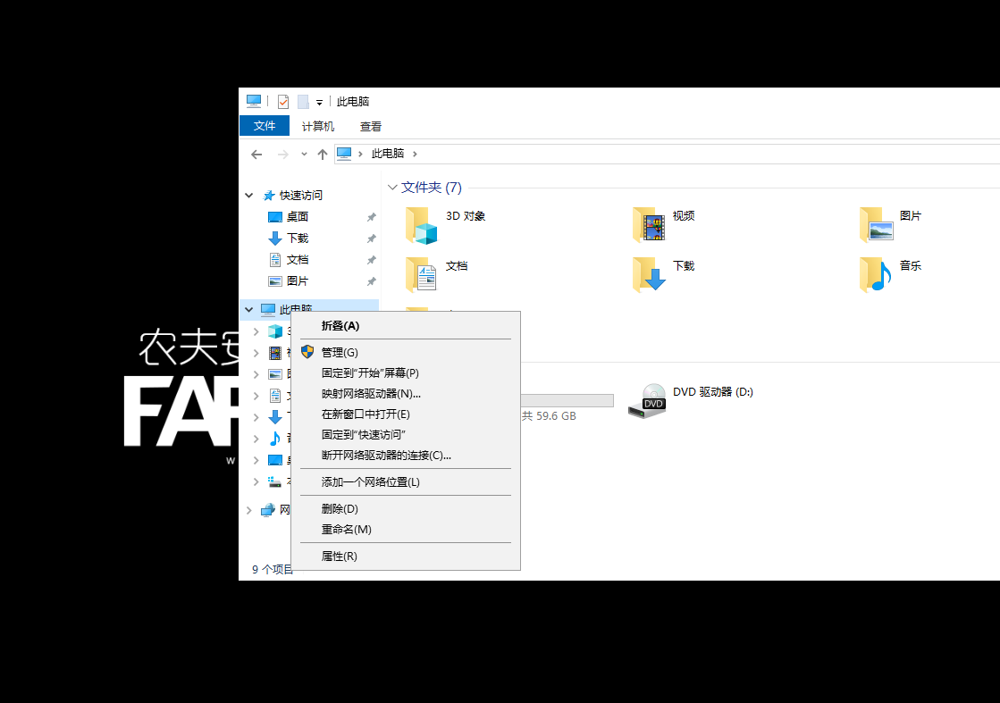
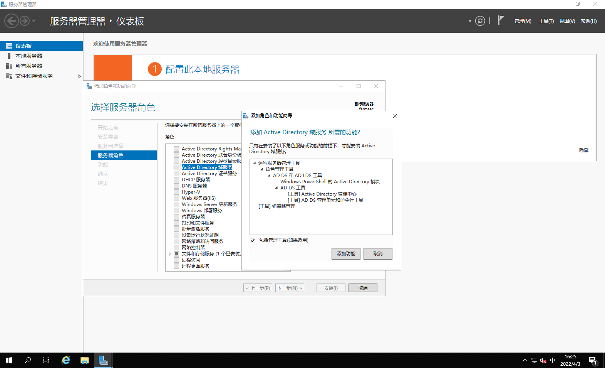
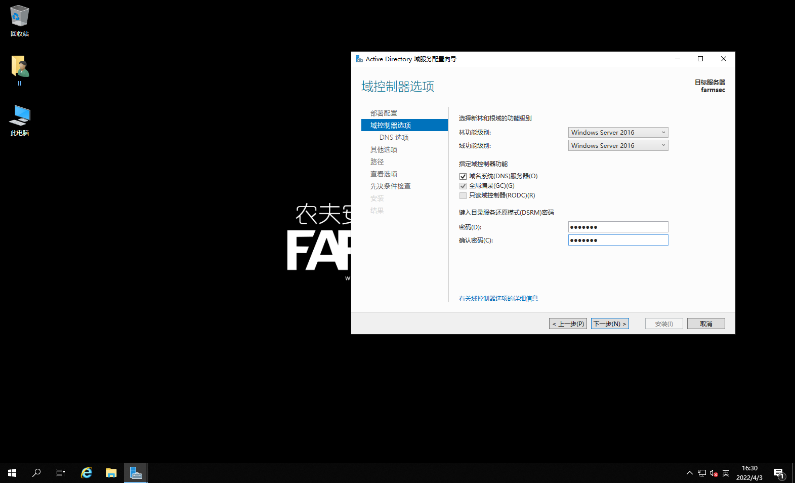
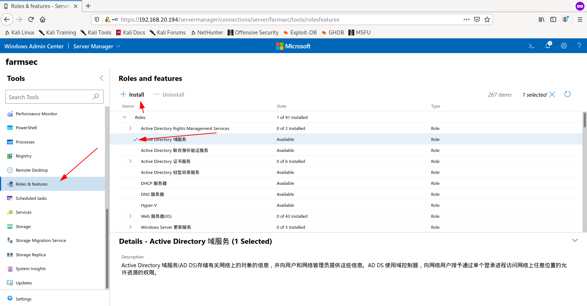
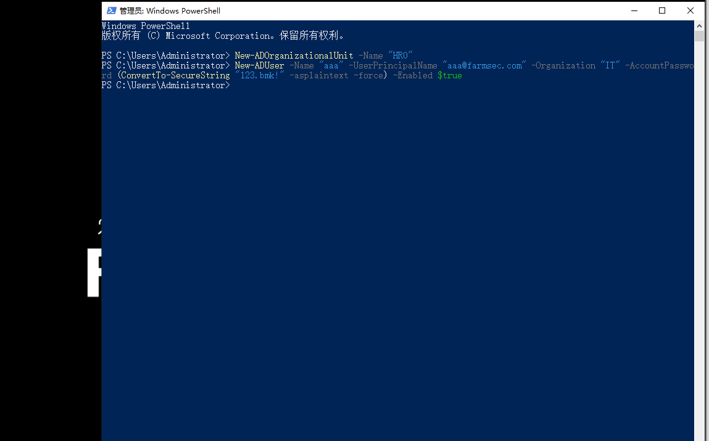
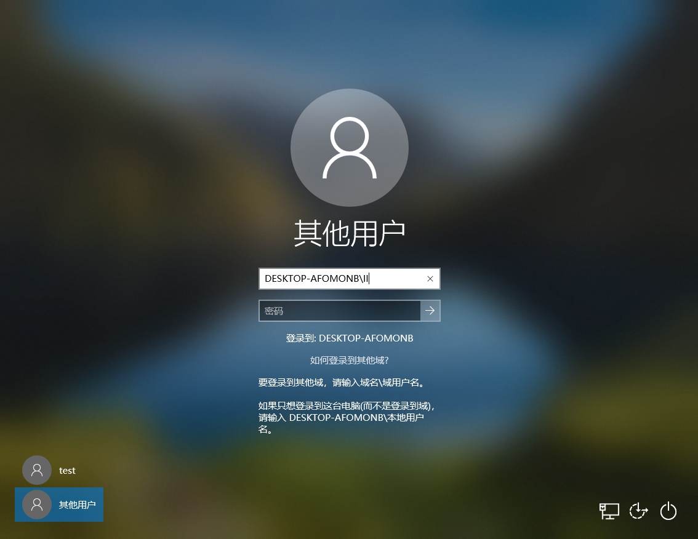
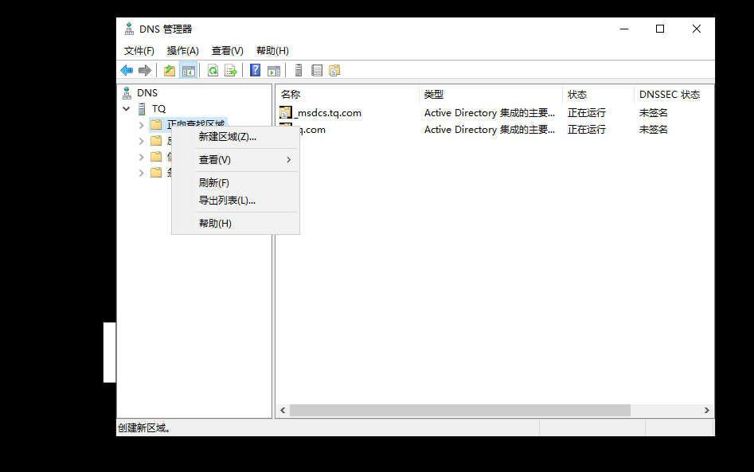
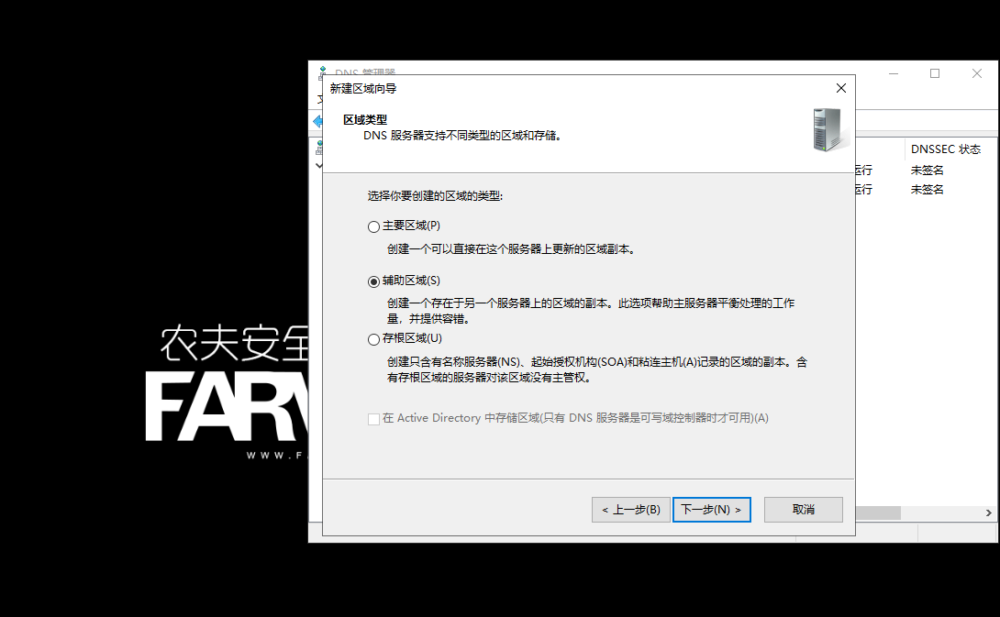
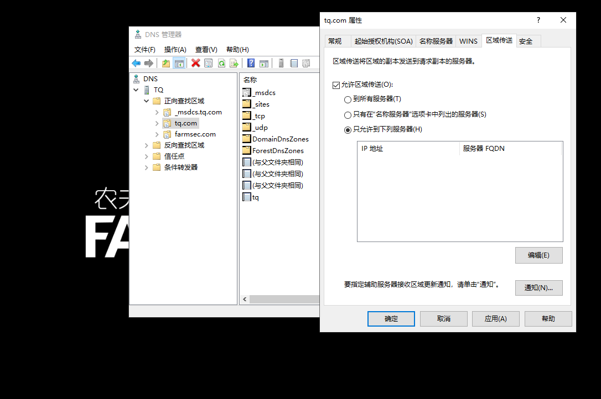

# Windows_AD域搭建

## 1.准备工作

VirtualBox虚拟机，还原windows server 2019第一次快照,win10与server2019处于一个网段中

复制Windows server2019虚拟机,打开后执行sysprep.exe,使用whoami /user命令查看sid值为不同字段

## 2.域控（AD DS）详解

Active Directory概括: 

使用 Active Directory(R) 域服务 (AD DS) 服务器角色，可以创建用于用户和资源管理的可伸缩、安全及可管理的基础机构，并可以提供对启用目录的应用程序（如 Microsoft(R) Exchange Server）的支持。

AD DS 提供了一个分布式数据库，该数据库可以存储和管理有关网络资源的信息，以及启用了目录的应用程序中特定于应用程序的数据。运行 AD DS 的服务器称为域控制器。管理员可以使用 AD DS 将网络元素（如用户、计算机和其他设备）整理到层次内嵌结构。内嵌层次结构包括 Active Directory 林、林中的域以及每个域中的组织单位 (OU)。

## 3.AD域搭建

3.1、使用本地管理员登录,”这台电脑”处右键选择属性

3.2、点击更改设置,在计算机名选项卡下点击更改

3.3、修改计算机名为"farmsec"

3.4、更改计算机名后，需要重新启动服务器。

3.5、右下角网络右键选择打开网络和共享中心,单击以太网,在以太网状态面板单击详细信息,记录下当前的IP地址,并判断网卡是否为桥接网卡

3.6、在以太网状态面板单击属性,在打开的属性面板双击Internet协议版本4进入设置,填写IP地址以及首选DNS服务器为上一步记录的IP地址,子网掩码和网关以实际网络情况填写

3.7、保存快照,为接下来演示的三种AD域安装做准备

3.8、点击windows图标进入标签中的服务器管理器,进入面板,点击添加角色和功能

3.9、默认选择“下一步”

3.10、选择“基于角色或基于功能的安装”，下一步	

3.11、选择本地服务器“farmsec”,下一步 

3.12、点击“Active Directory域服务,在弹出的向导处点击添加功能

3.13、确认是否勾选到AD域,然后点击下一步

3.14、保持默认,点击下一步

3.15、默认选项。下一步

3.16、勾选“如果需要，自动重新启动目标服务器”,在弹出的选项框选择是,点击安装

3.17、安装完成,点击关闭退出安装

3.18、在服务器管理器面板,点击旗子标示(通知),点击将此服务器提升为域控制器

3.19、由于是安装第一台ad域,所以点击添加新林，填写根域名为FARMSEC.COM ,然后点击下一步

3.20、设置目录服务还原密码为123.bmk 然后点击下一步

3.21、此处保持默认,点击下一步

3.22、此处显示NetBIOS域名,保持默认即可,必要时可以修改(大家都用一个会有问题，最好加个数字),然后点击下一步

3.23、此处可指定ad域的数据库,日志,以及sysvol文件的保存位置,生产环境下需要结合实际情况设置,现在我们保持默认,点击下一步

3.24、此处用来显示安装信息，点击查看脚本,把脚本中的命令内容复制保存下来,下一阶段的powershell安装ad域的演示中会用到,然后点击下一步

3.25、此处为先决条件检查,检查通过后点击安装

3.26、安装过程会自动重启

3.27、安装好后，使用域管理员登录

3.28、登录后，进入服务器管理器，点击工具，查看ad域是否安装成功

3.29、关机恢复快照为第7步保存的快照,准备使用powershell安装AD域

## 4.使用PowerShell搭建AD域

点击任务栏中的powershell图标,或者win+R输入powershell，进入powershell

powershell安装ad域:	`Install-WindowsFeature ad-domain-services`

安装ad域图形化管理器:	`Install-WindowsFeature RSAT-AD-AdminCenter`

将服务器提提升为域控制器：

`Import-Module ADDSDeployment`

Install-ADDSForest `

`-CreateDnsDelegation:$false`

`-DatabasePath "C:\Windows\NTDS"`

`-DomainMode "WinThreshold"`

`-DomainName "farmsec.com"`

`-DomainNetbiosName "FARMSEC0"`

`-ForestMode "WinThreshold"`

`-InstallDns:$true`

`-LogPath "C:\Windows\NTDS"`

`-NoRebootOnCompletion:$false`

`-SysvolPath "C:\Windows\SYSVOL"`

`-Force:$true`

设置目录服务还原密码，自动安装重启

重启后登录,进入服务器管理器,点击工具,验证ad域是否安装完成

关机恢复快照为第7步保存的快照,准备使用Windows admin center安装AD

## 5.使用Windows Admin Center搭建AD域

快速安装Windows admin center，在浏览器打开控制页面

点击服务器，打开网页控制台

点击角色和功能（Roles and features），在Active Directory域服务前点√，然后点击安装（install）

勾选如果需要重启服务器，然后点击确认

等待完成后可以在远程管理处重复18-27步的操作，Windows admin center是无法对添加的服务进行操作的

## 6.AD域控的使用

在服务器管理器面板点击工具,选择Active Directory用户和计算机

双击farmsec.com,可以看到在farmsec域下的一些配置

在farmsec.com处右键,选择新建->组织单位可以创建一个组织单位

在此填入名称,在实际的环境下可以给公司的每个部门创建一个组织单位.填写名称后点击确认

创建完成,可以看到目录已经显示

powershell也可以使用命令创建一个新的部门 ： `New-ADOrganizationalUnit -Name "HR0"`

创建完成,目录已经显示,没有出现的话,可以点击一下导航栏的刷新

在IT处右键,选择新建->用户

填写用户名等信息,点击下一步

填写密码,选择密码策略,以及账户状态.用户下次登录时须更改密码与密码永不过期不能同时勾选;用户下次登录时须更改密码域用户不能修改密码也不能同时勾选.勾选后点击下一步。

此页面会展示出创建的用户名和密码策略,确认无误后点击完成

可以看到用户已经创建好了

powershell也可以完成用户创建操作,但是不可以添加到部门:

`New-ADUser -Name "aaa" -UserPrincipalName "aaa@farmsec.com" -Organization "IT" -AccountPassword (ConvertTo-SecureString "123.bmk!" -asplaintext -force) -Enabled $true -`

可以发现aaa用户已经在users容器中被创建完成

打开win10,设置dns地址为ad域服务器的ip地址

打开计算机属性面板,点击更改设置,在计算机名选项卡中点击更改,在隶属于选项卡中选择域,并填写域名farmsec.com,确认无误后点击确认

在弹出的认证框填写域服务器管理员的用户及密码,administrator/123.bmk,点击确认，出现欢迎加入farmsec.com域即为主机加域成功,之后会重启

上滑后选择其他用户,提示登录到FARMSEC0域

输入在域中创建的用户及密码,按下回车或者点击右边的箭头（域名\用户名）

登录会提示第一次登录需要修改密码,点击确认然后填写新的密码

密码修改成功后会提示,点击确认后即可登录系统

所有域用户和PC本地用户是相互独立用户
服务端对域用户的所有操作不会实时同步到PC端，PC端会优先读取本地缓存，重启之后才会从新从服务端更新信息获取校验
首次登录PC的域用户，如果在这个过程中PC断网，则会提示无网络，域不可用，请检查网络

域用户登录PC端之后，在断网，那么服务端对域用户的所有操作（停用账号，修改密码等）均无法影响到已登录PC端的域用户
PC端联网之后重新向服务端校验本地信息（注销，重启），则服务端对域用户的更改会生效
断网之后PC端的域用户无法对服务端发起请求（比如修改密码），会提示没有可用服务器处理请求

由于域用户在pc上是没有安装软件的权限的,安装软件需要域管理员权限，这个密码在实际场景下几乎不可能发放给所有人，所以要把域用户添加到本地administrator组

注销域用户登录到本地用户（忘了主机名可以点击如何登录到其他域）

点击控制面板,选择用户账户,点击管理用户账户

在弹出的面板点击添加,再添加新用户处填入域用户的账户名及域名,确认后点击下一步

在授予权限处选择管理员,然后点击完成

可以看到域用户已经成为Administrator组成员,点击确定即可

注销后登录域用户,就可以安装软件了

## 7.配置双向信任域

域是安全边界，若无信任关系，域用户帐户只能在本域内使用。
信任关系在两个域之间架起了一座桥梁，使得域用户帐户可以跨域使用。
确切地说就是：信任关系使一个域地DC可以验证其他域的用户，这种身份验证需要 信任路径。例如：A域与B域没有信任关系，A域上的员工使用自己在A域的帐户，将 不能访问B域上的资源。
总之，两个域之间只有建立适当的信任关系后才可以实现互相访问，这就像两个国家之间 要进行友好往来需要建立外交关系一样。

信任是有方向的，信任的方向决定了资源访问的方向。
例如，如果a域信任b域，那么b域中的用户就可以访问a域中的资源。在window server 2003 中默认建立的信任关系都是双向的，手工建立的则可以根据访问需要建立单项或双向的信任关系。
所有信任关系中只能有两个域：信任域和受信任域。
有一个信任关系：A域信任B域，其中A域是信任域，B域是受信任域，这个信任关系 指明B域是受A域信任的域，即B域的用户帐户可以访问A域的资源（在拥有相应权限 的前提下）。从这里我们可以看出，信任关系具有方向性，这个信任关系是单向信 任，B域的用户可以访问A域的资源，但A域的用户还不能访问B域的资源。
还有一种信任关系：A域和B域之间的双向信任（A域信任B域，且B域信任A域）， 在这种信任关系下，A域和B域的用户帐户都能访问对方域的资源，因为这两个域都 得到了对方域的信任。

打开复制好的Windows server主机，参考AD域搭建配置为域控制器，域为tq.com

在farmsec.com的这台域控制器上面，打开DNS管理器，右击选择“属性”，选择“区域传送”对话框，勾选“允许区域传送”并选择“只允许到下列服务

选择“编辑”并添加tq.com这台域控制器的DNS地址,然后选择“确定”

检查添加情况，点击应用后确认

在tq.com域控上，打开DNS管理器，点击“正向查找区域”并选择“新建区域”；

打开“欢迎使用新建区域向导”窗口，并选择“下一步”

在区域类型页面，选择“辅助区域”并选择“下一步”

输入区域名称（我们这里需要的是复制farmsec.com的DNS区域，所以这里输入farmsec.com），然后选择“下一步”

输入farmsec.com域控的IP地址，并选择“添加”，然后选择“下一步”

创建成功后，选择“完成”，此时DNS管理器会发现多了一个farmsec.com区域

接下来我们反过来在farmsec.com添加tq.com的DNS辅助区域，先在tq.com上设置区域传送（tq.com右键）

编辑farmsec域控的ip

到farmsec.com域控上添加tq.com的DNS辅助区域

添加tq.com域控的ip

在farmsec.com和tq.com域控上分别nslookup对方域名，检查是否成功解析

farmsec.com：

tq.com：

在farmsec.com域控打开“Active Directory 域和信任关系”右击域名，选择“属性”

选择“信任”对话框，并选择“新建信任”，下一步

输入加入信任域的域名或NETBIOS，然后选择“下一步”

在“信任类型”选择“外部信任”（这种信任是不可传递的。），然后选择“下一步”

在信任方向选择“双向”，然后选择“下一步”

在信任方选择“此域和指定的域”；然后选择“下一步”

输入tq.com域控的管理员账户密码，然后选择“下一步”

在传出信任身份验证级别窗口选择“全域身份验证”（一般情况下，我们都会选择“全局性身份验证”；但如果有不同的需求可以选择下面一个“选择性身份验证”），然后选择“下一步”

选择传出新任身份验证级别，一般选择“全域性身份验证”，即所有用户；如果选择“选择性身份验证”则需要事后手动选择用户；然后选择“下一步”

在“选择信任完毕”直接下一步

​	信任创建完毕窗口也直接下一步，到信任确认传出，选择“是，确认传出信任”并点击下一步

在“确认传入信任”窗口，选择“是，确认传入信任”并选择“下一步”

在“正在完成新建信任向导”窗口，选择“完成”

在信任属性窗口中，可以看到，相关域之间的属性

到tq.com域控中打开域信任属性窗口，同样也可以看到两个域之间的信任

在tq域中创建一个用户如：god

打开上个实验加好farmsec.com域的win10主机,点击其他用户，默认提示还为farmsec0

尝试登录tq域的god用户（tq0\god）

登录成功

## 8.小结

将网络元素 组织为 分层结构可带来以下好处：

​	林可以充当组织的安全边界并定义管理员的授权范围。默认情况下，一个林包含一个域（称为林根域）。在林中还可以创建其他域，以提供 AD DS 数据分区，从而使组织仅在需要时复制数据。因此，在可用带宽有限的网络上，AD DS 可以进行全局缩放。Active Directory 域还支持与管理相关的许多其他核心功能，包括网络范围的用户标识、身份验证和信任关系。OU 简化了授权的委派以方便管理大量对象。所有者可以通过委派将对象的全部或有限授权转移给其他用户或组。委派十分重要，因为它有助于将大量对象的管理分发到多个被信任执行管理任务的人。

安全性方面：

​	安全性可以通过登录身份验证和到目录中资源的访问控制与 AD DS 集成。借助单点网络登录，管理员可以管理其整个网络中的目录数据和组织。授权网络用户还可以使用单点网络登录访问网络中任意位置的资源。基于策略的管理简化了即使最复杂的网络的管理。

其他 AD DS 功能包括下列各项：

​	一组规则，即架构，它定义包含在目录中的对象和属性的类别、这些对象的实例的约束和限制及其名称的格式。包含有关目录中每个对象的信息的 全局编录。无论目录中的哪个域实际包含目录信息，用户和管理员都可以使用全局编录查找这些数据。一种查询和索引机制，以便对象及其属性可由网络用户或应用 程序发布和发现。一种复制服务，可在整个网络中分发目录数据。域中所有可写域控制器均参与复制，并包含其域的所有目录信息的完整副本。对目录数据的任何更 改均复制到域中的所有域控制器。操作主机角色（也称为灵活单主机操作或 FSMO）。包含操作主机角色的域控制器被指定为执行特定任务，以确保一致性以及消除目录中有冲突的条目。
