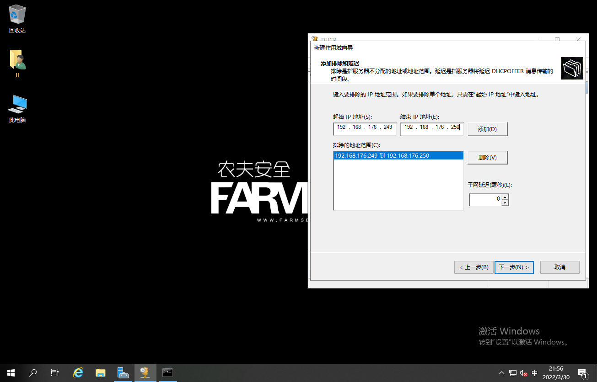
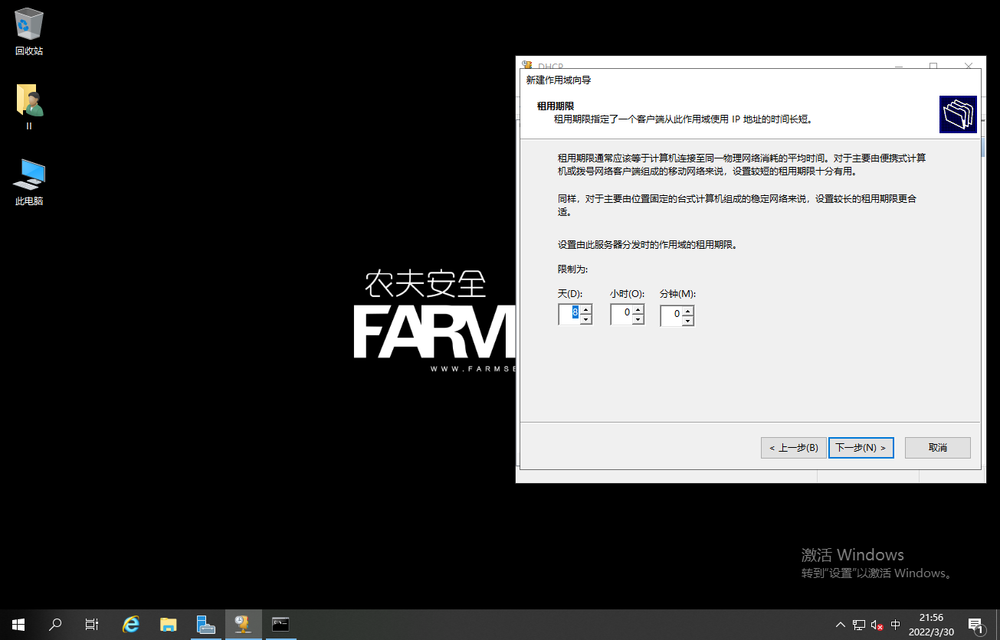

# Windows_DHCP搭建

## 1.准备工作

VirtualBox虚拟机，一台搭建完DNS服务的windows server 2019,win10与server2019处于一个网段中

## 2.DHCP详解与工作流程

DHCP（Dynamic Host Configuration Protocol ,动态主机配置协议）通常被用在大型的局域网络中，主要作用是集中的管理，分配IP地址，使网络环境中的主机动态的获得IP地址，Gateway地址，DNS服务器地址等信息，并能够提升地址的使用率。

分配方式:

1.自动分配方式：DHCP服务器为主机指定一个永久性的IP地址，一旦DHCP客户端第一次成功从DHCP服务器租用到IP地址，就可以永久使用该地址

2.动态分配方式：DHCP服务器给主机指定一个有时间限制的IP地址， 时间到期或主机明确表示放弃该地址时，该地址可以被其他主机使用

3.手工分配方式：客户端的IP地址是由网络管理员指定的，DHCP服务器只是将指定的IP地址告诉客户端主机

三种地址分配方式中， 只有动态分配方式可以重复使用客户端不再需要的地址

DHCP协议的工作流程：

1.发现阶段：即DHCP客户机寻找DHCP服务器的阶段。

2.提供阶段：即DHCP服务器提供IP地址的阶段。

3.选择阶段：DHCP客户机选择某台DHCP服务器提供的IP地址的阶段。

4.确认阶段：即DHCP服务器确认所提供的IP地址的阶段。

5.重新登陆：以后DHCP客户机每次登陆网络时，就不需要再发送DHCP discover发现信息了。

6.更新租约：DHCP服务器向DHCP客户机出租的IP地址一般都由一个租借期限，期满后DHCP服务器会收回出租的IP地址。

DHCP网络拓补图：

## 3.DHCP服务器搭建

**DHCP可与DNS服务器共存**

打开服务器管理器,点击“添加角色和功能”

开始之前，安装类型，服务器选择与安装其他服务类似,选择默认下一步即可

单击“DHCP服务器”，在弹出的功能框点击添加功能,然后点击下一步

功能处与注意事项处保持默认,点击下一步即可

勾选如果需要,自动重新启动目标服务器,确认后点击安装

安装完成

点击服务器管理器右上角旗子标示,点击完成DHCP配置

点击提交进行授权与DHCP安全组配置

完成授权与安全组创建,点击关闭即可

## 4.PowerShell安装DHCP服务

查看与dhcp相关的服务

`Get-WindowsFeature |where {$_.name -like "*dhcp*"}`

安装与dhcp相关的所有服务

`Get-WindowsFeature |where {$_.name -like "*dhcp*"} |add-WindowsFeature`

在此查看与dhcp相关的服务,发现在头部已经有了X标示,证明已经安装

`Get-WindowsFeature |where {$_.name -like "*dhcp*"}`

添加DHCP安全组配置

`netsh dhcp add securitygroups`

重启dhcp服务使设置生效:`Restart-Service dhcpserver`

## 5.配置作用域

配置作用域,首先打开服务器管理器,点击工具,选择DHCP

在IPv4处右键,点击新建作用域

向导介绍,点击“下一步”即可

设置作用域名称，这里我们设置为IT,点击下一步

配置DHCP分配地址范围以及子网掩码,确认后点击下一步

设置排除地址,先填好起始IP地址和结束IP地址,点击添加,然后设置子网延迟的值,完成后点击下一步

设置租期，默认为8天,可避免工作日广播包拥挤,保持默认即可,点击下一步

配置DHCP选项（网关、DNS、域名）,选择现在配置即可

设置默认网关地址为：192.168.20.1,点击添加,确认无误后点击下一步

设置DNS名称与DNS服务器地址这里可以填写本机IP,上个实验已经安装了DNS服务器,但是为了在客户机上区分,所以填写8.8.8.8 ,填写后添加,然后点击下一步。至于114.114.114.114的话可能微软不认同

设置WINS服务器地址,可以保持默认,直接下一步

选择是,立即启用此作用域然后点击下一步

完成作用域的新建向导

这时候我们在win10关闭路由器DHCP功能并调整客户端网卡属性为DHCP获取

查看Win10客户端IP信息,可以发现DHCP服务器地址为server服务器地址

使用ipconfig /release和ipconfig /renew可以释放IP地址和获取IP地址

在DHCP管理器的地址租用选项下可以看到从服务器上获取IP的客户端

在保留处右键,选择新建保留可创建保留IP地址

填写客户机当前的IP地址与MAC地址,点击添加,就可以使客户机一直获取到同一个IP地址了

