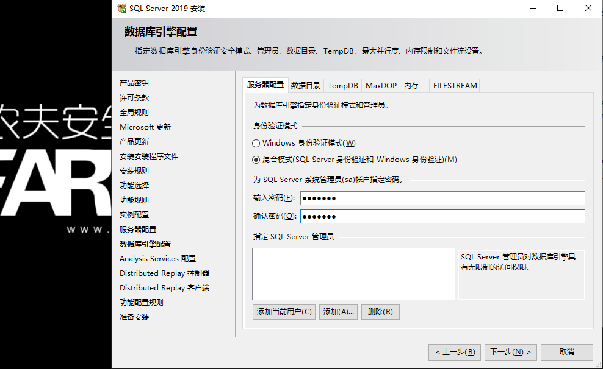
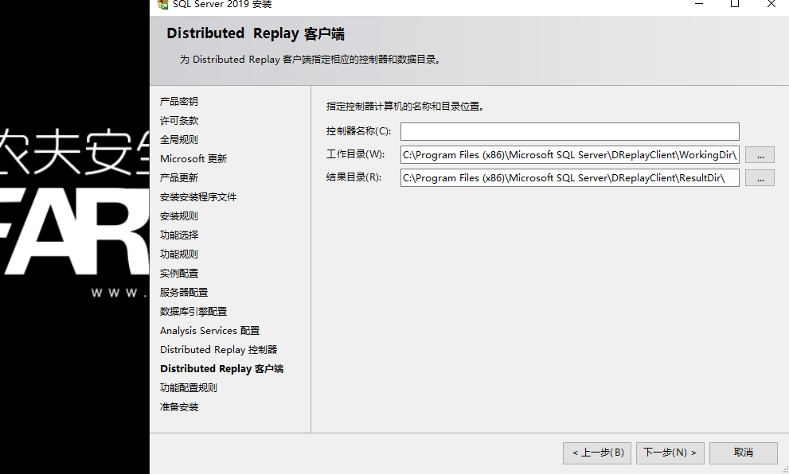

# Windows SQLserver 2019安装

**介绍**：	

​	SQL是英文Structured Query Language的缩写，意思为结构化查询语言。SQL语言的主要功能就是同各种数据库建立联系，进行沟通。按照ANSI(美国国家标准协会)的规定，SQL被作为关系型数据库管理系统的标准语言。SQL Server是由Microsoft开发和推广的关系数据库管理系统（RDBMS）。 

## 常见网站架构：

Linux		PHP			MYSQL
Windows	ASP.NET		SQLserver（域名以ASP结尾）

## 准备工作

**iis+.net:**
1.VirtualBox虚拟机，安装有sqlserver.
2.spacebuilder（近乎） v5.3的网站源码

**tomcat for windows:**
1.VirtualBox虚拟机，还原windows server 2019快照
2.Tomcat windows安装包
3.jdk安装包
4.war包源码

## **.Net Framework 3.5 sp1支持**

旧版的Microsoft SQL Server2014如果本机没有 .Net FrameWork 3.5 sp1，在安装过程中会有以下报错，实际测试Microsoft SQL Server2019已经不需要.net支持，直接安装即可

 

## SQLserver安装

1.挂载SQL Server 2019安装光盘并双击打开CD驱动器

 

2.在“SQL Server 安装中心”左侧选项中选择“安装”，然后在右侧详细窗格中选择“全新 SQL Server 独立安装或向现有安装添加功能”。

 

3.输入产品密钥（因为版权原因此处选择开发版）,下一步

 

4.接受许可条款

 

5.检查全局规则（规则全部通过的话会自动跳入下一步）

 

6.检查更新,需要耗费时间,在生产环境下需要开启,实验环境可以忽略,下一步

 

7.安装安装程序以及校验安装规则,没有错误的换会自动下一步到设置角色页面

 

8.选择要安装的功能,在不知道那个是必备时,可以点击全选,全部安装.根目录以及共享功能目录路径默认即可,生产环境下需要配合权限设置来修改路径；由于机器学习的模块需要网络下载，比较慢，这里选择一些标准模块来安装。

  

  

9.功能规则检查,全通过的话会自动跳过到实例配置

 

10. 配置实例名称与实例ID,每台 Windows Server 上最多只能安装一个默认实例,安装程序会根据实例ID创建对应的文件夹,可以保持默认直接下一

 

11.配置服务帐户与排序规则,手动代表得在服务中手动启动,自动为自动启动,禁用说明不允许启动,在生产环境下需结合实际情况配置,在此试验中保持默认即可,排序规则同理

 

 

12.配置数据库引擎

(1)首先把身份验证模式调整为混合模式,然后输入SQL Server的系统管理员sa的密码

 +

(2)指定SQL Server管理员处可以直接点击添加当前用户添加当前的windows用户或者点击添加,在弹出的选择框点击左下角高级,然后点击立即查找来选择计算机上的其他用户

 

 

(3)在数据目录选项卡下可以修改数据目录的保存路径,在生产环境下目录选择很重要,直接关系到备份的保存,需要根据实际情况修改;在此实验下保持默认即可,FILESTREAM一般不去调整,直接下一步即可

 

13.配置分析服务,点击添加当前用户即可,数据目录保持默认,点击下一步

 

14.配置分布式重播控制器,点击添加当前用户即可

 

15.配置分布式重播客户端,保持默认点击下一步

 

16.确认安装选项，然后单击“安装”。

 

## SQL Server Management Studio安装

(1)把SSMS-Setup-ENU.exe文件拷贝到虚拟机双击打开,选择安装位置默认即可，点击install开始安装

 

(2)单击restart重启服务器，安装完成

 

(3)点击开始Microsoft SQL Server Tools 18文件夹下的Microsoft SQL Server Management Studio 18图标打开数据库

 

(4)两种身份验证模式都可以登录,先使用windows身份验证,点击连接即可登录

 

(5)这里显示的是数据库内置的元数据库;没有元数据库的数据库如:access , sqlite大部分存在于中小政府部门或中小企业.

 

(6)点击左上角的新建查询（new query）就可以使用数据库命令进行增删改查了

 

基础查询语句
1.SELECT @@VERSION---查看数据库版本
2.SELECT @@language---查看当前所用语言的名称
3.select suser_name()---查看用户登录名 
4.select user_name()---用户在数据库中的名字
5.select user---用户在数据库中的名字
6.select db_name()---当前使用的数据库名
7.select IS_SRVROLEMEMBER('sysadmin')---判断用户是否为sa
8.Select IS_MEMBER('db_owner')---判断用户是否有dba权限

## Microsoft SQL Server 2019开启远程

1.点击开始 Microsoft SQL Server 2019文件夹下SQL Server 2019配置管理器

 

2.启用SQL Server网络配置的TCP/IP：选中左侧的「SQL Server网络配置」中「MSSQLSERVER的协议」，找到右侧的「TCP/IP」右键鼠标菜单“启用”或双击弹出属性窗口选择启用(安装完成后默认为未启用状态)

 

3.在TCP/IP处右键,点击属性,选择为IP地址选项卡,到最下边IPALL目录下,把TCP端口填写为1433(默认已填写)

 

4.登录数据库,在数据库处右键选择属性（properties）

 

5.点击左边的连接(connections),勾选允许远程连接到此服务器即可(默认也是开启的,其实在功能时候全选就默认设置了远程功能,这个只是在没有全选时候才需要开的)

 

6.使用dbeaver数据库连接工具连接

下载地址：https://download.dbeaver.com/community/22.0.2/dbeaver-ce-22.0.2-x86_64-setup.exe

 

左下角测试连接

 

连接成功后

