# 101-C9-windows基础命令

## 一 powershell

### 1 什么是 PowerShell？

PowerShell 由命令行 shell 和脚本语言两部分组成。 它最初是一种框架，用于在 Windows 中自动执行管理任务。 PowerShell 现已发展为一种跨平台工具，用于执行多种任务。

命令行 shell 缺少图形界面，让你无法使用鼠标与图形元素进行交互。 相反，你需要在计算机控制台中键入文本命令。 下面是使用控制台的一些优点：

- 与控制台交互通常比使用图形界面快。
- 在控制台中，可以运行成批命令，因此它非常适合用于持续集成管道的任务自动化。
- 你可使用控制台与云资源和其他资源交互。
- 可在文本文件中存储命令和脚本，并使用源代码管理系统。 这可能是最大的优点之一，因为你的命令可重复且可审核。 在许多系统（特别是政府系统）中，必须跟踪和评估或审核一切内容。 审核涵盖了从数据库更改到脚本所做的更改的所有内容。

功能

PowerShell 通过传统 shell 共享某些功能：

- 内置帮助系统：大多数 shell 都有一些帮助系统，你可以在其中了解有关命令的详细信息。 例如，你可以了解命令的作用以及它支持的参数。 PowerShell 中的帮助系统提供有关命令的信息，并与联机帮助文章集成。
- 管道：传统 shell 使用管道按顺序运行多个命令。 一个命令的输出是下一个命令的输入。 PowerShell 实现了传统 shell 传达的这种概念，但它又有所不同，因为它对文本上的对象进行操作。 本模块稍后会详细介绍此功能。
- 别名：别名是可用于运行命令的替代名称。 PowerShell 支持使用常见别名，如 `cls`（清除屏幕）和 `ls`（列出文件）。 因此，对于熟悉的命令，新用户可利用其对其他框架的知识，而不必记住 PowerShell 名称。

PowerShell 不同于传统的命令行 shell，具体体现在以下几方面：

- **它对文本上的对象进行操作。** 在命令行 shell 中，你必须运行输出和输入可能不同的脚本，因此你最终会对输出进行格式化并提取所需的数据。 而在 PowerShell 中，可以使用对象作为输入和输出。 这意味着格式设置和数据提取所需时间会更少。

- **它具有 cmdlet。** PowerShell 中的命令称为 cmdlet（念作  commandlet）。 与其他许多 shell 环境不同，在 PowerShell 中，cmdlet  是在常见运行时而不是单独的可执行文件上生成的。 此特性在参数分析和管道行为方面提供了一致的体验。

  Cmdlet 通常采用对象输入并返回对象。 PowerShell 中的核心 cmdlet 是在 .NET Core  中生成的，采用的是开放源代码形式。 你可以使用来自社区和其他来源的更多 cmdlet、脚本和函数来扩展 PowerShell，也可以在 .NET Core 或 PowerShell 中生成自己的 cmdlet。

- **它具有多种类型的命令。** PowerShell 中的命令可以是本机可执行文件、cmdlet、函数、脚本或别名。 运行的每个命令都属于这些类型之一。 由于 cmdlet 是一种命令，因此，命令和 cmdlet 通常可互换使用。


### 2 启动powershell终端

在开始菜单中，选择windows powershell即可。

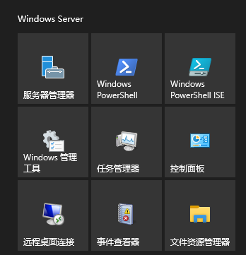

启动后的页面与cmd页面有相似之处。

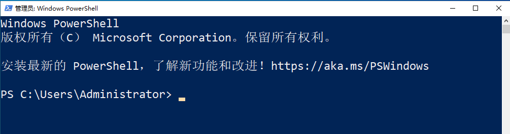


### 3 获取powershell的指令与帮助

获取指令

```
Get-Command
Get-Command -Name *EventLog
```

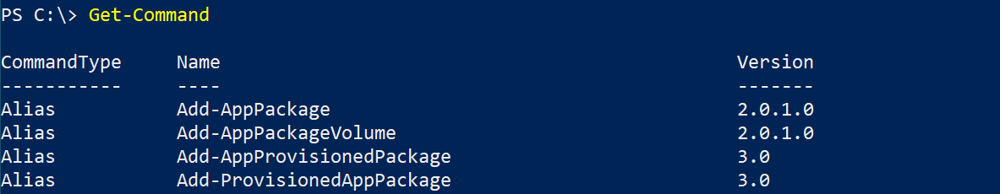

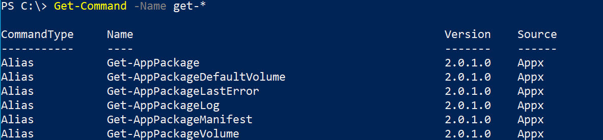

获取帮助

```
Get-Help Get-Process
Get-Help Get-Process -Full
```

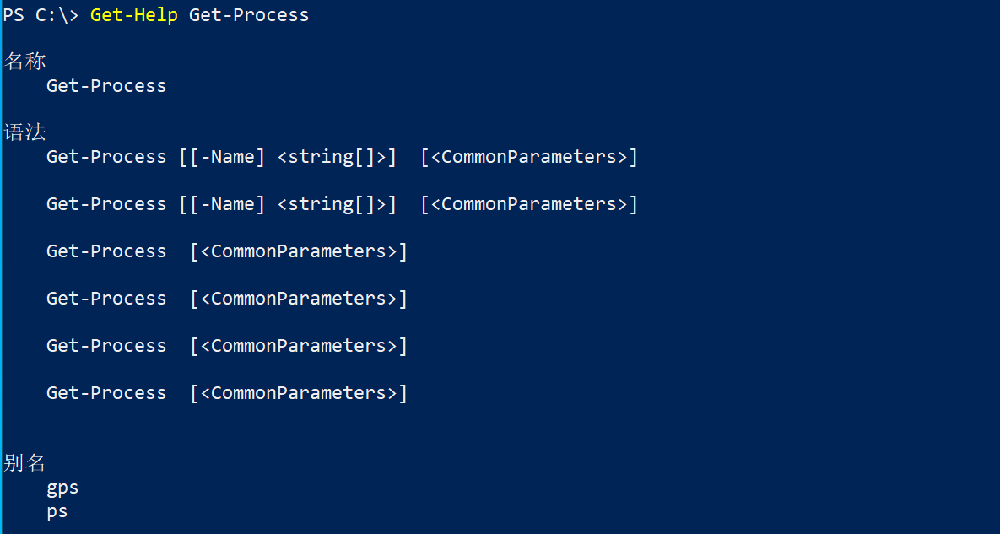

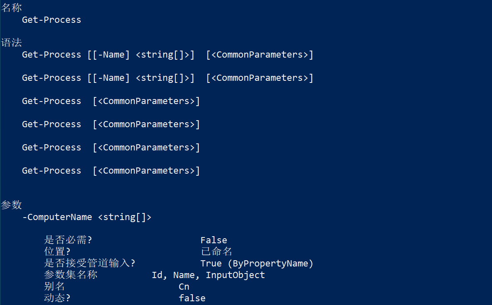


### 4 与Linux兼容的指令

```
ls 
mkdir
cd
echo
cat
ps 
netstat
arp
ipconfig 
```

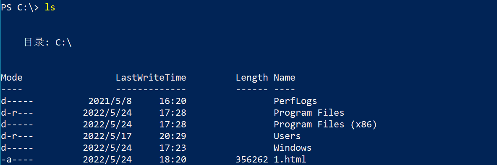

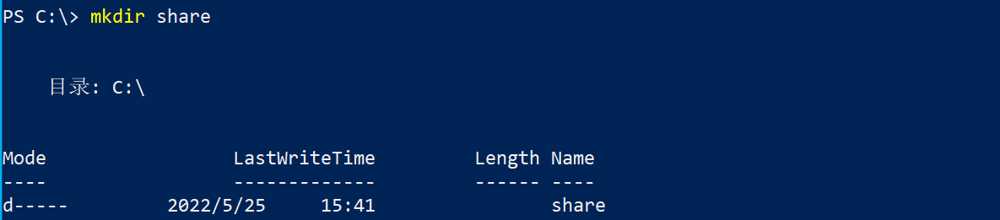


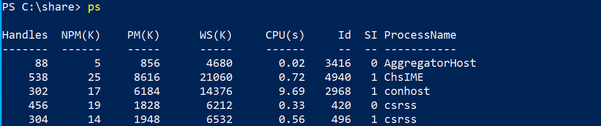

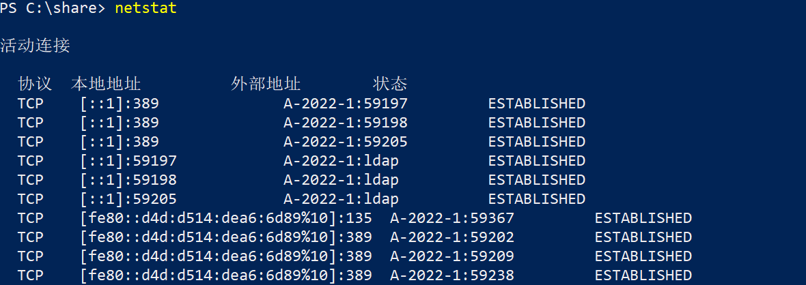

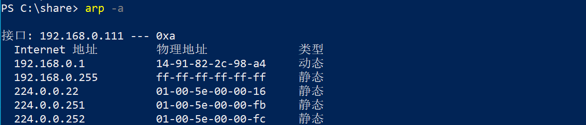

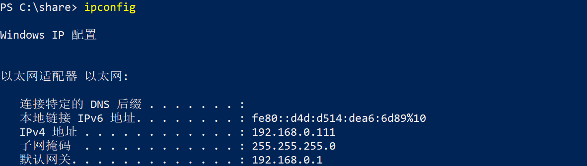


### 5 常用指令

```
Get-Process
Get-ComputerInfo
Get-HotFix
Get-ADComputer -Filter '*' -Properties ipv4address
Get-ADComputer -Filter '*' -Properties ipv4address |FT DNSHostName,IPv4Address,Name
Get-ADUser -Filter '*'
Get-ADUser -Filter '*'|FT Name,sid

```


```
Get-Process |Select-Object handles,ProcessName |Out-File c:\share\ps.txt
```


```
Invoke-WebRequest -Uri http://www.baidu.com -OutFile c:\1.html
```


### 6 远程访问

```
Enter-PSSession A-2022-2
Enter-PSSession A-2022-2 -Credential (Get-Credential)
```

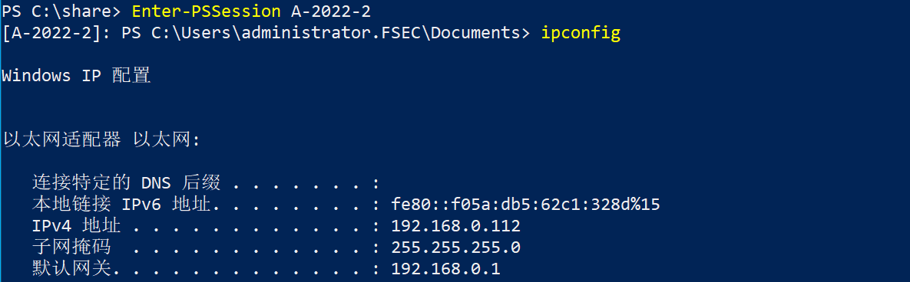

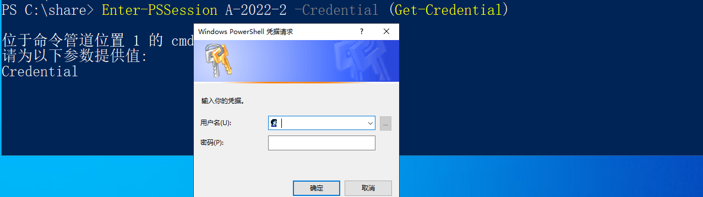


```
Invoke-Command -ComputerName A-2022-2 -ScriptBlock {Get-Process}
Invoke-Command -ComputerName A-2022-2,A-2022-1 -ScriptBlock {Get-Process}
```

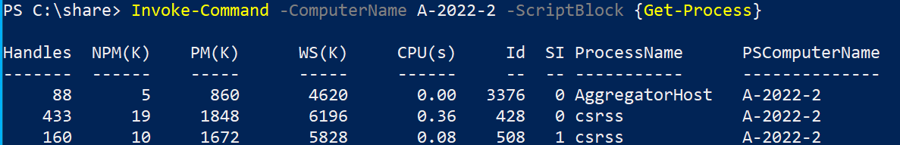


## 二 wmic

windows Management Instrumentation (WMI) 是在基于 Windows 的操作系统上管理数据和操作的基础结构。

可以编写 WMI 脚本或应用程序来自动执行远程计算机上的管理任务。

 

**How to Get Your System Serial Number**

```
wmic bios get serialnumber
```


**How to Check HotFixID of all the Installed Updates in Windows**

```
wmic qfe list
```

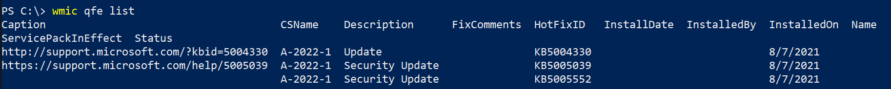


**How to Get the List of all Installed Applications in Windows**

```
wmic product get name
```


**How to Get the Total Number of CPU Cores in Windows**

```
wmic cpu get numberofcores
```

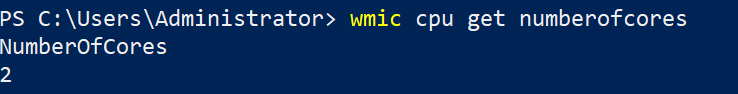

**How to Get the System Bios Version using wmic command**

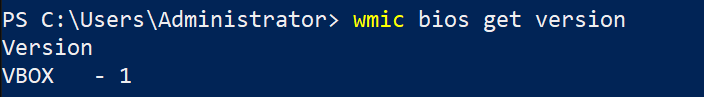


**How to Get All the Users logged in to a Remote System**

```
wmic /node:192.168.0.112 /user:administrator /password:123.bmk! computersystem get username
```

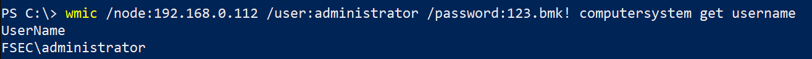

**How to Get the List of all running Processes using wmic command**

```
wmic process list
```

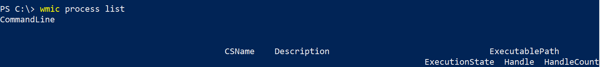

**How to Get the Executable of all the Process**

```
wmic process get ProcessID,ExecutablePath
```

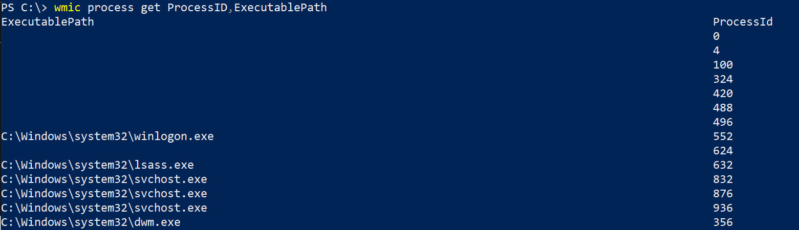

