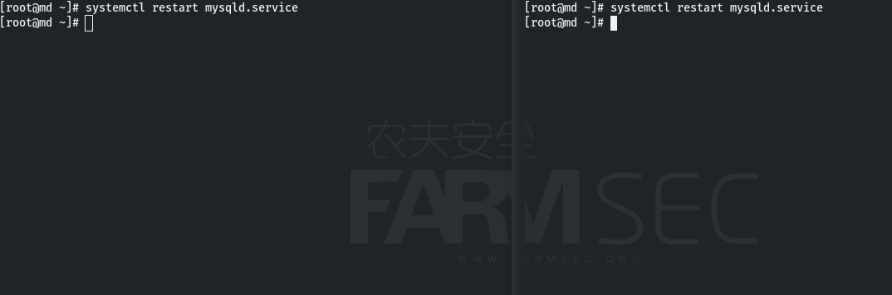
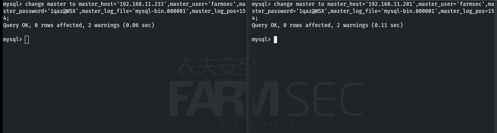

# 101-D1-mariadb

## 1.1 环境准备

+ centos7服务器两台
+ centos7服务器全部安装mariadb
+ VirtualBox虚拟机，安装window7一台
+ navicat软件包

## 1.2 数据库是什么？

​	数据库(Database)是按照数据结构来组织、存储和管理数据的仓库，它产生于距今六十多年前，随着信息技术和市场的发展，特别是二十世纪九十年代以后，数据管理不再仅仅是存储和管理数据，而转变成用户所需要的各种数据管理的方式。数据库有很多种类型，从最简单的存储有各种数据的表格到能够进行海量数据存储的大型数据库系统都在各个方面得到了广泛的应用。

## 1.3 数据库类型

### 1.3.1 关系系数据库

+ Oracle
+ MySql
+ Microsoft SQL Server
+ SQLite
+ PostgreSQL
+ IBM DB2
+ ...

### 1.3.2 非关系型数据库

+ MongoDB
+ Cassandra
+ Redis
+ HBase
+ neo4j
+ ...

### 1.3.3 区别

​	关系型数据库最典型的数据结构是表，由二维表及其之间的联系所组成的一个数据组织。

​	非关系型数据库严格上不是一种数据库，应该是一种数据结构化存储方法的集合，可以是文档或者键值对等。

## 1.4 mariadb简介

​	MariaDB数据库管理系统是MySQL的一个分支，主要由开源社区在维护，采用GPL授权许可 MariaDB的目的是完全兼容MySQL，包括API和命令行，使之能轻松成为MySQL的代替品。在存储引擎方面，使用XtraDB（英语：XtraDB）来代替MySQL的InnoDB。 MariaDB由MySQL的创始人Michael Widenius（英语：Michael Widenius）主导开发，他早前曾以10亿美元的价格，将自己创建的公司MySQL AB卖给了SUN，此后，随着SUN被甲骨文收购，MySQL的所有权也落入Oracle的手中。MariaDB名称来自Michael Widenius的女儿Maria的名字。

## 1.5 安装数据库

```
wget https://dev.mysql.com/get/mysql57-community-release-el7-10.noarch.rpm
```


```
yum -y install mysql57-community-release-el7-10.noarch.rpm
```


```
yum -y install mysql-community-server
```


```
如果报下图的错，使用这个命令安装
yum -y install mysql-community-server --nogpgcheck
```


## 1.7 启动数据库

启动数据库

```
systemctl start mysqld.service
```

查看服务运行状态

```
systemctl status mysqld.service
```


## 1.8 连接数据库

### 1.8.1 查看密码

```
grep "password" /var/log/mysqld.log
```


### 1.8.2 命令行连接

```
mysql -u root -p
```


### 1.8.3 修改密码

```
ALTER USER 'root'@'localhost' IDENTIFIED BY '1qaz@WSX';
```


密码要符合复杂度要求

```
查看默认密码复杂度
SHOW VARIABLES LIKE 'validate_password%';

如需修改密码复杂度参考如下命令：
set global validate_password_policy=LOW;
set global validate_password_length=7;
```

### 1.8.4 创建并使用数据库

```
创建数据库：
create database farmsec;

查看数据库：
show databases;

使用数据库：
use farmsec;

创建表：
create table user(id int,name varchar(20),password varchar(15));

表中插入数据：
insert into user(id,name,password) value(1,"admin","123456");

最简单的查询：
select * from user;
```


### 1.8.5 客户端连接

```
使用mysql系统数据库:
use mysql;   

配置其他主机访问数据库:
GRANT ALL PRIVILEGES ON *.* TO 'root'@'%'IDENTIFIED BY '1qaz@WSX' WITH GRANT OPTION;     

从mysql数据库中的授权表重新载入权限
flush privileges;  
```


### 1.8.6 使用navicat连接数据库

下载[navicat](https://navicat.com.cn/)安装包，将安装包放到虚拟机内安装即可。

点击连接,选择mariadb,填写ip,用户和密码点击确认


右键新建数据库,填写库名为test,字符集为utf8,排序规则为utf8_general_ci


在数据库的表处右键点击导入向导,可以导入所需的表


选择文件格式,这里我们选择文本文件,然后点击下一步


点击”添加文件“按钮,然后选定user文件,点击确认,下一步


选择分割符


选择附加选项


修改导入后的表名


修改表结构


选择导入模式


点击开始即可导入


导入完成


### 1.8.7 语法

```
增加数据：
insert into user(id,name,sex,age) value(11,"qaq","boy","23");

查看数据：
select * from user where id=11;

修改数据：
update user set name="QAQ" where id=11;

删除数据：
delete from user where id=11;
```


查看数据：

```
查找表中所有内容：
select * from user;

查找表中单列内容：
select name from user;

查找表中多列内容：
select name,age from user;
```


```
只返回固定数量的行数：
select name,age from user limit 3;

排序： 
select name,age from user order by age;

倒序： 
select name,age from user order by age DESC;
```


```
统计数量：
select sex,count(*) from user group by sex;

统计数量并排序：
select sex,count(*) from user group by sex order by count(*) desc;
```


where子句:

使用WHERE子句，我们可以指定一个选择标准，从表中选择所需的记录。

```
单个条件：
select * from user where id=3;

多个条件：
select * from user where age=18 and sex='boy';
select * from user where age=18 or sex='boy';
select * from user where age in (18,27);
select * from user where name like '%y';
```


运算符：

```
select * from user where age>20;
```

| =    | 检查两个操作数的值是否相等，如果是，则条件变为真。           | (A = B) 不为 true.  |
| ---- | ------------------------------------------------------------ | ------------------- |
| !=   | 检查两个操作数的值是否相等，如果值不相等，则条件变为真。     | (A != B) 为 true.   |
| >    | 检查左操作数的值是否大于右操作数的值，如果是，则条件为真。   | (A > B) 不为 true.  |
| <    | 检查左操作数的值是否小于右操作数的值，如果是，则条件为真。   | (A < B) 为 true.    |
| >=   | 检查左操作数的值是否大于或等于右操作数的值，如果是，则条件为真。 | (A >= B) 不为 true. |
| <=   | 检查左操作数的值是否小于或等于右操作数的值，如果是，则条件变为真。 | (A <= B) 为 true.   |


子查询：

在select 中子查询总是从内向外处理。先处理括号内部的在处理括号外部的

```
select name,age from user where name in(select name from buy);
```


多表查询:

```
select user.id,user.name,buy.shop from user,buy where user.name=buy.name;
```


```
JOIN: 如果表中有至少一个匹配，则返回行
select user.age,buy.shop from user inner join buy on user.name=buy.name;

LEFT JOIN: 即使右表中没有匹配，也从左表返回所有的行
select user.age,buy.shop from user left join buy on user.name=buy.name;

RIGHT JOIN: 即使左表中没有匹配，也从右表返回所有的行
select user.age,buy.shop from user right join buy on user.name=buy.name;
```


联合查询：

Union语句必须有两条或者以上的select语句,语句之间用union隔开。
每个查询必须包含相同的列、表达式或者聚合函数。
不过次序可以不统一。列数据的类型必须兼容类型不必完全相同。

```
select name from user union select name from buy;

union all 不去重
select name from user union all select name from buy;
```


## 1.9 函数

```
返回当前用户:
select user();

返回数据库的版本号:
select version();

返回当前数据库名:
select database();

休眠参数给定的秒数：
select sleep(5);   
```


```
获取从字符串s中的第n个位置开始长度为len的字符串:
substring(s,n,len)
select substring(user(),2,3);

length()/char_length():   

char_length(str)
计算单位：字符
不管汉字还是数字或者是字母都算是一个字符

length(str)
计算单位：字节
utf8编码：一个汉字三个字节，一个数字或字母一个字节。
gbk编码：一个汉字两个字节，一个数字或字母一个字节。
```


## 1.10 忘记密码

在mariadb的使用中忘记密码后先停止mariadb的服务


修改配置文件/etc/my.cnf在[mysqld]下添加 skip-grant-tables后保存


启动mariadb服务,使用空密码方式使用root用户登录mariadb


修改root用户的密码

```
use mysql;
update mysql.user set authentication_string=PASSWORD('1qaz@WSX') where User='root';
```

刷新权限表   

```
flush privileges;
```


退出数据库并删除配置文件中的skip-grant-tables


重启mariadb,使用新设置的密码登录


## 1.11 主主热备

​	Mysql数据库没有增量备份的机制，当数据量太大的时候备份是一个很大的问题。还好mysql数据库提供了主从备份的机制，其实就是把主数据库的所有的数据同时写到备份的数据库中。实现mysql数据库的热备份。
主从复制：

​	主库授权从库远程连接，读取binlog日志并更新到本地数据库的过程；主库写数据后，从库会自动同步过来（从库跟着主库变）；
主主复制：

​	主从相互授权连接，读取对方binlog日志并更新到本地数据库的过程；只要对方数据改变，自己就跟着改变； 
​	要想实现双机的热备，首先要了解主从数据库服务器的版本的需求。要实现热备mysql的版本都高于3.2。还有一个基本的原则就是作为从数据库的数据版本可以高于主服务器数据库的版本，但是不可以低于主服务器的数据库版本。
​	当然要实现mysql双机热备，除了mysql本身自带的REPLICATION功能可以实现外，也可以用Heartbeat这个开源软件来实现。

---

同时在两个服务器建立连接帐户,该帐户必须授予REPLIATION SLAVE权限

```
grant replication slave on *.* to 'farmsec'@'192.168.11.233' identified by '1qaz@WSX';
grant replication slave on *.* to 'farmsec'@'192.168.11.201' identified by '1qaz@WSX';
```

记得要刷新权限表

```
flush privileges;
```


修改配置文件my.cnf,主1(192.168.11.201)

```
server-id=1
log-bin=mysql-bin
binlog-do-db=test
binlog-ignore-db=mysql
log-slave-updates
sync_binlog=1
auto_increment_offset=1
auto_increment_increment=2
replicate-do-db=test
replicate-ignore-db=mysql,information_schema
```

修改配置文件my.cnf,主2(192.168.11.233)

```
server-id=2
log-bin=mysql-bin
binlog-do-db=test
binlog-ignore-db=mysql
log-slave-updates
sync_binlog=1
auto_increment_offset=2
auto_increment_increment=2
replicate-do-db=test
replicate-ignore-db=mysql,information_schema,performance_schema
```


分别重启mariadb服务

```
systemctl restart mysqld.service
```



分别检查查主1和主2作为主服务器的状态

```
show master status\G;
```


在主1上用change master to 指定同步位置

```
change master to master_host='192.168.11.233',master_user='farmsec',master_password='1qaz@WSX',master_log_file='mysql-bin.000001',master_log_pos=154;
```

在主2上用change master to 指定同步位置

```
change master to master_host='192.168.11.201',master_user='farmsec',master_password='1qaz@WSX',master_log_file='mysql-bin.000001',master_log_pos=154;
```



分别在主1和主2上重启从服务线程

```
start slave;
```

分别在主1和主2上查看从服务器状态Slave_IO_Running与Slave_SQL_Running两项值均为Yes，即表示设置主主服务器成功。

```
show slave status\G 
```


在主1的test数据库创建一个表aaa

```
use test;
create table aaa(name int);
```


在主2的test数据库中查看表名,存在aaa表就证明实验成功


## reference

<https://blog.csdn.net/weixin_44106306/article/details/122922936>

