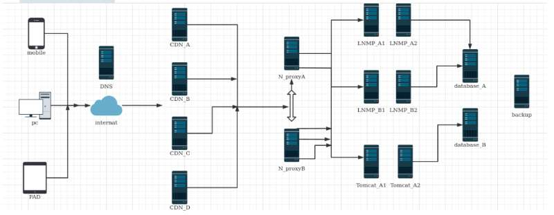

# 101-D10-构建整体企业架构

# 基础篇整合实验

## 一 前言

到这里，基础篇的课程实际已经结束了。

在Linux的内容结束以后，我们完成了一个小型的整合实验。

在windows的内容技术以后，我们同样完成了一个小型的整合实验(这块的内容并无变化，后文就不在讨论)。

很明显，前面都已经忘光了对不对？

所以最后的这个章节的目标在于，可以让我们复习的基础上，对于IT体系的理解可以得到加强。


## 二 新的目标

虽然在那个小的整合实验中，完成了很多功能上的设计。但实际上依旧缺少很多。

如果我们的服务器增至数百乃至更多，整个系统的上线、更新的工作将会是一场灾难。

如果我们可以让整个IT系统的效率哪怕增加5%，那么对于经济账都会是一笔极大的节约。

这就构成了这次整合实验的目标：规划的IT的体系，拥有极佳的快速反应能力。

这就需要引入DevOps的理念(对应课程中的gitlab与Jenkins章节)

```
DevOps（Development和Operations的组合词）是一组过程、方法与系统的统称，用于促进开发（应用程序/软件工程）、技术运营和质量保障（QA）部门之间的沟通、协作与整合。
它是一种重视“软件开发人员（Dev）”和“IT运维技术人员（Ops）”之间沟通合作的文化、运动或惯例。透过自动化“软件交付”和“架构变更”的流程，来使得构建、测试、发布软件能够更加地快捷、频繁和可靠。
它的出现是由于软件行业日益清晰地认识到：为了按时交付软件产品和服务，开发和运维工作必须紧密合作。
```

## 三 设计与实施

在之前的任务目标不变的情况下，如何通过devops的思路，将IT系统快速推送上线就是唯一需要思考的地方。



不妨将整个IT的系统的问题进行分解，按照不同层次进行划分，这样即可得到我们所需要的内容。

```
1.整个IT系统的底层环境的选择？虚拟机还是私有云亦或者docker？
2.虚拟体系的系统，能否省心省力的建立，而非一台一台的手工安装？
3.不同主机上面所需要的应用是哪些？能否自动化？
4.不同主机上面所需要的代码是哪些？能否自动化？
5.如果需要增加主机的情况下，哪些方式可以快速进行响应？
6.如果需要更新代码的情况下，哪些方式可以快速进行响应？
...
```

## 四 实施步骤

任何人的指导，不如自己真的去思考、完善、动手。

依靠自己的能力搞定它，你会发现这件事情会很酷。

而在防御篇结束以后， DevSecOps的思维会让你觉得更好玩。

我们期待的是：你拥有的是站在更大舞台的能力。

