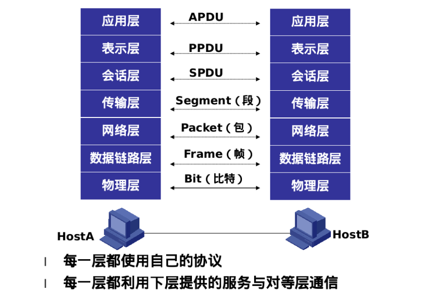

# 计算机网络(上)

## 计算机网络的基本概念

计算机网络是指将地理位置不同的具有独立功能的多台计算机及其外部设备，通过通信线路连接起来，在网络操作系统，网络管理软件及网络通信协议的管理和协调下，实现资源共享和信息传递的计算机系统

衡量计算机网络的主要指标:

```
 带宽　　描述在一定时间范围内能够从一个节点传送到另一个节点的数据量,通常以bps为单位,例如家用网络带宽为500Mbps
 延迟　　描述网络上数据从一个节点传送到另一个节点所经历的时间
```

网络模型一般是指OSI七层参考模型和TCP/IP四层参考模型。这两个模型在网络中应用最为广泛。


## OSI七层模型

开放系统互连参考模型 (Open System Interconnect 简称OSI）是国际标准化组织(ISO)和国际电报电话咨询委员会(CCITT)联合制定的开放系统互连参考模型，为开放式互连信息系统提供了一种功能结构的框架。

它从低到高分别是：物理层、数据链路层、网络层、传输层、会话层、表示层和应用层。



网络数据包的封装与解封装类似于快递物品，每一层接收到数据后会进行特定类型的打包。


<各层的解读均来自于互联网的复制与粘贴>

**物理层**: 建立和维护用于传输和接受二进制信息的物理链路

物理层是OSI分层结构体系中最重要、最基础的一层，它建立在传输媒介基础上，起建立、维护和取消物理连接作用，实现设备之间的物理接口。
• 物理层之接收和发送一串比特(bit)流，不考虑信息的意义和信息结构。 
• 物理层包括对连接到网络上的设备描述其各种机械的、电气的、功能的规定。

物理层要形成适合数据传输需要的实体，为数据传送服务： 
一、保证数据按位传输的正确性；
二、向数据链路层提供一个透明的位传输；
三、提供足够的带宽(带宽是指每秒钟内能通过的比特(BIT)数)，以减少信道上的拥塞。
传输数据的方式能满足点到点，一点到多点，串行或并行，半双工或全双工，同步或异步传输的需要。 
完成物理层的一些管理工作，如在数据终端设备、数据通信和交换设备等设备之间完成对数据链路的建立、保持和拆除操作。 
 物理层的典型设备：光纤、同轴电缆、双绞线、中继器和集线器


**数据链路层**：为物理链路提供可靠的数据传输，包括错误的检测和修正

链路层的主要功能： 链路层的功能是实现系统实体间二进制信息块的正确传输 。
为网络层提供可靠无错误的数据信息 在数据链路中解决信息模式、操作模式、差错控制、流量控制、信息交换过程和通信控制规程的问题链路层是为网络层提供数据传送服务的，这种服务要依靠本层具备的功能来实现。
链路层应具备如下功能： 链路连接的建立，拆除，分离。 帧定界和帧同步。
链路层的数据传输单元是帧，协议不同，帧的长短和界面也有差别，但无论如何必须对帧进行定界。
数据链路层的典型设备：二层交换机、网桥、网卡


**网络层:** 提供网络中的数据包寻址和传输服务

网络层的主要功能：介于运输层和数据链路层之间。它在数据链路层提供的两个相邻端点之间的数据帧的传送功能上，进一步管理网络中的数据通信、将数据设法从源端经过若干个中间节点传送到目的端，从而向运输层提供最基本的端到端的数据传送服务。目的是实现两个端系统之间的数据透明传送，具体功能包括寻址和路由选择、连接的建立、保持和终止等。网络层的主要功能包括：建立和拆除网络连接、路径选择和中继、网络连接多路复用、分段和组块、服务选择和传输和流量控制。
数据链路层的典型设备：路由器


**传输层**: 为端点之间提供透明的、可靠的数据传输、端到端错误修复、流量控制

传输层提供了主机应用程序进程之间的端到端的服务，基本功能如下：
(1) 分割与重组数据
(2) 按端口号寻址
(3) 连接管理
(4) 差错控制和流量控制,纠错的功能
传输层要向会话层提供通信服务的可靠性，避免报文的出错、丢失、延迟时间紊乱、重复、乱序等差错。


**会话层**:控制计算机之间的会话

会话层（SESSION LAYER）允许不同机器上的用户之间建立会话关系。会话层循序进行类似的传输层的普通数据的传送，在某些场合还提供了一些有用的增强型服务。允许用户利用一次会话在远端的分时系统上登陆，或者在两台机器间传递文件。 会话层提供的服务之一是管理对话控制。会话层允许信息同时双向传输，或任一时刻只能单向传输。如果属于后者，类似于物理信道上的半双工模式，会话层将记录此时该轮到哪一方。一种与对话控制有关的服务是令牌管理（token management）。有些协议会保证双方不能同时进行同样的操作，这一点很重要。为了管理这些活动，会话层提供了令牌，令牌可以在会话双方之间移动，只有持有令牌的一方可以执行某种关键性操作。另一种会话层服务是同步。如果在平均每小时出现一次大故障的网络上，两台机器简要进行一次两小时的文件传输，试想会出现什么样的情况呢？每一次传输中途失败后，都不得不重新传送这个文件。当网络再次出现大故障时，可能又会半途而废。为解决这个问题，会话层提供了一种方法，即在数据中插入同步点。每次网络出现故障后，仅仅重传最后一个同步点以后的数据（这个其实就是断点下载的原理）


**表示层**:提供数据转换服务，如加密、压缩、格式化

表示层为在应用过程之间传送的信息提供表示方法的服务，它只关心信息发出的语法和语义。

表示层为应用层提供的服务有三项内容

语法转换：语法转换涉及代码转换和字符集的转换，数据格式的修改、数据结构操作的适配、数据压缩、数据加密等。

语法选择：语法选择是提供初始选择的一种语法和随后修改这种选择的手段。

联接管理：利用会话层提供的服务建立表示联接，管理在这一联接之上的数据运输和同步控制，以及正常或非正常地终止联接。


**应用层**:协助应用程序与网络通讯

应用层直接和应用程序接口并提供常见的网络应用服务。应用层也向表示层发出请求。应用层是开放系统的最高层,是直接为应用进程提供服务的。其作用是在实现多个系统应用进程相互通信的同时,完成一系列业务处理所需的服务.其服务元素分为两类:公共应用服务元素CASE和特定应用服务元素SASE.
CASE提供最基本的服务,它成为应用层中任何用户和任何服务元素的用户，主要为应用进程通信,分布系统实现提供基本的控制机制；特定服务SASE则要满足一些特定服务,如文卷传送,访问管理,作业传送,银行事务,订单输入等。这些将涉及到虚拟终端,作业传送与操作,文卷传送及访问管理,远程数据库访问,图形核心系统,开放系统互连管理等等。


## TCP/IP模型

TCP/IP模型与OSI参考模型有些类似，将OSI中的会话层、表示层去掉，并将数据链路层和物理层合并成网络接口层，TCP/IP支持所有标准的数据链路层和物理层协议。


TCP/IP模型中每一层的功能如下图：


## 协议与模型的对应关系

OSI七层模型与TCP/IP模型，所对应的功能与之哪些协议工作的大致清单可参考下图：


**ARP （地址解析协议）**
地址解析协议，即ARP（Address Resolution Protocol），是根据IP地址获取物理地址的一个TCP/IP协议。主机发送信息时将包含目标IP地址的ARP请求广播到网络上的所有主机，并接收返回消息，以此确定目标的物理地址；收到返回消息后将该IP地址和物理地址存入本机ARP缓存中并保留一定时间，下次请求时直接查询ARP缓存以节约资源。

地址解析协议是建立在网络中各个主机互相信任的基础上的，网络上的主机可以自主发送ARP应答消息，其他主机收到应答报文时不会检测该报文的真实性就会将其记入本机ARP缓存；由此攻击者就可以向某一主机发送伪ARP应答报文，使其发送的信息无法到达预期的主机或到达错误的主机，这就构成了一个ARP欺骗。

ARP命令可用于查询本机ARP缓存中IP地址和MAC地址的对应关系、添加或删除静态对应关系等。

相关协议有RARP、代理ARP。NDP用于在IPv6中代替地址解析协议。

工作过程
主机A的IP地址为192.168.1.1，MAC地址为0A-11-22-33-44-01；
主机B的IP地址为192.168.1.2，MAC地址为0A-11-22-33-44-02；
当主机A要与主机B通信时，地址解析协议可以将主机B的IP地址（192.168.1.2）解析成主机B的MAC地址，以下为工作流程：
第1步：根据主机A上的路由表内容，IP确定用于访问主机B的转发IP地址是192.168.1.2。然后A主机在自己的本地ARP缓存中检查主机B的匹配MAC地址。
第2步：如果主机A在ARP缓存中没有找到映射，它将询问192.168.1.2的硬件地址，从而将ARP请求帧广播到本地网络上的所有主机。源主机A的IP地址和MAC地址都包括在ARP请求中。本地网络上的每台主机都接收到ARP请求并且检查是否与自己的IP地址匹配。如果主机发现请求的IP地址与自己的IP地址不匹配，它将丢弃ARP请求。
第3步：主机B确定ARP请求中的IP地址与自己的IP地址匹配，则将主机A的IP地址和MAC地址映射添加到本地ARP缓存中。
第4步：主机B将包含其MAC地址的ARP回复消息直接发送回主机A。
第5步：当主机A收到从主机B发来的ARP回复消息时，会用主机B的IP和MAC地址映射更新ARP缓存。本机缓存是有生存期的，生存期结束后，将再次重复上面的过程。主机B的MAC地址一旦确定，主机A就能向主机B发送IP通信了。


ARP缓存中包含一个或多个表，它们用于存储IP地址及其经过解析的MAC地址。
ARP命令用于查询本机ARP缓存中IP地址-->MAC地址的对应关系、添加或删除静态对应关系等。
如果在没有参数的情况下使用，ARP命令将显示帮助信息。
ARP命令常见用法

```
arp -a或arp –g
用于查看缓存中的所有项目。
arp -a Ip
如果有多个网卡，那么使用arp -a加上接口的IP地址，就可以只显示与该接口相关的ARP缓存项目。
arp -s Ip 物理地址
可以向ARP缓存中人工输入一个静态项目。
arp -d Ip
使用该命令能够人工删除一个静态项目。
```


**NAT(网络地址转换)**

NAT英文全称是“Network Address Translation”，中文意思是“网络地址转换”，允许一个整体机构以一个公用IP（Internet Protocol）地址出现在Internet上。顾名思义，它是一种把内部私有网络地址（IP地址）翻译成合法网络IP地址的技术。

NAT功能通常被集成到路由器、防火墙、ISDN路由器或者单独的NAT设备中，NAT技术类型 NAT有三种类型：

```
1.静态NAT(Static NAT)
2.动态地址NAT(Pooled NAT)
3.网络地址端口转换NAPT（Port－Level NAT）
```

 

**ICMP协议（Internet控制消息协议）**

它是TCP/IP协议族的一个子协议，用于在IP主机、路由器之间传递控制消息。控制消息是指网络通不通、主机是否可达、路由是否可用等网络本身的消息。这些控制消息虽然并不传输用户数据，但是对于用户数据的传递起着重要的作用。

我们经常使用的Ping及traceroute基于ICMP协议。

```
ping -c4 www.fsec.io
```


```
traceroute www.fsec.io
```


**tcp与udp协议**

**TCP**是面向连接的可靠的传输层协议，它支持在不可靠网络上实现面向连接的可靠的数据传输
TCP的特点：       三次握手        建立可靠的连接
                              确认机制        应答接受
                              端口号           多路复用
                              完整性校验    差错检测
                              序列号           丢失检测、乱序重拍
                              窗口机制       流量控制


**UDP**是一种无连接的传输层协议，它主要用于不要求分组顺序到达的传输中，分组传输顺序的检查与排序由应用层完成 ，提供面向事务的简单不可靠信息传送服务。
UDP特点：
UDP是无连接的  传输数据前并不与对方建立连接
UDP不对收到的数据进行排序 
UDP对接收到的数据报不发送确认，发送端也不会重发数据
UDP传输数据较TCP快速，开销也少
UDP缺乏拥塞控制机制


**tcp协议的三次握手与四次挥手**


## 端口与服务

端口按端口号分3大类
1:公认端口(Well Konwn Port)：

从0到1023，它们紧密绑定（binding）于一些服务。通常这些端口的通讯明确表明了某种服务的协议。
2:注册端口( Registered Ports)
从1024到49151。它们松散地绑定于一些服务。也就是说有许多服务绑定于这些端口，这些端口同样用于许多其它目的.
3:动态或私有端口( Dynamic and/or Private Ports)
动态端口，即私人端口号（private port numbers），是可用于任意软件与任何其他的软件通信的端口数，使用因特网的传输控制协议，或用户传输协议。动态端口一般从49152到65535 

常见的服务与端口对应关系：

| 服务名      | 端口号    |
| :---------- | --------- |
| ftp-data    | 20/tcp    |
| ftp         | 21/tcp    |
| ssh         | 22/tcp    |
| telnet      | 23/tcp    |
| smtp        | 25/tcp    |
| whois       | 43/tcp    |
| domain      | 53/tcp    |
| domain      | 53/udp    |
| http        | 80/tcp    |
| ntp         | 123/udp   |
| imap2       | 143/tcp   |
| snmp        | 161/tcp   |
| snmp        | 161/udp   |
| snmp-trap   | 162/tcp   |
| snmp-trap   | 162/udp   |
| https       | 443/tcp   |
| syslog      | 514/udp   |
| rsync       | 873/tcp   |
| imaps       | 993/tcp   |
| pop3s       | 995/tcp   |
| ms-sql-s    | 1433/tcp  |
| ms-sql-m    | 1434/udp  |
| nfs         | 2049/tcp  |
| nfs         | 2049/udp  |
| mysql       | 3306/tcp  |
| windows-RDP | 3389/tcp  |
| svn         | 3690/tcp  |
| postgresql  | 5432/tcp  |
| redis       | 6379/tcp  |
| oracle      | 1521/tcp  |
| MongoDB     | 27017/tcp |
| weblogic    | 7001/tcp  |
| tomcat      | 8080/tcp  |
| jboss       | 8080/tcp  |

更多的清单，在/etc/services中存在系统默认的定义。


