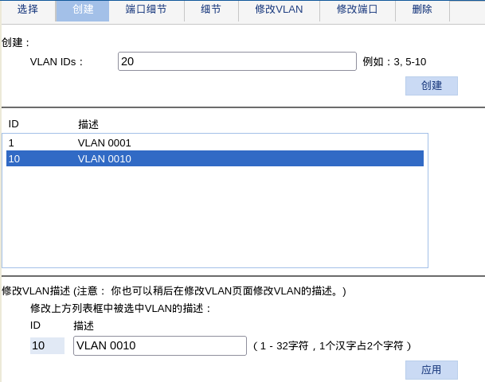
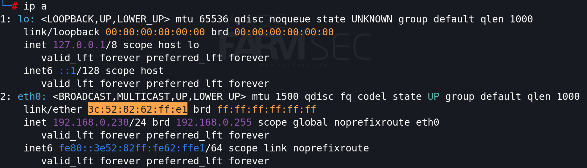

# 计算机网络下

## IP地址与子网划分

IP  是网络层协议，也是当今应用最广泛的网络协议之一


IP的主要作用 

```
 标识节点和链路        用唯一的IP地址标识每一个节点
                     用唯一的IP网络标识每一个链路

 寻址和转发           确定节点所在网络的位置，进而确定节点所在的位置
                    IP路由器选择适当的路径将IP包转发到目的的节点

 适应各种数据链路    根据链路的MTU对IP包进行分片和重组
                  为了通过实际的数据链路传递信息，须建立IP地址到数据链路层地址的映射
```

IP地址格式和表示方式


私有 IP 地址 (private IP address):为了节约 IP 地址空间 , 并增加了安全性,保 留了一些 IP 地址段作为私网 IP ,不会在公网上出现。处于私有 IP 地址的网络称为 内网或私网 , 与外部进行通信就必须通过网络地址翻译 (NAT)。
私有地址的范围 :

```
1.A 类地址中 :10.0.0.0到 10.255.255.255.255
2.B 类地址中 :172.16.0.0到 172.31.255.255
3.C 类地址中 :192.168.0.0到 192.168.255.255
```

169.254.0.0 为内网无法获得ip自动分配


子网划分：命令ipcalc

```
apt-get install ipcalc
ipcalc 192.168.0.0/26
```


关于具体的原理，请查阅视频，文档写起来太艰难了:)


## 交换机 

交换机作用         

```
		        连接多个以太网物理段，隔离冲突域
                对以太网帧进行高速而透明的交换转发 
                自行学习和维护Mac地址信息
```

交换机特点                      

```
                主要工作在OSI模型的物理层、数据链路层
                提供以太网间的透明桥接和交换
                依据链路层的Mac地址，将以太网数据帧在端口进行转发
```

交换机背板带宽

```
背板带宽  考察交换机上所有端口能提供的总带宽。
计算公式为端口数*相应端口速率*2（全双工模式）    			       
如果总带宽≤标称背板带宽，那么背板带宽就是线速带宽
```

教程以H3C S1848G作为演示案例

交换机可通过多种方式进行配置调试，如console、http、telnet等.

使用http的方法进行管理时，设备的默认IP为192.168.0.233.默认账号密码均为admin


成功登录后的页面如下：


**端口镜像：**  设备-->端口镜像


**VLAN**：网络-->VLAN





**MAC地址**：网络-->MAC地址

MAC地址表：





MAC泛洪攻击：攻击者伪造大量的MAC把交换机地址表填满，会进入“通转发”模式，接到数据包，转发到全部的接口

```
macof
```


## 路由协议

1、RIP（Routing Information Protocol）：路由信息协议。
是一种比较简单的内部网关协议，主要用于规模较小的网络，比如校园网以及结构较简单的地区性网络。对于更为复杂的环境和大型网络，一般不使用RIP。
RIP是一种基于距离矢量（Distance-Vector）算法的协议，它通过UDP报文进行路由信息的交换，使用的端口号为520。其使用跳数来衡量到达目的地址的距离，为了限制收敛时间，RIP规定度量值（该值等于从本网络到达目的网络间的路由器数量）为0到15之间的整数，大于等于16的跳数将会定义为网络或主机不可达，因此RIP不适合大型网络。
RIP有两个版本：RIP V1（有类别路由协议）和RIP V2（无分类路由协议）。

2、OSPF（Open Shortest Path First）：开放式最短路径优先协议。
属于链路状态路由协议，OSPF提出了“区域（area）”的概念，每个区域中所有路由器维护着一个相同的链路状态数据库 （LSDB），其使用链路状态数据库，通过最短生成树算法（SPF算法）计算得到路由表，因此其收敛速度较快。目前OSPF协议在各种网络中广泛部署，目前针对IPv4协议使用的是OSPF Version 2（RFC2328）；针对IPv6协议使用OSPF Version 3（RFC2740）。

3、BGP(Border Gateway Protocol)：边界网关协议。
 为了维护各个ISP的独立利益，标准化组织制定了ISP间的路由协议BGP，其用来处理各ISP之间的路由传递。
 与内部网关协议不同的是，其不在于发现和计算路由，而在于控制路由的传播和选择最佳路由。

vlan组网方案示意图：


## 飞塔防火墙

Fortinet:行业领先的网络安全和恶意软件防护公司

本教程以飞塔80D为例进行讲解防火墙的使用。

使用console口连接防火墙

Linux中使用minicom工具进行console的连接，在正式使用前需要使用进行必要的配置

```
minicom -s
```


选择串口设置，将串行设备设置为/dev/ttyS0，Bps/Par/Bits修改为9600 8N1


```
minicom
```


```
FG080D3914002712 # execute factoryreset     ###恢复出厂设置
```


默认的情况下，飞塔80D的web访问地址为：https://192.168.1.99/，默认用户admin，密码为空。


**修改网站页面语言**

system-->settings-->Language


**配置网口**

网络-->接口


飞塔共有4个网口，我们模拟所做出的规划如下：

```
port1   外网口，模拟为宽带入线
port2   第一个内网网段		172.16.0.0/24
port3   第二个内网网段		172.16.1.0/24
port4   第三个内网网段		172.16.2.0/24
```

由于现在进行访问所使用的为port1口，未防止配置后无法维持远程连接，为此先配置port2-4。

port2的配置：


port3/4的配置方法类似，最终的效果如下：


port1的修改内容，则需要根据实际的网络状况进行配置，一般来讲：

```
自定义：可用于企业拥有固定IP的专线网络
DHCP  :  可用于作为一个网络的子网，且网络存在DHCP服务
PPPoE :   可用于为宽带拨号上网的情况
```

另外由于外网流量的不确定性，最好将外网可进行远程访问进行关闭。


更改配置后，需要在物理上进行线路的调整，调整的方式如下：

```
 将外网的网线接入port1
 将调试主机接入port2,且将IP地址配置为DHCP
 随后访问https://172.16.0.1
```


恢复远程访问后，可查看端口的情况进行确认。此时会发现port1具备了IP地址。


此时我们的主机并不能访问互联网，同时进行ping port1/2得到的情况如下：


导致此问题的缘由在于，在没有设置规则的情况下，默认的访问策略为拒绝，或者说我们现在的流量被防火墙阻断了。为此需要添加防火墙的策略。

策略与对象-->IPv4策略-->新建

需要建立2条的访问策略，放行port1到port2的流量以及port2到port1的流量。


完成策略的创建后，即可访问互联网。

在实际的工作中，可以依据实际的情况进行相应的访问控制(主要通过源地址、目的、时间、服务、动作).

那么这需要我们进行必要的规划设计，我们可以考虑如下的场景：

```
port2为IT人员所使用的网段
port3为销售人员所使用的网段
port4为内部服务器所使用的网段
```

那么所规划的策略就可以进行针对性的设计。

**将内网的服务器发布至公网**

在实际场景中，如果公司拥有多个公网IP地址，可以将内网的IP映射至公网，那么可以提供公网的服务。

策略&对象-->虚拟IP-->新建


同时建立一条访问策略，允许port1至port2的流量中，可以访问192.168.2.157


在kali终端中，通过Python3快速建立一个web服务

```
python3 -m http.server
```


浏览器中访问对应的地址，即可校验通过外网IP可访问内网的资源.


