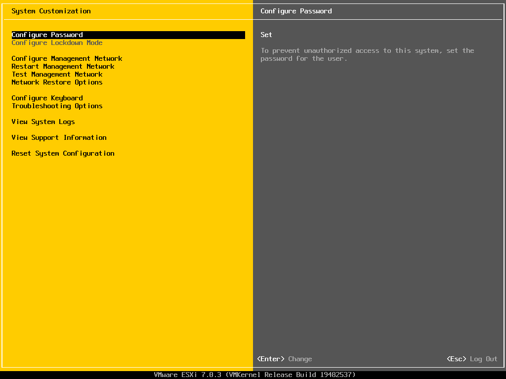

# 一、虚拟化

## 1.1 简介

​	虚拟化是指计算机元件在虚拟的基础上而不是真实的基础上运行。虚拟化技术可以扩大硬件的容量，简化软件的重新配置过程。CPU的虚拟化技术可以单CPU模拟多CPU并行，允许一个平台同时运行多个操作系统，并且应用程序都可以在相互独立的空间内运行而互不影响，从而显著提高计算机的工作效率。
​	顾名思义，虚拟化就是在计算上虚拟出一些实际计算机里真实存在的东西，以达到更方便、简单、成本低、安全性高的目的。比如，虚拟计算机硬件，可以安装操作系统;以现有操作系统为蓝本，再虚拟出几个一摸一样的;虚拟一个操作系统环境，可以安装应用软件。这个解释，是本人很通俗的说法，严格精准的定义，至今还未看到。

## 1.2 分类

​	虚拟化技术，经过数年的发展，已经成为一个庞大的技术家族，其技术形式种类繁多，实现的应用也一大箩筐了。但对其分类，网上的介绍比较含糊，分类属性不一。如将服务器虚拟化、硬件虚拟化、cpu虚拟化相提并论，但其实它们都属一个类别，只是按不同属性分类得出的不同名称。

​	按照不同属性，对虚拟化做一个分类：
　以被应用的领域来划分：服务器虚拟化、存储虚拟化、网络虚拟化、桌面虚拟化。还有从以某类里衍生出来的，无法归类，比如cpu虚拟化，文件虚拟化。这些不用属性的类别之间的关系又是交错联系的

### 硬件虚拟化

​	硬件虚拟化，就是用软件来虚拟一台标准电脑的硬件配置，如cpu、内存、硬盘、声显卡、光驱等，成为一台虚拟的裸机，然后就可以在上面安装操作系统了，其代表产品VMware。
​	使用时，先在操作系统里安装一个硬件虚拟化软件，用其虚拟出一台电脑，再安装系统，做到系统里运行系统，并可虚拟出多台电脑，安装多个相同或不同的系统。
​	其代表产品为VMware，其余几个知名的有：微软的Virtual PC，开源免费的VirtualBox。
​	为虚拟机分配的硬件资源要占用实际硬件的资源，对性能损耗也较大。因为是在系统里安装虚拟化软件，再在虚拟的电脑上装系统，所以就有原系统和虚拟化软件两层消耗，为了提高性能，出现了另外一种硬件虚拟化形式：直接在裸机上安装虚拟化软件，然后安装多个系统，并同时运行。跳过原系统这一环节，性能大大提高。这种虚拟化又叫做准虚拟化。VMware推出的相关产品叫VMware ESXi，微软的该类产品为Hyper-V，主要应用于服务器领域。

### 应用虚拟化

​	前两种虚拟化技术，大多应用于企业、服务器和一些IT专业工作领域。随着虚拟化技术的发展，逐渐从企业往个人、专业往大众应用的趋势发展，便出现了应用程序虚拟化技术，简称应用虚拟化。它近年虚拟化的新贵和热门领域。
​	前两种虚拟化的目的是虚拟完整的真实的操作系统，应用虚拟化的目的也是虚拟操作系统，但只是为保证应用程序的正常运行虚拟系统的某些关键部分，如注册表、C盘环境等，所以较为轻量、小巧。

### 软件全虚拟化、软件半虚拟化和硬件辅助虚拟化

​	纯软件的“全虚拟化”方式不需要修改客户机操作系统，但是其性能较未虚拟化时影响比较大。支持完全虚拟化的虚拟机软件包括VMware Workstation和Virtual PC等。
​	半虚拟化模式，这种模式需要对客户机操作系统进行更改，使得客户机操作系统知道其运行在虚拟化环境下，从而可以获得更高的性能。半虚拟化的典型产品包括Xen、UML等。
​	看虚拟化技术是完全虚拟化还是半虚拟化，首先看虚拟化技术有没有修改内核，xen虚拟化技术需要修改内核，因此它有完全虚拟化和半虚拟化之分，kvm没有修改内核，因此，它只有完全虚拟化；还要看cpu是否支持硬件虚拟化，支持硬件虚拟化，就是完全虚拟化，不支持，就是半虚拟化。xen有两种选择，而kvm只有一种选择，所以，xen有完全虚拟化和半虚拟化之分，kvm只有完全虚拟化。
​	硬件辅助虚拟化技术，在处理器中加入了新的特权级来运行虚拟机监控层，使得客户机操作系统可以运行在原始特权级，不需要更改，并且由硬件来完成两个特权级之间的转换。硬件辅助虚拟技术提高了虚拟机的兼容性和性能。支持硬件辅助虚拟化的有 Linux KVM和Xen等。

## 1.3 VT技术

​	VT(Virtualization Technology)是Intel为了在硬件层面上辅助虚拟化技术实现，而在其用户平台上开发的虚拟化支持系统。在此之前，虚拟化只能使用软件来虚拟底层的架构。
​	Intel公司开发了两套VT技术：一套是VT-i，主要针对安腾架构的主机：一套是VT-x， 主要是针对IA32架构的主机。
​	VT-x依靠VMX(Virtual Machine Extension)来进行对虚拟化技术的硬件支持。作为一 种芯片辅助虚拟化技术，VMX提供两种新的状态来进行虚拟：根模式(VMX root)和非根模式 (VMX non—root)。根模式主要是应对丁Host OS或者VMM的环境。在这种模式下，处理器的行为和没有vT技术时的行为是类似的，可以很好地处理各个特权级别的指令，只是VMX 有其一套指令集，而且当加载数据到某些特定的寄存器的时候，会受到一些限制。而非根模式则是虑对于Guest OS或者vM的环境。在这种环境下，处理器的很多操作是受限的。

# 二、esxi

## 2.1 简介

​	VMware ESXi是VMware开发的企业级类型 IHypervisor，用于硬件虚拟化。作为类型IHypervisor，ESXi不是安装在操作系统上的软件应用程序，而是直接安装在硬件上并且集成了重要的操作系统组件，如内核。

## 2.2 下载

获取[试用资源](https://docs.vmware.com/en/VMware-vSphere/7.0/com.vmware.esxi.install.doc/GUID-016E39C1-E8DB-486A-A235-55CAB242C351.html)：vmware公司提供60天免费全功能测试版，只需要注册即可获取。

## 2.3 安装

开始界面

等待加载

按回车继续 `https://172.16.55.131/`

按f11继续

选择磁盘，按回车继续

选择键盘布局，默认即可，按回车继续

输入密码，按回车继续

按f11安装

安装进度

安装成功，移除光盘，按回车重启

启动界面

按f2设置ip为静态ip，弹出认证界面，输入密码，按回车继续

设置界面

按下方向键选到"configure n=management network",按回车继续

选择第三个ipv4配置，按回车，选择第三个静态，按空格确认，按回车继续

按esc退出，按y保存

按esc返回开始界面

浏览器访问地址 `https://172.16.55.131/`

登录

安装成功

## 2.4 使用

在esxi中安装虚拟机，需要准备一个系统镜像。

添加硬盘，右键虚拟机设置，点击添加，类型选择SCSI

添加完成

点击重新扫描，如果看不到新添加的硬盘，可以重启服务器

按f12,输入密码，按f11重启

可以看到新添加的硬盘了

新建数据存储

输入名称

下一步

点击完成，然后点是

上传iso镜像

创建虚拟机

输入名称，选择操作系统和版本

选择存储

选择“数据存储iso文件”，弹出的界面选择对应的镜像即可

完成

点击虚拟机名称

打开电源

成功的话，可以看到安装系统的界面

虚拟机安装完成

