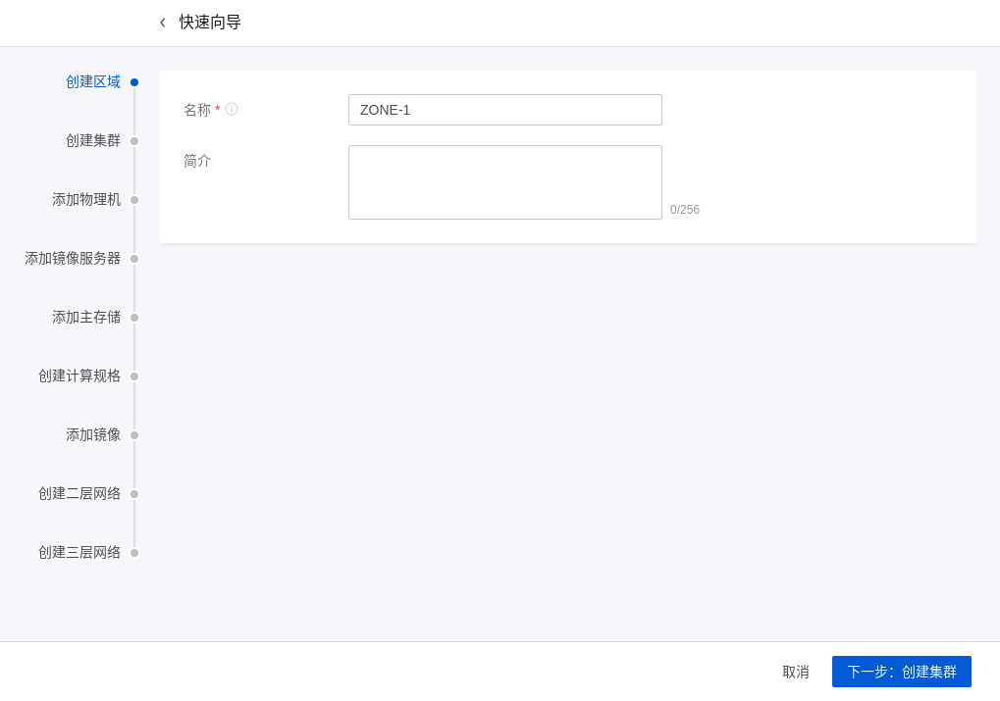
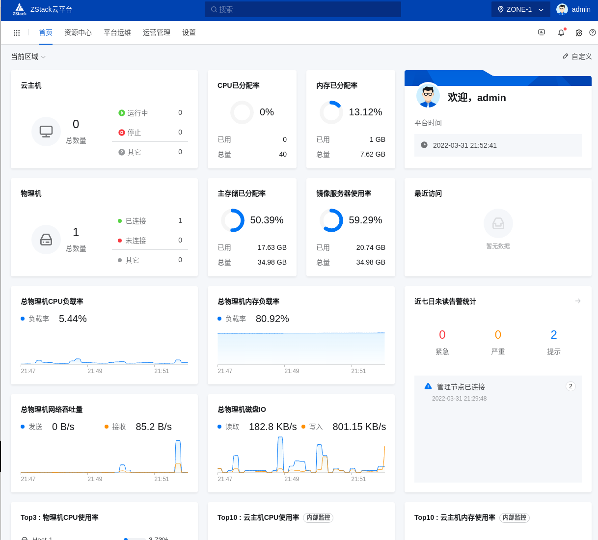

# 一、私有云

## 1.1 简介

​	私有云(Private Clouds)是为一个客户单独使用而构建的，因而提供对数据、安全性和服务质量的最有效控制。该公司拥有基础设施，并可以控制在此基础设施上部署应用程序的方式。私有云可部署在企业数据中心的防火墙内，也可以将它们部署在一个安全的主机托管场所，私有云的核心属性是专有资源。

# 二、zstack

## 2.1 简介

​	ZStack（云轴科技）是上海云轴信息科技有限公司旗下品牌，由阿里云、中国电信战略投资并战略合作 ，自主创新、专注产品化的云计算，以“降低企业上云门槛”为使命、“让每一家企业都拥有自己的云”为愿景，具备自主知识产权、自主开源云代码、自主云平台。凭借自研的ZStack Cloud、ZStack Mini、ZStack CMP、ZStack Cube、ZStack Zaku等产品，积极支持信创发展，适配信创生态，并最早提出云计算的4S特性 [8]  ，注重产品化，普惠云计算。

## 2.2 下载

[下载iso镜像](https://www.zstack.io/product/product_downloads/)

## 2.3 安装

`http://172.16.55.133/`,安装配置汇总

点击 "SOFTWARE SELECTION"，然后选择第一个管理节点

点击"INSTALLATION DESTINATION"，配置硬盘分区

点击"NETWORK & HOSTNAME"，配置静态IP地址

配置网卡自动激活

配置完成后，点击开始安装

设置root密码

等待安装完成后，点击重启即可。

## 2.4 使用

浏览器访问，默认账户密码:admin/password

登录，点击“开始初始化”

创建区域

创建集群

添加物理机

添加镜像服务器

添加主存储

创建计算规格

添加镜像

创建二层网络

创建三层网络

首页

创建云主机

基础配置

资源配置

系统配置

确认信息

点击云主机名称

点击“打开控制台”

可以安装系统了

云主机安装完成。

