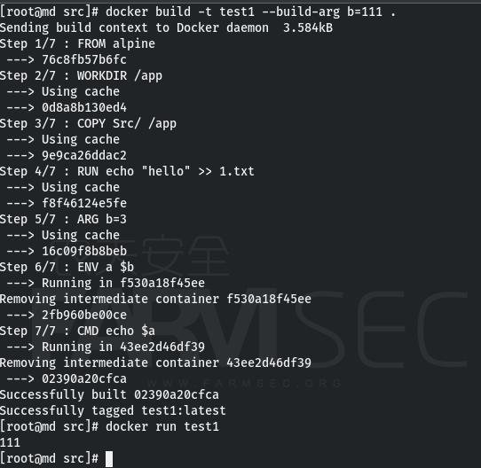
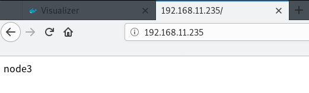

# 一、docker file

## 1.1什么是 Dockerfile？

​	Dockerfile 是一个用来构建镜像的文本文件，文本内容包含了一条条构建镜像所需的指令和说明。

## 1.2使用 Dockerfile 定制镜像

### 1.2.1 定制一个nginx镜像

构建好的镜像内会有一个 /usr/share/nginx/html/index.html 文件

在一个空目录下，新建一个名为 Dockerfile 文件，并在文件内添加以下内容：

```
FROM nginx
RUN echo 'hello world' > /usr/share/nginx/html/index.html
```


### 1.2.2 FROM 和 RUN 指令的作用

**FROM**：定制的镜像都是基于 FROM 的镜像，这里的 nginx 就是定制需要的基础镜像。后续的操作都是基于 nginx。

**RUN**：用于执行后面跟着的命令行命令。有以下俩种格式：

shell 格式：

```shell
RUN <命令行命令>
# <命令行命令> 等同于，在终端操作的 shell 命令。
```

exec 格式：

```shell
RUN ["可执行文件", "参数1", "参数2"]
# 例如：
# RUN ["./test.php", "dev", "offline"] 等价于 RUN ./test.php dev offline
```

**注意**：Dockerfile 的指令每执行一次都会在 docker 上新建一层。所以过多无意义的层，会造成镜像膨胀过大。例如：

```
FROM centos
RUN yum -y install wget
RUN wget -O redis.tar.gz "http://download.redis.io/releases/redis-5.0.3.tar.gz"
RUN tar -xvf redis.tar.gz
```

以上执行会创建 3 层镜像。可简化为以下格式：

```
FROM centos
RUN yum -y install wget \
  && wget -O redis.tar.gz "http://download.redis.io/releases/redis-5.0.3.tar.gz" \
  && tar -xvf redis.tar.gz
```

如上，以 **&&** 符号连接命令，这样执行后，只会创建 1 层镜像。

## 1.3 开始构建镜像

在 Dockerfile 文件的存放目录下，执行构建动作。

以下示例，通过目录下的 Dockerfile 构建一个 nginx:v3（镜像名称:镜像标签）。

```
docker build -t nginx:v3 .
```


构建成功

## 1.4 指令详解

### 1.4.1 COPY

复制指令，从上下文目录中复制文件或者目录到容器里指定路径。

格式：

```
COPY [--chown=<user>:<group>] <源路径1>...  <目标路径>
COPY [--chown=<user>:<group>] ["<源路径1>",...  "<目标路径>"]
```

**[--chown=<user>:<group>]**：可选参数，用户改变复制到容器内文件的拥有者和属组。

### 1.4.2 ADD

ADD 指令和 COPY 的使用格类似，拷贝文件或目录到容器中，如果是URL或压缩包便会自动下载或自动解压。

### 1.4.3 CMD

类似于 RUN 指令，用于运行程序，但二者运行的时间点不同:

- CMD 在docker run 时运行。
- RUN 是在 docker build时运行。

**作用**：为启动的容器指定默认要运行的程序，程序运行结束，容器也就结束。CMD 指令指定的程序可被 docker run 命令行参数中指定要运行的程序所覆盖。

**注意**：如果 Dockerfile 中如果存在多个 CMD 指令，仅最后一个生效。

格式：

```
CMD <shell 命令> 
CMD ["<可执行文件或命令>","<param1>","<param2>",...] 
CMD ["<param1>","<param2>",...]  # 该写法是为 ENTRYPOINT 指令指定的程序提供默认参数
```

推荐使用第二种格式，执行过程比较明确。第一种格式实际上在运行的过程中也会自动转换成第二种格式运行，并且默认可执行文件是 sh。

### 1.4.4 ENTRYPOINT

类似于 CMD 指令，但其不会被 docker run 的命令行参数指定的指令所覆盖，而且这些命令行参数会被当作参数送给 ENTRYPOINT 指令指定的程序。

但是, 如果运行 docker run 时使用了 --entrypoint 选项，将覆盖 ENTRYPOINT 指令指定的程序。

**优点**：在执行 docker run 的时候可以指定 ENTRYPOINT 运行所需的参数。

**注意**：如果 Dockerfile 中如果存在多个 ENTRYPOINT 指令，仅最后一个生效。

格式：

```
ENTRYPOINT ["<executeable>","<param1>","<param2>",...]
```

可以搭配 CMD 命令使用：一般是变参才会使用 CMD ，这里的 CMD 等于是在给 ENTRYPOINT 传参，以下示例会提到。

示例：

假设已通过 Dockerfile 构建了 nginx:test 镜像：

```
FROM nginx

ENTRYPOINT ["nginx", "-c"] # 定参
CMD ["/etc/nginx/nginx.conf"] # 变参 
```

1、不传参运行

```
$ docker run  nginx:test
```

容器内会默认运行以下命令，启动主进程。

```
nginx -c /etc/nginx/nginx.conf
```

2、传参运行

```
$ docker run  nginx:test -c /etc/nginx/new.conf
```

容器内会默认运行以下命令，启动主进程(/etc/nginx/new.conf:假设容器内已有此文件)

```
nginx -c /etc/nginx/new.conf
```

### 1.4.5 ENV

设置环境变量，定义了环境变量，那么在后续的指令中，就可以使用这个环境变量。

格式：

```
ENV <key> <value>
ENV <key1>=<value1> <key2>=<value2>...
```

以下示例设置 NODE_VERSION = 7.2.0 ， 在后续的指令中可以通过 $NODE_VERSION 引用：

```
ENV NODE_VERSION 7.2.0

RUN curl -SLO "https://nodejs.org/dist/v$NODE_VERSION/node-v$NODE_VERSION-linux-x64.tar.xz" \
  && curl -SLO "https://nodejs.org/dist/v$NODE_VERSION/SHASUMS256.txt.asc"
```

### 1.4.6 ARG

构建参数，与 ENV 作用一致。不过作用域不一样。ARG 设置的环境变量仅对 Dockerfile 内有效，也就是说只有 docker build 的过程中有效，构建好的镜像内不存在此环境变量。

构建命令 docker build 中可以用 --build-arg <参数名>=<值> 来覆盖。

格式：

```
ARG <参数名>[=<默认值>]
```

### 1.4.7 VOLUME

定义匿名数据卷。在启动容器时忘记挂载数据卷，会自动挂载到匿名卷。

作用：

- 避免重要的数据，因容器重启而丢失，这是非常致命的。
- 避免容器不断变大。

格式：

```
VOLUME ["<路径1>", "<路径2>"...]
VOLUME <路径>
```

在启动容器 docker run 的时候，我们可以通过 -v 参数修改挂载点。

### 1.4.8 EXPOSE

仅仅只是声明端口。

作用：

- 帮助镜像使用者理解这个镜像服务的守护端口，以方便配置映射。
- 在运行时使用随机端口映射时，也就是 docker run -P 时，会自动随机映射 EXPOSE 的端口。

格式：

```
EXPOSE <端口1> [<端口2>...]
```

### 1.4.9 WORKDIR

指定工作目录。用 WORKDIR 指定的工作目录，会在构建镜像的每一层中都存在。（WORKDIR 指定的工作目录，必须是提前创建好的）。

docker build 构建镜像过程中的，每一个 RUN 命令都是新建的一层。只有通过 WORKDIR 创建的目录才会一直存在。

格式：

```
WORKDIR <工作目录路径>
```

### 1.4.10 USER

用于指定执行后续命令的用户和用户组，这边只是切换后续命令执行的用户（用户和用户组必须提前已经存在）。

格式：

```
USER <用户名>[:<用户组>]
```

## 1.5 练习

常用的五个指令

FROM    除了FORM其他都是非必须的

WORKDIR 指定工作目录

COPY   指定了目录可以使用相对路径   

RUN  build时执行

CMD run时执行         


EXPOSE 暴露端口

VOLUME  映射


ENV 参数    等同于  docker run -e   构建和运行时都有效

ARG 仅构建时有效


Dockerfile:

```
FROM alpine
WORKDIR /app
COPY Src/ /app
RUN echo "hello" >> 1.txt
CMD cat 1.txt 
```

构建镜像：

```
docker build -t test1 .
```


Dockerfile:ENV 参数

```
FROM alpine
WORKDIR /app
COPY Src/ /app
RUN echo "hello" >> 1.txt
ENV a=7
CMD echo $a 
```


Dockerfile:ARG参数

```
FROM alpine
WORKDIR /app
COPY Src/ /app
RUN echo "hello" >> 1.txt
ENV a=7
ARG b=3
CMD echo $b
```

CMD是运行是执行的，而ARG的参数仅构建时有效，所有运行是找不到这个变量，打印的空行


可以赋值给ENV的参数


构建时修改内部变量

```
docker build -t test1 --build-arg b=111 .
```



# 二、swarm集群管理

## 2.1 简介

​	Docker Swarm 是 Docker 的集群管理工具。它将 Docker 主机池转变为单个虚拟 Docker 主机。 Docker Swarm 提供了标准的 Docker API，所有任何已经与 Docker 守护程序通信的工具都可以使用 Swarm 轻松地扩展到多个主机。

## 2.2 原理

如下图所示，swarm 集群由管理节点（manager）和工作节点（work node）构成。

- **swarm mananger**：负责整个集群的管理工作包括集群配置、服务管理等所有跟集群有关的工作。
- **work node**：即图中的 available node，主要负责运行相应的服务来执行任务（task）。


## 2.3 安装与使用

### 2.3.1 准备工作

3台centos7，安装了docker

修改主机名，配置一台机器可以ssh免密登录其他两台

```
yum install -y yum-utils
yum-config-manager --add-repo https://download.docker.com/linux/centos/docker-ce.repo
yum install -y docker-ce docker-ce-cli 

hostname node1
hostname node2
hostname node3

vi /etc/hosts
192.168.11.235 node1
192.168.11.141 node2
192.168.11.234 node3

ssh-keygen
ssh-copy-id -i /root/.ssh/id_rsa.pub root@node2 
ssh-copy-id -i /root/.ssh/id_rsa.pub root@node3
```

### 2.3.2 创建swarm集群

在node1上执行命令

```
docker swarm init --advertise-addr 192.168.11.235
```


复制生成的命令，去node2和node3上执行，在node1上查看集群节点

```
docker node ls
```


### 2.3.3 创建私有仓库

开启各个节点的转发功能且关闭mtu

```
vi /etc/sysctl.conf

net.ipv4.ip_forward = 1  
net.ipv4.ip_forward_use_pmtu = 0
```

使用scp拷贝文件

```
scp /etc/sysctl.conf node2:/etc/
scp /etc/sysctl.conf node3:/etc/
```

刷新

```
sysctl -p  
```

官方私有仓库镜像registry

```
docker pull registry
docker images
```

创建私有库存放目录

```
mkdir -p /var/lib/registry
```

开启私有库镜像到容器

```
docker run -itd -p 5000:5000 --restart=always -v /var/lib/registry:/var/lib/registry --name registry d3241e050fc9
```

检测5000端口是否有私有库信息

```
curl http://192.168.11.235:5000/v2/_catalog
```


修改三台机器的docker服务文件

```
vi /usr/lib/systemd/system/docker.service

--insecure-registry 192.168.11.235:5000
```


```
scp /usr/lib/systemd/system/docker.service node2:/usr/lib/systemd/system/
scp /usr/lib/systemd/system/docker.service node3:/usr/lib/systemd/system/
```

重启daemon和docker

```
systemctl daemon-reload
systemctl restart docker
```

### 2.3.4 向私有库上传镜像

使用nginx为例

```
docker pull nginx
```

为nginx设置tag方便识别

```
docker tag nginx 192.168.11.235:5000/nginx  
```

上传私有镜像到私有库

```
docker push 192.168.11.235:5000/nginx
```

查看私有库是否添加nginx

```
curl http://192.168.11.235:5000/v2/_catalog
```


### 2.3.5 创建swarm专用网络

```
创建
docker network create --driver overlay dyzNetwork
查看
docker network ls 
```

到这里集群已经可以使用了，node2和node3可以pull私有库的内容

```
docker pull 192.168.11.235:5000/nginx
```


### 2.3.5 安装swarm图形化监视程序

```
docker pull dockersamples/visualizer:latest
```

设置tag传到私有库

```
docker tag dockersamples/visualizer 192.168.11.235:5000/visualizer
docker push 192.168.11.235:5000/visualizer
```

开启容器，浏览器访问`http://192.168.11.235:8888`是否出现界面

```
docker run -itd -p 8888:8080 -v /var/run/docker.sock:/var/run/docker.sock --name vis 192.168.11.235:5000/visualizer
```


### 2.3.6 在集群中开启nginx镜像

```
docker images
docker service create --replicas 3 --network dyzNetwork --name ccnm -p 80:80 192.168.11.235:5000/nginx

replicas:容器个数
```

查看总览

```
docker service ls
```

查看集群信息

```
docker service ps ccnm
```


可以看到每个节点起了几个容器


### 2.3.7 验证集群效果

修改容器内的网页信息，强制刷新页面看到集群节点切换访问。

```
docker ps 
docker exec -ti f71ffb62be14 /bin/bash
echo node2 > /usr/share/nginx/html/index.html
```





****


当某个节点挂了，启动的容器数量是不变的，挂掉的节点上的容器，会分配到其他节点启动容器

```
systemctl stop docker 
```


开启节点后，还是可以继续使用的

```
systemctl start docker 
```


调整集群内容器数量

```
docker service scale ccnm=7
```


### 2.3.8 创建挂载真机目录的集群

删除集群

```
docker service rm ccnm
```

每个节点都必须存在相同路径的目录(这里手动创建，实际可以采用同步等方式)

去每个节点新建目录

```
mkdir /test
echo hello >/test/index.html
```

新建集群

```
docker service create --replicas 9 --network dyzNetwork --name ccnm -p 80:80 --mount type=bind,src=/test/,dst=/usr/share/nginx/html/ 192.168.11.235:5000/nginx
```


