# 101-D7-GitLab

## 1.GitLab简介

GitLab 概述：是一个利用 Ruby on Rails 开发的开源应用程序，实现一个自托管的 Git 项目仓库，可通过 Web界面进行访问公开的私人项目。Ruby on Rails 是一个可以使你开发、部署、维护 web 应用程序变得简单的框架。
GitLab 拥有不 Github 类似的功能，能够浏览源代码，管理缺陷和注释。可以管理团队对仓库的访问，它非常易于浏览提交过的版本并提供一个文件历史库。它还提供一个代码片段收集功能可以轻松实现代码复用，便于日后有需要的时候进行查找。

官方主页： https://about.gitlab.com/

## 2.GitLab 和 GitHub 的区别

相同点:
二者都是基于web的Git仓库，在很大程度上GitLab是仿照GitHub来做的，它们都提供了分享开源项目的平台，为开发团队提供了存储、分享、发布和合作开发项目的中心化于存储的场所。
不同点：
1.GitHub如果要使用私有仓库，是需要付费的。GitLab可以在上面创建私人的免费仓库。
2.GitLab让开发团队对他们的代码仓库拥有更多的控制，相比于GitHub，它有不少的特色：允许免费设置仓库权限；允许用户选择分享一个project的部分代码；允许用户设置project的获取权限，进一步的提升安全性；可以设置获取到团队整体的改进进度；通过 innersourcing 让不在权限范围内的人访问不到该资源。

总结：从代码私有性方面来看，有时公司并不希望员工获取到全部的代码，这个时候 GitLab 无疑是更好的选择。但对亍开源项目而言，GitHub 依然是代码托管的首选。

## 3.GitLab的搭建(CentOS Stream 8)

官方安装教程：https://docs.gitlab.com/ee/install/

### 3.1 [minimum requirements](https://docs.gitlab.com/ee/install/requirements.html)

- **4 核**是**推荐**的最小核数，最多支持 500 个用户

- **4GB RAM**是**所需**的最小内存大小，最多可支持 500 个用户

- 硬盘空间在很大程度上取决于您要存储在 GitLab 中的存储库的大小,这里建议至少**10G**大小

  **此为测试环境实际生产环境请结合官方教程依据需求调整**

### 3.2 安装包下载：

[`gitlab/gitlab-ce`](https://packages.gitlab.com/gitlab/gitlab-ce)：仅包含社区版功能的精简包  

- 官方源下载链接：https://packages.gitlab.com/gitlab/gitlab-ce

- 清华源下载链接：https://mirrors.tuna.tsinghua.edu.cn/gitlab-ce/yum/el8/

  

官方源下载方法：

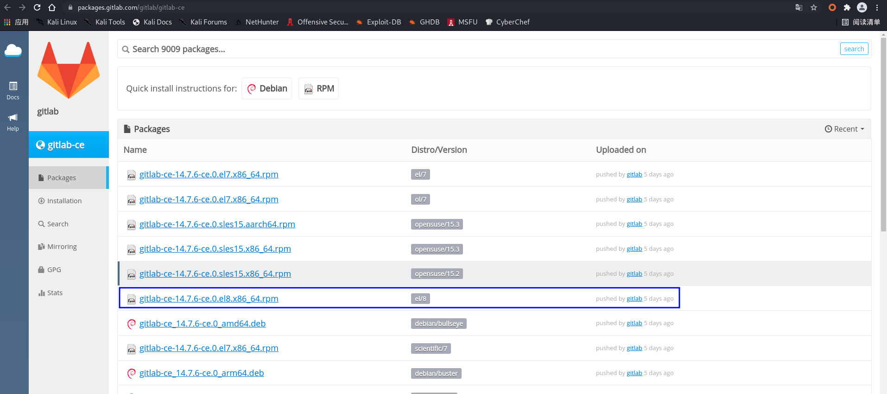

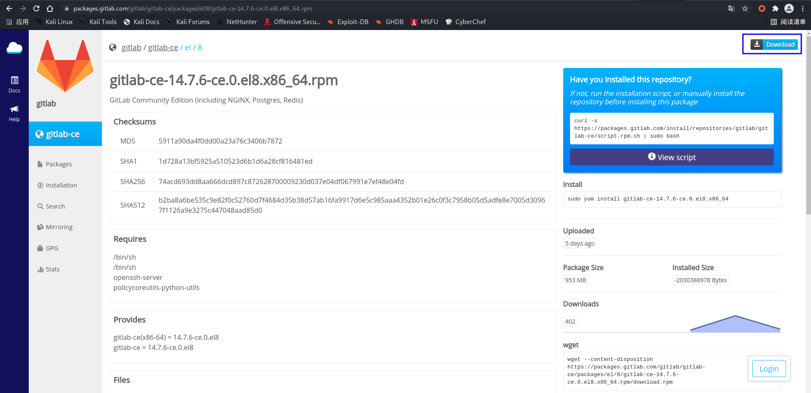


### 3.3 安装

#### 3.3.1 安装基础依赖软件包

```
dnf -y install policycoreutils-python-utils
```

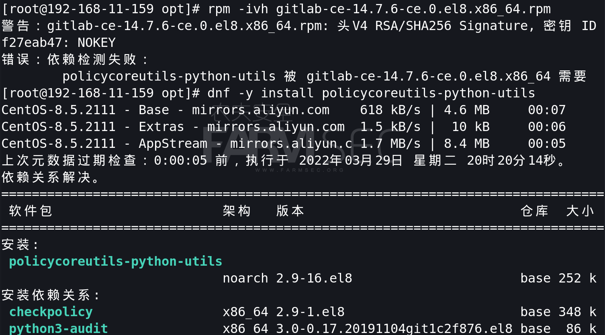

#### 3.3.2 将gitlab-ce-xxx-ce.0.el8.x86_64.rpm上传至C8服务器

```
scp gitlab-ce-14.7.6-ce.0.el8.x86_64.rpm root@192.168.11.233:/opt
```

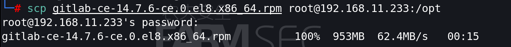

#### 3.3.3 安装rpm包

```
rpm -ivh gitlab-ce-14.7.6-ce.0.el8.x86_64.rpm
```

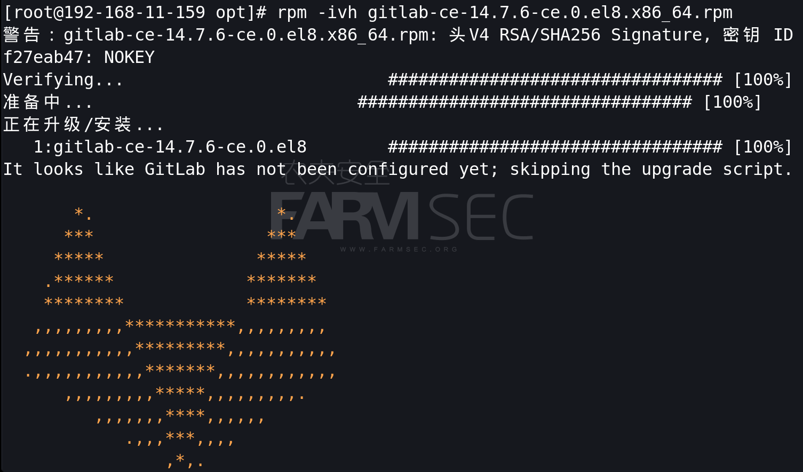

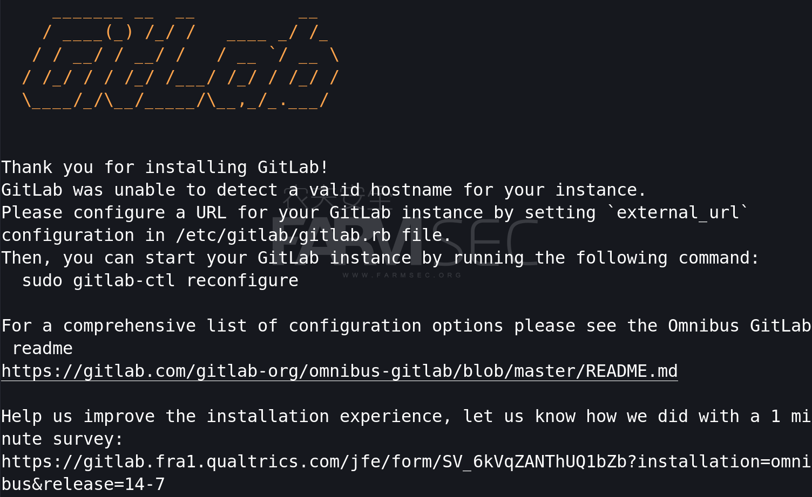

#### 3.3.4 配置实例url

安装完成后可以看到提示：GitLab无法检测实例的有效主机名。须通过设置/etc/gitlab/gitlab.rb文件中的“external_URL”为GitLab实例配置URL。

具体操作：

编辑/etc/gitlab/gitlab.rb，将external_url参数修改为本机IP地址

```
vi /etc/gitlab/gitlab.rb
```


#### 3.3.5 启动GitLab实例 

 可以通过运行以下命令来启动GitLab实例（时间会比较久） 

```
gitlab-ctl reconfigure
```

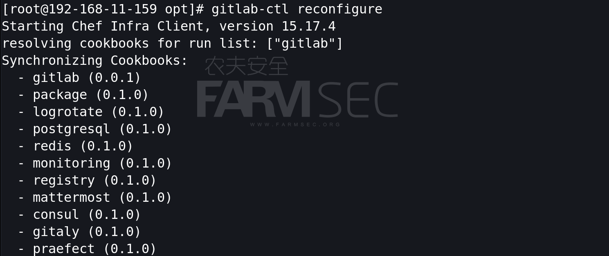

安装成功可以看到admin账户以及密码相关设置

```
用户名：root

密码：您没有选择将初始根密码打印到STDOUT。密码存储到/etc/gitlab/initial_root_password。此文件将在24小时后的首次重新配置运行中清理。
```

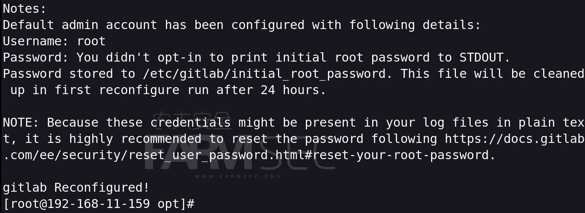

#### 3.3.6 重新启动实例

```
gitlab-ctl restart
```

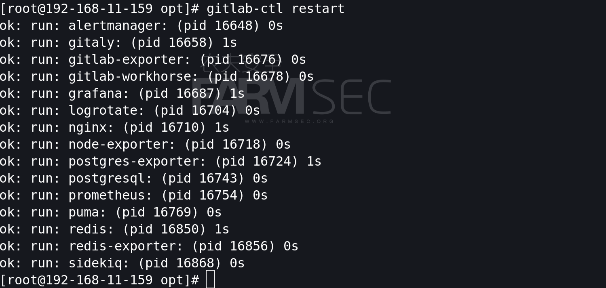

#### 3.3.7浏览器访问GitLab页面

浏览器中访问http://IP 即可打开gitlab页面（如果访问出现502耐心等待一会即可）

Username or email: root

Password：

```
cat /etc/gitlab/initial_root_password
```

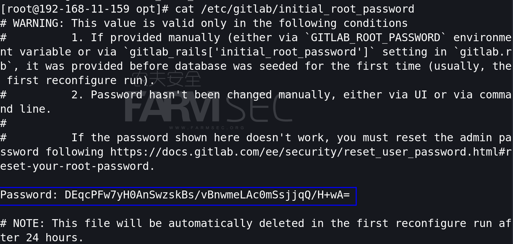

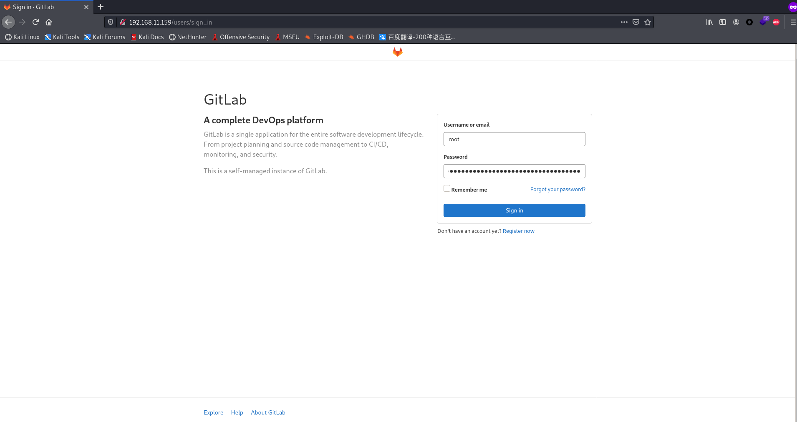

#### 3.3.8 重置密码

根据``/etc/gitlab/initial_root_password ``文件提示，可以看到重置密码有两种方式

1.在首次reconfigure运行之前，可以通过手工设定`gitlab.rb`中的`gitlab_rails['initial_root_password']`或者环境变量`GITLAB_ROOT_PASSWORD`

2.可以通过web UI或者命令行设定

**更改密码须在初次reconfigure的24小时内，否则`initial_root_password`将会24小时后自动删除**

web ui 重置密码：

```
setting- ->Password
```

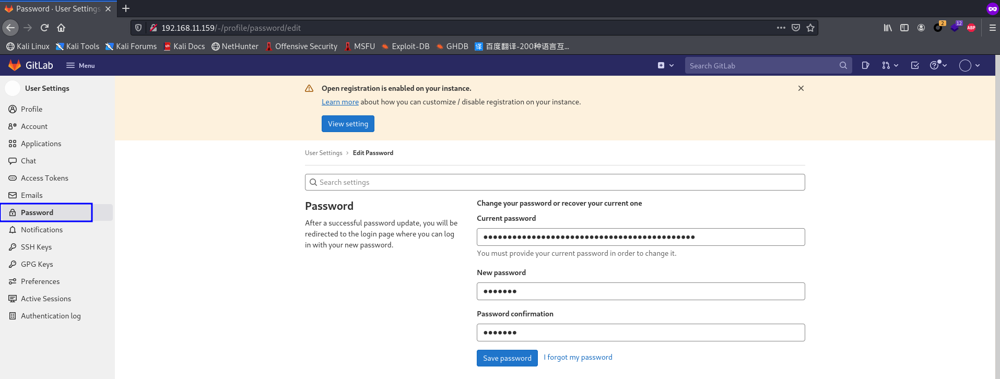

#### 3.3.9 更改为中文显示

```
setting-->Preferences-->Localization-->Language，修改为简体中文后即可更改语言为中文。
```

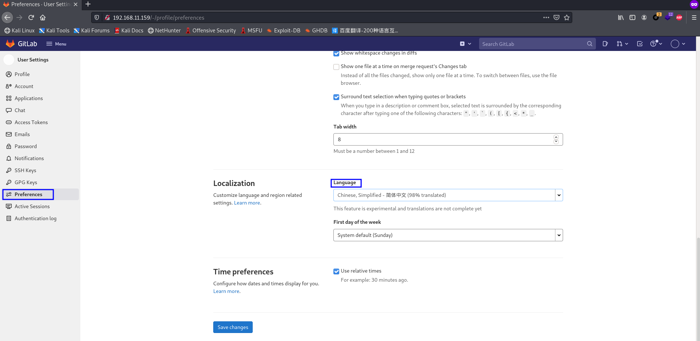

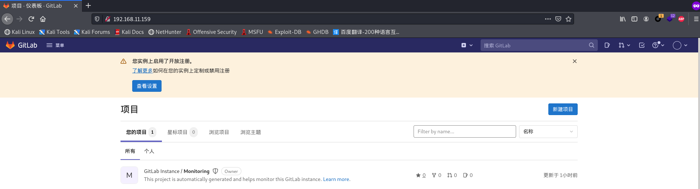

#### 3.3.10 GitLab使用及配置

`关闭 gitlab： gitlab-ctl stop
启动 gitlab： gitlab-ctl start
重启 gitlab： gitlab-ctl restart
gitlab 主配置文件：/etc/gitlab/gitlab.rb //可以自定义一些邮件服务等
日志地址：/var/log/gitlab/ //对应各服务
服务地址：/var/opt/gitlab/ //对应各服务的主目录
仓库地址：/var/opt/gitlab/git-data //记录项目仓库等提交信息
重置配置：gitlab-ctl reconfigure //不要乱用，会重置为最原始的配置的
重启服务：gitlab-ctl stop/start/restart //启动命令`


## 4.GitLab的使用

### 4.1 新建测试项目

来到GitLab主页面，点击`新建项目`按钮

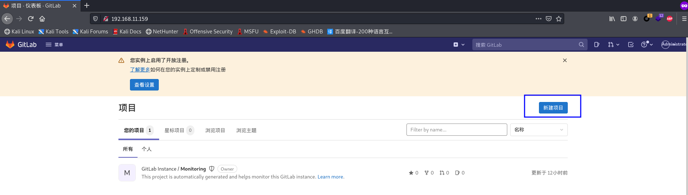

### 4.2 创建空白项目

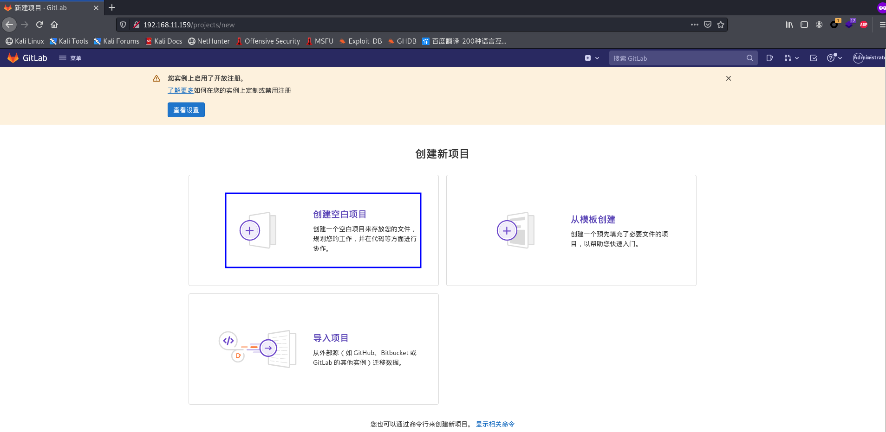

### 4.3 编辑空白项目

此处可见性级别选择`公开`

可见性级别：

- 私有：需要分配具体可以访问该项目的用户/用户组

- 内部：拥有gitlab账户的所有人都可以访问

- 公开：所有人都可以访问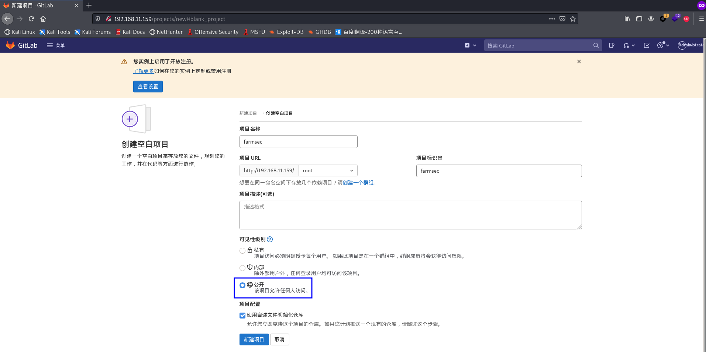

  

### 4.4 新建测试文件

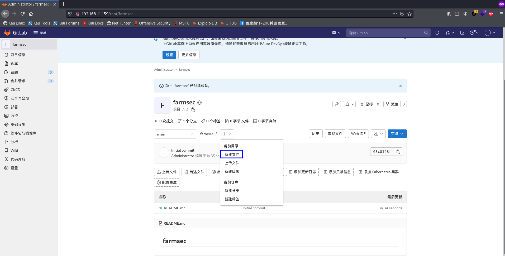


### 4.5 新建文件`index.html`

如图填入相应内容后点击`Commit changes`按钮

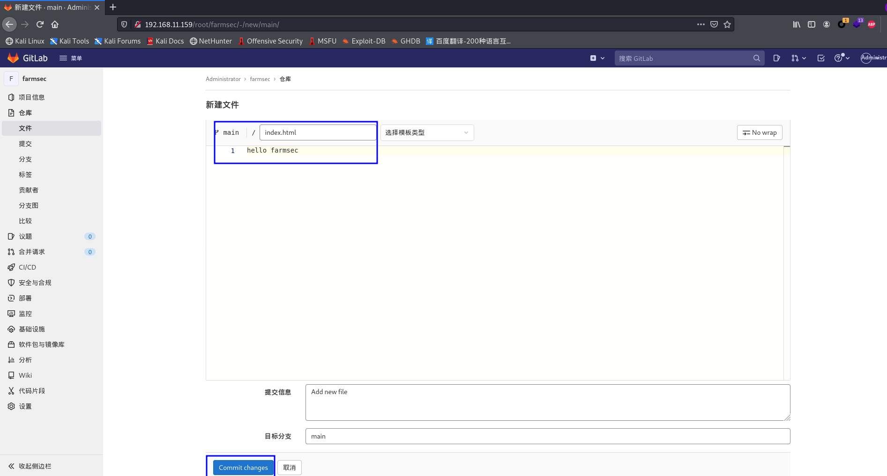


### 4.6 测试项目

#### 4.6.1 克隆项目地址

farmsec- - 克隆 - - 使用HTTP克隆- -(复制)

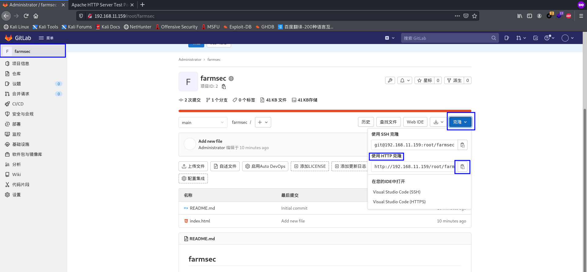


#### 4.6.2 将项目克隆到web主机

```
git clone http://192.168.11.159/root/farmsec.git
```

**注：centos最小化安装默认不会自带git命令，须手动安装**

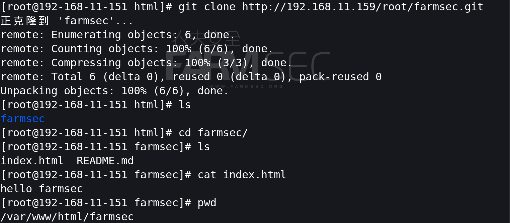

#### 4.6.3 页面测试


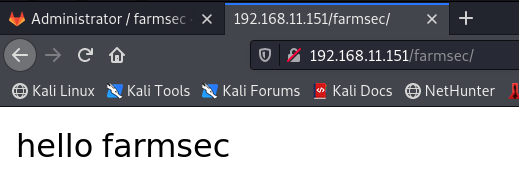

## 5.  通过git命令操作项目

通过需要clone代码可按照git clone的相关内容使用即可。

### 5.1git 常用命令

```
git config --global user.name “name“ 	#设置全局用户名
git config --global user.email mail 	#设置全局邮箱
git config --global --list 	#列出用户全局设置
git add index.html 	#添加文件到暂存区
git commit -m “描述内容“ 	#提交文件到工作区
git status 	#查看工作区的状态
git push 	#提交代码到 git 服务器上
git pull 	#获取代码到本地
git log 	#查看操作日志
vim .gitignore 	#定义忽略文件
git reset --hard HEAD^ 	#git 版本回滚， HEAD 为当前版本，加一个^为上一个，^^为上上一个版本
git reflog	#获取每次提交的 ID，可以使用--hard 根据提交的 ID 进行版本回退
git reset --hard 5ae4b06 	#回退到指定 id 的版本
git branch 	#查看当前所处的分支
git checkout -- file 	#从服务器更新某个那文件覆盖本地的文件
git --version 	#查看 git 当前的版本
git reflog 	#获取每次提交的 ID
```
### 5.2工作区和暂存区及分支概述

工作区就是编辑文件的目录区域，需要将工作区的修改好的文件add到暂存区才能提交到git服务器,在工作区有多个文件的时候可以将一个或多个文件添加至暂存区，再提交到 git 服务器即可。
```
git branch xxx 	#创建一个分支
git checkout xxx 	#切换到分支
git branch 	#查看当前所处的分支vim a.txt #随意在里面写一些内容
git add a.txt
git commit -m "add a.txt“ 	#提交到暂存区中
git push -u origin xxx 	#上传到分支上
```
