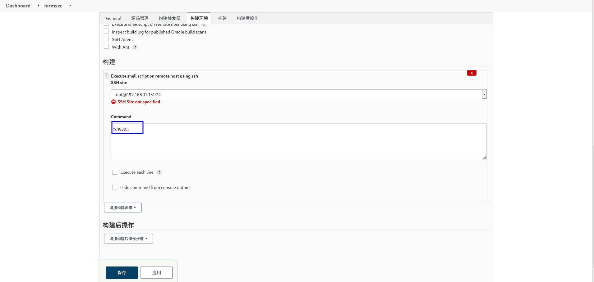

# 101-D8-jenkins

jenkins官网：https://www.jenkins.io/zh/

## 1.jenkins简介

Jenkins 是一个开源软件项目，是基于 Java 开发的一种持续集成工具，用于监控持续重复的工作，旨在提供一个开放易用的软件平台，使软件的持续集成变成可能；具有无与伦比的插件生态系统，几乎支持所有工具作为交付管道的一部分；支持各种运行方式，可通过系统包、Docker 或者通过一个独立的 Java 程序。


## 2.jenkins安装(CentOS Stream 8)

官方链接：https://www.jenkins.io/zh/doc/book/installing/

### 2.1 系统要求

最低推荐配置:

- 256MB可用内存
- 1GB可用磁盘空间(作为一个[Docker](https://www.jenkins.io/zh/doc/book/installing/#docker)容器运行jenkins的话推荐10GB)

为小团队推荐的硬件配置:

- 1GB+可用内存
- 50 GB+ 可用磁盘空间

软件配置:

- Java 8—无论是Java运行时环境（JRE）还是Java开发工具包（JDK）都可以。

**注意:** 如果将Jenkins作为Docker 容器运行，这不是必需的

### 2.2 jenkins开源镜像站

清华大学开源软件镜像站 ：https://mirrors.tuna.tsinghua.edu.cn/jenkins/redhat/?C=M&O=A


### 2.3 yum安装 

官方安装（ CentOS/Fedora/Red Hat）：https://pkg.jenkins.io/redhat-stable/

#### 2.3.1 安装wget命令

```
yum -y install wget
```


#### 2.3.2 使用jenkins官方源

```
sudo wget -O /etc/yum.repos.d/jenkins.repo https://pkg.jenkins.io/redhat-stable/jenkins.repo
```


#### 2.3.3 导入jenkins密钥

```
sudo rpm --import https://pkg.jenkins.io/redhat-stable/jenkins.io.key
```


#### 2.3.4 安装java环境

```
yum -y install java-11-openjdk
```


#### 2.3.5 安装jenkins

```
yum install jenkins
```


#### 2.3.6 启动jenkins服务，并将服务设为开机自启

```
systemctl start jenkins

systemctl enable jenkins

```


#### 2.3.7 浏览器访问jenkins页面

`http://192.168.11.202:8080`


#### 2.3.6 解锁jenkins

```
cat /var/lib/jenkins/secrets/initialAdminPassword
```


#### 2.3.7 自定义Jenkins插件

选择`安装推荐的插件`，中间可能会失败，可以选择`重试`直到全部安装成功


#### 2.3.8 等待安装推荐插件完成

要确保推荐安装的插件都安装成功，鉴于jenkins服务器在国外，故此过程会很慢

等待时间很长,网速较差安装不成功的同学可以停止jenkins,直接删除`/var/lib/jenkins/plugins`目录,然后把本地的plugins文件夹中的内容复制到主机的`/var/lib/jenkins/plugins`目录下,然后重启Jenkins,发现安装直接全部跳过了,此处不做演示

```
systemctl stop jenkins	

scp -r ./plugins/* root@192.168.11.227:/var/lib/jenkins/plugins

systemctl start jenkins
```


重启后再次回到`解锁jenkins`页面


直接来到创建第一个管理员用户界面


#### 2.3.9 创建管理员用户


#### 2.3.10 实例配置

保持默认，这里可以定义我们的访问URL


#### 2.3.11 配置完成，开始使用


### 2.4 配置jenkins自动化任务

#### 2.4.1 单台目标主机的同步测试

这里需要`ssh`插件，默认并没有安装，需要手动安装

##### 2.4.1.1 安装`SSH`,`Ansible`插件

右上角搜索需要的插件名称 - ->`Download now and install after restart`


##### 2.4.1.2	等待插件安装完成

可以把`安装完成后重启Jenkins(空闲时)`勾选，安装完成后会自动重启jenkins


##### 2.4.1.3 安装完成会自动重启


##### 2.4.1.4 重新登录jenkins


##### 2.4.1.5 验证插件时候安装成功


#### 2.4.2 配置目标机器ssh连接信息

##### 2.4.2.1添加远程访问的认证信息： `Manage Jenkins` -->`Configure System`–`>SSH remote hosts`-->`新增`


##### 2.4.2.2 配置如下图内容

`Hostname`:主机名，一般填写目标主机ip

`Port`：ssh端口，默认22

`Credentials`：认证信息，即为通过ssh远程连接目标主机的用户名、密码


配置成功后，点击`Check connection` ，如果看到提示`Successfull connection`即为连接成功，然后点击`应用`- ->`保存`即可完成ssh配置


`Credentials`- ->`添加` - ->填入`用户名`、`密码`


#### 2.4.3 创建jenkins项目

##### 2.4.3.1 回到`Dashboard`- ->`新建item`或者`Create a job` 来新建一个项目


##### 2.4.3.2 输入`任务名称`，并选择`Freestyle project`


##### 2.4.3.3 配置`构建`内容

`SSH site`：调用`Configure System`中`SSH`定义好的主机信息

在`Command`中写入要执行的命令`whoami`




##### 2.4.3.4 开始`Build`

点击`Build Now`开始构建项目，通过左下角的`Build History`可以看到该项目某次构建的结果


##### 2.4.3.5 查看构建结果

点击`#1` - ->`控制台输出`  来查看当前次执行详细信息


## 3.思考

3.1如果是要讲命令推送到多台远程主机，该怎么做？

3.2 如果现在有多台web主机，该怎么推送web代码？

3.3 如何通过jenkins批量安装lamp服务？


