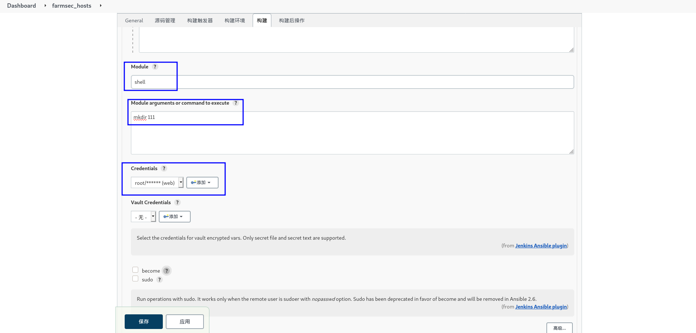

# 101-D9-DEVOPS


## 1.DevOps简介

`DevOps`（Development和Operations的组合词）是一组过程、方法与系统的统称，用于促进开发（应用程序/软件工程）、技术运营和质量保障（QA）部门之间的沟通、协作与整合。
它是一种重视“软件开发人员（Dev）”和“IT运维技术人员（Ops）”之间沟通合作的文化、运动或惯例。透过自动化“软件交付”和“架构变更”的流程，来使得构建、测试、发布软件能够更加地快捷、频繁和可靠。
它的出现是由于软件行业日益清晰地认识到：为了按时交付软件产品和服务，开发和运营工作必须紧密合作。

`DevOps`: `Development`和`Operations`的组合
可以把DevOps看作开发（软件工程）、技术运营和质量保障（QA）三者的交集。传统的软件组织将开发、IT运营和质量保障设为各自分离的部门。在这种环境下如何采用新的开发方法（例如敏捷软件开发），这是一个重要的课题：按照从前的工作方式，开发和部署不需要IT支持或者QA深入的、跨部门的支持，而却需要极其紧密的多部门协作。然而DevOps考虑的还不止是软件部署。它是一套针对这几个部门间沟通与协作问题的流程和方法。
需要频繁交付的企业可能更需要对DevOps有一个大致的了解。Flickr发展了自己的DevOps能力，使之能够支撑业务部门“每天部署10次”的要求──如果一个组织要生产面向多种用户、具备多样功能的应用程序，其部署周期必然会很短。这种能力也被称为持续部署，并且经常与精益创业方法联系起来。 从2009年起，相关的工作组、专业组织和博客快速涌现。

DevOps的引入能对产品交付、测试、功能开发和维护（包括──曾经罕见但如今已屡见不鲜的──“热补丁”）起到意义深远的影响。在缺乏DevOps能力的组织中，开发与运营之间存在着信息“鸿沟”──例如运营人员要求更好的可靠性和安全性，开发人员则希望基础设施响应更快，而业务用户的需求则是更快地将更多的特性发布给最终用户使用。这种信息鸿沟就是最常出问题的地方。


## 2.持续集成概述

持续集成概述：持续集成（Continuous integration，简称CI）持续集成是指开发者在代码的开发过程中，可以频繁的将代码部署集成到主干，并过程自动化测试。
持续交付（Continuous Delivery,简称CD）：持续交付指的是在持续集成的环境基础上，将代码部署到预生产环境。
持续部署（Continuous Deployment，简称CD）：在持续交付的基础上，把部署到生产环境的过程自动化。


## 3.持续集成系统的工作流程

1).开发者将新版本 push 到 Gitlab。
2).Gitlab 随后触发 jenkins master 节点进行一次 build。(通过 web hook 或者定时检测)。
3).jenkins master 节点将这个build任务分配给若干个注册的slave节点中的一个,这个slave点根据一个事先设置好的脚本进行build。这个脚本可以做的事情很多,比如编译，测试，生成测试报告等等。这些原本需要手动完成的任务都可以交给 jenkins 来做。
4).在 build 中要进行编译，一般使用分布式编译器 distcc 来加快编译速度。

## 4.多台目标主机的同步测试

### 4.1 jenkins中安装 ansible插件

安装方式同ssh，前面已安装过


### 4.2 Jenkins主机中安装ansible

#### 4.2.1换epel源

```
yum -y install epel-release
```


#### 4.2.2 jenkins主机安装ansible

```
yum -y install ansible
```


#### 4.2.3 配置ansible环境

`Manage Jenkins` - -> `Global Tool Configuration` - -> `Ansible`- ->`新增 Ansible` 配置ansible和ansible-playbook


#### 4.2.4 jenkins主机查看ansible和ansible-playbook命令位置

```
which ansible

which ansible-playbook
```


将配置编辑如下图并先后应用，保存


### 4.3 新建一个jenkins项目

#### 4.3.1 回到`Dashboard`- ->`新建item`或者`Create a job` 来新建一个项目

任务名称：farmsec_hosts

类型：Freestyle project


#### 4.3.2 创建ansible构建

`构建`- ->`Invoke Ansible Ad-Hoc Command(调用Ansible临时命令)`


`Host pattern`:主机模型

`Inventory`:主机列表

`Content`：主机列表内容

`Module`:模块名字

`Module arguments or command to execute`：执行的命令或参数

`Credentials`：认证方式




#### 4.3.3 开始构建

点击`Build Now`，查看`Build History` 发现报错


#### 4.3.4 开始排错

##### 4.3.4.1 发现问题

点击`#1` 查看`控制台输出`开始排错，发现` 使用SSH密码而不使用密钥是不被允许的，因为主机密钥检查已启用，而sshpass不支持这种方式。请将此主机的指纹添加到您的已知_hosts文件以管理此主机。 `


简而言之就是首次ssh连接远程主机，需要jenkins主机信任**远程主机指纹**


##### 4.3.4.2 解决问题

修改**jenkins**主机`/etc/ssh/ssh_config` 内容中的`StrictHostKeyChecking` 值为`no` 即
可自动接受证书。

```
vi /etc/ssh/ssh_config

systemctl restart sshd
```


##### 4.3.4.3 测试问题


#### 4.3.5 验证结果

出现`mkdir 111`结果，执行完成


## 5.多台目标主机批量执行命令

### 5.1 gitlab建立测试项目

在gitlab中建立测试的shell脚本，内容如下：
`#!/bin/bash
echo "farmsec_cs" >>/opt/test.txt`

### 5.2创建空白项目`farmsec_shell`

`菜单`- ->`项目`- ->`新建项目`

新建文件`test.sh`

`#!/bin/bash
echo "farmsec_test" >>/opt/test.txt`


+


### 5.3 新建jenkins项目`farmsec_test`

配置`构建`


`yum -y install git
cd /opt
rm -rf farmsec_shell test.txt
git clone http://192.168.11.212/root/farmsec_shell.git
sh /opt/farmsec_shell/test.sh`


### 5.4 测试成果


