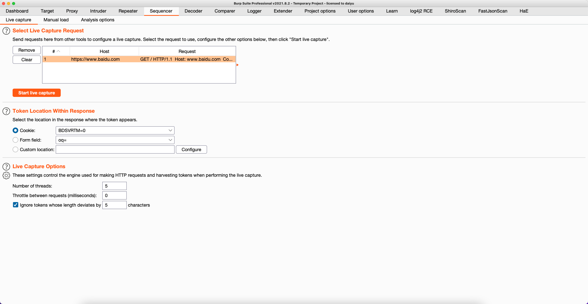
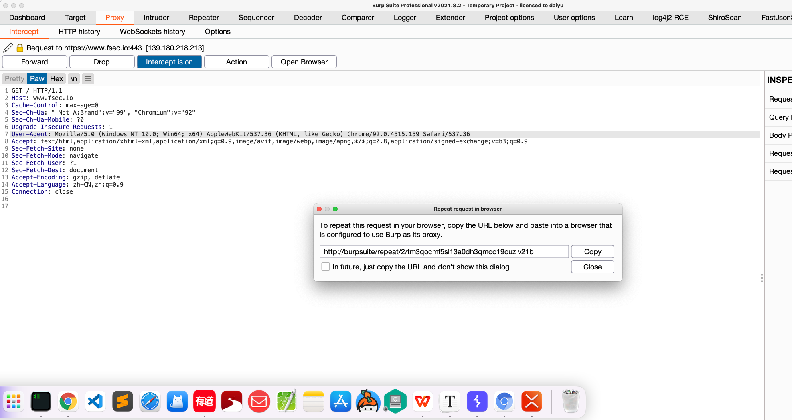
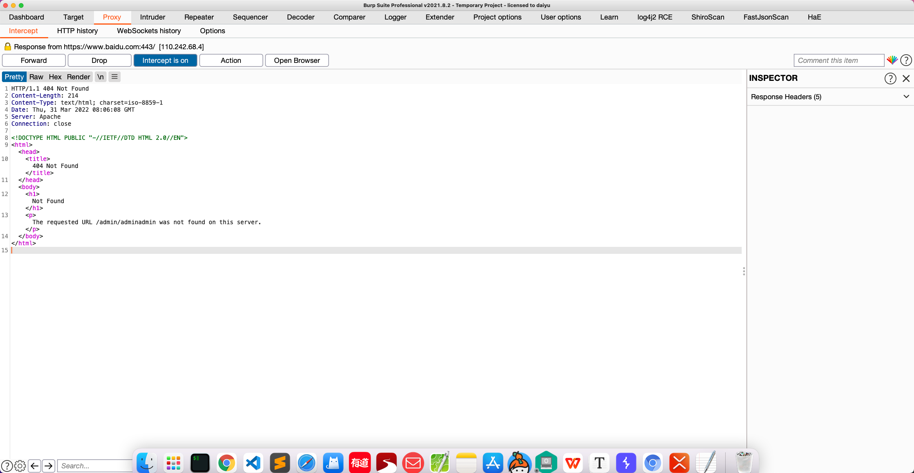
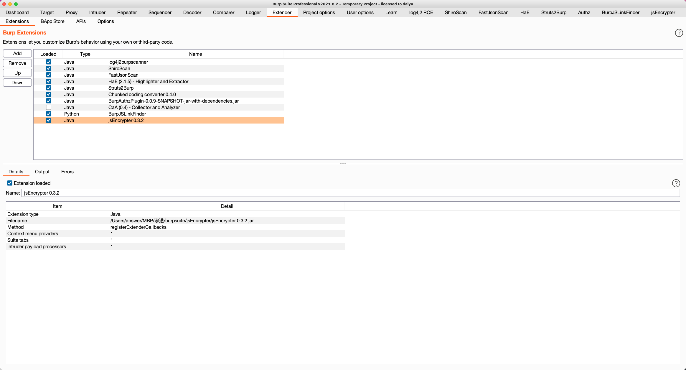
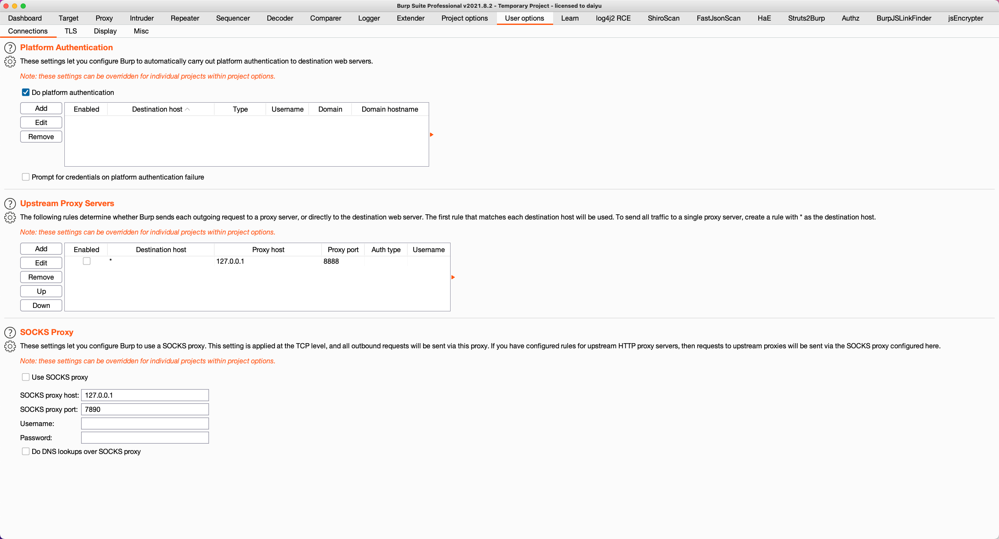

# BurpSuite使用

## 1.1 Burpsuite简介

`Burpsuite`是一个用于测试Web应用程序安全性的图形化工具。该工具使用`java`编写，由`PortSwigger Web Security`开发。

该工具有三个版本。可以免费下载的社区版、专业版和试用后可以购买的企业版。社区版减少了许多功能。它是为网络应用程序安全检查提供全面解决方案而开发的。除了`Proxy`，`Scanner`和`Intruder`等基本功能外，该工具还包含更高级的选项，如`Spider`、`Repeater`、`Decoder`、`Comparer`、`Extender`和`Sequencer`。

## 1.2 Burp下载与安装

### 1.2.1 下载

`portswigger.net` 官网下载``BurpSuite`专业版或社区版的安装程序

访问下面的链接，即可选择不同平台的`Burpsuite`最新稳定版本进行下载

专业版：`https://portswigger.net/burp/releases/professional-community-2022-2-4?requestededition=professional`

社区版：`https://portswigger.net/burp/releases/professional-community-2022-2-4?requestededition=community`

## 1.3 Burp常用模块

### 1.3.1 Proxy 代理模块

`Proxy` 模块允许用户拦截浏览器和目标服务器之间发送的`HTTP` 请求和响应，用户可以在`intercept`子模块中选择开启拦截（`intercept is on`）或者关闭请求拦截（`intercept is off`）

点击`Open Browser`,即可打开`Burp`内置`Chromium`浏览器，当前浏览器内置了`burpsuite`插件。

在浏览器访问任意`ur`l地址，`burp`即可同步拦截到`http`请求

点击`forward`即可进行请求转发，`burp`会将拦截到的`http`请求进行发送

此时用户即可在`Http History`子菜单中查看到用户此前发送过的`http`历史信息

当用户点击`Drop`即可终止用户的请求，服务器不会接收到用户的此次`Http`请求

用户可以在`intercept`子模块中选择开启拦截（`intercept is on`）或者关闭请求拦截（`intercept is off`）,`Forward`与`Drop`按钮决定的是拦截单次`http`请求的处理方式，而开启拦截（`intercept is on`）或者关闭请求拦截（`intercept is off`）决定的是`burp`做为中间人是否进行持续拦截请求进行处理。

#### 右键菜单

当用户拦截到http请求以后，即可点击`Action`选择将当前的`http`请求进行不同的行动，或者在http请求的内容界面点击右键，同样可以唤出菜单

1.`Scan` 扫描

点击`Scan`以后即可唤出漏洞扫描的主菜单，用户可以配置扫描类型以及具体的参数

2.`Do passive scan` 运行被动扫描

针对当前的http请求使用被动扫描，用户可以在`Tasks`界面中查看当前被动扫描任务队列

3.`Do active scan`  运行主动扫描

针对当前的`http`请求使用被动扫描，用户可以在`Tasks`界面中查看当前主动扫描任务队列

4. `Send to Intruder` 将当前请求发送至入侵模块

将当前请求发送至入侵模块，用户可根据当前http请求信息定制相应攻击载核

5.`Send to Repeater` 将当前请求发送至重放模块

将当前请求发送至重放模块，用户可以定制请求的具体内容，并且查看返回内容

6.`Send to Sequencer` 将当前请求发送至定序模块

将当前请求发送至定序模块，用户可以通过实时捕获判断`sessions`信息

7.`Send to Comparer` 将当前请求发送至对比模块

将当前请求发送至对比模块，用户可以根据多个`http`请求信息来对比相关差异性

8.`Send to Decoder` 将当前请求发送至解码模块

将当前请求发送至解码模块，用户可以根据指定的加密的方式来进行编码或解码

9.`Request in browser` 在浏览器中发送请求

使用浏览器的源session（In original session）或者使用当前浏览器的session（In current browser session）发送请求

10.`Extensions` 将当前请求发送至插件模块中

11.`Engagement tools` 额外工具可以对当前的请求进行相关的操作

`Find Comments`                  查找注释
`Find references `              查找引用
`Discover content`            目录枚举
`Schedule task  `                  定时任务

12.`Change request method` 更改请求类型

用户可以使用此功能更改当前`HTTP`的请求类型，如果是`GET`请求则会更改成`POST`，`POST`请求则会更改成`GET`

13.`Change body encoding` 更改http请求体的编码方式

可以将当前`HTTP`请求体的内容更改为文件上传时所用的请求体

14.`Copy URL` 复制当前`HTTP`请求中的`URL`地址

15.`Copy as curl command` 将当前`HTTP`请求复制为`CURL`工具的请求格式

16.`Copy to file` 将当前的请求保存到指定文件

17.`Paste from file` 通过文件进行粘贴`HTTP`请求

18.`Save item` 以`XML`格式保存当前请求内容

`Don't intercept requests` 根据指定规定拦截请求

`to this host` 用户请求的当前主机不进行拦截

`to this IP address` 用户请求的当前的IP不进行拦截

`for this file extension` 当前`URL`的文件扩展不进行拦截

`for this directory` 当前`URL`的目录名称不进行拦截

19.`Do intercept` 进行拦截

`response to this request` 拦截当前请求返回的结果

`Convert selection`

`URL-encode as you type`

`Cut` 剪切

`Copy` 复制

`Paste` 粘贴

`Message editor documentation`

`Proxy interception ducumentation`

#### HTTP请求历史

用户可以在当前子菜单中查看HTTP请求的历史信息

点击`Filter`即可定制过滤规则，筛选`HTTP`请求

#### WebSockets 历史

点击`Filter`即可定制过滤规则，筛选`WebSockets`请求

#### Options 选项

**代理监听选项**

用户可以设置当前`Burpsuite`所监听的端口，用户需要配置浏览器的代理选项，当前的这个代理即是浏览器的代理地址

用户可以点击`add`进行添加

`Binding ` 设置burp绑定的代理服务器监听地址及端口

`Bind to port` 绑定的端口

`Bind to address` 绑定的地址

`Bind to address` > `Loopback only` 仅绑定本机地址

`Bind to address` > `All interfaces` 绑定所有接口

`Bind to address` > `Specific address` 绑定具体的内网地址

可以使用`Specific address`模式来对内网特定的主机进行拦截，比如测试安卓`app`时，或微信小程序，只要设置好代理`HTTP`即可拦截到`HTTP`请求

`Request handling` 请求处理选项

用户可以将拦截到的请求重定向至指定的主机及端口，并且可以选择是否强制使用`TLS`协议，每个重定向选项都可以单独使用。例如，用户可以将所有请求重定向到特定的主机，同时保留每个原始请求中使用的原始端口和协议。

`Support invisible proxying（enable only if needed` 隐形代理选项

通常，Web 代理需要在请求的第一行接收完整的 URL，以确定将请求转发到哪个目标主机（它们不查看 Host 标头来确定目标）。如果启用了不可见代理，当 Burp 收到任何非代理样式的请求时，它将解析出 Host 标头的内容，并将其用作该请求的目标主机。

当使用带有代理的 HTTPS 时，客户端发送一个 CONNECT 请求来标识他们希望连接的目标主机，然后执行 SSL 协商。但是，非代理感知客户端将直接进行 SSL 协商，认为它们直接与目标主机通信。如果启用了不可见代理，Burp 将容忍客户端直接协商 SSL，并再次从解密请求中解析出 Host 标头的内容。

`Certificate`（证书）

配置`TLS`证书（`HTTPS`证书）用于解决使用代理拦截`HTTPS`协议时出现的问题

`Use a self-signed certificate` 使用自签名证书，浏览器会显示一个简单的自签名TLS证书，但它会导致出现TLS警告

`Generate CA-signed per-host certificates` 这是用户默认选项。安装证书后，`Burp`会创建一个自签名的(`CA`)证书，并将其存储在用户的计算机上，当用户的浏览器与目标主机建立`TLS`连接时，`Burp`为该主机生成一个由`CA`证书签名的`TLS`证书。用户可以在浏览器中安装`Burp`的`CA`证书作为受信任的根证书，这样每台主机的证书就会被接受，而不会发出任何警告。用户还可以导出CA证书，以便在其他工具或`Burp`的其他实例中使用。

`Generate a CA-signed certificate with a specific hostname ` `Burp`将使用您指定的主机名生成一个单独的主机证书，用于每个`TLS`连接。在执行不可见代理时，这个选项有时是必要的，因为客户机不发送CONNECT请求，因此`Burp`在`TLS`协商之前无法识别所需的主机名。与前面一样，用户可以将`Burp`的CA证书安装为受信任的根证书。

**TLS protocols** TLS协议

配置控制`Burp`在与浏览器进行`TLS`协商时将使用的`TLS`协议。您可以将`Burp`配置为使用`Java`安装的默认协议，或者覆盖这些默认协议并根据需要启用定制协议。

`HTTP2`  是否支持HTTP2版本协议

`Intercepting HTTP request `拦截HTTP请求

配置`Intercept`选项卡中根据规则定制需要过滤拦截的`HTTP`请求。

`Intercepting server responses` 拦截服务器端返回的`http`信息

`Intercepting WebSocket messages` 拦截`WebSocket`消息

用户配置是否拦截传出(客户端到服务器)消息和传入(服务器到客户端)的`WebSocket`消息

`Response modification`  响应修改

用户设置这些选项用于自动修改响应。通过自动重写应用程序响应中的`HTML`，使用这些选项来实现各种任务。

以下选项可能有助于删除客户端对数据的控制:

取消隐藏的表单字段。(有一个子选项，可以在屏幕上突出显示未隐藏的字段，以便识别。)
启用禁用的表单字段
删除输入字段长度限制
删除`JavaScript`表单验证
下面的选项可能对测试目的禁用客户端逻辑有用(注意，这些特性不是被设计为以NoScript的方式作为安全防御):

删除所有`JavaScript`
删除`<object>`标记
以下选项可用于对通信无意中通过Burp代理的受害用户提供类似`sslstrip`的攻击。用户可以将这些选项与侦听器选项结合使用，在传出请求中强制`TLS`，从而有效地从用户连接中剥离`TLS`:

将`HTTPS`链接转换为`HTTP`
从`cookies`中移除安全标志

`Match and replace` 匹配和替换

用户设置用于自动替换经过代理的部分请求和响应。对于每个`HTTP`消息，依次执行启用的匹配和替换规则，并进行任何适用的替换。

`TLS pass through` `TLS` 连接通过规则

这些设置用于指定`Burp`将直接通过`TLS`连接目标`web`服务器。`Proxy intercept`视图或历史记录中没有关于通过这些连接发出的请求或响应的详细信息。

在客户端不能直接消除`TLS`错误的情况下，通过`TLS`连接可以很有用，例如，在执行`TLS`证书固定的移动应用程序中。如果应用程序访问多个域，或者混合使用`HTTP`和`HTTPS`连接，那么通过`TLS`连接到特定的问题主机仍然可以让用户使用`Burp`以正常方式处理其他流量。

如果启用了客户端`TLS`协商失败时自动添加条目的选项，那么当客户端`TLS`协商失败时，`Burp`将检测(例如，由于不识别`Burp`的`CA`证书)，并自动将相关服务器添加到`TLS`通过列表。

`Miscellaneous` 其他选项

这些设置控制`Burp Proxy`行为的一些特定细节。有以下选项:

在对服务器的请求中使用`HTTP/1.0`——这个选项控制`Burp Proxy`是否在对目标服务器的请求中强制使用`HTTP 1.0`版本。默认设置是使用浏览器使用的任何`HTTP`版本。然而，一些历史服务器或应用程序可能需要`1.0`版本才能正常工作。
在响应客户端时使用`HTTP/1.0` -当前所有浏览器都支持`1.0`和`1.1`版本的`HTTP`。由于`1.0`版本的特性集较少，因此强制使用`1.0`版本有时可以有效地控制浏览器行为的某些方面，比如阻止执行`HTTP`管道。
设置响应头`Connection: close`——在某些情况下，这个选项也可以用来阻止`HTTP`管道。
在传入的请求上设置`Connection: close`——这个选项在某些情况下也可以用来阻止HTTP管道。
在传入的请求中条带代理-*报头-浏览器有时会发送请求报头，其中包含用于正在使用的代理服务器的信息。一些攻击存在，恶意网站可能试图诱导浏览器在这些标头中包含敏感数据。默认情况下，`Burp Proxy`将这些头从传入的请求中剥离，以防止任何信息的泄漏。不选中此选项将导致`Burp`不修改这些标题。
从传入请求的`accept - encoding`头中删除不支持的编码——浏览器通常会在响应中提供接受各种编码，例如压缩内容。在处理Burp响应时，一些编码会导致问题。默认情况下，Burp删除不支持的编码，以减少使用它们的机会。如果服务器要求支持不受支持的编码，那么您可能需要取消此选项。
在传入的请求中`Strip Sec-WebSocket-Extensions`头——浏览器可能提供支持与`WebSocket`连接相关的各种扩展，例如内容压缩。在处理Burp响应时，一些编码会导致问题。默认情况下，`Burp`删除这个头以减少扩展被使用的机会。如果服务器授权了一个特定的扩展，那么你可能需要取消这个选项。
在请求中解压`GZIP / deflate`—一些应用程序(通常是那些使用定制客户端组件的应用程序)压缩请求中的消息体。此选项控制Burp Proxy是否自动解压缩请求体。请注意，如果某些应用程序期望压缩的body，而该压缩已经被`Burp`删除，那么它们可能会中断。
在响应中解压GZIP / deflate-大多数浏览器接受`GZIP-`并在响应中解压压缩的内容。此选项控制Burp Proxy是否自动解压缩响应体。请注意，用户通常可以通过删除请求中的`Accept-Encoding`头(可能使用`Burp Proxy`的匹配和替换特性)来阻止服务器试图压缩响应。
在`http://burp`上禁用web界面——如果你被迫配置你的监听器来接受一个不受保护的接口上的连接，并且希望阻止其他人访问`Burp`的浏览器内接口，这个选项可能会有用。
在浏览器中关闭`Burp`错误消息——当某些错误发生时，默认情况下`Burp`会向浏览器返回有意义的错误消息。如果您希望以隐形模式运行`Burp`，以对受害用户执行中间人攻击，那么可能需要抑制这些错误消息，以掩盖涉及`Burp`的事实。
不要向代理历史记录或活动任务发送项目——这个选项阻止`Burp`记录任何请求到代理历史记录或将它们发送到活动任务，例如被动爬行或活动审计。如果您将`Burp Proxy`用于某些特定目的，例如对上游服务器进行身份验证或执行匹配-替换操作，并且您希望避免日志记录所带来的内存和存储开销，那么它可能会很有用。
如果超出范围，不要将项目发送到代理历史记录或活动任务——这个选项阻止`Burp`将任何范围外的请求记录到代理历史记录或将它们发送到活动任务，例如被动爬行或活动审计。避免积累范围外项的项目数据是很有用的。

### 1.3.2 Repeater 重放模块

`Repeater` 在重放模块中，用户可以自定义`HTTP`请求进行发送，并且可以观察当前请求的返回结果

`send` 发送请求按钮，在窗口中将`HTTP`请求协议构造好以后用户即可发送

`cancel` 取消请求按钮，如果服务器端响应时间过长可点击该按钮取消当前请求

点击左下角设置按钮，即可配置当前搜索的过滤规则

`<` 左箭头按钮可回退历史发送过的`HTTP`请求信息

`Hex `以16进制格式编辑显示`HTTP`请求

### 1.3.3 Intruder 入侵者模块

`Intruder` > `Target` 子菜单选项

`Attack target `攻击目标

该选项用于配置攻击目标服务器的详细信息

`Host` 这是目标服务器的IP地址或主机名。`Port` `HTTP/S`协议的端口号。
use`HTTPS ` 指定是否应该使用`TLS`协议。
配置这些细节的最简单方法是在`Burp`中任意位置选择您想要攻击的请求，并选择上下文菜单上的`Send to Intruder`选项。这将把选中的请求发送到`Intruder`中的新选项卡，并将自动填充`Target`和`Positions`选项卡。

`Payload Positions`

有效载荷位置

此选项卡用于配置攻击的请求模板、有效载荷标记和攻击类型(它决定将有效载荷分配到有效载荷位置的方式)。

`Attack type` 该选项用户配置攻击的类型

`Sniper` 狙击手 

在狙击手模块的有效载荷位置，用户可以自定义参数变量，用户可配置多个参数进行模糊测试，在此模式中，如果用户指定了多个变量，则`burp`通过逐行读取字典内容，并且多个变量会被迭代枚举

`Battering arm` 攻城锤

在攻城锤模块的有效载荷位置，用户可以自定义参数变量，用户可配置多个参数进行模糊测试，在此模式中，如果用户指定了多个变量，则`burp`通过逐行读取字典内容，并且多个变量会被同步枚举

`Pitchfork` 干草叉

在攻城锤模块的有效载荷位置，用户可以自定义参数变量，用户可配置多个参数进行模糊测试，在此模式中，如果用户指定了多个变量，则`burp`通过变量的位置指定字典，逐行读取字典内容，并且多个变量会被同步枚举

`Cluster bomb` 集束炸弹

在攻城锤模块的有效载荷位置，用户可以自定义参数变量，用户可配置多个参数进行模糊测试，在此模式中，如果用户指定了多个变量，则`burp`通过变量的位置指定字典，`burp`通过逐行读取字典内容，并且多个变量会被迭代枚举

#### 载荷设置

`Payload Sets` 载荷设置，`burp`内置了不同类型的字典可供用户选择，用户可以根据实际情况进行选择

例如简单`A-Z`,`0-9`的`payload`,点击`Load`即可加载本地的字典进行使用

### 

#### 载荷选项

`Save Options` 该设置允许用户将当前攻击的配置保存到当前项目文件

`Request Headers` 该设置用于控制`Intruder`模块发送请求时用户是否更新`HTTP`的请求报头

`Error handling` 该设置用于控制`Intruder`在发送请求期间如何处理网络错误

`Attack Results` 该设置用于控制`Intruder`攻击的返回结果信息

`Grep-Match` 该设置可用于标记包含指定表达式的结果项

`Grep-Extract` 该设置可用于从响应中提取有用信息到攻击结果表中。对于列表中配置的每个项目，`Burp`将添加一个新的结果列，其中包含为该项目提取的文本。然后可以对该列进行排序(通过单击列标题)，对提取的数据进行排序。

`Grep-payloads` 该设置可用于标记包含提交`payload`返回的结果项

### 1.3.4 Comparer  对比模块

`Comparer`模块是`Burp`内置的`HTTP`请求对比模块

`proxy` 界面拦截`http`请求，右键发送至`Comparer`

点击`Words`即可对比当前两个`HTTP`请求中的差异性

点击`bytes`即可查看十六进制编码下的`HTTP`请求差异

### 1.3.5 Decoder 解码模块

`Decoder`模块是`Burp`内置的加解密模块，用户可选择自定义的加密或解密方式进行使用

#### 加密

`Encode` 加密

内置常见的一些加解密方式

#### 解密

`Decode` 解密

### 1.3.6 Logger 日志模块

`Burp` 中的日志模块，主要用于查看`burp`代理，`burp`第三方模块运行的日志信息

`View filter` 点击视图过滤 即可在面板中根据自定义规则来进行筛选

`Logging On` 关闭或打开日志功能

### 1.3.7 Target 模块

`target` 模块在`burp`中用于显示测试的目标范围

`Contents` 功能用于查看当前目标请求过的`URL`具体路径以及请求方式

`Request` 功能用于查看当前目标的具体`HTTP`请求

`Issues` 功能用于查看当前目标扫描出来的风险

`Target Scope` 目标范围

该功能用于过滤及筛选测试的目标范围

`include in scope` 测试目标仅包括指定的范围

`exclude in scope` 测试目标排除在制定的范围

### 1.3.8 Extender 插件模块

#### 插件添加

`Burp Extender`当前已经加载的插件模块信息

`Add` 添加

`Remove` 删除

#### 插件商店

`BApp Store` `burp`在线插件商店

用户可以在线进行安装`burp`插件

#### 开发文档

`Burp extender APIS`

`burp` 插件开发的`API`接口信息（java平台）

#### 插件载入

`Java environment` `java`环境的插件加载

`python enviroment` `python`环境插件加载

`ruby enviroment` `ruby` 环境插件加载

### 1.3.9 Dashboard 视图模块

`Tasks` 任务视图，用户可以在当前界面下查看被动扫描与主动扫描的日志信息

用户可以在`Filter `过滤器中根据任务的状态进行筛选

`Event Log` 事件视图，用户可以在当前界面下查看插件的一些扫描日志信息

用户可以在`Filter`过滤器中根据事件的级别进行筛选

`Issue activity` 风险视图，用户可以在当前界面下查看到已扫描出来的漏洞风险信息

用户可以在`Filter`过滤器中根据漏洞的风险级别进行筛选

### 1.3.10 User options

#### 代理

`Upstream proxy` 上游代理

`burp`将抓取到到的请求通过上游代理转发到指定的服务器，例如用户可以通过配置上游代理实现`burp`获取流量，然后将流量转发给`xray`进行漏洞扫描

`Socks proxy` socks代理

`burp`配置前置的socks代理

#### 字体

`User Interface` 配置`burp`用户界面的字体大小

`HTTP Message Display` 配置`burp`请求内容的字体大小

