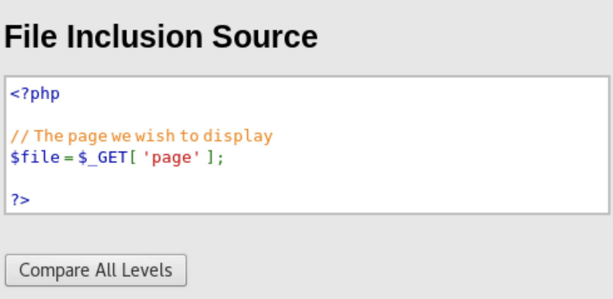
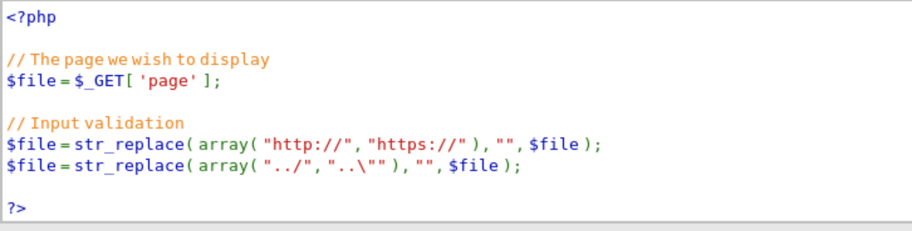
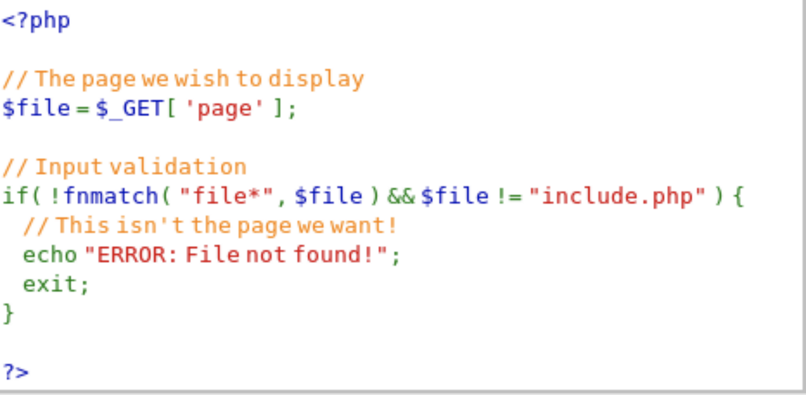

# 201-A10-文件包含漏洞（上）

## 1. 漏洞产生原理：

- 文件包含漏洞（File Inclusion）是一种最常见的依赖于脚本运行而影响 Web 应用程序的漏洞。当应用程序使用攻击者控制的变量建立一个可执行代码的路径，允许攻击者控制在运行时执行哪个文件时，就会导致文件包含漏洞。
- 程序开发人员通常会把可重复使用的函数写入单个文件中，在使用这些函数时，程序开发人员直接调用此文件，而无需再次编写函数，这种调用文件的过程一般被称为文件包含。此外，程序开发人员都希望代码更加灵活，所以通常会将被包含的文件设置为变量，用来进行动态调用。但正是由于这种灵活性，从而导致客户端可以调用一个恶意文件，导致文件包含漏洞。

 ## 1.1文件包含漏洞分为本地文件包含漏洞和远程文件包含漏洞：

 - 远程文件包含（RFI，Remote File Inclusion）: 当 Web 应用程序下载并执行远程文件时，会导致远程文件包含，这些远程文件通常以 HTTP 或 FTP URI 的形式获取，作为Web 应用程序的用户提供的参数。
 - 本地文件包含（LFI，Local File Inclusion）：本地文件包含类似于远程文件包含，本地文件包含仅能包括本地文件，即当前服务器上的文件以供执行。

## 1.2文件包含漏洞的危害

- Web 服务器的文件被外界浏览而导致信息泄漏。
 - 脚本被任意执行所造成的影响。典型的影响如下：
   - 篡改网站。
   - 执行非法操作。
   - 攻击其他网站（垫脚石）。

 ## 2. 文件包含漏洞的利用（low）

远程文件包含漏洞
打开`low`安全级别的文件包含页面`File Inclusion`。
当我们点击`file1.php`时，对应的`URL`的`page`的值变为`file1.php`，同时Web应用执行`file1.php`文件的源代码；
当我们点击`file2.php`时，对应的`URL`的`page`的值变为`file2.php`，同时Web应用执行`file2.php`文件的源代码；
当我们点击`file3.php`时，对应的`URL`的`page`的值变为`file3.php`，同时Web应用执行`file3.php`文件的源代码。
由此可知，当我们在目标`URL`的`page`值后添加某个存在的文件名时，Web应用程序会相应的包含此文件。同时，Web应用程序会根据其文件的内容是否符合`PHP`语法格式，判断执行此文件源代码还是直接显示文件源代码。

利用payload
使用payload为：../../../../../../../../../../../../../../../../etc/passwd

源码分析
点击页面右下角的`View Source`，即显示`low`安全等级的文件包含的源码：

Web应用程序定义了一个变量`page` ，将用户输入的值作为`page`变量的值，同时将其赋值给`file`变量。最后，Web应用程序通过对`file`变量的引用来实现文件的包含功能。

从源码我们可以看到，`low`安全等级的Web应用程序没有对输入的`page`变量的值执行任何过滤措施，如果我们输入那些系统不希望用户看见任何信息的文件的文件名，并赋值给`page`变量。那么Web应用程序就会产生文件包含漏洞，系统的敏感信息就会被泄露。

## 2.1文件包含漏洞的利用（medium）

点击页面右下角的`View Source`，即显示`medium`安全等级的文件包含的源码：Web应用程序使用`str_replace()`函数对关键字`http://`、`https://` 、`../` 、`..\`执行了过滤操作，只要用户传递给`page`变量的文件名中出现上述四个关键字，皆以空代替。
这样，Web应用程序保证了用户既无法使用`http://`、`http:\\`来利用远程文件包含漏洞，也无法使用`../` 、`..\`来利用本地文件包含漏洞。

如果我们不使用`../`与`..\`这两个关键词，而是直接访问根目录下的用户信息文件`/etc/passwd` 。由于Web应用程序并没有对根目录`/`执行过滤，所以系统不能过滤我们输入的payload，那么Web应用程序将成功包含文件`/etc/passwd`，并直接暴露其源代码。
即我们构造的payload成功的绕过了Web应用程序的防御机制。

## 2.2文件包含漏洞的利用（high）

查看源码：

`fnmatch()` 函数的作用是根据指定的模式来匹配文件名或字符串。
语法为：`fnmatch(pattern,string,flags)`
各个参数解释如下：

- `pattern`	必需。规定要检索的模式。
- `string`  必需。规定要检查的字符串或文件。
- `flags `    可选。
  如果用户输入的文件名不是`include.php`或者以`file`开头的文件名，那么Web应用程序直接退出。
  所以`high`安全等级是`medium`安全等级的扩展，在`medium`安全等级的基础上，进一步加强了文件包含漏洞的防御。
  对`high`安全等级而言，在`medium`安全等级的文件包含漏洞利用失败的技术皆无法在`high`安全等级下成功执行。

payload`为：`file1.php../../../../../../../../../../../../../../../../etc/passwd
我们就能成功看到系统用户敏感信息。

## 3.文件包含修复

修复建议
1、严格检查变量是否已经初始化。

2、对所有输入提交可能包含的文件地址，包括服务器本地文件及远程文件，进行严格的检查，参数中不允许出现./和../等目录跳转符。

3、严格检查文件包含函数中的参数是否外界可控。

