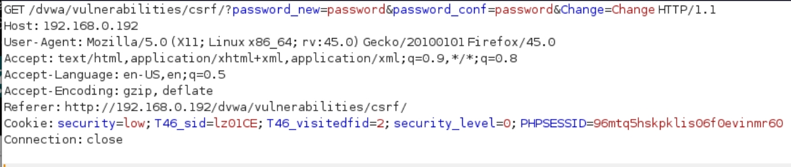
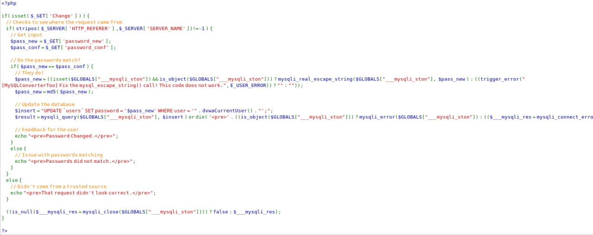
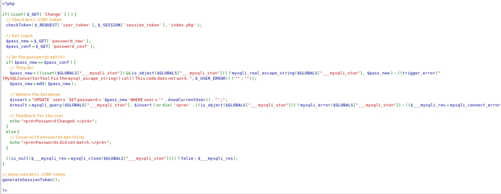

# csrf漏洞

## 1.1 漏洞信息

### 1.1.1 漏洞简介

CSRF ，全称 `Cross-site request forgery` ，翻译过来就是跨站请求伪造（客户端），是指利用受害者尚未失效的身份认证信息（`cookie` 、会话等），诱骗其点击恶意链接或者访问包含攻击代码的页面，在受害人不知情的情况下以受害者的身份向（身份认证信息所对应的）服务器发送请求，从而完成非法操作。 比如A银行的a用户，执行转账的操作是靠`http://xxx.com/xx.php?money=1000`向服务器发送一个get请求来执行的，那么如果在防御机制较差的情况下，攻击者b在恶意网站B的某个页面插入``，并诱使a访问，那么a在访问恶意页面时实际就以自己的身份向银行服务器发送了一次转账请求，而服务器做出响应后，a用户即损失了1000RMB

### 1.1.2 漏洞利用条件

CSRF漏洞有两个关键条件，理解这两个条件可以帮助我们理解并防御CSRF漏洞：
服务端验证refer（简单来说就是判断用户从哪个页面来，如果发现A银行的转账请求是来自B网站的，就应该拒绝执行）机制不完善，导致另一个不可信站点的请求可以被服务器接收并返回相应数据。
 服务端应该在每次用户执行敏感操作时（如更改密码），从服务端返回一个随机（术语称token）数给用户，用户请求时必须带上和服务端一致的token，否则拒绝执行。若没有采取token机制或token可预测，那么CSRF就变得容易利用


CSRF利用流程：
攻击者发现CSRF漏洞-->构造代码-->发送给受害人-->受害人打开-->受害人执行代码-->完成攻击


## 1.2 漏洞实验

### 1.2.1 低级

首先我们进入DVWA目标网站，用户名admin，密码 password,并将级别配置为low。
来到CSRF选项，执行一次正常的修改密码并进行观察。可以看到，更改密码的请求是直接放到url里的get请求。



那我们就来利用``标签发送get请求来实现一次CSRF攻击：
#### 构造恶意页面
代码如下：

```
<html>

<p>404 error</p>
</html>

```

保存在low.html中,发送给用户触发，我们会发现用户的密码被修改。
原理：如前面原理部分所说，html语言的``标签的src=‘url’可以对url进行一次get请求。

#### 诱使用户访问

直接双击low.html文件即可，用户访问此页面后相当于以自己的身份（有效cookie）向服务器发送了一次改密的get请求
`(http://192.168.0.192/dvwa/vulnerabilities/csrf/?password_new=123456&password_conf=123456&Change=Change#），`而服务端接收了合法用户发起的请求就会执行改密响应，密码即可更改。
双击html文件完成后，我们重新登录一下，使用我们修改的密码123456可成功登录，证明了密码已被修改.

#### 实验结果分析

利用``标签来发送get请求是在很多场景下都会使用的小技巧，而对于一些如改密等敏感请求如果处理不当，只是简单的凭借get请求而不做其他一些验证，就容易被攻击者利用。

## 1.2.2 中级

#### 分析改密请求的请求方式及规则
我们首先重复low等级的观察方式，发现url是和low等级一致的，然而重复low等级的漏洞复现却是失败的，我们需要看一下它的代码（代码注释中带有大致分析）



`int eregi(string pattern, string string)：`
     检查 `string` 中是否含有` pattern` （不区分大小写），如果有返回`True` ，反之` False` 。

可以看到，` Medium` 级别的代码检查了变量`HTTP_REFERER` （ `http` 包头的` Referer` 参数的值，表示来源地址，比如我`从baidu.com/i.html`点击链接进入`d.com`，那么对`d.com`来讲，`refer`就是`baidu.com/i.html`）中是否包含` SERVER_NAME` （ `http` 包头的 `Host `参数，及要访问的主机名，这里就是`192.168.0.192`）

#### 攻破防御规则

本步骤将绕过防御规则
检查` string `中是否含有 `pattern `（不区分大小写），如果有返回 `True` ，反之` False` 。这个规则并没有采用严格的正则表达式来检查，我们只是需要refer中包含主机名即可。那么如何包含主机名？

我们可以取文件名为主机名，其余步骤和`low`等级一致，这样就可以完美绕过`refer`验证。因为此时的`refer`变成了这样：`http://xxx.com(恶意网站，在这里就是我们本机)/192.168.0.192.html`，如下方所展示的，我们看到`refer`里包含了主机名`192.168.0.192`：

编辑`192.168.0.192.html` ：

```
<html>

<p>404 error</p>
</html>
```

如low等级所说，用户点击此页面，将发起一个改密get请求，这个请求自然是来自用户点击的`http://攻击者主机/172.16.12.2.html`，
所以refer的值也就是`http://攻击者主机/172.16.12.2.html`，
也可以从上方gif看到此时refer中带有了`172.16.12.2`主机名，
到这里，我们可以说，这种防御机制就被我们攻破了。

## 1.2.3 高级

#### 漏洞利用

本步骤将分析请求方式及规则
进行一次正常的改密请求，如下：

依旧是get请求，而请求中的参数包含了一个名为`user_token`的密文，这就是我们前面原理部分提到过的token机制，每一次改密请求token都是一个不可预测的随机数，low medium等级的方法显然不适用了，因为没有token，我们发出的请求就是无效的，而token是未知且难以预测的，从代码中也可以看出使用了token机制。



值得一提的是，如果你想用csrf去构造一个恶意页面用来偷取访问该页面的用户的token的话，我只能告诉你，你是不能成功的，这里牵扯到一个名为“跨域”的问题：

 我们的要偷偷访问的地址是`http://192.168.0.192/dvwa/vulnerabilities/csrf` ，位于服务器 `192.168.0.192`上，而我们的攻击页面位于黑客服务器 `11.2.11.122`（假设）上，两者的域名不同，域名 B 下的所有页面都不允许主动获取域名 A 下的页面内容，除非域名 A 下的页面主动发送信息给域名 B 的页面，所以我们的域是不能主动获取目标域的信息的，只能等待目标域主动发送信息，而对于user_token之类的敏感信息，目标域是不会主动发送给我们的。所以我们的攻击脚本是不可能取到改密界面中的` user_token` 。
所以，进行到这里，我们判断：仅仅使用csrf是得不到用户token，也完成不了攻击的！

本步骤将利用xss绕过防御规则
这里需要利用到high 等级的xss漏洞来获取user_token，payload如下：

```
<iframe src='../csrf' onload=alert(frames[0].document.getElementsByName('user_token')[0].value)>
```

而获取user_token后，我们就可以重复low等级的步骤，只不过改变一下src里的利用代码：

```

```

此处`6416c6dbc888098b6c6ef59bc2334fb2`为`xss获`取到的`token`，每一次刷新都在改变，请注意。


注：形似`6416c6dbc888098b6c6ef59bc2334fb2`的密文为服务端返回的`token`，对于防御机制较为完善的网站来说，用户要进行敏感操作如`支付`、`改密`等时，服务端会发给客户端一个随机数的响应，并且在服务端本身留下此随机数，用户进行敏感操作时必须带上此随机数，如果缺失或者随机数与服务端不匹配，就拒绝该请求。

接下来即可重复low等级步骤，建立html文档，诱使合法用户打开实现攻击（请注意！！当你xss弹框出来token时请不要返回csrf页面，因为在你点击csrf进入改密页面时token已经再次刷新！！这部分请严格跟着作者的步骤来）。

这种类型的CSRF危害没有GET型的大，利用起来通常使用的是一个自动提交的表单，如：

```
<html>
<body>
<form id="csrf" name="csrf" action="http://photo.weibo.com/users/follow" method="POST">
<input type="text" name="uid" value="1981622273" />
<input type="submit" value="submit" />
</form>
<script>
	document.csrf.submit();
</script> 
</body>
</html>
```

CSRF需要出现在重要的位置才能构成危害。

CSRF需要受害者点击才能完成攻击过程。

CSRF需要受害者拥有cookie被攻击网站的COOKIE才可以，并且session未失效 
