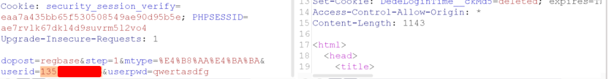
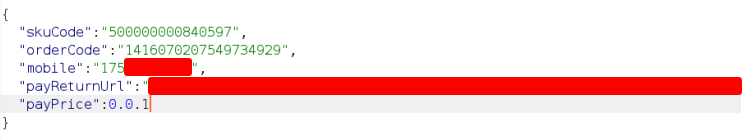

# 逻辑漏洞

## 一 逻辑漏洞的本质

所有web应用程序都通过逻辑实现各种功能。每个阶段都会执行数目庞大的逻辑操作。
这些逻辑代表着一个复杂的受攻击面。
SQL注入和XSS类漏洞，它们具有容易辨别的签名，人们对它们的利用方法也进行了广泛的研究。
但逻辑程序的逻辑缺陷更难以识别：每一种缺陷似乎都是唯一的。

程序开发者会认为，如果出现A，一定就会有B，因此我执行C。
但实际上，攻击者会制造出X。
所以简单来讲，逻辑漏洞可以理解为不按套路出牌。


为此在逻辑漏洞的学习时候，并不推荐按照注入类漏洞的方法学习，而更建议通过案例类的方案进行学习。


## 二 逻辑漏洞的案例

### 2.1 任意密码重置----抓包改包类

在某次的安全测试中，我们遇到了一个非常典型的任意密码重置类漏洞。

在网站的`忘记密码`处的截图如下：


那么从图中能分析出来网站的工作过程如下：

```
1.通过手机号接受短信验证码
2.用户输入验证码
3.验证码与服务器的数值一致后，可以修改密码
```

而底层的判断逻辑为：用户提供了只有他才知道信息，从而判断为本人。

随后按照正常用户的流程接收短信验证码，并填写正确的验证码。此时可抓取到的数据包如下：


而下一个步骤在网站的正常逻辑中，为修改用户的密码。


输入要修改的密码后，进行抓包


将userid字段替换为要修改的手机号，即可无感知的修改对方口令。




那么此时我们可以思考为什么会产生这个问题？而又该如何进行修复？


### 2.2 任意密码重置----修改返回包

上面的案例，是通过修改发送包，而下面的案例来自于过去线下班学生的实践，是一个典型的通过修改返回包的逻辑漏洞。

使用网站的正确流程修改帐号 A 的密码，抓包保存正确的返回包。


可以看到当密码修改成功后，返回包的内容为`code:100000`等内容。

而当我们想修改账户B的密码，由于没有正确的验证码，从而导致修改失败的返回包如下：


使用burpsuite，将正确的返回包，替换错误的返回包后，即可修改账户B的口令并成功登录。


在实际的漏洞挖掘中，类似的场景会出现变形，例如在登录界面，随意输入用户密码后，将false修改为true，亦或者status=0修改为status=1.

那么此时我们可以思考为什么会产生这个问题？而又该如何进行修复？


### 2.3 任意密码重置----敏感信息泄露


在一些逻辑漏洞的场景中，很多时候我们连抓包改包都不需要，正所谓生活不缺少美，只是缺少发现美的眼睛。

某些网站会出现将短信验证码放置于返回包中。


我知道你现在莫名其妙的想笑，但这真的还不是低级错误的天花板。

甚至于在实际的操作中，只需要将手机号输入到页面上，返回包中会出现用户的全部注册信息，这会包括手机号、姓名、邮箱、身份证号等等。


### 2.4 支付漏洞----0.01

网站的业务版块中，很常见的功能为在线购买及支付。而在其中典型的逻辑漏洞方式为修改支付金额，从而造成极低的价格购买高价值产品。下面的这个案例为过去线下班实践挖洞时的案例。

在网站中，提供在线购买礼品卡的功能。


正常的进行加入购物车，在支付页面抓取数据包，而同时将payPrice数值修改为0.01，得到的内容大致如下：



通过支付宝付出1分钱后，回到网站会发现订单已购买成功，并且后续的测试中，礼品卡可用。


那么此时我们可以思考为什么会产生这个问题？而又该如何进行修复？


### 2.5 支付漏洞----负数

在网站的支付功能模块中，往往也会出现类似于钱包的功能，用户可以通过提前充值，而购买时使用钱包中的金额进行支付，而无需在线支付。而案例来自于wooyun的漏洞库。

在某运营商的网盘的购买业务中，可抓取到的数据包如下：


而通过判定，分析出数据包的含义如下：

```
disktype:购买的网盘类型
period:购买网盘按照年的方式购买
period_num:购买的年限
```

那么将period_num的数值从1修改为-2后，生成的订单总金额为负数。


而当购买成功后，会发现钱包中的余额增加6000元。

这是由于网站的计算逻辑为`余额=钱包金额-（单价*数量）`

而当单价或数量任一为负数时，则数学的逻辑则变成负负得正，从而导致钱包金额的增加。

那么此时我们可以思考为什么会产生这个问题？而又该如何进行修复？


### 2.6 支付漏洞----拼接优惠信息


在网站的支付功能模块中，优惠相关同样也可以构成逻辑的攻击面。说到优惠券就不得不吐槽下现在的电商。

```
以前想买个东西，领个优惠券，买得起我买，买不起我滚。
可现在哪是买东西啊，分明就是复习高等数学......
```

下面的案例是价格整合计算的时候逻辑所产生的问题。

商城中存在的商品A如下：


商城中存在的商品B如下：


将商品A正常点击`加入购物车`，而商品B点击`加入购物车`后进行抓包，并将数量改为-1。


而由于有个负数的存在，导致订单信息产生了尴尬。所需要支付的价格为两个商品的差。


并且订单在支付后，可以成功生成订单。

### 2.7 越权漏洞----垂直越权

如果A用户的权限高于B用户，B用户越权操作A用户的权限的情况称为垂直越权。

案例为过去线下班实践挖洞时的案例。

在某个客服的系统中，提供的角色定义如下图：


正常登录质检专员的帐号，点击编辑，发现无法更改角色。换言之，低权限用户无法修改自己的角色。


在搜索界面输入超级管理员的帐号，打开 burp，开启抓包，点击搜索。


而返回包中，可查看到超级管理员的ID值。


随后将修改质检专员的信息重新进行编辑，点击保存的同时进行抓包。


将subRoleId的数值修改为管理的数值后放过数据包。


重新刷新界面，发现角色已升级为超级管理员，且拥有超级管理员的全部功能权限。


至此完成了一个低权限用户使用高权限用户的逻辑漏洞测试。

那么此时我们可以思考为什么会产生这个问题？而又该如何进行修复？

### 2.8 越权漏洞----水平越权

如果A用户的权限等于B用户，B用户越权操作A用户的权限的情况称为水平越权。

在正常访问中，能够通过网站访问到属于自己的订单信息。这种情况下，往往可能URL的链接的大概的内容如下：

```
http://xxx.com/order.php?uid=1000
```

而网站通过uid参数判断用户身份，从而调取相关的数据，而如果将uid进行遍历，则可能查阅到其他用户的数据。


### 2.9 越权漏洞----前后文越权

在很多国内所制作的逻辑漏洞脑图中，往往将越权类的逻辑漏洞分为垂直与水平越权两类。

而第三种`前后文越权`的类型由于比较少见，往往会被人们忽略。

很多时候，网站往往会存在基于顺序的逻辑，前后文越权的漏洞逻辑在于攻击此顺序，尝试跳过一些关键步骤。

案例为过去线下班实践挖洞时的案例。

从下图从可以分析出网站的大致步骤：先输入手机号，然后接收验证码，随后校验验证码，最后一步修改密码。


当输入手机号后，会跳转至第二个页面

与此同时，第二个页面的URL的变化为：/User/GetPassByMobileStep2


将URL修改为domain/User/GetPassByMobileStep3后，即可在不输入验证码的情况下，跳转至修改密码页面。


那么此时我们可以思考为什么会产生这个问题？而又该如何进行修复？


## 三 逻辑漏洞的总结

逻辑漏洞与过往的漏洞对比后，我们会发现在逻辑漏洞中，并没有清晰且明确的指纹信息。

而例如sql注入漏洞，我们可以通过请求包中的union、select等特定的内容进行识别。

亦或者当命令注入漏洞，数据包中的`whoami`以及返回包中的`root`关键字，同样可以进行识别。

一次成功的逻辑漏洞攻击尝试，往往数据包与服务器所要求一致且合法。

所以在逻辑漏洞挖掘中，无法通过工具进行自动化的检测，而站在防守端，同样无法基于特征判断。

那么挖掘逻辑漏洞最好的工具显然是Burpsuite，而实际的操作中，可以采用大致如下的方案：

```
1.分析网站的功能模块
2.按照正常用户的方式，边抓包边理解正常业务功能
3.分析每个步骤的数据包中的参数意义与功能点的背后逻辑
4.设计一个或多个测试方案，并进行尝试
```


附录：互联网下载的脑图

**Tips**:但请注意，不要死记硬背，那样会限制住你的思维。**骚气是逻辑漏洞最大的特色。**


