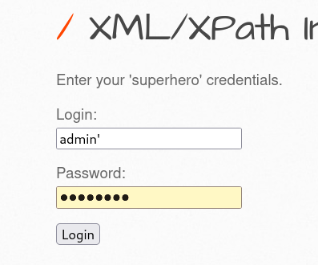

# 201-A22-XPath漏洞

## 1.XPath简介

XPath（XML路径语言）是一种用于导航XML文件文档并从中获取数据的语言。许多时候，一个XPath表达式可以代表一个文档节点导航到另一个文档节点所需要的一系列步骤：

如果WEB应用程序将数据保存在XML文档中，那么他们可能使用XPath访问数据，以响应用户提交的输入。如果这个输入未经过过滤就插入到XPath查询语句中，攻击者就可以通过控制查询语句来破坏网站应用程序的逻辑，或者获取未授权访问的数据。

我们来看以下下面的XML数据：

```XML
<?xml version="1.0" encoding="UTF-8"?>

<bookstore>

<book category="COOKING">
  <title lang="en">Everyday Italian</title>
  <author>Giada De Laurentiis</author>
  <year>2005</year>
  <purchaseprice>20.00</purchaseprice>
  <price>30.00</price>
</book>

<book category="CHILDREN">
  <title lang="en">Harry Potter</title>
  <author>J K. Rowling</author>
  <year>2005</year>
  <purchaseprice>20.00</purchaseprice>
  <price>29.99</price>
</book>

<book category="WEB">
  <title lang="en">XQuery Kick Start</title>
  <author>James McGovern</author>
  <author>Per Bothner</author>
  <author>Kurt Cagle</author>
  <author>James Linn</author>
  <author>Vaidyanathan Nagarajan</author>
  <year>2003</year>
  <purchaseprice>30.00</purchaseprice>
  <price>49.99</price>
</book>

<book category="WEB">
  <title lang="en">Learning XML</title>
  <author>Erik T. Ray</author>
  <year>2003</year>
  <purchaseprice>25.00</purchaseprice>
  <price>39.95</price>
</book>

</bookstore> 
```

可以看到，以上XML代码实际上是把数据保存在了网页上，将书名保存到了`<bookstore>`→`<book>`→`<title>`标签下。把书的作者也按此节点路径保存在了与`<title>`标签平行的`<author>`标签下。这样实际上就是网页保存了数据。

那么查询这些数据的语言，就是XPath。

一个获取所有书籍价格的XPath查询如下：

`/bookstore/book/price/text() `

选取价格高于 35 的所有 price 节点：

`/bookstore/book[price>35]/price`

一个返回所有J K. Rowling作者资料的查询为：

`/bookstore/book[author/test()='J K. Rowling']`


## 2.XPath语法

如上文中的例子，XPath语法特别像一个文件夹路径，中间加上一些命令参数。

更多语法和含义如下表：

XPath 使用路径表达式在 XML 文档中选取节点。节点是通过沿着路径或者 step 来选取的。 下面列出了最有用的路径表达式：

| 表达式   | 描述                                                         |
| -------- | ------------------------------------------------------------ |
| nodename | 选取此节点的所有子节点。                                     |
| /        | 从根节点选取（取子节点）。                                   |
| //       | 从匹配选择的当前节点选择文档中的节点，而不考虑它们的位置（取子孙节点）。 |
| .        | 选取当前节点。                                               |
| ..       | 选取当前节点的父节点。                                       |
| @        | 选取属性。                                                   |

| 路径表达式                          | 结果                                                         |
| ----------------------------------- | ------------------------------------------------------------ |
| /bookstore/book[1]                  | 选取属于 bookstore 子元素的第一个 book 元素。                |
| /bookstore/book[last()]             | 选取属于 bookstore 子元素的最后一个 book 元素。              |
| /bookstore/book[last()-1]           | 选取属于 bookstore 子元素的倒数第二个 book 元素。            |
| /bookstore/book[position()<3]       | 选取最前面的两个属于 bookstore 元素的子元素的 book 元素。    |
| //title[@lang]                      | 选取所有拥有名为 lang 的属性的 title 元素。                  |
| //title[@lang='eng']                | 选取所有 title 元素，且这些元素拥有值为 eng 的 lang 属性。   |
| /bookstore/book[price>35.00]        | 选取 bookstore 元素的所有 book 元素，且其中的 price 元素的值须大于 35.00。 |
| /bookstore/book[price>35.00]//title | 选取 bookstore 元素中的 book 元素的所有 title 元素，且其中的 price 元素的值须大于 35.00。 |

| 通配符 | 描述                 |
| ------ | -------------------- |
| *      | 匹配任何元素节点。   |
| @*     | 匹配任何属性节点。   |
| node() | 匹配任何类型的节点。 |

| 路径表达式   | 结果                              |
| ------------ | --------------------------------- |
| /bookstore/* | 选取 bookstore 元素的所有子元素。 |
| //*          | 选取文档中的所有元素。            |
| //title[@*]  | 选取所有带有属性的 title 元素。   |

| 路径表达式                       | 结果                                                         |
| -------------------------------- | ------------------------------------------------------------ |
| //book/title \| //book/price     | 选取 book 元素的所有 title 和 price 元素。                   |
| //title \| //price               | 选取文档中的所有 title 和 price 元素。                       |
| /bookstore/book/title \| //price | 选取属于 bookstore 元素的 book 元素的所有 title 元素，以及文档中所有的 price 元素。 |

问题就在于，如果网站没有严格的编程，用户提交的数据可能被直接嵌入到XPath查询语句中，那么后面的故事就和SQL注入几乎是一样的。

## 3. 查找XPath 注入漏洞

下面我们用实际例子来说明。

例1：

以下例子来自于bWAPP的XML/XPath Injection (Login Form)。


下面我们输入一个单引号`'`



然后在页面出现了XPath报错：


根据SQL注入的经验，我们知道，查询登录应该是，同时（and）查询用户输入的用户名和密码，符合则允许登录。

那么其XPath代码应该是`/XXXX/XXXX/[login='$用户输入用户名' and password='$用户输入密码']` ，其中XXXX代表节点路径 ，如果用户的输入被XPath查询到则登入验证通过。

我们可以构造如下代码。

` admin' or 'a'='a' or'`

那么理想的化，代码会变成这样：

`/XXXX/XXXX/[login='admin' or 'a'='a' or'' and password='$用户输入密码']` 

因为a永远等于a,所以，这条语句结果为真，可能会被登录功能验证通过。

我们尝试攻击。


攻击成功。


例2：

这个例子出自bWAPP靶场的XML/XPath Injection (Login Form)


这是一个网页搜索功能，当我们点击Search时会得到一系列数据。其后端没有数据库，是靠XPath语言实现的。


当我们在url中的genre参数中加一个引号，网页也出现了XPath报错。


根据前文对XPath语言特征的描述。我们猜测其代码应该类似于前文中的一种形式：

> 选取价格高于 35 的所有 price 节点：
>
> //bookstore/book[price>35]/price

所以他有可能是这种形式：

`/xxx/xxx/[genre='$由用户输入']/movie`

或者它也可以写成这样：

`/xxx/xxx/[contains(genre,'$由用户输入')]/movie`

contains表模糊查询。这两个语句的区别是，前一个是要在genre节点下精确匹配到一个值，第二个是要在genre节点下模糊匹配一个值。

我们可以首先尝试闭合。

原URL：`http://192.168.43.252/bWAPP_latest/bWAPP/xmli_2.php?genre=由用户输入&action=search`

我们分别插入`1']/movie`和`1')]/move`看看哪个可以闭合。

前者报错


后者没有报错，闭合成功。


由此我们确定了，XPath语句应该写成这样：

`/xxx/xxx/[contains(genre,'$由用户输入')]/movie`

构造， `action')]|//*|//*[contains ('1','1`注入其中。

那么理想情况下代码会变成这样：`/xxx/xxx/[contains(genre,'action')]|//*|//*[contains ('1','1')]/movie`

分别构成了三个查询

`/xxx/xxx/[contains(genre,'action')]`

`//*`

`//*[contains ('1','1')]/movie`

其中只有`//*`返回字符。

因为第一个，`/xxx/xxx/[contains(genre,'action')]`只是匹配了一下action节点，

代码需要``/xxx/xxx/[contains(genre,'action')]/movie`才可能返回值。

第三个，只是模糊匹配了一下1=1

只有有`//*`返回从根节点开始选取文档中的所有元素。


执行成功。

# 4.XPath漏洞的防御

如果一定要在XPath语句中加入用户输入，那么应该设计一份可接受的白名单检测用户输入，最好只包括字母数字。

如`() = [] : , * / //`之类应该特别注意，可以设定黑名单。