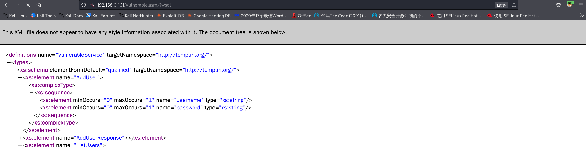
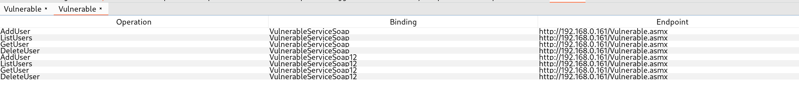
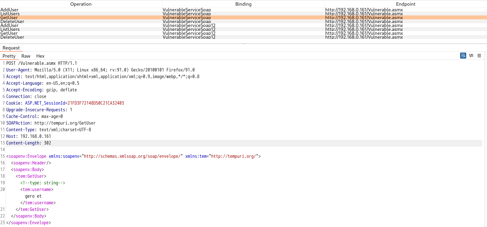
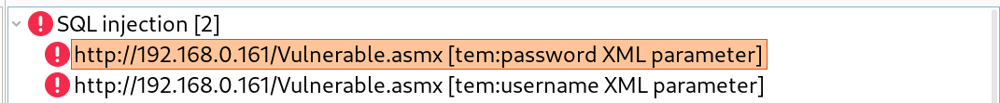
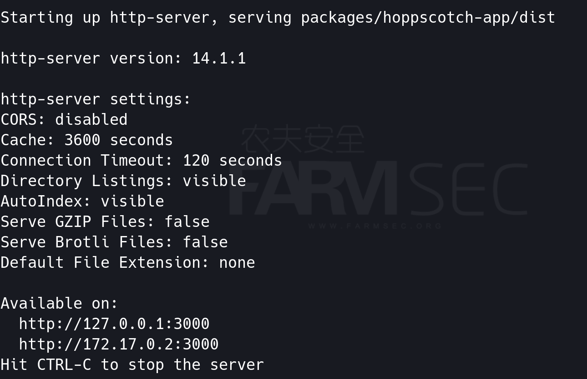
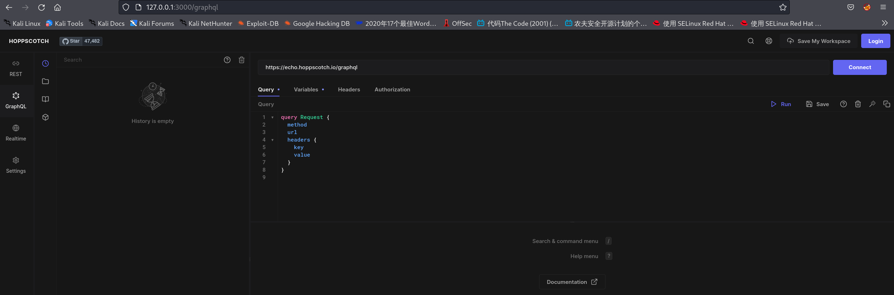
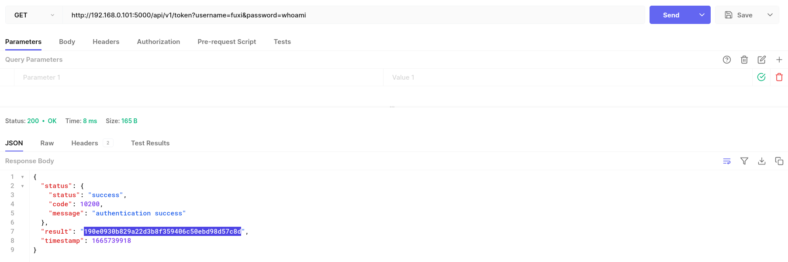
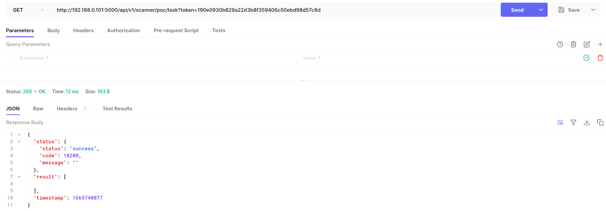
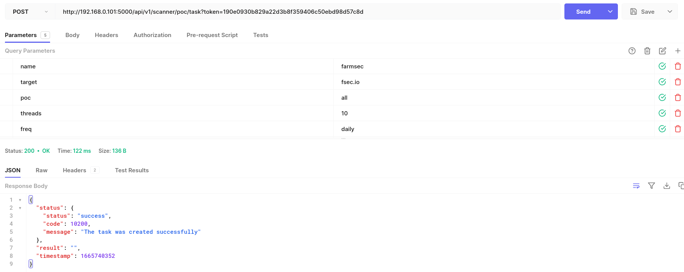
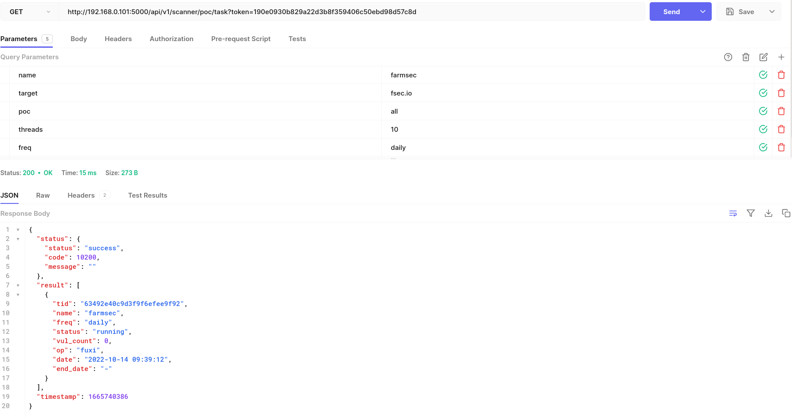

# API接口测试


## 一 WSDL类

WSDL描述Web服务的公共接口。这是一个基于XML的关于如何与Web服务通讯和使用的服务描述；也就是描述与目录中列出的Web服务进行交互时需要绑定的协议和信息格式。通常采用抽象语言描述该服务支持的操作和信息，使用的时候再将实际的网络协议和信息格式绑定给该服务。

WSDL 元素基于XML语法描述了与服务进行交互的基本元素：

```
Type（消息类型）：数据类型定义的容器，它使用某种类型系统（如 XSD）。
Message（消息）：通信数据的抽象类型化定义，它由一个或者多个 part 组成。
Part：消息参数
Operation操作）：对服务所支持的操作进行抽象描述，WSDL定义了四种操作：  1.单向（one-way）：端点接受信息；2.请求-响应（request-response）：端点接受消息，然后发送相关消息；3.要求-响应（solicit-response）：端点发送消息，然后接受相关消息；4.通知（notification）：端点发送消息。
Port Type（端口类型）：特定端口类型的具体协议和数据格式规范。
Binding：特定端口类型的具体协议和数据格式规范。
Port：定义为绑定和网络地址组合的单个端点。
Service：相关端口的集合，包括其关联的接口、操作、消息等。
```

通过命令可下载CsharpVulnSoap靶机

```
wget http://volatileminds.net/CsharpVulnSoap.ova
```

访问靶机URL：http://ip/Vulnerable.asmx?wsdl



将页面请求通过burpsuite抓包后，使用Wsdler模块即可解析请求。





解析出HTTP请求后，剩下的该怎么挖洞就怎么挖了：）




## 二 API接口类

```
市面上常见的API请求构建工具形式有独立的桌面程序、命令行程序、浏览器扩展、Web服务等几种，比较著名的API请求构建工具有Postman、Swagger Inspecter、Soap UI、Apigee等等。国内有一些公司也通过Web服务的方式提供API测试功能，例如网易数帆的GoAPI，还有像curl这样免费的不需要图形界面也可以直接进行HTTP API测试的工具。

之前有很多API请求构建工具都是商业软件，或者免费版仅仅提供很有限的功能。其中曾经最流行的Postman在收费之后就很被开发者社区诟病。有位印度裔小哥Liyas Thomas对此极为不爽，就发布了一个新的工具叫：Postwoman，显而易见，Postwoman是专怼Postman的。

2020年8月，Liyas小哥可能觉得一直怼Postman也挺low的，2020年8月决定改名叫hoppscotch了。
```

### 2.1 hoppscotch安装

使用docker直接可完成启动

```
docker run --rm --name hoppscotch -p 3000:3000 hoppscotch/hoppscotch:latest
```



随后访问http://IP:3000 成功打开页面代表安装成功。




### 2.2 搭建开源安全工具fuxi

```
docker pull jeffzh3ng/fuxi
docker run -itd --name fuxi_docker -p 5000:50020 jeffzh3ng/fuxi:latest
Default username: fuxi
Default password: whoami
```

其官方API文档链接为：https://github.com/jeffzh3ng/fuxi/blob/v2.1/docs/fuxi_api_doc_chinese.md

我们挑选了部分内容：

**如何获取token**

```
/api/v1/token?username=fuxi&password=whoami
```


**/api/v1/token**

| 请求模式 | 参数                                                  | 功能描述          |
| -------- | ----------------------------------------------------- | ----------------- |
| GET      | username(string, required) password(string, required) | 获取当前用户token |
| PUT      | username(string, required) password(string, required) | 刷新当前用户token |

poc扫描模块接口


**/api/v1/scanner/poc/task**

接口描述：新增poc扫描任务，获取当前任务列表

| 请求模式 | 参数                                                         | 参数描述                                                     | 接口描述         |
| -------- | ------------------------------------------------------------ | ------------------------------------------------------------ | ---------------- |
| GET      |                                                              |                                                              | 获取扫描任务列表 |
| POST     | name(string,required) target(string,required)  poc(string,required) threads(int) freq(string,required) | 任务名称 扫描对象，以逗号分隔 扫描插件ID，以逗号分隔 任务周期：daily weekly monthly | 新增扫描任务     |


通过API接口获取token

http://192.168.0.101:5000/api/v1/token?username=fuxi&password=whoami



通过API接口获取任务

http://192.168.0.101:5000/api/v1/scanner/poc/task?token=190e0930b829a22d3b8f359406c50ebd98d57c8d



通过API接口提交任务

http://192.168.0.101:5000/api/v1/scanner/poc/task?token=190e0930b829a22d3b8f359406c50ebd98d57c8d






## 三 接口类测试的思路总结

有工具能吐吐吐呢，就直接吐吐吐，如同WSDL一样

没有的话呢，就是看API的说明书，如果API一样

但实际上，测试接口类本质都是识别出来http请求


